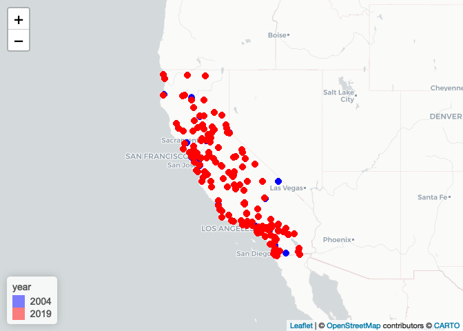
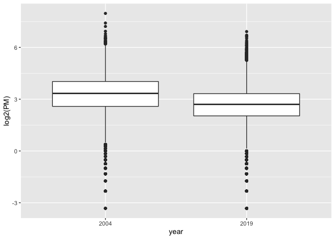
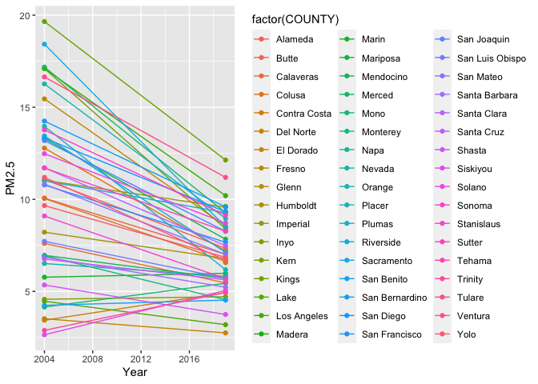
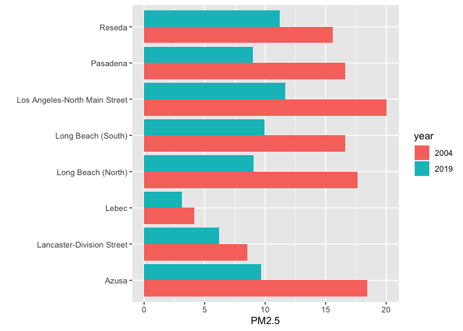

Assignment 01
================
Qiushi
2022-09-22

Import packages

``` r
library(data.table)
library(leaflet)
library(dplyr)
```

    ## 
    ## Attaching package: 'dplyr'

    ## The following objects are masked from 'package:data.table':
    ## 
    ##     between, first, last

    ## The following objects are masked from 'package:stats':
    ## 
    ##     filter, lag

    ## The following objects are masked from 'package:base':
    ## 
    ##     intersect, setdiff, setequal, union

## Step 1.read in data and chek for issues

Reading in the 2004 data:

``` r
pm_04 <- data.table::fread("ad_viz_plotval_data_2004.csv")
pm_04
```

    ##              Date Source  Site ID POC Daily Mean PM2.5 Concentration    UNITS
    ##     1: 01/01/2004    AQS 60010007   1                            8.9 ug/m3 LC
    ##     2: 01/02/2004    AQS 60010007   1                           12.2 ug/m3 LC
    ##     3: 01/03/2004    AQS 60010007   1                           16.5 ug/m3 LC
    ##     4: 01/04/2004    AQS 60010007   1                           19.5 ug/m3 LC
    ##     5: 01/05/2004    AQS 60010007   1                           11.5 ug/m3 LC
    ##    ---                                                                       
    ## 19229: 12/17/2004    AQS 61131003   1                           16.0 ug/m3 LC
    ## 19230: 12/20/2004    AQS 61131003   1                           17.0 ug/m3 LC
    ## 19231: 12/23/2004    AQS 61131003   1                            9.0 ug/m3 LC
    ## 19232: 12/26/2004    AQS 61131003   1                           24.0 ug/m3 LC
    ## 19233: 12/29/2004    AQS 61131003   1                            9.0 ug/m3 LC
    ##        DAILY_AQI_VALUE            Site Name DAILY_OBS_COUNT PERCENT_COMPLETE
    ##     1:              37            Livermore               1              100
    ##     2:              51            Livermore               1              100
    ##     3:              60            Livermore               1              100
    ##     4:              67            Livermore               1              100
    ##     5:              48            Livermore               1              100
    ##    ---                                                                      
    ## 19229:              59 Woodland-Gibson Road               1              100
    ## 19230:              61 Woodland-Gibson Road               1              100
    ## 19231:              38 Woodland-Gibson Road               1              100
    ## 19232:              76 Woodland-Gibson Road               1              100
    ## 19233:              38 Woodland-Gibson Road               1              100
    ##        AQS_PARAMETER_CODE                     AQS_PARAMETER_DESC CBSA_CODE
    ##     1:              88101               PM2.5 - Local Conditions     41860
    ##     2:              88502 Acceptable PM2.5 AQI & Speciation Mass     41860
    ##     3:              88502 Acceptable PM2.5 AQI & Speciation Mass     41860
    ##     4:              88502 Acceptable PM2.5 AQI & Speciation Mass     41860
    ##     5:              88502 Acceptable PM2.5 AQI & Speciation Mass     41860
    ##    ---                                                                    
    ## 19229:              88101               PM2.5 - Local Conditions     40900
    ## 19230:              88101               PM2.5 - Local Conditions     40900
    ## 19231:              88101               PM2.5 - Local Conditions     40900
    ## 19232:              88101               PM2.5 - Local Conditions     40900
    ## 19233:              88101               PM2.5 - Local Conditions     40900
    ##                                      CBSA_NAME STATE_CODE      STATE
    ##     1:       San Francisco-Oakland-Hayward, CA          6 California
    ##     2:       San Francisco-Oakland-Hayward, CA          6 California
    ##     3:       San Francisco-Oakland-Hayward, CA          6 California
    ##     4:       San Francisco-Oakland-Hayward, CA          6 California
    ##     5:       San Francisco-Oakland-Hayward, CA          6 California
    ##    ---                                                              
    ## 19229: Sacramento--Roseville--Arden-Arcade, CA          6 California
    ## 19230: Sacramento--Roseville--Arden-Arcade, CA          6 California
    ## 19231: Sacramento--Roseville--Arden-Arcade, CA          6 California
    ## 19232: Sacramento--Roseville--Arden-Arcade, CA          6 California
    ## 19233: Sacramento--Roseville--Arden-Arcade, CA          6 California
    ##        COUNTY_CODE  COUNTY SITE_LATITUDE SITE_LONGITUDE
    ##     1:           1 Alameda      37.68753      -121.7842
    ##     2:           1 Alameda      37.68753      -121.7842
    ##     3:           1 Alameda      37.68753      -121.7842
    ##     4:           1 Alameda      37.68753      -121.7842
    ##     5:           1 Alameda      37.68753      -121.7842
    ##    ---                                                 
    ## 19229:         113    Yolo      38.66121      -121.7327
    ## 19230:         113    Yolo      38.66121      -121.7327
    ## 19231:         113    Yolo      38.66121      -121.7327
    ## 19232:         113    Yolo      38.66121      -121.7327
    ## 19233:         113    Yolo      38.66121      -121.7327

Reading in the 2019 data:

``` r
pm_19 <- data.table::fread("ad_viz_plotval_data_2019.csv")
pm_19
```

    ##              Date Source  Site ID POC Daily Mean PM2.5 Concentration    UNITS
    ##     1: 01/01/2019    AQS 60010007   3                            5.7 ug/m3 LC
    ##     2: 01/02/2019    AQS 60010007   3                           11.9 ug/m3 LC
    ##     3: 01/03/2019    AQS 60010007   3                           20.1 ug/m3 LC
    ##     4: 01/04/2019    AQS 60010007   3                           28.8 ug/m3 LC
    ##     5: 01/05/2019    AQS 60010007   3                           11.2 ug/m3 LC
    ##    ---                                                                       
    ## 53152: 11/17/2019    AQS 61131003   1                           18.1 ug/m3 LC
    ## 53153: 11/29/2019    AQS 61131003   1                           12.5 ug/m3 LC
    ## 53154: 12/17/2019    AQS 61131003   1                           23.8 ug/m3 LC
    ## 53155: 12/23/2019    AQS 61131003   1                            1.0 ug/m3 LC
    ## 53156: 12/29/2019    AQS 61131003   1                            9.1 ug/m3 LC
    ##        DAILY_AQI_VALUE            Site Name DAILY_OBS_COUNT PERCENT_COMPLETE
    ##     1:              24            Livermore               1              100
    ##     2:              50            Livermore               1              100
    ##     3:              68            Livermore               1              100
    ##     4:              86            Livermore               1              100
    ##     5:              47            Livermore               1              100
    ##    ---                                                                      
    ## 53152:              64 Woodland-Gibson Road               1              100
    ## 53153:              52 Woodland-Gibson Road               1              100
    ## 53154:              76 Woodland-Gibson Road               1              100
    ## 53155:               4 Woodland-Gibson Road               1              100
    ## 53156:              38 Woodland-Gibson Road               1              100
    ##        AQS_PARAMETER_CODE       AQS_PARAMETER_DESC CBSA_CODE
    ##     1:              88101 PM2.5 - Local Conditions     41860
    ##     2:              88101 PM2.5 - Local Conditions     41860
    ##     3:              88101 PM2.5 - Local Conditions     41860
    ##     4:              88101 PM2.5 - Local Conditions     41860
    ##     5:              88101 PM2.5 - Local Conditions     41860
    ##    ---                                                      
    ## 53152:              88101 PM2.5 - Local Conditions     40900
    ## 53153:              88101 PM2.5 - Local Conditions     40900
    ## 53154:              88101 PM2.5 - Local Conditions     40900
    ## 53155:              88101 PM2.5 - Local Conditions     40900
    ## 53156:              88101 PM2.5 - Local Conditions     40900
    ##                                      CBSA_NAME STATE_CODE      STATE
    ##     1:       San Francisco-Oakland-Hayward, CA          6 California
    ##     2:       San Francisco-Oakland-Hayward, CA          6 California
    ##     3:       San Francisco-Oakland-Hayward, CA          6 California
    ##     4:       San Francisco-Oakland-Hayward, CA          6 California
    ##     5:       San Francisco-Oakland-Hayward, CA          6 California
    ##    ---                                                              
    ## 53152: Sacramento--Roseville--Arden-Arcade, CA          6 California
    ## 53153: Sacramento--Roseville--Arden-Arcade, CA          6 California
    ## 53154: Sacramento--Roseville--Arden-Arcade, CA          6 California
    ## 53155: Sacramento--Roseville--Arden-Arcade, CA          6 California
    ## 53156: Sacramento--Roseville--Arden-Arcade, CA          6 California
    ##        COUNTY_CODE  COUNTY SITE_LATITUDE SITE_LONGITUDE
    ##     1:           1 Alameda      37.68753      -121.7842
    ##     2:           1 Alameda      37.68753      -121.7842
    ##     3:           1 Alameda      37.68753      -121.7842
    ##     4:           1 Alameda      37.68753      -121.7842
    ##     5:           1 Alameda      37.68753      -121.7842
    ##    ---                                                 
    ## 53152:         113    Yolo      38.66121      -121.7327
    ## 53153:         113    Yolo      38.66121      -121.7327
    ## 53154:         113    Yolo      38.66121      -121.7327
    ## 53155:         113    Yolo      38.66121      -121.7327
    ## 53156:         113    Yolo      38.66121      -121.7327

Check dimention:

``` r
dim(pm_04)
```

    ## [1] 19233    20

``` r
dim(pm_19)
```

    ## [1] 53156    20

Check headers:

``` r
head(pm_04)
```

    ##          Date Source  Site ID POC Daily Mean PM2.5 Concentration    UNITS
    ## 1: 01/01/2004    AQS 60010007   1                            8.9 ug/m3 LC
    ## 2: 01/02/2004    AQS 60010007   1                           12.2 ug/m3 LC
    ## 3: 01/03/2004    AQS 60010007   1                           16.5 ug/m3 LC
    ## 4: 01/04/2004    AQS 60010007   1                           19.5 ug/m3 LC
    ## 5: 01/05/2004    AQS 60010007   1                           11.5 ug/m3 LC
    ## 6: 01/06/2004    AQS 60010007   1                           32.5 ug/m3 LC
    ##    DAILY_AQI_VALUE Site Name DAILY_OBS_COUNT PERCENT_COMPLETE
    ## 1:              37 Livermore               1              100
    ## 2:              51 Livermore               1              100
    ## 3:              60 Livermore               1              100
    ## 4:              67 Livermore               1              100
    ## 5:              48 Livermore               1              100
    ## 6:              94 Livermore               1              100
    ##    AQS_PARAMETER_CODE                     AQS_PARAMETER_DESC CBSA_CODE
    ## 1:              88101               PM2.5 - Local Conditions     41860
    ## 2:              88502 Acceptable PM2.5 AQI & Speciation Mass     41860
    ## 3:              88502 Acceptable PM2.5 AQI & Speciation Mass     41860
    ## 4:              88502 Acceptable PM2.5 AQI & Speciation Mass     41860
    ## 5:              88502 Acceptable PM2.5 AQI & Speciation Mass     41860
    ## 6:              88502 Acceptable PM2.5 AQI & Speciation Mass     41860
    ##                            CBSA_NAME STATE_CODE      STATE COUNTY_CODE  COUNTY
    ## 1: San Francisco-Oakland-Hayward, CA          6 California           1 Alameda
    ## 2: San Francisco-Oakland-Hayward, CA          6 California           1 Alameda
    ## 3: San Francisco-Oakland-Hayward, CA          6 California           1 Alameda
    ## 4: San Francisco-Oakland-Hayward, CA          6 California           1 Alameda
    ## 5: San Francisco-Oakland-Hayward, CA          6 California           1 Alameda
    ## 6: San Francisco-Oakland-Hayward, CA          6 California           1 Alameda
    ##    SITE_LATITUDE SITE_LONGITUDE
    ## 1:      37.68753      -121.7842
    ## 2:      37.68753      -121.7842
    ## 3:      37.68753      -121.7842
    ## 4:      37.68753      -121.7842
    ## 5:      37.68753      -121.7842
    ## 6:      37.68753      -121.7842

``` r
head(pm_19)
```

    ##          Date Source  Site ID POC Daily Mean PM2.5 Concentration    UNITS
    ## 1: 01/01/2019    AQS 60010007   3                            5.7 ug/m3 LC
    ## 2: 01/02/2019    AQS 60010007   3                           11.9 ug/m3 LC
    ## 3: 01/03/2019    AQS 60010007   3                           20.1 ug/m3 LC
    ## 4: 01/04/2019    AQS 60010007   3                           28.8 ug/m3 LC
    ## 5: 01/05/2019    AQS 60010007   3                           11.2 ug/m3 LC
    ## 6: 01/06/2019    AQS 60010007   3                            2.7 ug/m3 LC
    ##    DAILY_AQI_VALUE Site Name DAILY_OBS_COUNT PERCENT_COMPLETE
    ## 1:              24 Livermore               1              100
    ## 2:              50 Livermore               1              100
    ## 3:              68 Livermore               1              100
    ## 4:              86 Livermore               1              100
    ## 5:              47 Livermore               1              100
    ## 6:              11 Livermore               1              100
    ##    AQS_PARAMETER_CODE       AQS_PARAMETER_DESC CBSA_CODE
    ## 1:              88101 PM2.5 - Local Conditions     41860
    ## 2:              88101 PM2.5 - Local Conditions     41860
    ## 3:              88101 PM2.5 - Local Conditions     41860
    ## 4:              88101 PM2.5 - Local Conditions     41860
    ## 5:              88101 PM2.5 - Local Conditions     41860
    ## 6:              88101 PM2.5 - Local Conditions     41860
    ##                            CBSA_NAME STATE_CODE      STATE COUNTY_CODE  COUNTY
    ## 1: San Francisco-Oakland-Hayward, CA          6 California           1 Alameda
    ## 2: San Francisco-Oakland-Hayward, CA          6 California           1 Alameda
    ## 3: San Francisco-Oakland-Hayward, CA          6 California           1 Alameda
    ## 4: San Francisco-Oakland-Hayward, CA          6 California           1 Alameda
    ## 5: San Francisco-Oakland-Hayward, CA          6 California           1 Alameda
    ## 6: San Francisco-Oakland-Hayward, CA          6 California           1 Alameda
    ##    SITE_LATITUDE SITE_LONGITUDE
    ## 1:      37.68753      -121.7842
    ## 2:      37.68753      -121.7842
    ## 3:      37.68753      -121.7842
    ## 4:      37.68753      -121.7842
    ## 5:      37.68753      -121.7842
    ## 6:      37.68753      -121.7842

Check footers:

``` r
tail(pm_04)
```

    ##          Date Source  Site ID POC Daily Mean PM2.5 Concentration    UNITS
    ## 1: 12/14/2004    AQS 61131003   1                             11 ug/m3 LC
    ## 2: 12/17/2004    AQS 61131003   1                             16 ug/m3 LC
    ## 3: 12/20/2004    AQS 61131003   1                             17 ug/m3 LC
    ## 4: 12/23/2004    AQS 61131003   1                              9 ug/m3 LC
    ## 5: 12/26/2004    AQS 61131003   1                             24 ug/m3 LC
    ## 6: 12/29/2004    AQS 61131003   1                              9 ug/m3 LC
    ##    DAILY_AQI_VALUE            Site Name DAILY_OBS_COUNT PERCENT_COMPLETE
    ## 1:              46 Woodland-Gibson Road               1              100
    ## 2:              59 Woodland-Gibson Road               1              100
    ## 3:              61 Woodland-Gibson Road               1              100
    ## 4:              38 Woodland-Gibson Road               1              100
    ## 5:              76 Woodland-Gibson Road               1              100
    ## 6:              38 Woodland-Gibson Road               1              100
    ##    AQS_PARAMETER_CODE       AQS_PARAMETER_DESC CBSA_CODE
    ## 1:              88101 PM2.5 - Local Conditions     40900
    ## 2:              88101 PM2.5 - Local Conditions     40900
    ## 3:              88101 PM2.5 - Local Conditions     40900
    ## 4:              88101 PM2.5 - Local Conditions     40900
    ## 5:              88101 PM2.5 - Local Conditions     40900
    ## 6:              88101 PM2.5 - Local Conditions     40900
    ##                                  CBSA_NAME STATE_CODE      STATE COUNTY_CODE
    ## 1: Sacramento--Roseville--Arden-Arcade, CA          6 California         113
    ## 2: Sacramento--Roseville--Arden-Arcade, CA          6 California         113
    ## 3: Sacramento--Roseville--Arden-Arcade, CA          6 California         113
    ## 4: Sacramento--Roseville--Arden-Arcade, CA          6 California         113
    ## 5: Sacramento--Roseville--Arden-Arcade, CA          6 California         113
    ## 6: Sacramento--Roseville--Arden-Arcade, CA          6 California         113
    ##    COUNTY SITE_LATITUDE SITE_LONGITUDE
    ## 1:   Yolo      38.66121      -121.7327
    ## 2:   Yolo      38.66121      -121.7327
    ## 3:   Yolo      38.66121      -121.7327
    ## 4:   Yolo      38.66121      -121.7327
    ## 5:   Yolo      38.66121      -121.7327
    ## 6:   Yolo      38.66121      -121.7327

``` r
tail(pm_19)
```

    ##          Date Source  Site ID POC Daily Mean PM2.5 Concentration    UNITS
    ## 1: 11/11/2019    AQS 61131003   1                           13.5 ug/m3 LC
    ## 2: 11/17/2019    AQS 61131003   1                           18.1 ug/m3 LC
    ## 3: 11/29/2019    AQS 61131003   1                           12.5 ug/m3 LC
    ## 4: 12/17/2019    AQS 61131003   1                           23.8 ug/m3 LC
    ## 5: 12/23/2019    AQS 61131003   1                            1.0 ug/m3 LC
    ## 6: 12/29/2019    AQS 61131003   1                            9.1 ug/m3 LC
    ##    DAILY_AQI_VALUE            Site Name DAILY_OBS_COUNT PERCENT_COMPLETE
    ## 1:              54 Woodland-Gibson Road               1              100
    ## 2:              64 Woodland-Gibson Road               1              100
    ## 3:              52 Woodland-Gibson Road               1              100
    ## 4:              76 Woodland-Gibson Road               1              100
    ## 5:               4 Woodland-Gibson Road               1              100
    ## 6:              38 Woodland-Gibson Road               1              100
    ##    AQS_PARAMETER_CODE       AQS_PARAMETER_DESC CBSA_CODE
    ## 1:              88101 PM2.5 - Local Conditions     40900
    ## 2:              88101 PM2.5 - Local Conditions     40900
    ## 3:              88101 PM2.5 - Local Conditions     40900
    ## 4:              88101 PM2.5 - Local Conditions     40900
    ## 5:              88101 PM2.5 - Local Conditions     40900
    ## 6:              88101 PM2.5 - Local Conditions     40900
    ##                                  CBSA_NAME STATE_CODE      STATE COUNTY_CODE
    ## 1: Sacramento--Roseville--Arden-Arcade, CA          6 California         113
    ## 2: Sacramento--Roseville--Arden-Arcade, CA          6 California         113
    ## 3: Sacramento--Roseville--Arden-Arcade, CA          6 California         113
    ## 4: Sacramento--Roseville--Arden-Arcade, CA          6 California         113
    ## 5: Sacramento--Roseville--Arden-Arcade, CA          6 California         113
    ## 6: Sacramento--Roseville--Arden-Arcade, CA          6 California         113
    ##    COUNTY SITE_LATITUDE SITE_LONGITUDE
    ## 1:   Yolo      38.66121      -121.7327
    ## 2:   Yolo      38.66121      -121.7327
    ## 3:   Yolo      38.66121      -121.7327
    ## 4:   Yolo      38.66121      -121.7327
    ## 5:   Yolo      38.66121      -121.7327
    ## 6:   Yolo      38.66121      -121.7327

Check variable names and types:

``` r
str(pm_04)
```

    ## Classes 'data.table' and 'data.frame':   19233 obs. of  20 variables:
    ##  $ Date                          : chr  "01/01/2004" "01/02/2004" "01/03/2004" "01/04/2004" ...
    ##  $ Source                        : chr  "AQS" "AQS" "AQS" "AQS" ...
    ##  $ Site ID                       : int  60010007 60010007 60010007 60010007 60010007 60010007 60010007 60010007 60010007 60010007 ...
    ##  $ POC                           : int  1 1 1 1 1 1 1 1 1 1 ...
    ##  $ Daily Mean PM2.5 Concentration: num  8.9 12.2 16.5 19.5 11.5 32.5 15.5 29.9 21 16.9 ...
    ##  $ UNITS                         : chr  "ug/m3 LC" "ug/m3 LC" "ug/m3 LC" "ug/m3 LC" ...
    ##  $ DAILY_AQI_VALUE               : int  37 51 60 67 48 94 58 88 70 61 ...
    ##  $ Site Name                     : chr  "Livermore" "Livermore" "Livermore" "Livermore" ...
    ##  $ DAILY_OBS_COUNT               : int  1 1 1 1 1 1 1 1 1 1 ...
    ##  $ PERCENT_COMPLETE              : num  100 100 100 100 100 100 100 100 100 100 ...
    ##  $ AQS_PARAMETER_CODE            : int  88101 88502 88502 88502 88502 88502 88502 88502 88502 88502 ...
    ##  $ AQS_PARAMETER_DESC            : chr  "PM2.5 - Local Conditions" "Acceptable PM2.5 AQI & Speciation Mass" "Acceptable PM2.5 AQI & Speciation Mass" "Acceptable PM2.5 AQI & Speciation Mass" ...
    ##  $ CBSA_CODE                     : int  41860 41860 41860 41860 41860 41860 41860 41860 41860 41860 ...
    ##  $ CBSA_NAME                     : chr  "San Francisco-Oakland-Hayward, CA" "San Francisco-Oakland-Hayward, CA" "San Francisco-Oakland-Hayward, CA" "San Francisco-Oakland-Hayward, CA" ...
    ##  $ STATE_CODE                    : int  6 6 6 6 6 6 6 6 6 6 ...
    ##  $ STATE                         : chr  "California" "California" "California" "California" ...
    ##  $ COUNTY_CODE                   : int  1 1 1 1 1 1 1 1 1 1 ...
    ##  $ COUNTY                        : chr  "Alameda" "Alameda" "Alameda" "Alameda" ...
    ##  $ SITE_LATITUDE                 : num  37.7 37.7 37.7 37.7 37.7 ...
    ##  $ SITE_LONGITUDE                : num  -122 -122 -122 -122 -122 ...
    ##  - attr(*, ".internal.selfref")=<externalptr>

``` r
str(pm_19)
```

    ## Classes 'data.table' and 'data.frame':   53156 obs. of  20 variables:
    ##  $ Date                          : chr  "01/01/2019" "01/02/2019" "01/03/2019" "01/04/2019" ...
    ##  $ Source                        : chr  "AQS" "AQS" "AQS" "AQS" ...
    ##  $ Site ID                       : int  60010007 60010007 60010007 60010007 60010007 60010007 60010007 60010007 60010007 60010007 ...
    ##  $ POC                           : int  3 3 3 3 3 3 3 3 3 3 ...
    ##  $ Daily Mean PM2.5 Concentration: num  5.7 11.9 20.1 28.8 11.2 2.7 2.8 7 3.1 7.1 ...
    ##  $ UNITS                         : chr  "ug/m3 LC" "ug/m3 LC" "ug/m3 LC" "ug/m3 LC" ...
    ##  $ DAILY_AQI_VALUE               : int  24 50 68 86 47 11 12 29 13 30 ...
    ##  $ Site Name                     : chr  "Livermore" "Livermore" "Livermore" "Livermore" ...
    ##  $ DAILY_OBS_COUNT               : int  1 1 1 1 1 1 1 1 1 1 ...
    ##  $ PERCENT_COMPLETE              : num  100 100 100 100 100 100 100 100 100 100 ...
    ##  $ AQS_PARAMETER_CODE            : int  88101 88101 88101 88101 88101 88101 88101 88101 88101 88101 ...
    ##  $ AQS_PARAMETER_DESC            : chr  "PM2.5 - Local Conditions" "PM2.5 - Local Conditions" "PM2.5 - Local Conditions" "PM2.5 - Local Conditions" ...
    ##  $ CBSA_CODE                     : int  41860 41860 41860 41860 41860 41860 41860 41860 41860 41860 ...
    ##  $ CBSA_NAME                     : chr  "San Francisco-Oakland-Hayward, CA" "San Francisco-Oakland-Hayward, CA" "San Francisco-Oakland-Hayward, CA" "San Francisco-Oakland-Hayward, CA" ...
    ##  $ STATE_CODE                    : int  6 6 6 6 6 6 6 6 6 6 ...
    ##  $ STATE                         : chr  "California" "California" "California" "California" ...
    ##  $ COUNTY_CODE                   : int  1 1 1 1 1 1 1 1 1 1 ...
    ##  $ COUNTY                        : chr  "Alameda" "Alameda" "Alameda" "Alameda" ...
    ##  $ SITE_LATITUDE                 : num  37.7 37.7 37.7 37.7 37.7 ...
    ##  $ SITE_LONGITUDE                : num  -122 -122 -122 -122 -122 ...
    ##  - attr(*, ".internal.selfref")=<externalptr>

Check issues:

``` r
summary(pm_04$`Daily Mean PM2.5 Concentration`)
```

    ##    Min. 1st Qu.  Median    Mean 3rd Qu.    Max. 
    ##   -0.10    6.00   10.10   13.13   16.30  251.00

``` r
summary(pm_19$`Daily Mean PM2.5 Concentration`)
```

    ##    Min. 1st Qu.  Median    Mean 3rd Qu.    Max. 
    ##  -2.200   4.000   6.500   7.739   9.900 120.900

``` r
table(is.na(pm_04))
```

    ## 
    ##  FALSE   TRUE 
    ## 383407   1253

``` r
table(is.na(pm_19))
```

    ## 
    ##   FALSE    TRUE 
    ## 1058939    4181

Summary: The maximum PM2.5 concentration in 2004 is much more larger
than that in 2019. There are many missing values.

## Step 2. Combine the two years of data into one data frame. Use the Date variable to create a new column for year, which will serve as an identifier. Change the names of the key variables so that they are easier to refer to in your code.

Combine the two years of data into one data frame:

``` r
pm <- rbind(pm_04, pm_19)
```

Use the Date variable to create a new column for year, which will serve
as an identifier. Change the names of the key variables so that they are
easier to refer to in your code.

``` r
pm <- mutate(pm, year = factor(rep(c(2004, 2019), c(nrow(pm_04), nrow(pm_19))))) %>%
  rename(PM = `Daily Mean PM2.5 Concentration`)
```

## Step 3. Create a basic map in leaflet() that shows the locations of the sites (make sure to use different colors for each year). Summarize the spatial distribution of the monitoring sites.

``` r
library(leaflet)
year.pal <- colorFactor(c("blue","red"), domain = pm$year)

leaflet(pm) %>% 
  addProviderTiles("CartoDB.Positron") %>%
  addCircleMarkers(lat = ~SITE_LATITUDE, lng = ~SITE_LONGITUDE,
                   color = ~year.pal(year),
                   fillOpacity = 1, radius = 2) %>% 
  addLegend("bottomleft", pal = year.pal, values = pm$year, title = "year")
```

<!-- -->

Summary: Monitoring sites are densely distributed in coastal areas, and
sparsely distributed in the inland areas. The number of monitoring sites
in 2019 is larger than that in 2004.

## Step 4. Check for any missing or implausible values of PM2.5 in the combined dataset. Explore the proportions of each and provide a summary of any temporal patterns you see in these observations.

Check missing or implausible values.

``` r
summary(pm$PM)
```

    ##    Min. 1st Qu.  Median    Mean 3rd Qu.    Max. 
    ##   -2.20    4.40    7.20    9.17   11.30  251.00

``` r
mean(pm$PM < 0)
```

    ## [1] 0.003909434

``` r
mean(is.na(pm$PM))
```

    ## [1] 0

There is no missing value of PM2.5. But there are 0.39% implausible
values.

Remove lines with implausible values (PM2.5 \< 0).

``` r
pm <- pm[(PM > 0) | (PM = 0)]
```

## Step 5. Explore the main question of interest at three different spatial levels. Create exploratory plots (e.g. boxplots, histograms, line plots) and summary statistics that best suit each level of data. Be sure to write up explanations of what you observe in these data.

### State view (entire California)

``` r
library(ggplot2)
ggplot(data = pm, mapping = aes(year, log2(PM))) + geom_boxplot()
```

<!-- -->

``` r
with(pm, tapply(PM, year, summary))
```

    ## $`2004`
    ##    Min. 1st Qu.  Median    Mean 3rd Qu.    Max. 
    ##    0.10    6.00   10.10   13.13   16.30  251.00 
    ## 
    ## $`2019`
    ##    Min. 1st Qu.  Median    Mean 3rd Qu.    Max. 
    ##   0.100   4.100   6.500   7.795  10.000 120.900

Summary: PM2.5 of 2004 is much more larger than that of 2019 in
California. In other words, the air pollution of 2019 is less than that
of 2004. Also the variation in 2019 is smaller than that in 2004.

### County View

``` r
pm_county <- pm[, list(PM, COUNTY, year)]
```

``` r
pm_county <- pm_county[ , .(mean(PM, na.rm = T)), by = .(COUNTY, year)]
pm_county
```

    ##              COUNTY year        V1
    ##  1:         Alameda 2004 11.079039
    ##  2:           Butte 2004 10.069820
    ##  3:       Calaveras 2004  7.606557
    ##  4:          Colusa 2004 10.049254
    ##  5:    Contra Costa 2004 12.781467
    ##  6:       Del Norte 2004  3.435345
    ##  7:       El Dorado 2004  3.519531
    ##  8:          Fresno 2004 15.455309
    ##  9:        Humboldt 2004  8.215517
    ## 10:        Imperial 2004 11.034973
    ## 11:            Inyo 2004  4.575610
    ## 12:            Kern 2004 17.104064
    ## 13:           Kings 2004 19.654762
    ## 14:            Lake 2004  4.468333
    ## 15:     Los Angeles 2004 17.100134
    ## 16:           Marin 2004  5.773333
    ## 17:        Mariposa 2004 13.295899
    ## 18:       Mendocino 2004  6.959016
    ## 19:          Merced 2004 17.180000
    ## 20:            Mono 2004  4.152486
    ## 21:        Monterey 2004  6.940000
    ## 22:          Nevada 2004  6.517241
    ## 23:          Orange 2004 16.266541
    ## 24:          Placer 2004 13.963008
    ## 25:          Plumas 2004 11.011628
    ## 26:       Riverside 2004 18.424356
    ## 27:      Sacramento 2004 13.441942
    ## 28:      San Benito 2004  4.245082
    ## 29:  San Bernardino 2004 14.249496
    ## 30:       San Diego 2004 13.324389
    ## 31:   San Francisco 2004 10.782679
    ## 32:     San Joaquin 2004 13.188525
    ## 33: San Luis Obispo 2004  7.720455
    ## 34:       San Mateo 2004 10.825989
    ## 35:   Santa Barbara 2004  6.868000
    ## 36:     Santa Clara 2004 11.715455
    ## 37:      Santa Cruz 2004  6.760714
    ## 38:          Shasta 2004  5.350000
    ## 39:        Siskiyou 2004  2.648276
    ## 40:          Solano 2004 12.475900
    ## 41:          Sonoma 2004  9.096739
    ## 42:      Stanislaus 2004 13.770492
    ## 43:          Sutter 2004 11.699676
    ## 44:         Trinity 2004  2.886842
    ## 45:          Tulare 2004 16.644179
    ## 46:         Ventura 2004 11.197069
    ## 47:            Yolo 2004  9.662947
    ## 48:         Alameda 2019  7.343601
    ## 49:           Butte 2019  7.010986
    ## 50:       Calaveras 2019  5.460947
    ## 51:          Colusa 2019  6.626309
    ## 52:    Contra Costa 2019  7.196539
    ## 53:       Del Norte 2019  4.934951
    ## 54:       El Dorado 2019  2.748023
    ## 55:          Fresno 2019  8.548834
    ## 56:           Glenn 2019  6.561236
    ## 57:        Humboldt 2019  6.787850
    ## 58:        Imperial 2019  9.570179
    ## 59:            Inyo 2019  4.713193
    ## 60:            Kern 2019  8.395263
    ## 61:           Kings 2019 12.134410
    ## 62:            Lake 2019  3.194915
    ## 63:     Los Angeles 2019 10.199328
    ## 64:          Madera 2019  9.612885
    ## 65:           Marin 2019  5.984683
    ## 66:        Mariposa 2019  7.834888
    ## 67:       Mendocino 2019  5.710623
    ## 68:          Merced 2019  9.274113
    ## 69:            Mono 2019  5.442697
    ## 70:        Monterey 2019  4.551795
    ## 71:            Napa 2019  5.923099
    ## 72:          Nevada 2019  5.821673
    ## 73:          Orange 2019  8.963719
    ## 74:          Placer 2019  6.181986
    ## 75:          Plumas 2019  9.277547
    ## 76:       Riverside 2019  8.506640
    ## 77:      Sacramento 2019  7.124165
    ## 78:      San Benito 2019  4.530258
    ## 79:  San Bernardino 2019  9.591205
    ## 80:       San Diego 2019  9.326208
    ## 81:   San Francisco 2019  7.667409
    ## 82:     San Joaquin 2019  8.265926
    ## 83: San Luis Obispo 2019  5.714540
    ## 84:       San Mateo 2019  7.008455
    ## 85:   Santa Barbara 2019  5.227674
    ## 86:     Santa Clara 2019  7.482000
    ## 87:      Santa Cruz 2019  5.628161
    ## 88:          Shasta 2019  3.748630
    ## 89:        Siskiyou 2019  5.055022
    ## 90:          Solano 2019  8.714944
    ## 91:          Sonoma 2019  5.694737
    ## 92:      Stanislaus 2019  9.140100
    ## 93:          Sutter 2019  8.266384
    ## 94:          Tehama 2019  5.501719
    ## 95:         Trinity 2019  4.944315
    ## 96:          Tulare 2019 11.190974
    ## 97:         Ventura 2019  6.686559
    ## 98:            Yolo 2019  6.849136
    ##              COUNTY year        V1

Line plot may be a good choice.

``` r
qplot(Year, V1, data = mutate(pm_county, Year = as.numeric(as.character(year))),
      color = factor(COUNTY), 
      geom = c("point", "line")) +
  ylab('PM2.5')
```

<!-- -->

Summary: Most counties in California decreased PM2.5 from 2004 to 2016.
Only a few of them increased the value. Riversde had the most
significant decrease in PM2.5, which was from 18.424356 to 8.506640
ug/m3.

### Site View in Los Angeles

``` r
pm_LA <- 
  pm %>%
  filter(COUNTY == 'Los Angeles') %>%
  collect()

pm_LA <- 
  pm_LA %>%
  select(PM, 'Site Name', year)
pm_LA <- pm_LA[ , .(mean(PM, na.rm = T)), by = .(`Site Name`, year)]
pm_LA
```

    ##                          Site Name year        V1
    ##  1:                          Azusa 2004 18.405376
    ##  2:                        Burbank 2004 19.231193
    ##  3:  Los Angeles-North Main Street 2004 20.050841
    ##  4:                         Reseda 2004 15.574528
    ##  5:                        Lynwood 2004 18.540870
    ##  6:                                2004 19.945370
    ##  7:                       Pasadena 2004 16.631858
    ##  8:             Long Beach (North) 2004 17.634462
    ##  9:             Long Beach (South) 2004 16.603670
    ## 10:      Lancaster-Division Street 2004  8.504505
    ## 11:                          Lebec 2004  4.138261
    ## 12:                          Azusa 2019  9.686777
    ## 13:                       Glendora 2019 11.882222
    ## 14:  Los Angeles-North Main Street 2019 11.661814
    ## 15:                         Reseda 2019 11.206875
    ## 16:                        Compton 2019 11.026073
    ## 17:                 Pico Rivera #2 2019 10.387079
    ## 18:                       Pasadena 2019  8.990286
    ## 19:             Long Beach (North) 2019  9.018239
    ## 20:             Long Beach (South) 2019  9.940642
    ## 21: Long Beach-Route 710 Near Road 2019 12.105626
    ## 22:                  Santa Clarita 2019  6.735955
    ## 23:      Lancaster-Division Street 2019  6.205337
    ## 24:                          Lebec 2019  3.148077
    ##                          Site Name year        V1

Remove line with blank “Site Name”

``` r
pm_LA <- pm_LA %>% filter(`Site Name` != "") %>% collect()
pm_LA
```

    ##                          Site Name year        V1
    ##  1:                          Azusa 2004 18.405376
    ##  2:                        Burbank 2004 19.231193
    ##  3:  Los Angeles-North Main Street 2004 20.050841
    ##  4:                         Reseda 2004 15.574528
    ##  5:                        Lynwood 2004 18.540870
    ##  6:                       Pasadena 2004 16.631858
    ##  7:             Long Beach (North) 2004 17.634462
    ##  8:             Long Beach (South) 2004 16.603670
    ##  9:      Lancaster-Division Street 2004  8.504505
    ## 10:                          Lebec 2004  4.138261
    ## 11:                          Azusa 2019  9.686777
    ## 12:                       Glendora 2019 11.882222
    ## 13:  Los Angeles-North Main Street 2019 11.661814
    ## 14:                         Reseda 2019 11.206875
    ## 15:                        Compton 2019 11.026073
    ## 16:                 Pico Rivera #2 2019 10.387079
    ## 17:                       Pasadena 2019  8.990286
    ## 18:             Long Beach (North) 2019  9.018239
    ## 19:             Long Beach (South) 2019  9.940642
    ## 20: Long Beach-Route 710 Near Road 2019 12.105626
    ## 21:                  Santa Clarita 2019  6.735955
    ## 22:      Lancaster-Division Street 2019  6.205337
    ## 23:                          Lebec 2019  3.148077
    ##                          Site Name year        V1

Remove lines with site that only appear once.

``` r
sites = intersect(x = pm_LA[year == 2004]$`Site Name`, y = pm_LA[year == 2019]$`Site Name`)
sites
```

    ## [1] "Azusa"                         "Los Angeles-North Main Street"
    ## [3] "Reseda"                        "Pasadena"                     
    ## [5] "Long Beach (North)"            "Long Beach (South)"           
    ## [7] "Lancaster-Division Street"     "Lebec"

``` r
pm_LA <- 
  pm_LA %>%
  filter(pm_LA$`Site Name` %in% sites) %>% 
  collect()
pm_LA
```

    ##                         Site Name year        V1
    ##  1:                         Azusa 2004 18.405376
    ##  2: Los Angeles-North Main Street 2004 20.050841
    ##  3:                        Reseda 2004 15.574528
    ##  4:                      Pasadena 2004 16.631858
    ##  5:            Long Beach (North) 2004 17.634462
    ##  6:            Long Beach (South) 2004 16.603670
    ##  7:     Lancaster-Division Street 2004  8.504505
    ##  8:                         Lebec 2004  4.138261
    ##  9:                         Azusa 2019  9.686777
    ## 10: Los Angeles-North Main Street 2019 11.661814
    ## 11:                        Reseda 2019 11.206875
    ## 12:                      Pasadena 2019  8.990286
    ## 13:            Long Beach (North) 2019  9.018239
    ## 14:            Long Beach (South) 2019  9.940642
    ## 15:     Lancaster-Division Street 2019  6.205337
    ## 16:                         Lebec 2019  3.148077

Try bar chart.

``` r
ggplot(data = pm_LA, mapping = aes(x = V1, y = `Site Name`, fill = year)) + 
         geom_bar(stat = "identity", position = "dodge") +
  xlab("PM2.5") + ylab("")
```

<!-- -->

Summary: There was decrease in PM2.5 in all sites in Los Angeles, based
on the bar chart. Many sites, for example Azusa, had decreased about
50%. Lebec had the best air quality in both 2004 and 2019. The air
quality of Los Angeles-North Main Street was worst.
