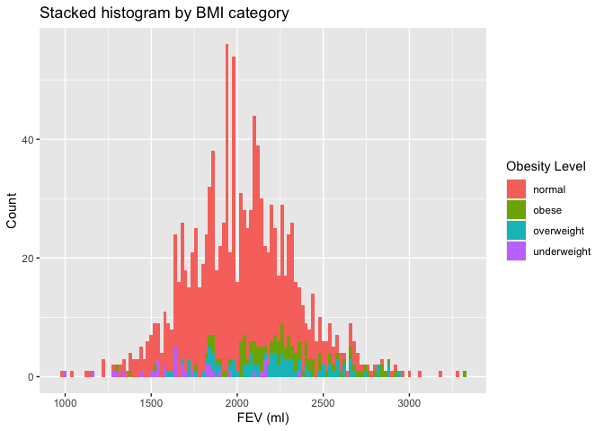
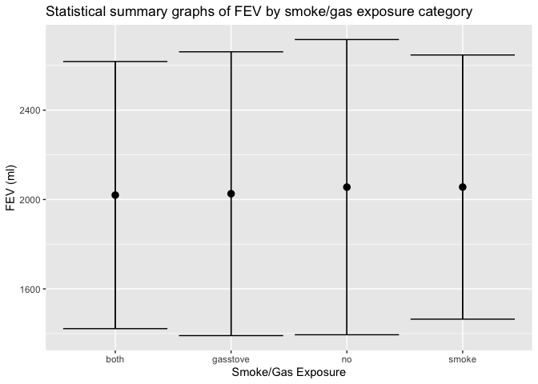
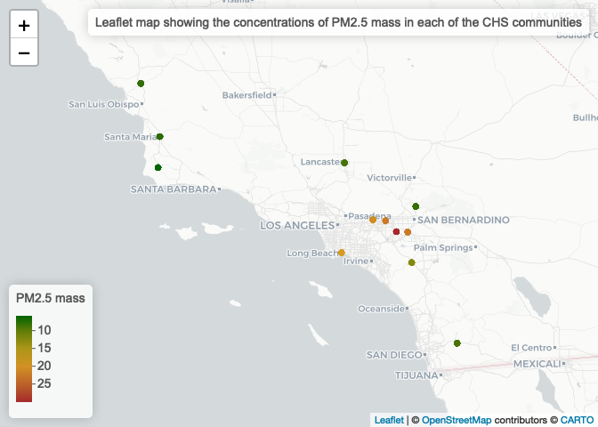

Assignment 02 - Data Viz and Wrangling
================
Qiushi
2022-10-04

Import libraries.

``` r
library(data.table)
library(dplyr)
```

    ## 
    ## Attaching package: 'dplyr'

    ## The following objects are masked from 'package:data.table':
    ## 
    ##     between, first, last

    ## The following objects are masked from 'package:stats':
    ## 
    ##     filter, lag

    ## The following objects are masked from 'package:base':
    ## 
    ##     intersect, setdiff, setequal, union

``` r
library(ggplot2)
```

### Data Wrangling

Read in data.

``` r
individual <- read.csv("chs_individual.csv")
regional <- read.csv("chs_regional.csv")
```

Merge data.

``` r
total_data <- 
  merge(x = individual,
        y = regional,
        by = "townname",
        all.x = TRUE,
        all.y = FALSE)
total_data
```

    ##           townname  sid male race hispanic    agepft height weight      bmi
    ## 1           Alpine  841    1    W        1 10.548939    150     78 15.75758
    ## 2           Alpine  835    0    W        0 10.099932    143     69 15.33749
    ## 3           Alpine  838    0    O        1  9.486653    133     62 15.93183
    ## 4           Alpine  840    0    W        0  9.965777    146     78 16.63283
    ## 5           Alpine  865    0    W        0 10.039699    162    140 24.24797
    ## 6           Alpine  867    0    W        1  9.957563    141     94 21.49151
    ## 7           Alpine  842    1    M        1  9.489391    139     65 15.29189
    ## 8           Alpine  839    0    M        1 10.053388    142     86 19.38649
    ## 9           Alpine  844    1    W        1 10.513347    143     65 14.44836
    ## 10          Alpine  847    1    M        0  9.902806    137     69 16.71034
    ## 11          Alpine  849    1    W        0 10.343600    147    112 23.55921
    ## 12          Alpine  851    1    W        0 10.245038    152     97 19.08367
    ## 13          Alpine  855    1    W        1 10.428474    143     64 14.22608
    ## 14          Alpine  856    1    W        0  9.464750    134     71 17.97323
    ## 15          Alpine  860    0    W        0  9.946612    142     64 14.42715
    ## 16          Alpine  863    1    W        0 10.954141    142     75 16.90682
    ## 17          Alpine  864    1    W        0 10.132786    144     71 15.56362
    ## 18          Alpine  886    1    W        0 10.004107    141     71 16.23295
    ## 19          Alpine  887    1    O        1 10.529774    138     74 17.66245
    ## 20          Alpine  889    1    W        0  9.828884    132     67 17.47850
    ## 21          Alpine  843    1    W        0  9.571526    149     98 20.06462
    ## 22          Alpine  892    1    W        0  9.568789    137     84 20.34302
    ## 23          Alpine  894    0    W        0  9.295003    150     89 17.97980
    ## 24          Alpine  895    1    W        0 10.351814    138     63 15.03695
    ## 25          Alpine  896    1    W        0 10.083504    149    100 20.47410
    ## 26          Alpine  900    1    W        1  9.793292    130     52 13.98601
    ## 27          Alpine  901    0    W        0  9.311431    132     67 17.47850
    ## 28          Alpine  903    1    M        0  9.127995    128     66 18.31055
    ## 29          Alpine  905    0    W        0  9.730322    142     94 21.18988
    ## 30          Alpine  906    0    W        0 10.203970    126     57 16.31966
    ## 31          Alpine  907    0    W        1 10.102669    134     71 17.97323
    ## 32          Alpine  908    1    M        1 10.094456    134     58 14.68235
    ## 33          Alpine  909    0    W        0 10.206708    141     68 15.54705
    ## 34          Alpine  891    1    O        1 10.042437    143    118 26.22933
    ## 35          Alpine  912    1    O        1 10.097194    136     78 19.16876
    ## 36          Alpine  914    1    O        1 10.105407    139     81 19.05604
    ## 37          Alpine  917    0    W        0  9.738535    137     75 18.16341
    ## 38          Alpine  923    0    W        0  9.147159    135     71 17.70794
    ## 39          Alpine  929    1    W        1 10.406571    138     64 15.27563
    ## 40          Alpine  930    1    W        0 10.080767    134     73 18.47952
    ## 41          Alpine  931    1    M        1 10.395619    140     71 16.46568
    ## 42          Alpine  933    1    W        1 10.625599    136     79 19.41452
    ## 43          Alpine  934    0    M        1 10.313484    137     64 15.49945
    ## 44          Alpine  936    1    W        0        NA     NA     NA       NA
    ## 45          Alpine  937    0    W        0 10.053388    141     71 16.23295
    ## 46          Alpine  938    0    W        0 10.234086    138     85 20.28795
    ## 47          Alpine  910    0    W        0  9.467488    133     59 15.16094
    ## 48          Alpine  870    0    W        1        NA     NA     NA       NA
    ## 49          Alpine  872    0    O        1  9.557837    133     69 17.73059
    ## 50          Alpine  873    0    W        0  9.804244    140    101 23.42301
    ## 51          Alpine  874    0    W        1  9.388090    149     82 16.78876
    ## 52          Alpine  875    0    O        1  9.650924    142     99 22.31700
    ## 53          Alpine  878    1    W        1  9.839836    135     68 16.95972
    ## 54          Alpine  880    1    O        1 10.121834    143    102 22.67281
    ## 55          Alpine  882    1    W        0  9.464750    143     63 14.00380
    ## 56          Alpine  883    1    M        1  9.744011    142    115 25.92379
    ## 57          Alpine  884    0    O        1  9.642710    143    115 25.56249
    ## 58          Alpine  963    1    W        0  9.412731    138     72 17.18508
    ## 59          Alpine  964    1    W        0 10.253251    144     80 17.53648
    ## 60          Alpine  968    0    W        0  9.470226    147     85 17.87976
    ## 61          Alpine  970    1    O        1 10.201232    147     85 17.87976
    ## 62          Alpine  972    0    W        0  9.415469    129     61 16.66202
    ## 63          Alpine  973    0    W        0  9.264887    125     58 16.87273
    ## 64          Alpine  974    0    W        0 10.579055    153     88 17.08744
    ## 65          Alpine  975    0    W        0 10.661191    137     52 12.59330
    ## 66          Alpine  976    0    W        0  9.319644    137     78 18.88995
    ## 67          Alpine  977    0    W        0  9.459274    148    116 24.07198
    ## 68          Alpine  978    1    W        0  9.010267    141     79 18.06201
    ## 69          Alpine  979    1    W        0 10.083504    136     67 16.46548
    ## 70          Alpine  982    0    W        0  9.905544    137     65 15.74162
    ## 71          Alpine  983    1    W        0 10.036961    133     92 23.64078
    ## 72          Alpine  986    0    W        0  9.590691    137     75 18.16341
    ## 73          Alpine  989    1    A        0 10.973306    146    101 21.53739
    ## 74          Alpine  991    1    O        1 10.217659    143     77 17.11575
    ## 75          Alpine  993    0    W        0 10.097194    146    100 21.32414
    ## 76          Alpine  997    0    W        0  9.327858    143     72 16.00434
    ## 77          Alpine  999    0    W        0  9.571526    159    125 22.47466
    ## 78          Alpine 1000    0    W        1 12.438056    126     94 26.91312
    ## 79          Alpine 1002    0    W        0  9.905544    146     66 14.07394
    ## 80          Alpine 1003    1    W        0 10.940452    140     65 15.07421
    ## 81          Alpine 1004    0    O        0  9.694730    142    114 25.69836
    ## 82          Alpine 1005    1    O        1 10.420260    141     79 18.06201
    ## 83          Alpine 1083    1    W        0 11.767283    145     82 17.72781
    ## 84          Alpine 1155    1    O        1        NA     NA     NA       NA
    ## 85          Alpine 1156    1    W        0 10.494182    140     66 15.30612
    ## 86          Alpine  946    1    W        0 10.483231    155    125 23.64961
    ## 87          Alpine  951    0    W        1  9.894593    143     80 17.78260
    ## 88          Alpine  869    1    W        1  9.629021    141     68 15.54705
    ## 89          Alpine  941    0    W        0 10.830938    135     93 23.19491
    ## 90          Alpine  957    1    W        0 11.203285    150     75 15.15152
    ## 91          Alpine  958    0    W        0  9.935661    133     62 15.93183
    ## 92          Alpine  952    0    W        1  9.984942    145    118 25.51076
    ## 93          Alpine  953    1    W        0 11.189596    140     83 19.24861
    ## 94          Alpine  962    1    W        1 10.250513    143     85 18.89401
    ## 95          Alpine  960    0    W        0 11.597536    144     82 17.97489
    ## 96          Alpine  961    0    W        1 10.412047    148     86 17.84647
    ## 97          Alpine  940    1    A        1  9.516769    133     65 16.70273
    ## 98          Alpine 1173    1    W        0  9.456537    137     62 15.01509
    ## 99          Alpine 1154    1    O        1        NA     NA     NA       NA
    ## 100         Alpine 1153    0    O        1  9.409993    143    138 30.67498
    ## 101     Atascadero  361    0    W        0  9.820671    134     63 15.94808
    ## 102     Atascadero  367    1    B        0 10.387406    152     85 16.72280
    ## 103     Atascadero  368    1    M        1 10.242300    143    113 25.11792
    ## 104     Atascadero  372    0    W        0  9.579740    137     67 16.22598
    ## 105     Atascadero  373    0    O        1 10.409309    149    109 22.31677
    ## 106     Atascadero  376    1    W        0  9.782341    135     73 18.20676
    ## 107     Atascadero  370    0    W        0  9.916496    150     87 17.57576
    ## 108     Atascadero  378    0    W        0  9.785079    132     73 19.04374
    ## 109     Atascadero  379    1    M        1 10.390144    143    125 27.78531
    ## 110     Atascadero  380    1    W        0  9.609856    145     84 18.16020
    ## 111     Atascadero  377    0    W        0 10.146475    142     97 21.86615
    ## 112     Atascadero  382    0    W        0 10.028747    137     69 16.71034
    ## 113     Atascadero  383    0    W        0  9.448323    146     97 20.68442
    ## 114     Atascadero  384    0    W        0  9.678303    141    102 23.32058
    ## 115     Atascadero  385    0    W        0  9.193703    134     63 15.94808
    ## 116     Atascadero  387    1    M        0  9.984942    138     63 15.03695
    ## 117     Atascadero  389    0    W        0  9.566051    138     81 19.33322
    ## 118     Atascadero  390    0    W        0 10.420260    144     77 16.87886
    ## 119     Atascadero  391    1    W        0  9.705681    141     74 16.91885
    ## 120     Atascadero  392    0    W        0  9.963039    137     64 15.49945
    ## 121     Atascadero  393    0    W        0  9.932923    141    105 24.00647
    ## 122     Atascadero  394    1    W        1 10.034223    147    133 27.97656
    ## 123     Atascadero  395    0    M        1  9.639973    136     77 18.92301
    ## 124     Atascadero  381    1    W        0  9.763176    138     79 18.85586
    ## 125     Atascadero  398    1    W        0 10.234086    147     95 19.98326
    ## 126     Atascadero  399    0    W        1 10.162902    144    104 22.79742
    ## 127     Atascadero  401    0    O        1 10.392882    144     89 19.50933
    ## 128     Atascadero  404    1    W        0 10.138261    149     89 18.22195
    ## 129     Atascadero  405    0    W        0 10.053388    137     62 15.01509
    ## 130     Atascadero  406    1    W        0 10.444901    137     80 19.37431
    ## 131     Atascadero  407    0    W        0  9.382615    136     72 17.69424
    ## 132     Atascadero  408    1    W        0 10.031485    148     98 20.33668
    ## 133     Atascadero  409    0    W        0  9.519507    137     61 14.77291
    ## 134     Atascadero  410    1    W        1 10.907598    137     59 14.28855
    ## 135     Atascadero  411    1    W        0 10.288843    140     64 14.84230
    ## 136     Atascadero  413    1    W        0 10.119097    144     85 18.63251
    ## 137     Atascadero  416    1    W        0  9.661875    140     71 16.46568
    ## 138     Atascadero  419    1    M        1 10.984257    136     60 14.74520
    ## 139     Atascadero  420    0    M        1  9.390828    138     82 19.57190
    ## 140     Atascadero  424    0    A        0  9.429158    135     86 21.44906
    ## 141     Atascadero  426    1    W        0 10.579055    153    125 24.27194
    ## 142     Atascadero  428    0    W        0 10.176591    142     71 16.00512
    ## 143     Atascadero  429    1    W        0 10.401095    134     73 18.47952
    ## 144     Atascadero  430    1    M        0  9.305955    141     90 20.57698
    ## 145     Atascadero  431    1    W        0        NA     NA     NA       NA
    ## 146     Atascadero  433    0    W        0  9.615332    139     68 15.99767
    ## 147     Atascadero  434    0    M        0 10.165640    147     78 16.40731
    ## 148     Atascadero  435    1    M        1  9.412731    136     63 15.48246
    ## 149     Atascadero  436    1    W        0 10.223135    148    130 26.97722
    ## 150     Atascadero  437    1    W        0 10.171116    142     77 17.35767
    ## 151     Atascadero  439    1    W        0 10.554415    136     64 15.72822
    ## 152     Atascadero  441    0    M        0  9.957563    138     82 19.57190
    ## 153     Atascadero  442    0    W        0 10.184805    137     71 17.19470
    ## 154     Atascadero  444    0    W        0  9.568789    146     88 18.76525
    ## 155     Atascadero  445    1    W        0 10.162902    143     75 16.67119
    ## 156     Atascadero  447    0    W        0 10.381930    133     62 15.93183
    ## 157     Atascadero  448    1    W        0  9.464750    145     79 17.07923
    ## 158     Atascadero  449    1    W        1 10.176591    135     73 18.20676
    ## 159     Atascadero  451    0    W        0  9.746749    147     78 16.40731
    ## 160     Atascadero  452    0    W        0  9.760438    155     99 18.73049
    ## 161     Atascadero  453    0    W        0 10.266940    132     58 15.13065
    ## 162     Atascadero  454    1    W        0  9.379877    140     99 22.95918
    ## 163     Atascadero  455    1    W        0  9.407255    138     69 16.46904
    ## 164     Atascadero  397    1    W        1  9.631759    143    130 28.89672
    ## 165     Atascadero  457    0    W        0  9.462012    128     54 14.98136
    ## 166     Atascadero  458    0    W        0 10.368241    138     62 14.79827
    ## 167     Atascadero  459    0    W        0 10.316222    143     77 17.11575
    ## 168     Atascadero  460    1    W        0 11.214237    122     55 16.79656
    ## 169     Atascadero  461    1    W        0 10.392882    141     71 16.23295
    ## 170     Atascadero  463    0    O        1  9.927447    145     93 20.10593
    ## 171     Atascadero  464    1    W        0 10.444901    138     84 20.04926
    ## 172     Atascadero  466    1    W        0 10.475017    142     65 14.65258
    ## 173     Atascadero  470    1    W        0  9.327858    128     60 16.64595
    ## 174     Atascadero  475    0    W        0  9.639973    131     62 16.42201
    ## 175     Atascadero  476    0    W        0  9.256674    135     68 16.95972
    ## 176     Atascadero  477    0    W        0  9.311431    138     73 17.42377
    ## 177     Atascadero  478    0    W        1  9.889117    139     67 15.76241
    ## 178     Atascadero  481    0    O        0  9.032170    145     84 18.16020
    ## 179     Atascadero  482    1    W        1  9.062286    144    103 22.57821
    ## 180     Atascadero  483    1    M        1  9.218344    141     81 18.51928
    ## 181     Atascadero  487    1    W        0  9.746749    139     66 15.52715
    ## 182     Atascadero  488    1    M        1  9.675565    138     87 20.76531
    ## 183     Atascadero  491    1    W        0  9.919233    149    108 22.11203
    ## 184     Atascadero  496    0    W        0        NA     NA     NA       NA
    ## 185     Atascadero  497    1    W        1 10.097194    129     84 22.94443
    ## 186     Atascadero  499    1    M        1  9.623546    126     63 18.03752
    ## 187     Atascadero  500    0    W        0        NA     NA     NA       NA
    ## 188     Atascadero  502    0    O        1 10.072553    146     74 15.77987
    ## 189     Atascadero  505    1    M        1  9.609856    142     69 15.55427
    ## 190     Atascadero  508    1    W        0  9.462012    137     98 23.73353
    ## 191     Atascadero  509    0    D        1        NA     NA     NA       NA
    ## 192     Atascadero  510    1    M        1 10.124572    146     82 17.48580
    ## 193     Atascadero  512    0    M        1  9.275838    128     57 15.81365
    ## 194     Atascadero  514    0    W        0 10.387406    137     68 16.46816
    ## 195     Atascadero  515    1    W        0  9.149897    127     59 16.62731
    ## 196     Atascadero  516    1    W        0 10.453114    144     82 17.97489
    ## 197     Atascadero  786    1    M        1  9.705681    141    105 24.00647
    ## 198     Atascadero  787    1    O        1 10.324435    141     66 15.08978
    ## 199     Atascadero  668    0    M        1 10.075291    158    109 19.84676
    ## 200     Atascadero  456    1    W        0        NA     NA     NA       NA
    ## 201  Lake Elsinore 1016    1    W        0  9.659138    138     85 20.28795
    ## 202  Lake Elsinore 1037    0    W        0 10.220397    148     86 17.84647
    ## 203  Lake Elsinore 1040    1    W        0  9.253936    140     75 17.39332
    ## 204  Lake Elsinore 1046    0    M        1 10.447639    158    102 18.57220
    ## 205  Lake Elsinore 1050    0    W        0 10.223135    135     72 17.95735
    ## 206  Lake Elsinore 1015    0    W        0  9.713895    150    125 25.25253
    ## 207  Lake Elsinore 1054    0    O        1  9.787817    143     93 20.67227
    ## 208  Lake Elsinore 1055    0    O        1 10.110883    124     54 15.96349
    ## 209  Lake Elsinore 1043    0    W        1  9.864476    131     61 16.15714
    ## 210  Lake Elsinore 1053    1    O        1  9.839836    140     97 22.49536
    ## 211  Lake Elsinore 1063    0    W        0  9.577002    140     69 16.00186
    ## 212  Lake Elsinore 1064    0    W        0  9.650924    134     59 14.93550
    ## 213  Lake Elsinore 1065    1    M        0 10.395619    149    142 29.07322
    ## 214  Lake Elsinore 1067    1    W        0        NA     NA     NA       NA
    ## 215  Lake Elsinore 1044    1    W        0  9.516769    136     63 15.48246
    ## 216  Lake Elsinore 1071    0    W        0 10.162902    147     86 18.09011
    ## 217  Lake Elsinore 1073    0    W        0  9.577002    136     70 17.20274
    ## 218  Lake Elsinore 1051    0    W        1 10.198494    134     67 16.96065
    ## 219  Lake Elsinore 1077    1    W        0 10.381930    135     66 16.46091
    ## 220  Lake Elsinore 1080    0    W        1  9.579740    131     80 21.18970
    ## 221  Lake Elsinore 1081    1    O        1  9.234771    133     63 16.18880
    ## 222  Lake Elsinore 1058    0    O        1 11.074606    132     59 15.39152
    ## 223  Lake Elsinore 1061    0    W        1 10.217659    147     74 15.56590
    ## 224  Lake Elsinore 1010    1    O        1 10.663929    147     84 17.66941
    ## 225  Lake Elsinore 1012    0    O        1 10.551677    144    102 22.35901
    ## 226  Lake Elsinore 1086    0    O        1  9.467488    134     62 15.69493
    ## 227  Lake Elsinore 1088    0    O        1 10.677618    146    103 21.96387
    ## 228  Lake Elsinore 1068    1    W        0  9.492129    139     67 15.76241
    ## 229  Lake Elsinore 1023    1    W        0 10.094456    142     71 16.00512
    ## 230  Lake Elsinore 1024    1    W        0        NA     NA     NA       NA
    ## 231  Lake Elsinore 1076    0    O        1  9.629021    140     88 20.40816
    ## 232  Lake Elsinore 1027    1    W        0 10.225873    139     60 14.11559
    ## 233  Lake Elsinore 1028    1    W        0  9.735797    136     92 22.60931
    ## 234  Lake Elsinore 1031    0    W        0        NA     NA     NA       NA
    ## 235  Lake Elsinore 1033    0    M        0  9.834360    141     77 17.60475
    ## 236  Lake Elsinore 1034    1    W        0        NA     NA     NA       NA
    ## 237  Lake Elsinore 1035    0    W        0  9.730322    140     71 16.46568
    ## 238  Lake Elsinore 1036    1    W        0 10.050650    150     94 18.98990
    ## 239  Lake Elsinore 1113    0    M        1  9.993155    151     85 16.94503
    ## 240  Lake Elsinore 1115    0    W        0 10.116359    145     71 15.34969
    ## 241  Lake Elsinore 1116    0    W        0  9.516769    140     71 16.46568
    ## 242  Lake Elsinore 1117    1    O        1 10.012320    141    106 24.23511
    ## 243  Lake Elsinore 1120    1    W        0  9.423682    141     89 20.34835
    ## 244  Lake Elsinore 1121    1    M        1        NA     NA     NA       NA
    ## 245  Lake Elsinore 1123    1    W        0  9.979466    133     64 16.44576
    ## 246  Lake Elsinore 1124    1    W        0  9.705681    149    117 23.95469
    ## 247  Lake Elsinore 1127    1    A        1 10.179329    142     95 21.41530
    ## 248  Lake Elsinore 1128    0    M        1  9.976728    134     50 12.65720
    ## 249  Lake Elsinore 1129    1    W        1  9.768652    135     60 14.96446
    ## 250  Lake Elsinore 1130    1    W        0 10.310746    137     66 15.98380
    ## 251  Lake Elsinore 1131    0    W        0  9.486653    144     98 21.48218
    ## 252  Lake Elsinore 1132    0    W        0  9.897331    131     68 18.01124
    ## 253  Lake Elsinore 1135    0    M        0        NA     NA     NA       NA
    ## 254  Lake Elsinore 1137    0    W        0  9.385352    126     55 15.74704
    ## 255  Lake Elsinore 1139    1    O        1 10.127310    143     86 19.11629
    ## 256  Lake Elsinore 1140    1    W        0  9.555099    136     82 20.15178
    ## 257  Lake Elsinore 1142    0    W        0  9.724846    131     60 15.89227
    ## 258  Lake Elsinore 1143    1    A        0  9.336071    124     54 15.96349
    ## 259  Lake Elsinore 1149    1    W        0  9.429158    138     69 16.46904
    ## 260  Lake Elsinore 1150    1    W        0 10.236824    137     63 15.25727
    ## 261  Lake Elsinore 1151    0    O        1 10.113621    142    100 22.54242
    ## 262  Lake Elsinore 1082    1    O        1  9.571526    145     73 15.78208
    ## 263  Lake Elsinore 1007    0    W        0  9.724846    144     70 15.34442
    ## 264  Lake Elsinore 1084    0    W        1 10.201232    139    104 24.46702
    ## 265  Lake Elsinore 1085    0    O        1  9.593429    130     53 14.25498
    ## 266  Lake Elsinore 1161    1    O        1 10.381930    138     88 21.00399
    ## 267  Lake Elsinore 1165    1    W        0 10.751540    144     92 20.16695
    ## 268  Lake Elsinore 1020    1    W        0        NA     NA     NA       NA
    ## 269  Lake Elsinore 1091    1    O        1 10.261465    136     67 16.46548
    ## 270  Lake Elsinore 1092    1    W        0 10.475017    138     66 15.75299
    ## 271  Lake Elsinore 1026    0    W        0        NA     NA     NA       NA
    ## 272  Lake Elsinore 1094    0    W        0  9.533196    142     85 19.16106
    ## 273  Lake Elsinore 1096    0    W        0  9.533196    138     72 17.18508
    ## 274  Lake Elsinore 1097    0    M        1 10.034223    142    111 25.02209
    ## 275  Lake Elsinore 1098    0    W        0        NA     NA     NA       NA
    ## 276  Lake Elsinore 1100    0    O        1 10.379192    129     51 13.93054
    ## 277  Lake Elsinore 1102    1    W        1  9.629021    136     91 22.36356
    ## 278  Lake Elsinore 1107    1    W        1 10.461328    142     72 16.23055
    ## 279  Lake Elsinore 1185    1    M        1 10.108145    148    123 25.52460
    ## 280  Lake Elsinore 1187    0    O        1  9.785079    146    110 23.45656
    ## 281  Lake Elsinore 1188    0    O        1 10.475017    152    109 21.44454
    ## 282  Lake Elsinore 1189    1    O        1  9.782341    148    111 23.03440
    ## 283  Lake Elsinore 1190    1    D        1  9.697467    147     87 18.30046
    ## 284  Lake Elsinore 1191    1    M        1 10.505133    138     80 19.09454
    ## 285  Lake Elsinore 1192    1    O        1  9.596167    135     78 19.45380
    ## 286  Lake Elsinore 1195    1    O        1 10.480493    138     96 22.91344
    ## 287  Lake Elsinore 1196    0    W        0 10.034223    139     60 14.11559
    ## 288  Lake Elsinore 1197    0    W        0  9.793292    131     60 15.89227
    ## 289  Lake Elsinore 1179    0    W        0  9.952088    141     82 18.74791
    ## 290  Lake Elsinore 1181    1    O        1 10.617385    149     69 14.12713
    ## 291  Lake Elsinore 1182    0    W        1  9.667351    130     50 13.44809
    ## 292  Lake Elsinore 1183    0    O        1  9.486653    136     66 16.21972
    ## 293  Lake Elsinore 1184    0    O        1  9.719370    128     46 12.76190
    ## 294  Lake Elsinore 1093    0    O        1 10.291581    144     77 16.87886
    ## 295  Lake Elsinore 1175    1    W        1 10.042437    144    143 31.34645
    ## 296  Lake Elsinore 1169    1    M        1  9.686516    136     75 18.43150
    ## 297  Lake Elsinore 1089    1    M        1 10.080767    129     53 14.47684
    ## 298  Lake Elsinore 1170    1    M        0  9.834360    137     63 15.25727
    ## 299  Lake Elsinore 1177    0    M        1  9.557837    130     60 16.13771
    ## 300  Lake Elsinore 1178    0    M        1 10.201232    151     80 15.94826
    ## 301   Lake Gregory 1215    1    W        0  9.733060    124     50 14.78100
    ## 302   Lake Gregory 1198    0    O        1  9.368925    136     69 16.95698
    ## 303   Lake Gregory 1217    1    W        0  9.563313    146     70 14.92690
    ## 304   Lake Gregory 1205    1    W        1 10.223135    139     54 12.70403
    ## 305   Lake Gregory 1209    1    W        0  9.377139    145     86 18.59258
    ## 306   Lake Gregory 1210    1    W        1 10.236824    148     75 15.56378
    ## 307   Lake Gregory 1199    1    W        0        NA     NA     NA       NA
    ## 308   Lake Gregory 1240    0    W        0  9.656400    146    103 21.96387
    ## 309   Lake Gregory 1219    0    W        0  9.845311    144    100 21.92059
    ## 310   Lake Gregory 1222    0    W        0  9.957563    129     51 13.93054
    ## 311   Lake Gregory 1239    0    W        1  9.511294    132     65 16.95676
    ## 312   Lake Gregory 1227    1    W        0  9.853525    145     83 17.94401
    ## 313   Lake Gregory 1228    1    W        0  9.768652    137     65 15.74162
    ## 314   Lake Gregory 1229    0    W        0  9.492129    141     81 18.51928
    ## 315   Lake Gregory 1231    1    W        0  9.634497    134     73 18.47952
    ## 316   Lake Gregory 1232    1    W        0 10.488706    152    102 20.06736
    ## 317   Lake Gregory 1236    0    O        1  9.908282    148     83 17.22392
    ## 318   Lake Gregory 1237    0    W        0 10.127310    134     70 17.72008
    ## 319   Lake Gregory 1238    1    M        1  9.593429    141     90 20.57698
    ## 320   Lake Gregory 1255    0    W        1  9.544148    135     74 18.45617
    ## 321   Lake Gregory 1256    1    O        1        NA     NA     NA       NA
    ## 322   Lake Gregory 1257    0    W        1 10.291581    144     74 16.22124
    ## 323   Lake Gregory 1258    0    W        1 10.255989    156    158 29.51109
    ## 324   Lake Gregory 1224    0    W        0 10.020534    136     63 15.48246
    ## 325   Lake Gregory 1261    0    O        1 10.124572    148     97 20.12916
    ## 326   Lake Gregory 1262    1    W        1        NA     NA     NA       NA
    ## 327   Lake Gregory 1265    0    W        0        NA     NA     NA       NA
    ## 328   Lake Gregory 1266    0    M        0  9.889117    144     73 16.00203
    ## 329   Lake Gregory 1270    0    W        0  9.891855    125     51 14.83636
    ## 330   Lake Gregory 1271    1    O        1  9.927447    140    113 26.20594
    ## 331   Lake Gregory 1272    1    W        0  9.801506    135     60 14.96446
    ## 332   Lake Gregory 1273    0    W        1  9.716632    129     56 15.29628
    ## 333   Lake Gregory 1274    1    W        0  9.935661    138     66 15.75299
    ## 334   Lake Gregory 1276    1    W        0  9.377139    143     97 21.56140
    ## 335   Lake Gregory 1277    0    W        0  9.919233    142     89 20.06276
    ## 336   Lake Gregory 1278    1    W        0 10.058864    127     43 12.11821
    ## 337   Lake Gregory 1259    0    O        1  9.497604    131     64 16.95176
    ## 338   Lake Gregory 1281    1    O        1  9.434634    138     72 17.18508
    ## 339   Lake Gregory 1282    1    O        1 10.086242    131     89 23.57354
    ## 340   Lake Gregory 1283    0    O        0  9.935661    137    100 24.21788
    ## 341   Lake Gregory 1284    1    W        0 10.294319    135     60 14.96446
    ## 342   Lake Gregory 1286    0    W        1 10.050650    120     50 15.78283
    ## 343   Lake Gregory 1287    0    W        0 10.439425    130     54 14.52394
    ## 344   Lake Gregory 1288    0    O        1  9.259411    121     54 16.76488
    ## 345   Lake Gregory 1293    0    M        1  9.913758    136     60 14.74520
    ## 346   Lake Gregory 1294    1    W        0  9.935661    148    100 20.75171
    ## 347   Lake Gregory 1297    1    O        1  9.155373    146    111 23.66980
    ## 348   Lake Gregory 1299    0    W        1  9.557837    136     61 14.99096
    ## 349   Lake Gregory 1242    0    O        0  9.738535    138     59 14.08222
    ## 350   Lake Gregory 1279    1    W        0  9.776865    139     97 22.82020
    ## 351   Lake Gregory 1244    1    W        1 10.672142    137     76 18.40559
    ## 352   Lake Gregory 1245    0    B        0  9.434634    120     61 19.25505
    ## 353   Lake Gregory 1246    0    O        1  9.494867    133     71 18.24452
    ## 354   Lake Gregory 1247    0    W        0  9.842574    134     65 16.45436
    ## 355   Lake Gregory 1249    1    W        0 10.288843    140     74 17.16141
    ## 356   Lake Gregory 1250    0    W        1 10.318960    145     71 15.34969
    ## 357   Lake Gregory 1251    1    W        0  9.524983    133     56 14.39004
    ## 358   Lake Gregory 1252    1    W        0  9.533196    143     76 16.89347
    ## 359   Lake Gregory 1254    1    W        0 10.236824    130     64 17.21356
    ## 360   Lake Gregory 1322    1    O        1 10.362765    137     60 14.53073
    ## 361   Lake Gregory 1324    1    M        1 10.283368    125     52 15.12727
    ## 362   Lake Gregory 1327    0    W        0  9.409993    137     88 21.31174
    ## 363   Lake Gregory 1328    0    O        1  9.771389    131     56 14.83279
    ## 364   Lake Gregory 1329    1    W        0  9.251198    133     96 24.66864
    ## 365   Lake Gregory 1331    0    W        0  9.853525    132     67 17.47850
    ## 366   Lake Gregory 1332    0    W        0        NA     NA     NA       NA
    ## 367   Lake Gregory 1333    0    W        0 10.209446    137     71 17.19470
    ## 368   Lake Gregory 1334    1    O        1  9.919233    138    102 24.34553
    ## 369   Lake Gregory 1336    0    O        1        NA     NA     NA       NA
    ## 370   Lake Gregory 1337    1    O        1  9.727584    137     67 16.22598
    ## 371   Lake Gregory 1338    1    W        0  9.938398    143     74 16.44890
    ## 372   Lake Gregory 1339    1    W        0  9.771389    133     61 15.67487
    ## 373   Lake Gregory 1341    0    W        1  9.284052    141     81 18.51928
    ## 374   Lake Gregory 1344    1    W        0 10.965092    135     68 16.95972
    ## 375   Lake Gregory 1345    0    W        0 10.083504    138     65 15.51431
    ## 376   Lake Gregory 1348    0    W        0  9.648186    130     55 14.79290
    ## 377   Lake Gregory 1349    1    M        0  9.826146    141     60 13.71799
    ## 378   Lake Gregory 1350    0    M        1  9.848049    146     75 15.99311
    ## 379   Lake Gregory 1351    0    W        0 10.409309    136     70 17.20274
    ## 380   Lake Gregory 1352    1    W        0 10.083504    139     66 15.52715
    ## 381   Lake Gregory 1354    1    W        0 10.190281    142     63 14.20173
    ## 382   Lake Gregory 1358    1    W        0 10.395619    146     90 19.19173
    ## 383   Lake Gregory 1361    1    W        0 10.453114    142     84 18.93564
    ## 384   Lake Gregory 1364    1    W        0  9.442847    135     84 20.95024
    ## 385   Lake Gregory 1368    0    W        1        NA     NA     NA       NA
    ## 386   Lake Gregory 1369    1    O        1 12.731006    151     84 16.74568
    ## 387   Lake Gregory 1373    0    O        1        NA     NA     NA       NA
    ## 388   Lake Gregory 1374    1    O        1 10.214921    136     70 17.20274
    ## 389   Lake Gregory 1301    1    W        0  9.905544    137     70 16.95252
    ## 390   Lake Gregory 1243    1    A        1  9.593429    142     78 17.58309
    ## 391   Lake Gregory 1307    1    M        0  9.900068    140     62 14.37848
    ## 392   Lake Gregory 1308    1    W        0 10.190281    156    122 22.78704
    ## 393   Lake Gregory 1310    1    W        0        NA     NA     NA       NA
    ## 394   Lake Gregory 1311    1    O        1 10.149213    139    118 27.76066
    ## 395   Lake Gregory 1312    0    D        1 10.236824    124     56 16.55473
    ## 396   Lake Gregory 1313    1    W        0  9.864476    135     58 14.46564
    ## 397   Lake Gregory 1316    0    W        0  9.856263    131     85 22.51405
    ## 398   Lake Gregory 1317    1    W        0 10.485969    139     65 15.29189
    ## 399   Lake Gregory 1321    0    W        0 10.017796    133     73 18.75845
    ## 400   Lake Gregory 1303    0    W        0  9.585216    145    124 26.80791
    ## 401      Lancaster    1    1    W        0 10.154689    123     54 16.22411
    ## 402      Lancaster    2    1    W        0 10.461328    145     77 16.64685
    ## 403      Lancaster    6    0    B        0 10.097194    145    143 30.91558
    ## 404      Lancaster    7    0    O        0 10.746064    156     72 13.44809
    ## 405      Lancaster    8    0    W        1  9.782341    132     61 15.91326
    ## 406      Lancaster   10    1    O        1        NA     NA     NA       NA
    ## 407      Lancaster   13    1    O        1 10.176591    140     79 18.32096
    ## 408      Lancaster   16    0    W        0 10.436687    141     74 16.91885
    ## 409      Lancaster   19    0    W        0        NA     NA     NA       NA
    ## 410      Lancaster   21    0    W        1  9.938398    126     59 16.89228
    ## 411      Lancaster   22    0    O        1  9.886379    145     91 19.67355
    ## 412      Lancaster   23    0    W        0  9.738535    137     70 16.95252
    ## 413      Lancaster   25    1    B        0        NA     NA     NA       NA
    ## 414      Lancaster   26    1    M        1 10.729637    137     70 16.95252
    ## 415      Lancaster   27    0    M        1  9.897331    139     67 15.76241
    ## 416      Lancaster   29    0    B        0        NA     NA     NA       NA
    ## 417      Lancaster   33    1    W        1 10.036961    145     77 16.64685
    ## 418      Lancaster   35    1    O        1 10.395619    134     67 16.96065
    ## 419      Lancaster   36    0    W        0  9.579740    134     71 17.97323
    ## 420      Lancaster   37    1    O        1        NA     NA     NA       NA
    ## 421      Lancaster   40    0    O        1  9.815195    128     97 26.91096
    ## 422      Lancaster   42    1    W        1 10.143737    143     66 14.67064
    ## 423      Lancaster   43    0    W        0  9.842574    142     67 15.10342
    ## 424      Lancaster   44    1    W        0 10.160164    143     82 18.22716
    ## 425      Lancaster   45    0    W        1 10.628337    145     69 14.91731
    ## 426      Lancaster   46    1    W        1 10.384668    132     78 20.34811
    ## 427      Lancaster   47    0    M        1  9.694730    134     66 16.70751
    ## 428      Lancaster   50    0    W        0  9.971253    147     72 15.14520
    ## 429      Lancaster   56    1    M        1  9.957563    140     73 16.92950
    ## 430      Lancaster   57    0    W        0 10.209446    137     64 15.49945
    ## 431      Lancaster   58    0    W        0  9.612594    148    112 23.24192
    ## 432      Lancaster   59    0    W        1  9.787817    143     68 15.11521
    ## 433      Lancaster   61    0    W        0  9.924709    137     68 16.46816
    ## 434      Lancaster   64    0    O        1  9.793292    144     81 17.75568
    ## 435      Lancaster   66    0    O        1  9.519507    130     70 18.82733
    ## 436      Lancaster   68    1    O        1 10.206708    137     86 20.82738
    ## 437      Lancaster   69    1    W        1        NA     NA     NA       NA
    ## 438      Lancaster   70    0    O        1 10.061602    135     82 20.45143
    ## 439      Lancaster   71    0    O        1 10.061602    135     85 21.19965
    ## 440      Lancaster   74    0    M        1 10.275154    141     75 17.14748
    ## 441      Lancaster   75    0    W        0  9.754962    145     80 17.29543
    ## 442      Lancaster   77    0    W        0 10.108145    136    108 26.54137
    ## 443      Lancaster   78    0    O        1 10.187543    140     71 16.46568
    ## 444      Lancaster   80    0    B        0  9.812457    140     79 18.32096
    ## 445      Lancaster   81    0    W        0  9.973990    129     56 15.29628
    ## 446      Lancaster   82    0    B        0  9.960301    133     62 15.93183
    ## 447      Lancaster   84    0    O        1 10.663929    144    123 26.96233
    ## 448      Lancaster   87    0    A        0 10.940452    137     56 13.56201
    ## 449      Lancaster   89    0    W        0        NA     NA     NA       NA
    ## 450      Lancaster   93    1    O        1  9.305955    130     66 17.75148
    ## 451      Lancaster   97    0    W        1  9.702943    140     95 22.03154
    ## 452      Lancaster   98    0    O        1  9.325120    142    105 23.66955
    ## 453      Lancaster   99    1    D        1 10.376454    154    136 26.06602
    ## 454      Lancaster  100    0    O        1  9.894593    152    142 27.93692
    ## 455      Lancaster  103    1    W        0 10.045175    138     74 17.66245
    ## 456      Lancaster  105    1    W        0  9.738535    134     59 14.93550
    ## 457      Lancaster  106    0    W        0  9.864476    137     67 16.22598
    ## 458      Lancaster  107    1    M        1  9.415469    124     60 17.73721
    ## 459      Lancaster  108    1    O        1 10.165640    145    102 22.05167
    ## 460      Lancaster  110    1    W        1  9.902806    140     78 18.08905
    ## 461      Lancaster  111    0    B        0        NA     NA     NA       NA
    ## 462      Lancaster  112    0    W        1 10.403833    147     79 16.61766
    ## 463      Lancaster  116    1    B        0 10.036961    149     75 15.35557
    ## 464      Lancaster  121    1    B        0  9.902806    136    101 24.82109
    ## 465      Lancaster  123    0    W        0 10.335387    153    146 28.34962
    ## 466      Lancaster  124    1    W        0  9.993155    152    115 22.62497
    ## 467      Lancaster  126    0    O        1        NA     NA     NA       NA
    ## 468      Lancaster  128    1    W        0 10.083504    149     69 14.12713
    ## 469      Lancaster  129    1    W        1 10.124572    143    108 24.00651
    ## 470      Lancaster  131    0    O        1  9.705681    134     60 15.18864
    ## 471      Lancaster  132    0    W        1  9.971253    142     88 19.83733
    ## 472      Lancaster  133    1    W        0 10.187543    129     60 16.38888
    ## 473      Lancaster  134    1    O        1 10.223135    144     98 21.48218
    ## 474      Lancaster  135    1    W        1 10.455852    141     87 19.89108
    ## 475      Lancaster  136    0    M        1  9.798768    144     86 18.85171
    ## 476      Lancaster  138    1    W        0 10.557153    141     67 15.31842
    ## 477      Lancaster  140    1    M        1  9.656400    138    104 24.82290
    ## 478      Lancaster  142    0    W        0        NA     NA     NA       NA
    ## 479      Lancaster  145    1    B        0  9.494867    130     59 15.86875
    ## 480      Lancaster  146    0    O        1 10.182067    139     67 15.76241
    ## 481      Lancaster  149    0    M        1        NA     NA     NA       NA
    ## 482      Lancaster  150    0    B        0        NA     NA     NA       NA
    ## 483      Lancaster  151    1    W        0  9.552361    135     56 13.96683
    ## 484      Lancaster  152    1    W        0 10.718686    129     49 13.38425
    ## 485      Lancaster  155    0    M        0  9.555099    124     44 13.00728
    ## 486      Lancaster  157    0    W        1 10.543463    132     70 18.26112
    ## 487      Lancaster  162    1    W        0 10.537988    134     56 14.17607
    ## 488      Lancaster  164    0    B        0 10.286105    149     95 19.45039
    ## 489      Lancaster  167    1    W        0 10.064339    141     72 16.46158
    ## 490      Lancaster  169    1    B        0  9.774127    135     70 17.45854
    ## 491      Lancaster  215    0    W        0  9.968515    140     88 20.40816
    ## 492      Lancaster  217    0    B        0  9.500342    145     99 21.40309
    ## 493      Lancaster  218    0    W        0 10.269678    149     72 14.74135
    ## 494      Lancaster  221    0    B        0  9.842574    131     79 20.92482
    ## 495      Lancaster  222    0    O        1 10.056126    143    124 27.56303
    ## 496      Lancaster  223    1    O        1 10.787132    141     90 20.57698
    ## 497      Lancaster  211    1    W        0 10.661191    137     72 17.43688
    ## 498      Lancaster  213    0    O        1 10.365503    146     75 15.99311
    ## 499      Lancaster  214    1    O        1  9.982204    139     64 15.05663
    ## 500      Lancaster  209    0    W        0 10.502396    134     56 14.17607
    ## 501         Lompoc 1869    0    A        0  9.535934    130     54 14.52394
    ## 502         Lompoc 1868    0    W        1        NA     NA     NA       NA
    ## 503         Lompoc 1875    0    W        0  9.620808    136     69 16.95698
    ## 504         Lompoc 1872    1    M        1 10.510609    149     76 15.56031
    ## 505         Lompoc 1873    1    W        0 10.086242    147     91 19.14186
    ## 506         Lompoc 1888    0    W        1 10.220397    154     89 17.05791
    ## 507         Lompoc 1870    1    W        0  9.284052    152    120 23.60866
    ## 508         Lompoc 1890    0    W        0 10.056126    131     54 14.30304
    ## 509         Lompoc 1898    1    W        0  9.869952    142     75 16.90682
    ## 510         Lompoc 1899    1    W        0  9.837098    136     62 15.23671
    ## 511         Lompoc 1900    1    O        1 10.617385    132     65 16.95676
    ## 512         Lompoc 1903    0    W        0        NA     NA     NA       NA
    ## 513         Lompoc 1904    0    W        0 10.031485    147     83 17.45906
    ## 514         Lompoc 1905    1    W        0  9.382615    139     59 13.88033
    ## 515         Lompoc 1906    0    M        0 10.521561    148     84 17.43144
    ## 516         Lompoc 1908    0    W        0        NA     NA     NA       NA
    ## 517         Lompoc 1910    0    W        0 10.056126    140     82 19.01670
    ## 518         Lompoc 1913    1    M        1 10.017796    154    132 25.29938
    ## 519         Lompoc 1914    1    W        0 10.784394    150     78 15.75758
    ## 520         Lompoc 1889    1    W        0        NA     NA     NA       NA
    ## 521         Lompoc 1916    0    W        0  9.434634    137     74 17.92123
    ## 522         Lompoc 1921    1    W        0  9.831622    140     71 16.46568
    ## 523         Lompoc 1925    0    W        0 10.116359    149     71 14.53661
    ## 524         Lompoc 1926    0    W        0  9.667351    144     89 19.50933
    ## 525         Lompoc 1927    1    W        0 10.647502    143     70 15.55977
    ## 526         Lompoc 1930    0    W        0  9.412731    127     52 14.65457
    ## 527         Lompoc 1931    1    O        1  9.946612    138     65 15.51431
    ## 528         Lompoc 1934    0    O        1 10.124572    146     67 14.28718
    ## 529         Lompoc 1939    1    W        0 10.272416    145     78 16.86304
    ## 530         Lompoc 1940    1    O        1 10.349076    144     95 20.82457
    ## 531         Lompoc 1941    0    W        0 10.146475    133     54 13.87611
    ## 532         Lompoc 1946    0    O        1        NA     NA     NA       NA
    ## 533         Lompoc 1949    0    M        0  9.464750    125     46 13.38182
    ## 534         Lompoc 1950    1    O        1 10.127310    136     71 17.44849
    ## 535         Lompoc 1951    0    W        1 10.272416    134     54 13.66978
    ## 536         Lompoc 1953    0    W        0 10.773443    137     62 15.01509
    ## 537         Lompoc 1954    0    O        0  9.889117    154    104 19.93284
    ## 538         Lompoc 1955    1    B        0 10.814511    131     69 18.27611
    ## 539         Lompoc 1960    0    O        1 10.143737    143     71 15.78206
    ## 540         Lompoc 1961    0    W        0 10.338125    136    100 24.57534
    ## 541         Lompoc 1962    0    B        0 10.105407    143     72 16.00434
    ## 542         Lompoc 1964    0    O        1 10.017796    140     92 21.33581
    ## 543         Lompoc 1877    1    M        1 10.034223    139    102 23.99650
    ## 544         Lompoc 1879    0    M        0 10.450376    144     78 17.09806
    ## 545         Lompoc 1882    1    M        1 10.036961    147    115 24.19026
    ## 546         Lompoc 1970    0    A        0 10.291581    135     65 16.21150
    ## 547         Lompoc 1971    1    W        0 10.565366    139     91 21.40864
    ## 548         Lompoc 1972    0    O        1 10.165640    122     56 17.10195
    ## 549         Lompoc 1975    1    M        1  9.626283    141     99 22.63468
    ## 550         Lompoc 1976    0    W        1 10.297057    134     56 14.17607
    ## 551         Lompoc 1977    0    M        1 11.036277    150    169 34.14141
    ## 552         Lompoc 1979    0    W        0 10.047912    148     87 18.05399
    ## 553         Lompoc 1980    0    O        1 10.127310    139     80 18.82078
    ## 554         Lompoc 1981    1    O        1 10.042437    138     89 21.24267
    ## 555         Lompoc 1983    0    O        1        NA     NA     NA       NA
    ## 556         Lompoc 1984    1    W        1 10.280630    140    106 24.58256
    ## 557         Lompoc 1986    1    W        0 10.108145    146    112 23.88304
    ## 558         Lompoc 1987    0    A        0 10.047912    130     78 20.97902
    ## 559         Lompoc 1988    0    M        0  9.979466    148     88 18.26150
    ## 560         Lompoc 1915    0    W        0        NA     NA     NA       NA
    ## 561         Lompoc 1992    1    O        1  9.771389    144    108 23.67424
    ## 562         Lompoc 1993    0    A        1  9.527721    133     64 16.44576
    ## 563         Lompoc 1994    0    W        0  9.776865    131     65 17.21663
    ## 564         Lompoc 1996    0    A        0 10.146475    125     70 20.36364
    ## 565         Lompoc 1997    0    O        1  9.533196    125     63 18.32727
    ## 566         Lompoc 1999    0    W        1  9.952088    134     65 16.45436
    ## 567         Lompoc 2000    1    O        1 10.261465    142    110 24.79667
    ## 568         Lompoc 2001    1    O        1 10.078029    146     95 20.25794
    ## 569         Lompoc 2002    1    B        0 11.173169    146    108 23.03008
    ## 570         Lompoc 2005    1    A        0  9.943874    128     59 16.36852
    ## 571         Lompoc 2006    0    O        1  9.456537    131     70 18.54098
    ## 572         Lompoc 2008    1    O        1 10.195756    129     55 15.02314
    ## 573         Lompoc 2009    0    W        0  9.801506    165    138 23.04032
    ## 574         Lompoc 2014    0    O        1  9.505818    134     84 21.26410
    ## 575         Lompoc 2016    0    W        1  9.278576    136     76 18.67726
    ## 576         Lompoc 2017    1    W        0  9.763176    141     86 19.66245
    ## 577         Lompoc 2018    0    W        1 10.351814    143    100 22.22825
    ## 578         Lompoc 2022    1    M        0 10.113621    133     59 15.16094
    ## 579         Lompoc 2024    0    W        0  9.538672    134     73 18.47952
    ## 580         Lompoc 2025    0    O        1        NA     NA     NA       NA
    ## 581         Lompoc 2028    1    W        1  9.900068    143     82 18.22716
    ## 582         Lompoc 2029    0    O        1  9.604381    135     88 21.94787
    ## 583         Lompoc 1966    0    W        0  9.377139    133     79 20.30024
    ## 584         Lompoc 1967    1    W        0  9.872690    136    100 24.57534
    ## 585         Lompoc 1968    1    W        1  9.993155    143     84 18.67173
    ## 586         Lompoc 2035    1    W        0  9.839836    144     71 15.56362
    ## 587         Lompoc 2036    1    O        1        NA     NA     NA       NA
    ## 588         Lompoc 2037    1    O        1  9.705681    134     62 15.69493
    ## 589         Lompoc 2038    0    O        1  9.281314    136     78 19.16876
    ## 590         Lompoc 2040    1    W        0 11.214237    149    110 22.52151
    ## 591         Lompoc 2041    0    O        1 10.250513    141     87 19.89108
    ## 592         Lompoc 2042    0    O        1 10.047912    141     89 20.34835
    ## 593         Lompoc 2043    1    O        1  9.546886    137     90 21.79610
    ## 594         Lompoc 2044    0    O        1  9.864476    142     79 17.80852
    ## 595         Lompoc 2046    0    O        1  9.470226    142    106 23.89497
    ## 596         Lompoc 2047    0    W        1  9.631759    136     68 16.71123
    ## 597         Lompoc 2048    0    O        1  9.472964    133     68 17.47362
    ## 598         Lompoc 2049    1    O        1  9.733060    141    104 23.77784
    ## 599         Lompoc 2050    0    O        1  9.875428    145    119 25.72695
    ## 600         Lompoc 1990    0    W        0  9.790554    129     62 16.93517
    ## 601     Long Beach 1387    0    B        0 10.004107    139     62 14.58611
    ## 602     Long Beach 1390    0    O        1 10.316222    138     83 19.81058
    ## 603     Long Beach 1394    1    M        1  9.538672    142    100 22.54242
    ## 604     Long Beach 1395    1    B        0  9.467488    137     62 15.01509
    ## 605     Long Beach 1389    1    M        0        NA     NA     NA       NA
    ## 606     Long Beach 1399    0    B        0        NA     NA     NA       NA
    ## 607     Long Beach 1400    0    W        0 10.751540    140    111 25.74212
    ## 608     Long Beach 1401    1    W        0        NA     NA     NA       NA
    ## 609     Long Beach 1403    1    B        0  9.631759    142     72 16.23055
    ## 610     Long Beach 1404    1    W        0  9.976728    145     84 18.16020
    ## 611     Long Beach 1405    0    O        1 10.069815    143     79 17.56032
    ## 612     Long Beach 1408    0    O        1  9.754962    126     43 12.31132
    ## 613     Long Beach 1409    0    W        1  9.475702    138     66 15.75299
    ## 614     Long Beach 1411    0    W        1  9.453799    129     54 14.74999
    ## 615     Long Beach 1414    0    A        0  9.842574    131     49 12.97869
    ## 616     Long Beach 1416    0    O        0        NA     NA     NA       NA
    ## 617     Long Beach 1417    0    B        0  9.864476    142    122 27.50176
    ## 618     Long Beach 1396    0    B        0 10.149213    137     72 17.43688
    ## 619     Long Beach 1419    0    B        1  9.856263    142     83 18.71021
    ## 620     Long Beach 1421    0    W        1 10.242300    134     64 16.20122
    ## 621     Long Beach 1422    0    B        0  9.672827    140     79 18.32096
    ## 622     Long Beach 1424    1    A        0  9.716632    142    110 24.79667
    ## 623     Long Beach 1427    1    W        1  9.886379    141     89 20.34835
    ## 624     Long Beach 1429    0    W        0        NA     NA     NA       NA
    ## 625     Long Beach 1430    0    O        1  9.609856    142    112 25.24752
    ## 626     Long Beach 1431    0    O        1  9.990418    139     67 15.76241
    ## 627     Long Beach 1432    1    M        1 10.652977    148    127 26.35467
    ## 628     Long Beach 1433    0    W        0 10.157426    148    114 23.65695
    ## 629     Long Beach 1434    1    W        0 10.283368    135     63 15.71268
    ## 630     Long Beach 1436    0    A        0  9.787817    140     79 18.32096
    ## 631     Long Beach 1418    0    O        0  9.716632    136     91 22.36356
    ## 632     Long Beach 1441    0    O        1  9.960301    135     60 14.96446
    ## 633     Long Beach 1443    0    O        1  9.371663    141     90 20.57698
    ## 634     Long Beach 1445    1    M        1  9.735797    132     64 16.69588
    ## 635     Long Beach 1447    0    M        1  9.886379    136     80 19.66027
    ## 636     Long Beach 1449    1    A        0  9.878166    138     73 17.42377
    ## 637     Long Beach 1450    1    W        0  9.535934    136     66 16.21972
    ## 638     Long Beach 1451    0    O        1 10.151951    142     81 18.25936
    ## 639     Long Beach 1452    1    M        1  9.349760    148    168 34.86287
    ## 640     Long Beach 1455    0    M        0 10.313484    138     64 15.27563
    ## 641     Long Beach 1456    0    W        0  9.935661    136     73 17.94000
    ## 642     Long Beach 1458    1    A        0 10.083504    130     57 15.33082
    ## 643     Long Beach 1459    0    W        1 10.316222    137     70 16.95252
    ## 644     Long Beach 1461    1    W        0  9.809719    148    143 29.67495
    ## 645     Long Beach 1464    1    W        0  9.776865    144     72 15.78283
    ## 646     Long Beach 1465    1    O        0 10.261465    134     60 15.18864
    ## 647     Long Beach 1466    0    O        1 10.250513    133     63 16.18880
    ## 648     Long Beach 1468    0    O        0  9.013005    130     79 21.24798
    ## 649     Long Beach 1471    1    A        0  9.563313    143     85 18.89401
    ## 650     Long Beach 1472    0    B        0  9.943874    141     78 17.83338
    ## 651     Long Beach 1473    0    W        1  9.774127    142     60 13.52545
    ## 652     Long Beach 1476    0    A        0 10.047912    145    101 21.83548
    ## 653     Long Beach 1479    1    A        0 10.039699    137     60 14.53073
    ## 654     Long Beach 1480    1    W        0  9.642710    133    100 25.69650
    ## 655     Long Beach 1481    1    M        1  9.738535    153    119 23.10689
    ## 656     Long Beach 1482    1    O        1  9.273101    146     98 20.89766
    ## 657     Long Beach 1483    1    O        1  9.880903    138    100 23.86817
    ## 658     Long Beach 1486    1    W        0 10.603696    139     68 15.99767
    ## 659     Long Beach 1487    0    W        0  9.527721    135     61 15.21387
    ## 660     Long Beach 1491    0    B        0        NA     NA     NA       NA
    ## 661     Long Beach 1492    0    B        0  9.965777    155    124 23.46041
    ## 662     Long Beach 1493    1    W        0  9.946612    145     80 17.29543
    ## 663     Long Beach 1494    1    W        0 10.696783    140     86 19.94434
    ## 664     Long Beach 1495    0    M        1 10.332649    132     69 18.00025
    ## 665     Long Beach 1496    0    A        0  9.347023    132     50 13.04366
    ## 666     Long Beach 1497    1    M        1 10.214921    137     69 16.71034
    ## 667     Long Beach 1499    0    W        0 10.212183    140     65 15.07421
    ## 668     Long Beach 1500    1    W        1  9.741273    138     62 14.79827
    ## 669     Long Beach 1501    1    O        1 10.286105    132     55 14.34803
    ## 670     Long Beach 1502    0    W        0 11.101985    158    130 23.67045
    ## 671     Long Beach 1438    1    A        0  9.311431    145    121 26.15933
    ## 672     Long Beach 1505    1    O        1 10.674880    141     72 16.46158
    ## 673     Long Beach 1508    1    B        0  9.828884    135     70 17.45854
    ## 674     Long Beach 1509    0    W        0  9.932923    134     62 15.69493
    ## 675     Long Beach 1510    1    O        1 10.242300    142     87 19.61191
    ## 676     Long Beach 1511    1    A        0 10.009582    131     61 16.15714
    ## 677     Long Beach 1512    1    W        1        NA     NA     NA       NA
    ## 678     Long Beach 1515    1    A        0  9.262149    134     79 19.99838
    ## 679     Long Beach 1516    1    W        1  9.815195    130     50 13.44809
    ## 680     Long Beach 1517    1    W        0  9.823409    153    154 29.90303
    ## 681     Long Beach 1518    0    M        1 10.143737    145     66 14.26873
    ## 682     Long Beach 1519    1    A        0 10.214921    133     73 18.75845
    ## 683     Long Beach 1520    0    M        1  9.683778    135     81 20.20202
    ## 684     Long Beach 1522    0    W        0 10.171116    142     75 16.90682
    ## 685     Long Beach 1523    1    W        0  9.995893    148     69 14.31868
    ## 686     Long Beach 1525    0    M        1  9.546886    134     77 19.49209
    ## 687     Long Beach 1526    1    M        1  9.560575    143    141 31.34183
    ## 688     Long Beach 1528    0    B        0  9.582478    140     75 17.39332
    ## 689     Long Beach 1530    0    O        1 10.009582    141     71 16.23295
    ## 690     Long Beach 1531    1    B        0 10.945927    147     79 16.61766
    ## 691     Long Beach 1536    1    A        0  9.300479    135     60 14.96446
    ## 692     Long Beach 1537    0    M        0  9.505818    136     70 17.20274
    ## 693     Long Beach 1538    1    O        1  9.541410    131     59 15.62740
    ## 694     Long Beach 1540    1    B        0  9.404517    144    105 23.01662
    ## 695     Long Beach 1545    1    W        0  9.470226    142     75 16.90682
    ## 696     Long Beach 1554    0    B        0 10.034223    150    153 30.90909
    ## 697     Long Beach 1720    1    B        0 10.639288    143     85 18.89401
    ## 698     Long Beach 1721    1    W        0  9.845311    142     80 18.03394
    ## 699     Long Beach 1504    1    O        1 10.146475    131     55 14.56792
    ## 700     Long Beach 1718    1    B        0  9.735797    138     69 16.46904
    ## 701      Mira Loma  683    0    W        0  9.210130    135     58 14.46564
    ## 702      Mira Loma  692    0    O        1  9.232033    140     92 21.33581
    ## 703      Mira Loma  693    1    W        0 10.173854    151     90 17.94180
    ## 704      Mira Loma  694    0    W        0        NA     NA     NA       NA
    ## 705      Mira Loma  695    0    B        0  9.566051    149     81 16.58402
    ## 706      Mira Loma  697    1    W        1  9.620808    128     78 21.63974
    ## 707      Mira Loma  698    0    W        0 10.075291    146     92 19.61821
    ## 708      Mira Loma  701    0    W        0  9.382615    141     71 16.23295
    ## 709      Mira Loma  702    0    W        0  9.883641    144     75 16.44045
    ## 710      Mira Loma  684    1    W        0 10.004107    123     52 15.62322
    ## 711      Mira Loma  687    1    W        0  9.560575    148    110 22.82688
    ## 712      Mira Loma  688    0    W        0  9.388090    137     82 19.85866
    ## 713      Mira Loma  689    1    W        0 10.360027    135     64 15.96209
    ## 714      Mira Loma  690    0    W        0  9.483915    133    105 26.98133
    ## 715      Mira Loma  709    0    W        0  9.946612    141    103 23.54921
    ## 716      Mira Loma  710    0    O        1  9.489391    144     87 19.07092
    ## 717      Mira Loma  711    0    A        0  9.486653    135     61 15.21387
    ## 718      Mira Loma  712    1    W        0  9.481177    141     82 18.74791
    ## 719      Mira Loma  713    1    W        1 10.439425    129     60 16.38888
    ## 720      Mira Loma  714    0    W        0        NA     NA     NA       NA
    ## 721      Mira Loma  715    0    O        0  9.524983    135     68 16.95972
    ## 722      Mira Loma  717    1    W        0 10.097194    137     81 19.61649
    ## 723      Mira Loma  703    1    W        0  9.960301    147    101 21.24536
    ## 724      Mira Loma  704    1    W        0 10.162902    136     67 16.46548
    ## 725      Mira Loma  706    0    W        0  9.916496    145     71 15.34969
    ## 726      Mira Loma  707    0    W        0 10.047912    141     89 20.34835
    ## 727      Mira Loma  708    1    M        1  9.716632    129     56 15.29628
    ## 728      Mira Loma  671    1    W        0 10.231348    142     60 13.52545
    ## 729      Mira Loma  672    0    W        1 10.250513    138     81 19.33322
    ## 730      Mira Loma  673    0    W        0 10.001369    132     67 17.47850
    ## 731      Mira Loma  676    1    W        0  9.524983    146     67 14.28718
    ## 732      Mira Loma  677    0    W        0 10.001369    141     69 15.77568
    ## 733      Mira Loma  680    0    O        1 10.212183    137     65 15.74162
    ## 734      Mira Loma  681    0    W        0  9.284052    141     83 18.97655
    ## 735      Mira Loma  682    0    W        0  9.434634    139     74 17.40923
    ## 736      Mira Loma  740    1    O        1  9.886379    140    124 28.75696
    ## 737      Mira Loma  745    1    W        0  9.752225    130     61 16.40667
    ## 738      Mira Loma  747    0    W        0        NA     NA     NA       NA
    ## 739      Mira Loma  749    0    W        0  9.119781    127     60 16.90912
    ## 740      Mira Loma  750    1    O        1  9.242984    135     58 14.46564
    ## 741      Mira Loma  752    1    W        0        NA     NA     NA       NA
    ## 742      Mira Loma  753    1    W        1 10.099932    142     79 17.80852
    ## 743      Mira Loma  754    0    W        0  9.560575    136     68 16.71123
    ## 744      Mira Loma  756    0    O        1  9.560575    139     61 14.35085
    ## 745      Mira Loma  758    0    O        1  9.390828    127     62 17.47276
    ## 746      Mira Loma  760    1    O        1  9.872690    145    104 22.48406
    ## 747      Mira Loma  761    1    W        0  9.848049    144    128 28.05836
    ## 748      Mira Loma  766    1    W        1  9.401780    132     63 16.43501
    ## 749      Mira Loma  768    1    W        0  9.872690    134     59 14.93550
    ## 750      Mira Loma  769    1    W        1  9.401780    135     75 18.70557
    ## 751      Mira Loma  770    0    W        0 10.266940    141     66 15.08978
    ## 752      Mira Loma  772    1    O        1  9.593429    135     63 15.71268
    ## 753      Mira Loma  773    1    M        1  9.401780    136     76 18.67726
    ## 754      Mira Loma  774    1    M        1 10.146475    144     94 20.60536
    ## 755      Mira Loma  776    1    W        0  9.787817    144     96 21.04377
    ## 756      Mira Loma  778    1    O        1  9.804244    130     75 20.17214
    ## 757      Mira Loma  779    0    M        1  9.976728    149     98 20.06462
    ## 758      Mira Loma  780    0    M        1  9.771389    138     99 23.62949
    ## 759      Mira Loma  782    1    W        0  9.549624    131     58 15.36253
    ## 760      Mira Loma  783    1    W        0  9.623546    135     75 18.70557
    ## 761      Mira Loma  784    1    O        1  9.831622    129     70 19.12035
    ## 762      Mira Loma  785    0    W        1  9.741273    145    137 29.61842
    ## 763      Mira Loma  718    0    W        0  9.368925    143     70 15.55977
    ## 764      Mira Loma  719    0    W        0  9.459274    136     68 16.71123
    ## 765      Mira Loma  790    1    O        1 10.214921    145    120 25.94314
    ## 766      Mira Loma  794    0    W        1 10.228611    141     65 14.86115
    ## 767      Mira Loma  669    0    O        1 10.420260    140     66 15.30612
    ## 768      Mira Loma  799    0    M        1  9.941136    145     80 17.29543
    ## 769      Mira Loma  800    0    W        1  9.774127    134     66 16.70751
    ## 770      Mira Loma  803    0    O        1  9.938398    144     93 20.38615
    ## 771      Mira Loma  804    0    O        1        NA     NA     NA       NA
    ## 772      Mira Loma  805    1    O        1  9.215606    141    111 25.37827
    ## 773      Mira Loma  807    1    W        1 10.036961    135     72 17.95735
    ## 774      Mira Loma  808    1    O        1  9.494867    143    111 24.67336
    ## 775      Mira Loma  809    0    O        1  9.853525    137     59 14.28855
    ## 776      Mira Loma  810    1    O        1  9.497604    137     64 15.49945
    ## 777      Mira Loma  811    1    W        1  9.472964    135    105 26.18780
    ## 778      Mira Loma  812    0    O        1  9.396304    143     71 15.78206
    ## 779      Mira Loma  813    1    W        1 10.387406    127     59 16.62731
    ## 780      Mira Loma  814    0    O        1 10.015058    137     89 21.55392
    ## 781      Mira Loma  815    0    D        1  9.043121    128     48 13.31676
    ## 782      Mira Loma  816    1    O        1  9.415469    137     88 21.31174
    ## 783      Mira Loma  820    1    O        1 10.321697    132     61 15.91326
    ## 784      Mira Loma  822    1    O        1  9.648186    131     62 16.42201
    ## 785      Mira Loma  824    1    W        1  9.626283    134     71 17.97323
    ## 786      Mira Loma  827    0    O        1  9.787817    135     93 23.19491
    ## 787      Mira Loma  830    0    O        1  9.281314    124     50 14.78100
    ## 788      Mira Loma  831    1    O        1  9.883641    140     66 15.30612
    ## 789      Mira Loma  736    1    W        0  9.267625    139     69 16.23293
    ## 790      Mira Loma  737    1    W        0  9.147159    127     64 18.03640
    ## 791      Mira Loma  738    1    O        1  9.774127    133     56 14.39004
    ## 792      Mira Loma  726    1    B        0 10.261465    151    119 23.72304
    ## 793      Mira Loma  727    0    W        0  9.670089    139     75 17.64448
    ## 794      Mira Loma  798    1    O        1 10.083504    143    100 22.22825
    ## 795      Mira Loma  723    0    W        0        NA     NA     NA       NA
    ## 796      Mira Loma  733    0    W        0 10.069815    131     66 17.48150
    ## 797      Mira Loma  735    1    W        0 10.335387    145     96 20.75451
    ## 798      Mira Loma  729    0    W        0  9.645448    133     75 19.27238
    ## 799      Mira Loma  730    1    O        0        NA     NA     NA       NA
    ## 800      Mira Loma  720    1    W        1 10.045175    140     56 12.98701
    ## 801      Riverside  520    0    W        0  9.801506    136     59 14.49945
    ## 802      Riverside  528    1    W        0 10.193018    153     87 16.89327
    ## 803      Riverside  529    1    W        0  9.804244    145     75 16.21446
    ## 804      Riverside  535    0    W        0 10.239562    136     61 14.99096
    ## 805      Riverside  536    0    B        0  9.437372    150     83 16.76768
    ## 806      Riverside  521    1    W        0  9.831622    133     62 15.93183
    ## 807      Riverside  523    0    W        0  9.363450    132     61 15.91326
    ## 808      Riverside  543    1    W        0  9.656400    139     65 15.29189
    ## 809      Riverside  544    0    W        0  9.993155    155    112 21.19005
    ## 810      Riverside  546    1    W        1  9.683778    143     65 14.44836
    ## 811      Riverside  547    0    O        1  9.601643    133     70 17.98755
    ## 812      Riverside  548    1    D        1  9.741273    134     59 14.93550
    ## 813      Riverside  549    1    M        1  9.908282    140     72 16.69759
    ## 814      Riverside  550    0    W        0  9.371663    143     88 19.56086
    ## 815      Riverside  551    0    O        1 10.239562    134     57 14.42921
    ## 816      Riverside  552    0    O        1 10.228611    127     65 18.31822
    ## 817      Riverside  554    0    B        0  9.349760    148     82 17.01640
    ## 818      Riverside  557    1    M        0  9.935661    144     70 15.34442
    ## 819      Riverside  560    1    M        1  9.700205    137     65 15.74162
    ## 820      Riverside  561    1    O        1 10.127310    146     84 17.91228
    ## 821      Riverside  562    0    O        1  9.336071    126     78 22.33217
    ## 822      Riverside  566    0    M        1 10.239562    140     89 20.64007
    ## 823      Riverside  568    0    W        0 10.606434    133     52 13.36218
    ## 824      Riverside  569    0    M        1  9.973990    137     71 17.19470
    ## 825      Riverside  573    1    M        1  9.932923    141     83 18.97655
    ## 826      Riverside  574    0    O        1  9.727584    131     63 16.68689
    ## 827      Riverside  575    1    O        1  9.982204    136     91 22.36356
    ## 828      Riverside  576    1    O        1  9.481177    142     75 16.90682
    ## 829      Riverside  577    0    W        1  9.650924    145    101 21.83548
    ## 830      Riverside  578    1    O        1 10.034223    138     69 16.46904
    ## 831      Riverside  579    0    D        1  9.744011    143     79 17.56032
    ## 832      Riverside  581    0    D        0        NA     NA     NA       NA
    ## 833      Riverside  582    0    O        0 10.116359    140     78 18.08905
    ## 834      Riverside  584    0    M        1  9.705681    135    100 24.94077
    ## 835      Riverside  586    0    W        0 10.160164    146     93 19.83145
    ## 836      Riverside  587    1    B        1  9.889117    133     67 17.21666
    ## 837      Riverside  588    0    D        1        NA     NA     NA       NA
    ## 838      Riverside  591    0    W        0  9.774127    137     61 14.77291
    ## 839      Riverside  592    1    W        0 10.565366    145     74 15.99827
    ## 840      Riverside  593    0    W        0  9.431896    137     67 16.22598
    ## 841      Riverside  594    0    B        0        NA     NA     NA       NA
    ## 842      Riverside  532    0    W        1 10.078029    144     74 16.22124
    ## 843      Riverside  534    1    W        0  9.867214    142     86 19.38649
    ## 844      Riverside  600    1    W        0 10.217659    148    131 27.18474
    ## 845      Riverside  601    1    O        1 10.214921    143    101 22.45053
    ## 846      Riverside  537    1    W        0  9.787817    137     59 14.28855
    ## 847      Riverside  542    0    M        0  9.412731    143    114 25.34020
    ## 848      Riverside  607    0    O        1 10.097194    149     75 15.35557
    ## 849      Riverside  610    0    W        1 10.097194    139     60 14.11559
    ## 850      Riverside  611    0    B        0  9.796030    134     70 17.72008
    ## 851      Riverside  612    1    W        0  9.700205    139     65 15.29189
    ## 852      Riverside  613    1    O        1  9.571526    147     86 18.09011
    ## 853      Riverside  614    0    O        1  9.984942    132     59 15.39152
    ## 854      Riverside  615    1    W        1  9.998631    129     50 13.65740
    ## 855      Riverside  617    1    O        1  9.938398    134     71 17.97323
    ## 856      Riverside  618    1    O        1  9.738535    135     69 17.20913
    ## 857      Riverside  620    1    O        1  9.577002    133     65 16.70273
    ## 858      Riverside  621    0    O        1 10.193018    135     87 21.69847
    ## 859      Riverside  622    1    O        1        NA     NA     NA       NA
    ## 860      Riverside  623    1    W        1        NA     NA     NA       NA
    ## 861      Riverside  628    1    W        0  9.749487    134     78 19.74524
    ## 862      Riverside  631    0    W        0  9.481177    131     57 15.09766
    ## 863      Riverside  632    0    W        0  9.609856    143     74 16.44890
    ## 864      Riverside  633    0    B        0        NA     NA     NA       NA
    ## 865      Riverside  634    1    B        0  9.579740    144     84 18.41330
    ## 866      Riverside  637    0    W        0 10.047912    143    102 22.67281
    ## 867      Riverside  638    1    W        0        NA     NA     NA       NA
    ## 868      Riverside  639    1    M        1  9.921971    151    207 41.26613
    ## 869      Riverside  640    0    W        0 10.067077    149     74 15.15083
    ## 870      Riverside  641    1    M        0 10.269678    141     81 18.51928
    ## 871      Riverside  643    1    W        1  9.760438    141     81 18.51928
    ## 872      Riverside  646    0    W        1  9.990418    138     65 15.51431
    ## 873      Riverside  647    1    O        1  9.787817    141     93 21.26288
    ## 874      Riverside  649    1    M        1 11.619439    139     70 16.46819
    ## 875      Riverside  650    0    O        1  9.897331    143    101 22.45053
    ## 876      Riverside  652    0    B        0 10.050650    132     70 18.26112
    ## 877      Riverside  654    0    O        1 10.228611    140     73 16.92950
    ## 878      Riverside  655    1    W        1  9.629021    135     69 17.20913
    ## 879      Riverside  656    1    O        1        NA     NA     NA       NA
    ## 880      Riverside  658    0    B        0 10.187543    145    105 22.70025
    ## 881      Riverside  659    1    O        1  9.237509    130     62 16.67563
    ## 882      Riverside  661    0    W        0 10.264203    140     69 16.00186
    ## 883      Riverside  664    0    W        0  9.850787    140     78 18.08905
    ## 884      Riverside  666    0    B        0 10.042437    130     64 17.21356
    ## 885      Riverside  667    1    B        0  9.634497    130     59 15.86875
    ## 886      Riverside  602    0    W        0  9.963039    131     67 17.74637
    ## 887      Riverside  604    0    M        0  9.371663    137     65 15.74162
    ## 888      Riverside 1378    0    W        0  9.760438    140     64 14.84230
    ## 889      Riverside 1379    0    O        1  9.774127    144    131 28.71598
    ## 890      Riverside 1380    0    W        0  9.514031    133     54 13.87611
    ## 891      Riverside 1382    1    W        1  9.349760    114    115 40.22217
    ## 892      Riverside 1383    1    O        1 11.507187    147     85 17.87976
    ## 893      Riverside 1384    1    O        1 10.050650    138     73 17.42377
    ## 894      Riverside 1385    1    A        0 10.124572    129     74 20.21295
    ## 895      Riverside 1386    1    O        1 10.094456    136     69 16.95698
    ## 896      Riverside 1376    0    M        0  9.938398    136     64 15.72822
    ## 897      Riverside  595    1    W        0  9.618070    134     64 16.20122
    ## 898      Riverside  598    0    B        0  9.659138    130     51 13.71705
    ## 899      Riverside 1375    1    O        1 10.225873    140     89 20.64007
    ## 900      Riverside 1377    0    B        0  9.330595    133     86 22.09899
    ## 901      San Dimas  188    0    W        0  9.911020    135     60 14.96446
    ## 902      San Dimas  189    1    W        0  9.952088    142     79 17.80852
    ## 903      San Dimas  190    1    O        1  9.267625    134     60 15.18864
    ## 904      San Dimas  176    0    W        0  9.954825    140     69 16.00186
    ## 905      San Dimas  178    1    A        0  9.744011    138     78 18.61717
    ## 906      San Dimas  179    1    M        1 10.496920    143     93 20.67227
    ## 907      San Dimas  181    1    M        0 10.275154    143    119 26.45162
    ## 908      San Dimas  183    0    W        1  9.804244    141     79 18.06201
    ## 909      San Dimas  184    0    O        1 11.008898    144     72 15.78283
    ## 910      San Dimas  206    1    M        1  9.878166    137     73 17.67905
    ## 911      San Dimas  207    1    W        0  9.760438    135     65 16.21150
    ## 912      San Dimas  208    1    W        0  9.300479    133     67 17.21666
    ## 913      San Dimas  191    0    W        0  9.839836    150     83 16.76768
    ## 914      San Dimas  192    1    W        0  9.360712    132     61 15.91326
    ## 915      San Dimas  193    1    A        0  9.560575    131     69 18.27611
    ## 916      San Dimas  194    1    W        0 10.242300    153    112 21.74766
    ## 917      San Dimas  195    1    W        0 10.236824    155    133 25.16318
    ## 918      San Dimas  197    0    W        0  9.393566    144     99 21.70139
    ## 919      San Dimas  199    0    W        1  9.908282    130     42 11.29640
    ## 920      San Dimas  200    0    M        0 10.225873    147     76 15.98660
    ## 921      San Dimas  204    1    O        1  9.700205    139     74 17.40923
    ## 922      San Dimas  205    1    W        0  9.894593    136     64 15.72822
    ## 923      San Dimas  224    0    O        0  9.440110    143     85 18.89401
    ## 924      San Dimas  225    1    O        1  9.694730    135     82 20.45143
    ## 925      San Dimas  226    0    D        1 10.559890    142    104 23.44412
    ## 926      San Dimas  227    1    O        1  9.010267    124     53 15.66786
    ## 927      San Dimas  228    1    M        0  9.722108    136     63 15.48246
    ## 928      San Dimas  229    0    O        1 10.554415    139     69 16.23293
    ## 929      San Dimas  231    1    W        0 10.677618    141     74 16.91885
    ## 930      San Dimas  232    0    W        0 10.143737    134     67 16.96065
    ## 931      San Dimas  233    1    W        0  9.749487    141     79 18.06201
    ## 932      San Dimas  234    0    O        1  9.867214    144    109 23.89345
    ## 933      San Dimas  235    0    O        1 10.026010    143     92 20.44999
    ## 934      San Dimas  236    1    W        0 10.135524    158    152 27.67622
    ## 935      San Dimas  238    0    W        0  9.943874    147    105 22.08676
    ## 936      San Dimas  239    1    A        0  9.902806    142     84 18.93564
    ## 937      San Dimas  241    0    O        1        NA     NA     NA       NA
    ## 938      San Dimas  242    0    O        1        NA     NA     NA       NA
    ## 939      San Dimas  243    0    W        0 10.064339    138     70 16.70772
    ## 940      San Dimas  244    0    W        1  9.804244    143    113 25.11792
    ## 941      San Dimas  245    0    O        1 10.376454    137     64 15.49945
    ## 942      San Dimas  247    1    W        0 10.321697    140     66 15.30612
    ## 943      San Dimas  248    0    W        0  9.691992    132     66 17.21763
    ## 944      San Dimas  252    0    O        1  9.314168    140     77 17.85714
    ## 945      San Dimas  255    0    W        1  9.908282    140    148 34.32282
    ## 946      San Dimas  257    0    M        1  9.314168    135     68 16.95972
    ## 947      San Dimas  259    0    O        1  9.574264    146     90 19.19173
    ## 948      San Dimas  261    0    W        0  9.336071    143    102 22.67281
    ## 949      San Dimas  267    1    W        0  9.401780    135     66 16.46091
    ## 950      San Dimas  268    0    W        0  9.215606    128     54 14.98136
    ## 951      San Dimas  269    0    W        0 10.056126    145     65 14.05253
    ## 952      San Dimas  270    1    W        0  9.281314    130     56 15.06186
    ## 953      San Dimas  271    1    W        1  9.382615    140     73 16.92950
    ## 954      San Dimas  275    1    M        1 10.414784    134     73 18.47952
    ## 955      San Dimas  280    1    W        0  9.763176    141    108 24.69237
    ## 956      San Dimas  281    1    W        0  9.568789    135     60 14.96446
    ## 957      San Dimas  282    1    W        0  9.623546    144     74 16.22124
    ## 958      San Dimas  283    1    W        0 10.628337    145     78 16.86304
    ## 959      San Dimas  284    1    W        1  9.949350    144     72 15.78283
    ## 960      San Dimas  286    0    O        1  9.240246    118     47 15.34303
    ## 961      San Dimas  288    0    W        1 10.157426    136     89 21.87205
    ## 962      San Dimas  289    0    W        1  9.456537    128     60 16.64595
    ## 963      San Dimas  291    0    W        1 10.053388    136     77 18.92301
    ## 964      San Dimas  292    0    O        1 10.228611    140     93 21.56772
    ## 965      San Dimas  293    0    O        1 10.206708    130     75 20.17214
    ## 966      San Dimas  294    1    O        1 10.316222    144     90 19.72854
    ## 967      San Dimas  295    1    O        1 11.255305    145     98 21.18690
    ## 968      San Dimas  297    1    W        0 10.491444    136     60 14.74520
    ## 969      San Dimas  300    0    O        1 10.800821    143     74 16.44890
    ## 970      San Dimas  302    1    W        1  9.976728    139     76 17.87974
    ## 971      San Dimas  308    1    W        0 10.009582    127     52 14.65457
    ## 972      San Dimas  311    0    W        0  9.749487    135     70 17.45854
    ## 973      San Dimas  312    1    O        1  9.659138    135     54 13.46801
    ## 974      San Dimas  313    1    O        1 10.149213    135     60 14.96446
    ## 975      San Dimas  315    1    W        0  9.809719    138     95 22.67476
    ## 976      San Dimas  318    1    W        0  9.735797    128     59 16.36852
    ## 977      San Dimas  319    1    A        0 10.412047    143    101 22.45053
    ## 978      San Dimas  320    1    M        1  9.812457    133     69 17.73059
    ## 979      San Dimas  323    0    W        0  9.166324    133     98 25.18257
    ## 980      San Dimas  324    0    W        0 10.034223    150    116 23.43434
    ## 981      San Dimas  326    1    M        1  9.448323    126     61 17.46490
    ## 982      San Dimas  329    1    O        1  9.946612    148    122 25.31709
    ## 983      San Dimas  331    1    M        1  9.861739    133     61 15.67487
    ## 984      San Dimas  332    1    A        0  9.623546    135     65 16.21150
    ## 985      San Dimas  334    0    W        0  9.264887    147     99 20.82466
    ## 986      San Dimas  335    0    W        1  9.806982    142     98 22.09158
    ## 987      San Dimas  336    0    W        0  9.601643    140     64 14.84230
    ## 988      San Dimas  337    0    M        1  9.935661    131     52 13.77330
    ## 989      San Dimas  341    0    B        0  9.845311    141     64 14.63252
    ## 990      San Dimas  342    0    W        0 10.047912    146     93 19.83145
    ## 991      San Dimas  346    0    M        1  9.486653    135     66 16.46091
    ## 992      San Dimas  347    1    W        1  9.514031    131     58 15.36253
    ## 993      San Dimas  348    1    W        1 10.433949    133     58 14.90397
    ## 994      San Dimas  349    1    W        0 10.480493    142     82 18.48479
    ## 995      San Dimas  350    1    O        1  9.327858    130     65 17.48252
    ## 996      San Dimas  352    0    O        1  9.579740    141     99 22.63468
    ## 997      San Dimas  354    0    W        0 10.088980    136     80 19.66027
    ## 998      San Dimas  356    1    O        1 10.220397    140    110 25.51020
    ## 999      San Dimas  358    0    W        1  9.390828    128     57 15.81365
    ## 1000     San Dimas 1709    0    O        1  9.719370    136     59 14.49945
    ## 1001   Santa Maria 1548    1    O        1  9.894593    149    107 21.90729
    ## 1002   Santa Maria 1550    1    A        0        NA     NA     NA       NA
    ## 1003   Santa Maria 1557    0    A        0  9.612594    132     66 17.21763
    ## 1004   Santa Maria 1547    1    O        1  9.341547    130     61 16.40667
    ## 1005   Santa Maria 1555    1    W        0        NA     NA     NA       NA
    ## 1006   Santa Maria 1556    1    W        0 10.327173    140     72 16.69759
    ## 1007   Santa Maria 1562    0    M        1  9.776865    130     68 18.28940
    ## 1008   Santa Maria 1563    0    W        0  9.971253    143     80 17.78260
    ## 1009   Santa Maria 1564    0    M        0  9.993155    141     78 17.83338
    ## 1010   Santa Maria 1566    0    A        0  9.661875    132     67 17.47850
    ## 1011   Santa Maria 1567    0    W        0 10.086242    144     88 19.29012
    ## 1012   Santa Maria 1551    1    W        0 10.466804    145     79 17.07923
    ## 1013   Santa Maria 1572    0    W        0  9.924709    138     77 18.37849
    ## 1014   Santa Maria 1573    1    M        1 10.119097    138     97 23.15213
    ## 1015   Santa Maria 1574    1    W        0 10.442163    143     78 17.33803
    ## 1016   Santa Maria 1575    0    A        0 10.214921    139     71 16.70345
    ## 1017   Santa Maria 1558    1    M        1        NA     NA     NA       NA
    ## 1018   Santa Maria 1560    1    W        0  9.839836    143    120 26.67390
    ## 1019   Santa Maria 1561    0    O        1  9.404517    138     83 19.81058
    ## 1020   Santa Maria 1584    1    W        1  9.566051    136     90 22.11780
    ## 1021   Santa Maria 1585    1    D        1  9.754962    140     86 19.94434
    ## 1022   Santa Maria 1586    1    O        1 10.587269    147    154 32.39391
    ## 1023   Santa Maria 1587    1    M        1  9.686516    135     95 23.69373
    ## 1024   Santa Maria 1589    0    W        0  9.779603    135     86 21.44906
    ## 1025   Santa Maria 1590    0    W        0  9.952088    136     76 18.67726
    ## 1026   Santa Maria 1591    1    O        1  9.555099    134     87 22.02353
    ## 1027   Santa Maria 1592    1    W        0 10.379192    148    105 21.78930
    ## 1028   Santa Maria 1596    1    O        1 10.395619    137     73 17.67905
    ## 1029   Santa Maria 1597    0    O        1  9.519507    138     75 17.90113
    ## 1030   Santa Maria 1598    0    W        1  9.973990    137     77 18.64777
    ## 1031   Santa Maria 1599    1    W        0 10.135524    141     74 16.91885
    ## 1032   Santa Maria 1601    0    W        0  8.960986    135     68 16.95972
    ## 1033   Santa Maria 1602    1    A        0 10.255989    138     69 16.46904
    ## 1034   Santa Maria 1605    1    W        0 10.088980    149    130 26.61633
    ## 1035   Santa Maria 1607    1    A        0  9.839836    131     57 15.09766
    ## 1036   Santa Maria 1610    1    M        0  9.601643    136     67 16.46548
    ## 1037   Santa Maria 1612    1    M        1 10.086242    133     65 16.70273
    ## 1038   Santa Maria 1613    1    W        0  9.889117    139    103 24.23176
    ## 1039   Santa Maria 1618    1    W        0 10.004107    144    115 25.20868
    ## 1040   Santa Maria 1619    1    W        1  9.839836    133     77 19.78631
    ## 1041   Santa Maria 1621    0    O        1 10.395619    141     67 15.31842
    ## 1042   Santa Maria 1622    1    O        1  9.409993    135     69 17.20913
    ## 1043   Santa Maria 1623    1    O        1  9.234771    134     59 14.93550
    ## 1044   Santa Maria 1624    1    O        0  9.708419    140     81 18.78479
    ## 1045   Santa Maria 1627    1    D        1  9.174538    130     66 17.75148
    ## 1046   Santa Maria 1628    1    O        1        NA     NA     NA       NA
    ## 1047   Santa Maria 1630    1    O        0  9.804244    133     58 14.90397
    ## 1048   Santa Maria 1631    1    O        1  9.785079    144    117 25.64710
    ## 1049   Santa Maria 1633    1    O        1        NA     NA     NA       NA
    ## 1050   Santa Maria 1636    1    O        1 10.327173    143    124 27.56303
    ## 1051   Santa Maria 1637    0    O        1 10.609172    141     84 19.20518
    ## 1052   Santa Maria 1571    1    W        0        NA     NA     NA       NA
    ## 1053   Santa Maria 1641    0    O        0        NA     NA     NA       NA
    ## 1054   Santa Maria 1643    0    A        1 10.494182    130     57 15.33082
    ## 1055   Santa Maria 1644    0    W        1  9.388090    134     81 20.50467
    ## 1056   Santa Maria 1645    1    W        1  9.713895    136     73 17.94000
    ## 1057   Santa Maria 1577    0    W        1 10.143737    140     73 16.92950
    ## 1058   Santa Maria 1578    0    O        1  9.379877    156    146 27.26974
    ## 1059   Santa Maria 1579    1    O        1 10.830938    135     78 19.45380
    ## 1060   Santa Maria 1653    1    W        0 10.039699    136     78 19.16876
    ## 1061   Santa Maria 1658    0    O        1        NA     NA     NA       NA
    ## 1062   Santa Maria 1660    1    O        0 11.466119    138    103 24.58422
    ## 1063   Santa Maria 1661    0    O        0 10.661191    141     76 17.37612
    ## 1064   Santa Maria 1664    0    A        0 10.168378    123     50 15.02232
    ## 1065   Santa Maria 1667    0    W        1  9.193703    135     65 16.21150
    ## 1066   Santa Maria 1668    1    A        0 10.277892    128     56 15.53622
    ## 1067   Santa Maria 1669    0    W        0  9.694730    134     67 16.96065
    ## 1068   Santa Maria 1670    1    O        1  9.379877    136     79 19.41452
    ## 1069   Santa Maria 1673    0    O        1  9.757700    135     63 15.71268
    ## 1070   Santa Maria 1674    1    W        0 10.409309    137     67 16.22598
    ## 1071   Santa Maria 1677    1    W        0 10.450376    147     87 18.30046
    ## 1072   Santa Maria 1681    0    O        1  9.420945    140    117 27.13358
    ## 1073   Santa Maria 1682    1    W        0 10.447639    153    122 23.68941
    ## 1074   Santa Maria 1684    0    O        1 10.088980    143     77 17.11575
    ## 1075   Santa Maria 1686    0    O        1 10.042437    133     80 20.55720
    ## 1076   Santa Maria 1687    0    O        1 10.160164    130     65 17.48252
    ## 1077   Santa Maria 1688    0    W        0 10.255989    143    116 25.78477
    ## 1078   Santa Maria 1690    0    W        0 10.535250    150     80 16.16162
    ## 1079   Santa Maria 1691    0    M        1  9.475702    133     56 14.39004
    ## 1080   Santa Maria 1693    1    W        0  9.661875    151     86 17.14438
    ## 1081   Santa Maria 1694    0    W        0 10.409309    138     70 16.70772
    ## 1082   Santa Maria 1695    1    O        1  9.990418    148    160 33.20274
    ## 1083   Santa Maria 1696    1    W        0  9.483915    141     79 18.06201
    ## 1084   Santa Maria 1698    0    W        0  9.806982    137     73 17.67905
    ## 1085   Santa Maria 1701    0    W        0 10.264203    138     91 21.72004
    ## 1086   Santa Maria 1702    0    W        0        NA     NA     NA       NA
    ## 1087   Santa Maria 1703    1    A        0 10.365503    133     59 15.16094
    ## 1088   Santa Maria 1704    1    W        0 10.721424    134     60 15.18864
    ## 1089   Santa Maria 1705    1    M        1 10.453114    145     87 18.80878
    ## 1090   Santa Maria 1706    0    D        1  9.691992    140     84 19.48052
    ## 1091   Santa Maria 1708    0    O        1        NA     NA     NA       NA
    ## 1092   Santa Maria 1638    1    O        1  9.722108    137    100 24.21788
    ## 1093   Santa Maria 1714    0    A        0 10.483231    150    135 27.27273
    ## 1094   Santa Maria 1715    0    M        0 10.461328    131     66 17.48150
    ## 1095   Santa Maria 1716    1    W        0  9.730322    136     76 18.67726
    ## 1096   Santa Maria 1717    0    M        1  9.921971    136    107 26.29561
    ## 1097   Santa Maria 1647    1    M        1  9.497604    140     95 22.03154
    ## 1098   Santa Maria 1649    0    W        1  9.418207    143     85 18.89401
    ## 1099   Santa Maria 1650    1    O        1 10.494182    128     56 15.53622
    ## 1100   Santa Maria 1722    1    D        1 10.086242    155    118 22.32523
    ## 1101        Upland 1723    1    W        1 10.143737    139     67 15.76241
    ## 1102        Upland 1724    0    W        0        NA     NA     NA       NA
    ## 1103        Upland 1725    0    W        1  9.229295    138     75 17.90113
    ## 1104        Upland 1726    1    W        0 10.056126    155     99 18.73049
    ## 1105        Upland 1727    1    W        0  9.973990    144     67 14.68680
    ## 1106        Upland 1731    0    W        0  9.544148    135     83 20.70084
    ## 1107        Upland 1732    0    W        0  9.889117    141     67 15.31842
    ## 1108        Upland 1733    1    W        0  9.355236    122     62 18.93430
    ## 1109        Upland 1734    0    W        0  9.010267    128     69 19.14284
    ## 1110        Upland 1735    0    W        0  9.916496    146     71 15.14014
    ## 1111        Upland 1736    0    W        0  9.670089    130     54 14.52394
    ## 1112        Upland 1737    1    W        0  9.336071    133     76 19.52934
    ## 1113        Upland 1738    0    A        0  9.963039    140     60 13.91466
    ## 1114        Upland 1739    0    W        0  9.672827    130     74 19.90317
    ## 1115        Upland 1740    1    O        1  9.839836    131     57 15.09766
    ## 1116        Upland 1743    0    W        0  9.612594    130     66 17.75148
    ## 1117        Upland 1745    1    O        1  9.837098    132     61 15.91326
    ## 1118        Upland 1747    1    A        0 10.067077    144     72 15.78283
    ## 1119        Upland 1751    0    M        0  9.437372    132     76 19.82636
    ## 1120        Upland 1752    1    O        1 10.042437    130     60 16.13771
    ## 1121        Upland 1753    1    W        0  9.823409    147     80 16.82801
    ## 1122        Upland 1755    0    A        0  9.837098    143     86 19.11629
    ## 1123        Upland 1756    0    B        0  9.796030    138     81 19.33322
    ## 1124        Upland 1760    0    M        0  9.850787    132     57 14.86977
    ## 1125        Upland 1761    0    W        0  9.393566    142     81 18.25936
    ## 1126        Upland 1763    1    W        0 10.132786    139     90 21.17338
    ## 1127        Upland 1764    0    W        0  9.848049    142     76 17.13224
    ## 1128        Upland 1765    1    A        0  9.845311    138     67 15.99167
    ## 1129        Upland 1768    1    W        0  9.730322    141     76 17.37612
    ## 1130        Upland 1769    0    M        1  9.954825    139     67 15.76241
    ## 1131        Upland 1770    0    W        0  9.478439    133     85 21.84203
    ## 1132        Upland 1773    0    B        0 10.119097    142     79 17.80852
    ## 1133        Upland 1774    1    O        1 10.162902    142     99 22.31700
    ## 1134        Upland 1776    1    W        0 10.026010    140    101 23.42301
    ## 1135        Upland 1778    1    W        0 10.165640    146     98 20.89766
    ## 1136        Upland 1779    0    W        0 10.628337    148     94 19.50661
    ## 1137        Upland 1780    1    O        1  9.434634    139     69 16.23293
    ## 1138        Upland 1782    1    W        0        NA     NA     NA       NA
    ## 1139        Upland 1783    0    M        1  9.894593    144     85 18.63251
    ## 1140        Upland 1784    1    W        0 10.047912    137     73 17.67905
    ## 1141        Upland 1785    1    M        1 10.639288    146     69 14.71366
    ## 1142        Upland 1786    1    O        1  9.891855    135     74 18.45617
    ## 1143        Upland 1788    0    A        0  9.486653    136     72 17.69424
    ## 1144        Upland 1789    0    O        1  9.431896    133     59 15.16094
    ## 1145        Upland 1792    0    W        0  9.538672    135     71 17.70794
    ## 1146        Upland 1794    1    W        0  9.746749    142     99 22.31700
    ## 1147        Upland 1798    1    W        0  9.434634    143     86 19.11629
    ## 1148        Upland 1799    1    O        1  9.897331    138     75 17.90113
    ## 1149        Upland 1800    0    W        0  9.311431    145     69 14.91731
    ## 1150        Upland 1801    1    W        0  9.322382    137     60 14.53073
    ## 1151        Upland 1802    1    W        0  9.349760    131     56 14.83279
    ## 1152        Upland 1805    1    W        0  9.486653    142     66 14.87800
    ## 1153        Upland 1806    0    W        0        NA     NA     NA       NA
    ## 1154        Upland 1808    0    W        0  9.462012    136     60 14.74520
    ## 1155        Upland 1809    1    A        0  9.642710    139     75 17.64448
    ## 1156        Upland 1810    0    W        1  9.426420    127     57 16.06367
    ## 1157        Upland 1811    0    W        0 10.269678    138     74 17.66245
    ## 1158        Upland 1813    0    W        0  9.990418    161    159 27.88192
    ## 1159        Upland 1815    0    W        0 10.401095    140     65 15.07421
    ## 1160        Upland 1816    1    W        1  9.631759    134     60 15.18864
    ## 1161        Upland 1818    0    W        0  9.941136    131     95 25.16276
    ## 1162        Upland 1820    1    B        0  9.796030    142     92 20.73903
    ## 1163        Upland 1821    0    W        0  9.234771    126     56 16.03335
    ## 1164        Upland 1827    0    W        0  9.990418    146     82 17.48580
    ## 1165        Upland 1828    0    D        1 10.562628    142     70 15.77970
    ## 1166        Upland 1829    1    W        0  9.919233    155     99 18.73049
    ## 1167        Upland 1832    0    W        0  9.593429    139     83 19.52656
    ## 1168        Upland 1833    1    W        1  9.453799    139     73 17.17397
    ## 1169        Upland 1835    1    W        0 10.269678    143     81 18.00488
    ## 1170        Upland 1836    0    W        0  9.930185    146     87 18.55201
    ## 1171        Upland 1837    1    W        0  9.727584    135     64 15.96209
    ## 1172        Upland 1839    1    M        1  9.776865    141     85 19.43381
    ## 1173        Upland 1841    0    W        0  9.347023    147    120 25.24201
    ## 1174        Upland 1842    0    W        0  9.782341    137     73 17.67905
    ## 1175        Upland 1843    1    W        0  9.527721    138     64 15.27563
    ## 1176        Upland 1844    0    W        0  9.837098    142     83 18.71021
    ## 1177        Upland 1845    1    W        0 10.160164    141     92 21.03424
    ## 1178        Upland 1846    0    W        0 10.275154    133     63 16.18880
    ## 1179        Upland 1847    1    W        0  9.724846    138     74 17.66245
    ## 1180        Upland 1848    0    W        0  9.593429    135     60 14.96446
    ## 1181        Upland 1850    1    O        1  9.338809    143     86 19.11629
    ## 1182        Upland 1851    1    W        0 10.754278    134     67 16.96065
    ## 1183        Upland 1852    1    W        0  9.319644    143     74 16.44890
    ## 1184        Upland 1853    0    W        1  9.954825    134     58 14.68235
    ## 1185        Upland 1854    0    O        1        NA     NA     NA       NA
    ## 1186        Upland 1855    0    W        0  9.990418    137     68 16.46816
    ## 1187        Upland 1856    1    W        0 10.173854    149     79 16.17454
    ## 1188        Upland 1857    0    W        0  9.982204    138     71 16.94640
    ## 1189        Upland 1858    0    O        1  9.500342    134     85 21.51724
    ## 1190        Upland 1859    1    W        0  9.609856    133     64 16.44576
    ## 1191        Upland 1860    0    W        0  9.322382    136     62 15.23671
    ## 1192        Upland 1862    1    W        1        NA     NA     NA       NA
    ## 1193        Upland 1863    0    W        0        NA     NA     NA       NA
    ## 1194        Upland 1864    0    B        0  9.190965    139     91 21.40864
    ## 1195        Upland 1866    0    O        1  9.806982    139     60 14.11559
    ## 1196        Upland 1867    0    M        1  9.618070    140     71 16.46568
    ## 1197        Upland 2033    0    M        0 10.121834    130     67 18.02044
    ## 1198        Upland 2031    1    W        0  9.798768    135     83 20.70084
    ## 1199        Upland 2032    1    W        0  9.549624    137     59 14.28855
    ## 1200        Upland 2053    0    W        0        NA     NA     NA       NA
    ##      asthma active_asthma father_asthma mother_asthma wheeze hayfever allergy
    ## 1         0             0             0             0      0        0       0
    ## 2         0             0             0             0      0        0       1
    ## 3         0             0             0             0      0        0       0
    ## 4         0             0             0             0      0        0       0
    ## 5         1             1             0             0      1        0       1
    ## 6         0             0            NA             0      0        0       0
    ## 7         0             0             0             0      1        0       0
    ## 8         0             0             0             1      1        1       1
    ## 9        NA             0            NA            NA     NA       NA      NA
    ## 10        0             0             0             0      0        0       0
    ## 11        0             0             1             0      1        0       1
    ## 12        0             0             0             0      0        0       0
    ## 13        0             0            NA             0      0        0      NA
    ## 14        0             1             0             1      1        1       1
    ## 15        0             0             0             0      0        0       0
    ## 16        0             0             0             0      0       NA       0
    ## 17        0             0            NA             0      0        0       0
    ## 18        0             0             0             0      0        0       0
    ## 19        1             1             0             0      1        0       1
    ## 20        0             0            NA             0      0        0       0
    ## 21        0             0             0             0      1        0       1
    ## 22        1             1             0             1      1        0       1
    ## 23        0             0             0             0     NA        1       1
    ## 24        0             0             0             0      0        0       0
    ## 25        0             0             0             0      0        0       0
    ## 26        0             0             1             0      0        0       0
    ## 27        0             0             0             0     NA        1       0
    ## 28        0             0             0             0      1        1       0
    ## 29        1             1             0             1      1        0       0
    ## 30        0             0             0             1      0        0       0
    ## 31        0             0             0             0      0        0       0
    ## 32        0             0             0             0      0        0       0
    ## 33        0             0             0             0      0        1       1
    ## 34        0             0            NA             0      0        0       1
    ## 35        0             0             0            NA      0       NA       0
    ## 36        0             0             0             0      0        0       0
    ## 37        1             1             0             0      1        0       0
    ## 38        0             0             0             0      0        1       0
    ## 39        0             0             0             0      0        1       1
    ## 40        0             0             0             0      1        0       1
    ## 41        0             0             0             0      1        1       0
    ## 42        1             1             0             1      1        1       1
    ## 43        0             0             0             0      1        0       0
    ## 44        0             0             0             0      0        0       0
    ## 45        0             0             0             0      0        0       0
    ## 46        0             0             0             0      0        0       0
    ## 47        0             0             1             0      1        0       0
    ## 48        0             0             0             0      0        0       0
    ## 49        0             0             0            NA     NA        0      NA
    ## 50        0             0             0             0      0        0       0
    ## 51        0             0            NA             0      0        0       0
    ## 52        0             0             0             0      0        0       0
    ## 53        0             0             0             1      0        0       0
    ## 54        0             0             0             0      0        0       0
    ## 55        0             0             0             0      0        0       0
    ## 56        1             1             1             1      1        0       0
    ## 57        0             1             0             0      1        1       1
    ## 58        0             0             0             0      0        1       0
    ## 59        0             0             0             0      1        0       0
    ## 60        0             0             0             0      0        1       1
    ## 61        1             1             0             0      1        0       0
    ## 62        0             0             0             0      0        0       0
    ## 63        0             0             0             0      0        1       0
    ## 64        0             0             0             0      0        0       0
    ## 65        0             0             0             0      0        0       0
    ## 66        0             0             0             0      1        1       1
    ## 67        0             0             0             0      1        0       1
    ## 68        0             0             0             0      1        0       0
    ## 69        0             0             0             0      0        0       0
    ## 70        0             1             0             0      0        0       0
    ## 71        0             1             0             0     NA        0       0
    ## 72        0             0            NA             0      0        0       1
    ## 73        0             0            NA             0      0        0       0
    ## 74        0             0            NA             0      0       NA       0
    ## 75        0             0             0             0      0        0       0
    ## 76        0             0             0             0      0        0       1
    ## 77        0             0             1             0     NA        0       0
    ## 78        0             0             0             0      0       NA      NA
    ## 79        0             0             0             0      0        0       1
    ## 80        0             0             0             0      0       NA       0
    ## 81       NA             0             0             0      0        0       0
    ## 82        0             0             0             1      0        0       0
    ## 83        0             0             0             0      1       NA       0
    ## 84        0             0             0             1     NA        0       0
    ## 85        0             0            NA            NA      0        0       1
    ## 86        0             0             0             0      0        0       0
    ## 87        0             0             1             0      1        0       0
    ## 88        0             1             0             0      1        0       0
    ## 89        1             1             0             1      1        0       1
    ## 90        0             0             0             0      0        0       1
    ## 91        0             0             0             0      0        0       0
    ## 92        0             0             1             0      0       NA       0
    ## 93        0             0             0             0     NA       NA       0
    ## 94       NA             0            NA             0      1        0      NA
    ## 95        1             1             0             0      0        0       0
    ## 96        1             1             0             0      1        0       0
    ## 97        0             0            NA             0     NA        0       0
    ## 98        0             0             0             1      0       NA      NA
    ## 99        0             0            NA             1      0        0       0
    ## 100       0             0             0             0      0        0       1
    ## 101       0             0             0             0      0        0       0
    ## 102       1             1             1             0      1       NA      NA
    ## 103       1             1            NA             1      0        0       0
    ## 104       0             0             0             0      0        0       0
    ## 105       1             1             1             0      1        0       1
    ## 106       0             0             0             0      1        0       0
    ## 107       0             0             0             0      0       NA       1
    ## 108       1             1             1             0      1        0       0
    ## 109       0             0             0             0      0        1       0
    ## 110       1             1             0             1      1        1       1
    ## 111       0             0             0             0      1        0       0
    ## 112       0             0             0             0      0        0       1
    ## 113      NA             1            NA            NA      1        1      NA
    ## 114       0             0             0             0      1        1       1
    ## 115       0             0             0             1      1        0       0
    ## 116       0             0             1             0      0        0       0
    ## 117       0             0             0             0      0        0       1
    ## 118       0             0             0             0      1        0       0
    ## 119       0             0             0             0      1        0       0
    ## 120       0             0             0             0      1        0       0
    ## 121       0             1             0             0      1        0       0
    ## 122       0             0             0             0      0        0       0
    ## 123       0             0             0             0      0        0       1
    ## 124       1             1             0             1      1        1       1
    ## 125       0             0             0             0      0        0       1
    ## 126       0             0             0             1      0        0       1
    ## 127       1             1             0             0      1        0       1
    ## 128       0             0             0             0      0        1       1
    ## 129       0             0             0             0      0        0       0
    ## 130       0             0             0             0      1        0       0
    ## 131       0             0             0             0      0        0       0
    ## 132       0             0             0             0      0        0       0
    ## 133       0             0             0             0      0        0       0
    ## 134       1             1             0             0      1        1       1
    ## 135       0             0             0             0      0        0       0
    ## 136       1             1             0             0      0       NA       1
    ## 137       0             0             0             0      1        0       0
    ## 138       0             0             0             0      0        0       0
    ## 139       0             0             0             0      1        0       0
    ## 140       0             0             0             0      0        0       0
    ## 141       1             1             0             0      1        1       1
    ## 142       0             0             0             0      0       NA       0
    ## 143       0             0             0             1      0       NA       1
    ## 144       1             1             0             0      1        0       0
    ## 145       0             0            NA             0     NA        0      NA
    ## 146       0             0             0             1      0        0       0
    ## 147       0             0             0             0      1        0       1
    ## 148       0             0             0             0      0        0       0
    ## 149       0             0             0             1      1        0       0
    ## 150       1             1            NA             0      1        0       0
    ## 151       0             0             0             0      0        0       0
    ## 152       0             0             0             0      0        0       0
    ## 153       0             0             0             0      1        0       0
    ## 154       0             0             0             0      0        0       0
    ## 155       1             1             1             0      1        1       1
    ## 156       0             0             0             0      0        0       0
    ## 157       1             1            NA            NA      1        0       0
    ## 158       1             1             0             0      1        0       0
    ## 159       0             0             0             0      0        0       0
    ## 160       0             0             0             0      0        1       1
    ## 161       0             0             0             0      1        0       0
    ## 162       1             1             1             1      1        1       1
    ## 163       0             0             0             0      0        0       0
    ## 164       0             1             0             0      0        0       0
    ## 165       1             1             0             0      1        0       0
    ## 166       0             0             0             0      0        0       0
    ## 167       0             0             0             0      0        0       0
    ## 168       0             0             1             0      1        0       0
    ## 169       0             0             0             0      0        0       0
    ## 170       1             1             0             0      0        1       1
    ## 171       1             1             0             0      1        0       0
    ## 172       0             0             0             0      1        0       1
    ## 173       1             1             0             0      1        1      NA
    ## 174       1             1             0             1      1        1       0
    ## 175       0             0             0             0      1        0       1
    ## 176       0             0             0             0      0        0       0
    ## 177       0             0             0             0      0        1       0
    ## 178       0             0             0             0      1        0       0
    ## 179       0             0             0             0      0        0       0
    ## 180       0             0             0             0      0        1       1
    ## 181       0             0             0             0      1        0       1
    ## 182       1             1             1             0      1        0       0
    ## 183       0             0             0             0      0       NA       0
    ## 184       1             1             1             0      1        1       1
    ## 185      NA             0             1             0      0        1       1
    ## 186       0             0             0             0      1        1       1
    ## 187       0             0             1             0      0        0       0
    ## 188       0             0            NA            NA      0        0       0
    ## 189       1             1             0             0      1        1       1
    ## 190       0             0             0             0      0       NA      NA
    ## 191       0             1             0            NA      0        0       0
    ## 192       0             0             0             0      0        0       1
    ## 193       0             0             0             0      0        0       0
    ## 194       0             0             0             0      0        1       0
    ## 195       0             0             0             0      1        0       0
    ## 196       0             1             0             0      0       NA       1
    ## 197       0             1             0             0      1        0       0
    ## 198       0             0             0             0      0       NA       0
    ## 199       1             1             1             1      1        1       1
    ## 200       0             0             0             0      0       NA       1
    ## 201       1             1             0             0      1        0       1
    ## 202       1             1             0             0      1        0       0
    ## 203       0             0             0             0      0        1       1
    ## 204       0             0             0             0      1        0       0
    ## 205       0             0             0             0      0        0       1
    ## 206       0             0             0             1      0        0       0
    ## 207      NA             1             0             0     NA        0       0
    ## 208       0             0             0             0      0        0       0
    ## 209       1             1             0             0      0        1       1
    ## 210       0             0             0             0      0        0       0
    ## 211       0             0             0             0      1        0       0
    ## 212       0             0             0             0      0        1       1
    ## 213       0             0            NA            NA      1       NA       1
    ## 214       0             0             0             0      0       NA       0
    ## 215       0             0             0             0      0        0       0
    ## 216      NA             0            NA            NA      1        1       0
    ## 217       0             0             0             0      0        0       0
    ## 218       0             0             0             0      0       NA       1
    ## 219       0             0             0             0      0        0       0
    ## 220       0             0             0            NA      0        0       0
    ## 221       0             0             0             0     NA        0       0
    ## 222       0             0             0             0      0        0       0
    ## 223       0             0             0             1      1        1       0
    ## 224       0             0             0             0      0        0       0
    ## 225       1             1             0             0      1        1       1
    ## 226       0             0             0             1      1        0       0
    ## 227       0             0            NA             0      0        0       0
    ## 228       0             0             0             0      0        0       0
    ## 229       0             0             0             0      1        0       0
    ## 230      NA             0            NA            NA     NA       NA      NA
    ## 231       0             0             0             0      0        0       0
    ## 232       0             0             0             0      0        0       0
    ## 233       0             0             0             0     NA        0       0
    ## 234       0             0             0             0      0        0       0
    ## 235       0             0             0             0      0        0       0
    ## 236       0             0             0             1      1        0       0
    ## 237       0             0             0             0      0        0       0
    ## 238       1             1             0             0      1        0       0
    ## 239       0             1            NA             0     NA        1      NA
    ## 240       1             1             0            NA      0        0       0
    ## 241       0             0            NA             0     NA        1      NA
    ## 242       0             1             0             0      0        0       0
    ## 243       0             0             0             0      1        0       1
    ## 244       0             0             0             0      0        0       1
    ## 245       1             1             0             0      0        0       0
    ## 246       0             0             0             1      0        0       0
    ## 247       0             0             0             0      0        0       0
    ## 248       0             0             0             0      1        0       1
    ## 249       1             1             0             0      1        1       1
    ## 250       0             0             0             0      0        0       0
    ## 251       0             0             0             0      0        0       0
    ## 252       0             0             0             0      0        0       0
    ## 253       1             1             1             0      1        0       0
    ## 254       0             0            NA             0      0        1       0
    ## 255       0             0             0             0      0        0       0
    ## 256       0             0             0             0      0        0       0
    ## 257       0             0             0             0      0        0       0
    ## 258       0             0             0            NA     NA        0       0
    ## 259       1             1             0             0      1       NA       1
    ## 260       0             0             0             0      1        0       0
    ## 261       0             0             0             0      1        0      NA
    ## 262       0             1            NA             1      1        0       0
    ## 263       0             0             0             0      0        0       0
    ## 264       0             0             0             0      0        0       0
    ## 265       0             0             0             0      0        0       0
    ## 266       0             0             0             0      1        1       0
    ## 267       0             0             0             0      0        0       0
    ## 268       0             0             0             0      0       NA       0
    ## 269       0             0             0             0      0        0       0
    ## 270       0             0             1             0      1        0       0
    ## 271       0             0             0             0      0        0       0
    ## 272       0             0             0             0      0        0       0
    ## 273       1             1             0             0      1       NA       1
    ## 274       0             0             0             0      0        0      NA
    ## 275       0             0             0             1      0       NA       1
    ## 276       0             0             0             0      0        0       0
    ## 277       0             0             0             0      1        0       0
    ## 278       0             0             0             0      0       NA       1
    ## 279       0             0             0             0      0        0       1
    ## 280       0             0             0             0      0        0       0
    ## 281       0             0             0             0     NA       NA       0
    ## 282       0             0             0             0      1        0       0
    ## 283       0             0             0             0      0       NA       0
    ## 284       0             0             0             0      0        0       0
    ## 285       0             0             0             0      0        0       0
    ## 286       0             0             0             0      0        0       0
    ## 287       0             0             0             0      1        1       1
    ## 288       1             1             0             1      1        0       1
    ## 289       0             0            NA             0      1        1       1
    ## 290       0             0             0             0      0        0       1
    ## 291       0             0             0             0      0        0       0
    ## 292       0             0             0             0      0        0       0
    ## 293       0             0             0             0      0        0       0
    ## 294       0             0             0             0      0        0       0
    ## 295      NA             1             0             0      1        0       0
    ## 296       0             0            NA             0      0        0       0
    ## 297      NA             0            NA            NA     NA       NA      NA
    ## 298       0             0             0             0      1        1       0
    ## 299       0             1             1             0      1        0       0
    ## 300       0             0             0             0      0        0       1
    ## 301       0             0             0             0      1        1       0
    ## 302       0             0             1             0      0        0       1
    ## 303       0             0             1             0      1        0       0
    ## 304       0             0             1             0      0        0       1
    ## 305       1             1             0             0      1        0       0
    ## 306       1             1             0             0      1        0       1
    ## 307       0             0            NA             0      0        0      NA
    ## 308       0             0             0             0      0        0       0
    ## 309       0             0             0             0      0        0       0
    ## 310       0             0             0             0      0        1       1
    ## 311       1             1             0             0      1        0       0
    ## 312       0             0             0             0      0        0       0
    ## 313       0             0             0             0      0        0       0
    ## 314       0             0             0             0      0        0       0
    ## 315       1             1             0             1      1        1       1
    ## 316       0             0             0             0      1        0       0
    ## 317       0             0             0             0      0        0       1
    ## 318       0             0             0             1      0        1       1
    ## 319       1             1             0             0      1        0       0
    ## 320       0             0            NA             0      0        0       0
    ## 321       0             0             0             0      0        0       0
    ## 322       0             0             0             0      1        0       1
    ## 323       0             0             0             0      0        0       0
    ## 324       1             1             0             0      1        0       1
    ## 325       0             0             0             0      0        0       0
    ## 326       0             0             0             0      1        0       1
    ## 327      NA             0            NA            NA     NA       NA      NA
    ## 328       0             0             0             0      1        0      NA
    ## 329       0             0             0             0      0        0       0
    ## 330       1             1             1             0      1        0       0
    ## 331       0             0             0             0      1        0       0
    ## 332       0             0             0             0      0        0       0
    ## 333       0             0             0             0      0        0       0
    ## 334       1             1             0             1      1        1       0
    ## 335       0             0             0             0      0        0       0
    ## 336       0             0             0             0      1        0       0
    ## 337       0             1             0            NA     NA        0       0
    ## 338       0             0             0             0      0        0       0
    ## 339       1             1             0             1      1        1       1
    ## 340       0             0             0             0      0        0       0
    ## 341       0             0             0             0      0        0       0
    ## 342       0             0             0             0      0        0       0
    ## 343       0             0             0             1      0        0       0
    ## 344       0             0             0             0      0        0       1
    ## 345       0             1            NA             0      1        0       1
    ## 346       0             0             0             0      1        0       0
    ## 347       0             1             0             0      0        1       1
    ## 348       0             0             1             0      0        0       0
    ## 349       0             0             0             0      0       NA      NA
    ## 350       0             0             0             0      0        0       0
    ## 351       0             1             0             0     NA        0       1
    ## 352       0             0            NA            NA      1        0       0
    ## 353       0             0             0             0     NA        0       0
    ## 354       0             0             0             0      0        0       0
    ## 355       0             0             0             0      0        0       0
    ## 356       0             0             0             0      0        0       0
    ## 357       0             0             0             0      0        0       0
    ## 358       0             0             0             0      0       NA       0
    ## 359       0             0             0             0      1        0       0
    ## 360       0             0            NA            NA      1        0       0
    ## 361       0             0             1             0      0        0       0
    ## 362       0             0             0             0      0        0       0
    ## 363       0             0             0             0      0        0       0
    ## 364       1             1             0             0      0        0       0
    ## 365       0             0             0             0      0        0       0
    ## 366       0             0             0             1      1        0       1
    ## 367       0             0             0             0      0        1       1
    ## 368       0             0             0             0      0       NA       0
    ## 369       0             0             1             0      0        0       1
    ## 370       0             1             0             0      0        0       0
    ## 371       0             0             0             0      0        0       0
    ## 372       0             1             0             0      0        0       0
    ## 373       0             0             0             1      0        0       0
    ## 374       1             1             0            NA      1        0       0
    ## 375       0             0             0             0      0       NA       1
    ## 376       0             0            NA             0      1        0       0
    ## 377       1             1             0             1      1        0       1
    ## 378       0             0             0             0      0        0       1
    ## 379       0             0             0            NA      0        0       0
    ## 380       0             0             1             0      0        0       0
    ## 381       0             0             0             0      0       NA       0
    ## 382       0             0             0             0      1        0       0
    ## 383       0             0             0             0      1        0       0
    ## 384       0             0             0             0      0        0       0
    ## 385       0             0             0             0      0        0       0
    ## 386       0             0             0             0      0        0       0
    ## 387       1             0             0             0      1        0       1
    ## 388       0             0             0             0     NA        0       0
    ## 389       0             0             0             0      1        0       0
    ## 390       1             1            NA             0      1        1       0
    ## 391       1             1             1             0      1       NA       1
    ## 392       0             0             0             0      1        1       0
    ## 393       0             0             0             0      0        0       0
    ## 394       0             0             0             0      0        0       0
    ## 395       0             0             0             0      0        0       0
    ## 396       0             0             1             0      0        0       0
    ## 397       0             0             0            NA      0        0       1
    ## 398       0             0             0             0      0        0       0
    ## 399       0             0             0             0      0        0       0
    ## 400       0             1             0             0      1        0       0
    ## 401       0             0             0             0      0        0       0
    ## 402       0             0             0             0      1        0       0
    ## 403       0             0             0             0      0        1       0
    ## 404       0             0            NA             0      1        0       0
    ## 405       0             0             1             0      1        1       1
    ## 406       0             1             1             0      0        0       0
    ## 407       0             0             0             0      0        0       0
    ## 408       1             0             0             1      1        0       1
    ## 409       0             0             0             0      0        0       0
    ## 410       0             0             0             0      0        0       1
    ## 411       1             0            NA             0      0       NA       1
    ## 412       0             0             0             0      0        0       0
    ## 413       1             1            NA             0      1        0       0
    ## 414       0             0             0             0      1        0       0
    ## 415       0             0             0             1      1        1       0
    ## 416       1             1            NA             0      1        0       1
    ## 417       0             0             0             0      0        1       1
    ## 418       0             0             0             0      0        0       0
    ## 419       0             0             0             1      0        0       0
    ## 420       0             0            NA             0      1        0       0
    ## 421       0             0             0             0      0        1       1
    ## 422       0             0             0             0      0        0       0
    ## 423       0             0             0             1      1        0       0
    ## 424       0             0             0             0      0        0       0
    ## 425       0             0             0             0      1        0       0
    ## 426       0             0             0             0      1       NA      NA
    ## 427       0             1             0             0      0        0       0
    ## 428       0             0             0             0      1        0       1
    ## 429       0             0             0             0      0        0       0
    ## 430       1             1             0             0      1        1       1
    ## 431       0             0             0             0      0        0       1
    ## 432       0             0             0             0      0        0       0
    ## 433       1             1             0             0      1        0       0
    ## 434       0             0             0             1      0        0       0
    ## 435       0             0             0            NA      0        0       0
    ## 436       0             0             0             1      0        0       0
    ## 437       0             0             0             0      1        1       0
    ## 438       0             1             0             0      0        0       0
    ## 439       0             1             0             0      0        0       0
    ## 440       0             0             0             0      0       NA       0
    ## 441       0             0             0             0      0        0       0
    ## 442       0             0             0             0      0        0       0
    ## 443       0             0             0             1      0        0       0
    ## 444       0             0            NA             0      0        0       0
    ## 445       0             0             0             0      0        0       0
    ## 446       0             0            NA            NA      0        0       0
    ## 447       0             0             0             0      0        0       0
    ## 448       0             1             0             0      0        0       1
    ## 449       0             0             0             0      0        0       0
    ## 450       0             0             0             1      1        0       0
    ## 451      NA             1             0             0      0        0       0
    ## 452       0             0             0             0      0        0       1
    ## 453       0             0             0             0      0        0       0
    ## 454       1             1             0             0      1        0       0
    ## 455       0             0             0             0      0        0       0
    ## 456       0             0             0             0     NA        0       0
    ## 457       0             0             0             0     NA       NA      NA
    ## 458       1             1             0             0      0        1       1
    ## 459       0             0            NA             0      0        0       0
    ## 460       0             0             0             0      0       NA       1
    ## 461       0             0             0             0      0        1       1
    ## 462       0             0             0             0      0        0       0
    ## 463       0             0             0             0      1        0       0
    ## 464       1             1             0             0      1        0       0
    ## 465       0             0             0             0      0        1       0
    ## 466       0             0             0             0      1        0       0
    ## 467       0             0             0             0      0       NA       1
    ## 468       1             1             0             0      0        1       1
    ## 469       1             1             0             1      1        0       1
    ## 470       0             0             0             0      0        1       0
    ## 471       0             0             0             0      0        0       1
    ## 472       0             0             0             0      0       NA       0
    ## 473       1             1             0             0      1        0       1
    ## 474      NA             0             0             0      1        0       0
    ## 475       0             0             0             0      0        1       1
    ## 476       0             0             0             0      1        1       1
    ## 477       0             0             0             0      1        0       0
    ## 478       1             1             0             1      1        0       1
    ## 479       1             1             0             0      1        0       1
    ## 480       0             0             0             0      0       NA      NA
    ## 481       0             0             0             0      0        0       0
    ## 482       0             0             0             0      0        1       0
    ## 483       0             0             0             0      0        0       0
    ## 484       0             0             0             1      0        1       1
    ## 485       0             0             0             0      1        0       0
    ## 486       0             0             0             0      0        0       0
    ## 487       0             0             0             1      0        0       0
    ## 488      NA             0            NA             0     NA        1       0
    ## 489       1             1             0             0      1        0       1
    ## 490       0             0             0             0      0        0       0
    ## 491       0             0            NA             0      1        0       0
    ## 492       0             0            NA             0      1        0       0
    ## 493       0             0             0             0      1        0       1
    ## 494       1             1             1             1      1        1       1
    ## 495       0             0             0             0      0        0       0
    ## 496       0             0             0             0      0        0       1
    ## 497       0             0             0             0      0        0       0
    ## 498       0             0            NA             0      1        0       0
    ## 499       0             0             0             0      0        0       0
    ## 500       0             0             0             0     NA       NA       1
    ## 501       0             0             0             0      0        1       0
    ## 502       0             0             1             0      0        0       0
    ## 503       0             1            NA             1      1        1       0
    ## 504       1             1             0             1      1        1       1
    ## 505       1             1             0             0      1        0       0
    ## 506       0             0             0             0      0        0       0
    ## 507       0             0             0             0      0        0       0
    ## 508       0             1             0             0      0        0       0
    ## 509       0             0             0             0      1       NA       1
    ## 510       0             0             0             0      1        0       1
    ## 511       0             0             0             0      0        0       0
    ## 512       0             0             0             0      0        0       0
    ## 513       0             0             0             0      0        0       0
    ## 514       0             0            NA             0      1        1       1
    ## 515       0             0             0             0      0        1       1
    ## 516       0             0             0             0      0        0       0
    ## 517       1             1             0             0      1        1       1
    ## 518       1             1             0             0      1        1       1
    ## 519       0             0             0             0     NA        0       1
    ## 520       0             0             0             0      0        0      NA
    ## 521       0             0             0             0      0        0       0
    ## 522       0             0             0             0      0        0       0
    ## 523       0             0             0             0      0        0       1
    ## 524       0             0             0             1      0        0       0
    ## 525       0             0             0             0      1        0       0
    ## 526       0             0             0             0      0        0       1
    ## 527       0             0            NA            NA      1        0      NA
    ## 528       0             0             0             0      0        0       0
    ## 529       0             0             0             0      0        1       0
    ## 530       0             1             0             0      1        0       1
    ## 531       0             0             1             0      0        0       0
    ## 532       0             0             0             0      0        0       0
    ## 533       0             0             0             0      0        0       0
    ## 534       0             0             0             1      0       NA       0
    ## 535       0             0            NA             1      0        0       0
    ## 536       0             0             0             0      0        0       0
    ## 537       0             0            NA             1     NA        0      NA
    ## 538      NA             0             0             0      0        0       0
    ## 539       0             0             0            NA      0        1       1
    ## 540       0             0             0             1      0        0       1
    ## 541       1             1             0             0      1        0       1
    ## 542       0             1             0             0      0        0       0
    ## 543       1             1             0             0      1        1       1
    ## 544       0             0             0             0      0        0       1
    ## 545       0             0             0             0      0        0       0
    ## 546      NA             0            NA            NA     NA       NA      NA
    ## 547       0             0             0             0     NA        0       0
    ## 548       0             0             0             0      0        0       1
    ## 549       0             0             0             0      1        0       0
    ## 550       0             0             0            NA      0        0       1
    ## 551       0             0             1             0      0        0       0
    ## 552       0             0             0             0      0        0       0
    ## 553       0             0             0             0      0       NA       0
    ## 554       0             0             0             0      0        0       0
    ## 555       0             0             0             0      0        0       0
    ## 556       0             0             0             0      0        0       0
    ## 557       0             0             0             1      0        1       0
    ## 558       0             0            NA             0      0        0       0
    ## 559       0             0             0             0      1        1       0
    ## 560       0             1             0             0      0        0       0
    ## 561       0             0             0             0      1        0       0
    ## 562       0             0             0             0      0        0       0
    ## 563       0             0             0             0      0        0       0
    ## 564       0             0            NA            NA     NA        0      NA
    ## 565       1             1             1             0      1        0       1
    ## 566      NA             1             0             0      1        1       1
    ## 567       0             0             0             0      0        0       0
    ## 568       0             0             0             0      0       NA      NA
    ## 569       0             0             0             0      1        1      NA
    ## 570       0             0             0             0      0        0       0
    ## 571       0             0             0             0      0        0       0
    ## 572       0             0             0             0     NA       NA       0
    ## 573       1             1             1             0      1        0       1
    ## 574       1             1             0             0      1        0       1
    ## 575       0             0             0             0      0        0       0
    ## 576       0             0             0             0     NA        0       0
    ## 577       0             0             0             0      0        0       0
    ## 578       0             0             0             0      1        0       0
    ## 579       0             0             0             1      1        0       1
    ## 580       0             0             0             0      0        0       1
    ## 581       0             0            NA             0      0        0       0
    ## 582       0             0             0             0      0        0       0
    ## 583       1             1             0             0      1        0       0
    ## 584       0             0             0             0      1        0       0
    ## 585       0             0             0             0      1        0       0
    ## 586       0             0             0             0      0        0       0
    ## 587       0             0             0             0      0        0       0
    ## 588       0             0            NA             0      1        1       1
    ## 589       0             0             0             0      0        0       1
    ## 590       0             0             0             0      0        0       0
    ## 591       0             0             0             0     NA        0       0
    ## 592       1             1             0             1     NA        0       1
    ## 593       0             0             0             0      0        0       1
    ## 594       0             0             0             0      0        0       1
    ## 595       0             0             0             0      0        0       0
    ## 596       0             0             0             0      0       NA       0
    ## 597       0             0             0             0      0        0      NA
    ## 598       0             0             1             1      0        0       0
    ## 599       0             0             0             0      0        0       0
    ## 600       0             0             0             0     NA        0       0
    ## 601       0             0             0             0      0        1       0
    ## 602       0             0             0             0      1        0       0
    ## 603       0             0             0             0      0        0       1
    ## 604       0             0             1             0      0        0       0
    ## 605      NA             0             0             0      0        0       0
    ## 606       0             0             0             0      0        0       1
    ## 607       0             0             0             0      0       NA      NA
    ## 608       0             0             0             0      0        0       0
    ## 609       1             1             0             1      1        0       1
    ## 610       0             0             0             0      0        0       0
    ## 611       0             0             0             0     NA       NA      NA
    ## 612       0             0             0             0      0        0       0
    ## 613       0             0            NA             0      0        0       0
    ## 614       0             0             0             1      1       NA       1
    ## 615       0             0             0             0      0        0       0
    ## 616       0             0             0             0      0        0       0
    ## 617       0             0            NA             0      1        0       1
    ## 618       0             0             0             0      0        0       0
    ## 619       0             0            NA             0      0        0       0
    ## 620       0             1             0             0      0       NA       0
    ## 621       0             0             1             0      0        0       0
    ## 622       0             0             0             0      0       NA      NA
    ## 623       0             0             0             0      0        0       0
    ## 624       0             0             0             0      0        0       1
    ## 625       0             0             0             0      0       NA       0
    ## 626       0             1             0             0      1        1       1
    ## 627       0             0             0             0      0        0       0
    ## 628       0             0             0             0      0        0       0
    ## 629       0             0             0             0      0       NA       1
    ## 630       0             0             0             0      0        1       0
    ## 631       0             0             0             1      0        0       0
    ## 632       0             0             0             0      0        0       0
    ## 633      NA             0             0             0      0        0       0
    ## 634       1             1             0             0      1        1       1
    ## 635       0             0             0             0     NA        0       0
    ## 636       1             1             0             0      1        0       0
    ## 637       0             0             0             1      0        0       1
    ## 638      NA             0             0             0      0       NA       0
    ## 639       0             0             0             0      1        0       0
    ## 640       0             0            NA             0      1        0       0
    ## 641       0             0             0             0      0        0      NA
    ## 642       1             1            NA             0      1        0       0
    ## 643       1             1             1             0      1        1       1
    ## 644       0             0             0             0      0        0       1
    ## 645       0             0             0             0      0        0       0
    ## 646       1             1             0             0      1        0       1
    ## 647       0             0             0            NA      0        0       0
    ## 648       0             0             0             0      0        0       0
    ## 649       0             0             0             0      0        0       1
    ## 650       0             0             0             0      0        0       0
    ## 651       0             0            NA             0      0        0       1
    ## 652       0             0             0             0      0        0       1
    ## 653       0             0             0             0      0        0       1
    ## 654       1             1             0             1      1        0       1
    ## 655       0             0             0             0      1        0      NA
    ## 656       0             0             0             0      0        0       0
    ## 657       0             0             0             0      0        0       0
    ## 658       0             0             0             0      0        0       1
    ## 659       0             0             0             0      0        0       0
    ## 660       0             0             0             0      0        0       0
    ## 661       0             0             0             0      0        0       0
    ## 662       0             0             1             0      1        0       1
    ## 663       1             1             0             0      1        1       1
    ## 664       0             0             0             0      1        0       1
    ## 665       0             0             0             0      0        0       0
    ## 666       0             0             0             0      1        0       0
    ## 667       0             0             0             0      1        0       0
    ## 668       0             0             0             0      1        0       0
    ## 669       0             0             0             0      0        0       0
    ## 670       0             0             0             0      0        0       0
    ## 671       0             0             0             0      0        0       0
    ## 672       0             0             0             0      0        0       0
    ## 673       0             0             0             0      0        0       0
    ## 674       1             1             0             0      1        1       1
    ## 675       0             0             0             0      0        0       0
    ## 676       0             0             0             0      0        0       0
    ## 677       0             0             1             0      0        0       0
    ## 678       0             0             0             0      0        0       1
    ## 679       1             1             0             0      1        1       0
    ## 680       0             0             0             0      0       NA       1
    ## 681       0             0             0             0      0       NA       0
    ## 682       0             0             0             0      0        0       0
    ## 683       0             0             0             0      0        0       0
    ## 684       0             0            NA             0     NA        0       0
    ## 685       0             0             0             0      0        0       1
    ## 686       0             0            NA             0      0        0       0
    ## 687       0             0             0             0      1        0       0
    ## 688       0             0             0             0      0        0       0
    ## 689       1             1             0             0      1        1       1
    ## 690       1             0             0             0      1       NA       0
    ## 691      NA             0            NA            NA     NA       NA      NA
    ## 692       0             0             0             0      0        0       1
    ## 693       0             0             0             0      1        1       1
    ## 694       0             0            NA             0      0        0       0
    ## 695       0             0             0             0      0        0       1
    ## 696       0             1             0             0      0        0       0
    ## 697       0             0             1             0      0        0       0
    ## 698       1             1             0             1      1        1       1
    ## 699       0             0             0             0      0        1       0
    ## 700       0             0             0             0     NA        0       0
    ## 701       0             0             0             0      1        0       0
    ## 702       1             1             0             0      1        1       1
    ## 703       0             0             0             0      0        0       0
    ## 704       0             0             0             1      1        1       0
    ## 705       0             0             0             0      0        0       1
    ## 706       0             0             0             0      0        0       0
    ## 707       1             1             0             0      0        0       0
    ## 708       0             0             0             0      0        0       0
    ## 709       0             0             0             0     NA        0       0
    ## 710       1             1             0             0      1        1       1
    ## 711       1             1             0             1      1        1       1
    ## 712       0             0             0             0      0        0       0
    ## 713       1             1             0            NA      1        1       1
    ## 714       0             0             0             0     NA        0       0
    ## 715       1             1             0             0      1        0       0
    ## 716       0             0             0             0      0        0       0
    ## 717       0             0             0             0      0        0       0
    ## 718       0             0             0             0      1        1       1
    ## 719       0             0            NA             0      1       NA       0
    ## 720       0             0             0             1      0        0       0
    ## 721       0             1             0             0      0        0       0
    ## 722       0             0             0             0      0        0       0
    ## 723       1             1             0             0      1        1       0
    ## 724       0             0             0             0      0        0       0
    ## 725       0             0             0             0      0       NA       0
    ## 726       0             0             0             0      1        0       0
    ## 727       0             0             0             0      0        0       0
    ## 728       0             0             0             0      1        1       1
    ## 729       0             0             0             0      0        0       0
    ## 730       0             0             0             0      0        0       1
    ## 731      NA             0             0             0      1        1       1
    ## 732       0             0             0             0      1        0       1
    ## 733       0             0             0             0      0        0       0
    ## 734       0             0             0             1      1        0       1
    ## 735       0             0             0             0      0        0       0
    ## 736       1             1             0             0      1        1       1
    ## 737       0             0             0             0      0        0       0
    ## 738       0             0             1             1      0        0       1
    ## 739       0             0             0             0      0        0       0
    ## 740       0             0             0             0     NA        0       1
    ## 741       0             0             0             0      0       NA       1
    ## 742       0             0             1             0      1        0       0
    ## 743       1             1             0             1      1        0       0
    ## 744       0             0             0             0      0        0       0
    ## 745       0             0             0             0      0        0       0
    ## 746       0             0             0             1      0        1       0
    ## 747       0             1             0             0      1        0       0
    ## 748       0             0             0             0      0        0       0
    ## 749       0             0             0             0      1        0       0
    ## 750       1             1             1            NA      1        1       0
    ## 751       0             0            NA             0      0        0       0
    ## 752       0             0             0             0      0        0       0
    ## 753       1             1             0             0      1        1       1
    ## 754       0             0             0             0      0        0       0
    ## 755       0             0             0             0      1        0      NA
    ## 756       0             0             0             0      1        0       0
    ## 757       0             0             0             0      0        0       0
    ## 758       1             1             0             0      1        0       1
    ## 759       0             0             0             0      1        0       0
    ## 760       0             0             0             0      1        0       0
    ## 761      NA             0            NA            NA      1        0       1
    ## 762       0             0             0             0      1        0       0
    ## 763       0             0             0             1      0        0       0
    ## 764       0             0             0             0      1        0       0
    ## 765       0             0            NA            NA      0        0       0
    ## 766       1             1             1             0      1        1       1
    ## 767       0             0             0             0      1        0       0
    ## 768       0             0             0             0      0        0       0
    ## 769       0             0             0             0     NA       NA       0
    ## 770       0             0             0             0      0        0       0
    ## 771       0             0             0            NA      0        0       0
    ## 772      NA             0            NA            NA     NA       NA       0
    ## 773       0             0             0            NA      0        0       0
    ## 774       0             0             0             0      0        0       1
    ## 775       0             0             0             0      0        0       0
    ## 776      NA             0             0             0      0        0       0
    ## 777       1             1             1            NA      1        0       1
    ## 778       1             1             0             0      1       NA      NA
    ## 779       0             0             0             0      0        0       0
    ## 780       0             0             0             0      0        0       1
    ## 781       0             0            NA             0      0        0       0
    ## 782       0             0             0             0      0        0       0
    ## 783       0             0             0             0      0        0       0
    ## 784       0             0             0             0      0        0       0
    ## 785      NA             0            NA            NA     NA       NA      NA
    ## 786       0             0             0             0      0        0       0
    ## 787       0             0             0             0      0        0       0
    ## 788       0             0             0             0      1        0       1
    ## 789       0             0             0             0      0        0       0
    ## 790       0             1             0             0      0        0       0
    ## 791       0             0             0             0      0        0       0
    ## 792       0             0             0             0      0        1       1
    ## 793       0             0             1             0      1       NA       0
    ## 794       0             0             0             0      0        0       0
    ## 795       0             0             0             0      1       NA       1
    ## 796       0             0             0             0      1        0       0
    ## 797       0             0             0             0      1        0       0
    ## 798       0             0             0             0      0        0       0
    ## 799       0             0             0             0      0        0       0
    ## 800       0             0             0             0      0        1       0
    ## 801       0             0             0             0      0        0       0
    ## 802       0             0             0             1     NA        0       0
    ## 803       0             0             0             0      0        1       0
    ## 804       0             0             0             0      0        1       0
    ## 805       0             0             1             0      0       NA       0
    ## 806       0             0             0             0      0        0       1
    ## 807       0             0             0             0      0        0       1
    ## 808       1             1             1             0      1        0       1
    ## 809       0             0             0             0      0        0       0
    ## 810       0             0             0             0      0        0       0
    ## 811       0             0             0             0      0        0       0
    ## 812       0             0            NA             0      0        0       0
    ## 813       0             0             0             0      0        1      NA
    ## 814       0             0             0             0      0        0       0
    ## 815       0             0            NA             0      0        0       0
    ## 816       0             0             0             0      0        0       0
    ## 817       0             0             0             0      0        0      NA
    ## 818       0             0             0             0      1        0       0
    ## 819       0             0             1             0      0        0       0
    ## 820       0             0             0             0      0        0       0
    ## 821       0             1             0            NA      0        0       1
    ## 822       0             0             0             0      0        0       1
    ## 823       0             0             0             0     NA        1       0
    ## 824       0             0             0             0      0        0       0
    ## 825       0             0             0             0      0        0       0
    ## 826       0             0             0             0      0        0       0
    ## 827       0             0             0             0     NA        0       0
    ## 828       0             0             0             0      0        0       0
    ## 829       0             0             0             0      0        0       0
    ## 830       0             0             0             0      0        0       0
    ## 831       0             0             0             0     NA        0       0
    ## 832       0             0             0             0      0        0       0
    ## 833       0             0             0            NA      0        0       0
    ## 834       0             0             0             0      0        0       1
    ## 835       0             0             1             0      0        0       0
    ## 836       0             0             0             0      0        0       0
    ## 837       0             0             0             0      0        0       0
    ## 838       0             0             0             0      0        0       0
    ## 839       0             0             0             0      1        0       0
    ## 840       0             0             0             0      0        0       1
    ## 841       0             1             0            NA      1        0       0
    ## 842       1             1             0             0      1        0       1
    ## 843       1             1             1             0      1        1       0
    ## 844       1             1             0             1      1        0       1
    ## 845       0             0             0             0      0        0       0
    ## 846       0             0             0             0      0        0       0
    ## 847       0             0             0             0      1        1       1
    ## 848       1             1             0             1      0        0       0
    ## 849       0             1            NA             0      0        0       1
    ## 850       0             0             0             0      1        0       0
    ## 851       0             0             0             0      0        0       0
    ## 852       0             0             0             0      0        0       0
    ## 853       0             0             0             0      0        0       0
    ## 854       0             0             0             0      0        0       0
    ## 855       0             0            NA            NA      0       NA      NA
    ## 856       0             0             0             0      0       NA      NA
    ## 857       0             0             0             0      0        0       0
    ## 858       0             0             0             0      0        0       1
    ## 859       0             0             0             0      0        0       0
    ## 860       0             0             0             0      0        0       0
    ## 861       0             0             0             0      0        0       0
    ## 862       0             0             0             0     NA       NA       1
    ## 863       0             0             0             0      0        0       0
    ## 864       0             0             0             0      0        0       0
    ## 865       0             0             0             0      0       NA       1
    ## 866       0             1             0             0      1        1       0
    ## 867       1             1             0             0      1        0       0
    ## 868       0             0             0             0      0        0       0
    ## 869       0             0             0             0      0       NA       1
    ## 870       0             0             0             0      0        1       0
    ## 871       0             0             0             1      0        0       0
    ## 872       1             1            NA            NA      1        0       1
    ## 873       0             0             0             0      0        0       0
    ## 874       0             0             0             1      0        1       0
    ## 875       0             0             0             0      0        0       0
    ## 876       0             0             0             0      1       NA       0
    ## 877       1             0             0             0      1        0       1
    ## 878       0             0             0             0      0       NA      NA
    ## 879       0             0            NA             1     NA        1      NA
    ## 880       0             0             1             0      0        0       0
    ## 881       0             0             0             1      1        0       1
    ## 882       0             0             0             1     NA        0       0
    ## 883       0             0             0             0      0        0       0
    ## 884       1             1             0             0      1        0       0
    ## 885       0             0             0             0      0        0       0
    ## 886       0             0             0             0      0        0       0
    ## 887       0             0             0             0      1        0       0
    ## 888       0             0            NA             1      1        1       0
    ## 889       0             0             0             0      0        0       0
    ## 890       0             0             0             0      1       NA       1
    ## 891       1             1             0             0      1        0       1
    ## 892       0             0             0             0      1        1       1
    ## 893       0             0             0             0      0        0       0
    ## 894       1             1             0             0      1        1       1
    ## 895       0             0             0             1      0       NA      NA
    ## 896       0             0            NA            NA      0        0       0
    ## 897       0             0             0             0      1        0       0
    ## 898       0             1             0             0      1        0       0
    ## 899       0             0             0             0      0        0       0
    ## 900       0             0             0             0      0        0       0
    ## 901       0             0             0             0      0        0       1
    ## 902       0             0             0             0      0        0       0
    ## 903       0             0             0             0      0        0       0
    ## 904       0             0             0             1      0       NA       0
    ## 905       1             1             1             0      1        1       0
    ## 906       0             0             0             0      0        0       0
    ## 907       1             1             0             1      1        1       1
    ## 908       1             1             0             0      1        0       1
    ## 909       0             0             0             0      0        0       0
    ## 910       1             1             0             0      1       NA       1
    ## 911       0             1             1             0      0        0       0
    ## 912       0             0             0             0      0        0       1
    ## 913       0             0             1             0      0        0       0
    ## 914       0             0             0             0      0        1       0
    ## 915       0             0             0             0      0        0       0
    ## 916       0             0             0             1      0       NA       0
    ## 917       0             0             0             0      0        0       0
    ## 918       0             0             0             0      0        0       0
    ## 919       0             0             1             0     NA        1      NA
    ## 920       0             0             0             0      0        0       0
    ## 921       0             0             0             0      0        0       0
    ## 922       0             0             0             0      0        0       0
    ## 923       0             0             0             0      0        0       1
    ## 924       0             0             0             0      1        0       1
    ## 925       0             0             0             0      0       NA      NA
    ## 926       0             0             0             0      0        0       0
    ## 927       0             0             0             0      0        0       0
    ## 928       0             0             0             0      0        0       0
    ## 929       1             1             0             0      1        0       1
    ## 930       0             0             0             0      0        0       1
    ## 931       0             0             0             0      0        0       0
    ## 932       1             1             1             0      1        0       1
    ## 933       0             1             0             0      0        0       0
    ## 934       0             1             0             1      1        1       0
    ## 935       0             0             0             0      1        1       0
    ## 936       1             1             0             0      1        1       1
    ## 937       0             0             0             0      0        0       1
    ## 938       1             1             0             0      1        0       0
    ## 939       0             0             0             0      0        0       0
    ## 940       0             0             0             0      0        0       0
    ## 941       0             0             0             0      0        0       0
    ## 942       0             0             0             0      0        1       1
    ## 943       1             1             1             0      1        1       1
    ## 944       0             0             0             0      0        0       0
    ## 945       0             0             0             0      0        0       0
    ## 946       0             0             0             0      1        0       1
    ## 947       0             0             0             0      0        0       1
    ## 948       0             1             0             0      1        0       0
    ## 949       0             0             0             0      0        1       1
    ## 950       0             0             1             1      1        1       1
    ## 951       0             1            NA             1      0        0       1
    ## 952       0             0             1             0      0        0       1
    ## 953       0             0             0             1      0        0       0
    ## 954       0             0             0             1      0        0       0
    ## 955       0             0             0             1      0        0       0
    ## 956       0             0             0             0      0        1       0
    ## 957       0             0             0             0      0        1       1
    ## 958       0             0             0             0      1        0       1
    ## 959       0             0             0             0      0        0       0
    ## 960       0             1             0             0      0        1       1
    ## 961       0             0             0             0     NA        0       0
    ## 962       0             0             0             0      1        0       0
    ## 963       0             0             0             0      0        0      NA
    ## 964       0             0             0             0      0        0       0
    ## 965       0             0             0             0      0        0       0
    ## 966       0             0             0             0      0        0       0
    ## 967       0             0             0             0      0        0      NA
    ## 968       1             1             0             0      1       NA       1
    ## 969       0             0             0             0      0        0       0
    ## 970       0             0             0             0      1        1       0
    ## 971       0             0             0             0      0        0       0
    ## 972       0             0             0             0      0        0       0
    ## 973       1             1             0             0      0       NA       0
    ## 974       0             0             1             0      0       NA      NA
    ## 975       0             0             1             1      0        0       0
    ## 976       0             0             0             0      1        1       1
    ## 977       0             1             0             0      0        0       0
    ## 978       1             1             0             0      1        0       0
    ## 979       0             0             0             1      1        0       0
    ## 980       1             1             1             0      1        0       0
    ## 981       0             0             0             0      0        0       0
    ## 982       1             1             0             0      1       NA       1
    ## 983       0             0             0             0      1        0       0
    ## 984       0             0             0             0      0        0       0
    ## 985       0             0             0             0      0        0       0
    ## 986       0             0             0             0      0        0       0
    ## 987       0             0             0             0      1       NA      NA
    ## 988       0             0            NA            NA      0        1       1
    ## 989       0             0            NA             0      0        0       0
    ## 990       0             0             0             1      0       NA      NA
    ## 991       0             0             0             0      0        0       0
    ## 992       1             1             1             0      1       NA       1
    ## 993       0             0            NA             0      0        0       0
    ## 994       1             1             0             0      1        0       1
    ## 995       0             0             0             0      0        0       0
    ## 996       0             0             0             1      0        0       0
    ## 997      NA             0             0             0     NA       NA       1
    ## 998       1             1             0             0      1        0       0
    ## 999       0             0             0             0      1        0       0
    ## 1000      0             0             0             0      1        0       0
    ## 1001      0             0             0             0      1       NA       1
    ## 1002      0             0             0            NA      0        0       0
    ## 1003      0             0             0             0      0        0       0
    ## 1004      0             0             0             0      0        0       0
    ## 1005     NA             1             0             0      1        0       1
    ## 1006     NA             0             0             0      0        0       0
    ## 1007      0             0             0             0      0        1       0
    ## 1008      0             0             0             0      0        0       0
    ## 1009      0             1             0             1      1        0       0
    ## 1010      0             0             0             0      0        0       0
    ## 1011      0             0             0             0      0        0       1
    ## 1012      0             0             0             0      0        0       0
    ## 1013      0             0             1             0      0        0       0
    ## 1014      1             1             0             1      1        1       1
    ## 1015      0             0             1             0      0        0       1
    ## 1016      0             0             0             0     NA        0       0
    ## 1017      1             1             0             0      1        1       1
    ## 1018      0             0             0             0      1        0       0
    ## 1019      0             0             0             0      0        1       0
    ## 1020      0             0             0             0      0        0       0
    ## 1021      0             0             0             0      0        0       0
    ## 1022      0             0             1             0      0        0       0
    ## 1023      0             0             0             0      0        0       0
    ## 1024      0             0             0             0      0        0       0
    ## 1025      1             1            NA            NA      1        1       0
    ## 1026      0             0             0             0      0        0       0
    ## 1027      0             0             0             0     NA        0       1
    ## 1028      0             0             1             0      0        0       0
    ## 1029      0             0             0             1      0        0       0
    ## 1030      0             0             0             0      0        0       0
    ## 1031      0             1             0             0      1        0       1
    ## 1032      0             0             0             0      0        0       0
    ## 1033      0             0             0             0      0       NA      NA
    ## 1034      1             1             0             0      1        0       1
    ## 1035      0             0             0             0      0        0       0
    ## 1036      0             0            NA             0      1        0       1
    ## 1037      0             1             0             1      1        1       1
    ## 1038      0             0             0             0      0       NA      NA
    ## 1039      0             0             0             0      0        0       0
    ## 1040      0             0             0             0      0        0       0
    ## 1041      0             0             0             0     NA        0      NA
    ## 1042      0             0             0             0      0        0       0
    ## 1043      0             0             0             0      0        0       0
    ## 1044      0             0             0             0      0        0       1
    ## 1045      0             0             0             0      0        0       0
    ## 1046      0             0             0             0     NA       NA       0
    ## 1047      0             0             0             0      0        0       0
    ## 1048      0             0             0             0      0       NA       0
    ## 1049      1             1            NA             1      1        0       1
    ## 1050      0             0             0             0      0        0       0
    ## 1051      0             0             0             0      0        0       0
    ## 1052      0             0             0             1     NA        1       1
    ## 1053      0             0            NA            NA      0        0       0
    ## 1054      0             0             0             0      0        0       0
    ## 1055      0             0             0             0      0        0       0
    ## 1056      0             0             0             0     NA       NA      NA
    ## 1057      0             0             0             0      0        0       0
    ## 1058      0             0             0             0      0       NA       0
    ## 1059      0             0             0             0      0        0       0
    ## 1060      0             0             1             0      1        0       0
    ## 1061     NA             0            NA            NA     NA       NA      NA
    ## 1062      0             0             0             0      0        0       0
    ## 1063      0             0             0             0      0        0       0
    ## 1064      0             0             0             0      0        0       0
    ## 1065      0             0             0             0      0        0       0
    ## 1066      1             1             0             0      0       NA       1
    ## 1067      1             1             1             0      1        1       1
    ## 1068      0             0             0             0      0        0       1
    ## 1069      0             0            NA             0      0        1       0
    ## 1070      0             0             0             0      0        0       0
    ## 1071      0             0             0             0      1        0       1
    ## 1072      0             0             0             0      1        0       0
    ## 1073      0             0             0             0      0        0       0
    ## 1074      0             0             0             0      0        0       0
    ## 1075      0             0             0             0      0        0       0
    ## 1076      0             0             0             0      0        0       0
    ## 1077      1             1            NA             0      1        0       0
    ## 1078      0             0             0             0      0        1       0
    ## 1079      1             1             0             1      1        0       1
    ## 1080      0             0             0             0      1        0       1
    ## 1081      0             0             0             0      0        0       0
    ## 1082      1             1             0             0      1        0       1
    ## 1083      1             1             1             0      1        1       0
    ## 1084      0             0             0             0      0        0       0
    ## 1085      0             0             0             0      0        0       0
    ## 1086      0             0            NA            NA      0        1       0
    ## 1087      0             0            NA             1      0        0       0
    ## 1088      0             0             0             0      0        0       0
    ## 1089      1             1             1             0      0        0       0
    ## 1090      0             0             0             0      0        0       0
    ## 1091      0             0            NA             0      0       NA       1
    ## 1092      0             0             0             0      0        0       0
    ## 1093      0             0            NA             0      0        0       0
    ## 1094      1             1             0            NA      1        0       1
    ## 1095      0             0            NA             1      0        0       0
    ## 1096      0             0             0             0      0        0       0
    ## 1097      0             0             0             0      0        0       0
    ## 1098      0             0             0             0      0        0       1
    ## 1099      0             0             0             0     NA       NA       0
    ## 1100      0             0             0             0      1        0       1
    ## 1101      0             0             0             0      1        1       1
    ## 1102      1             1             0             1      1        1       1
    ## 1103      0             0             0             0      0        0       0
    ## 1104      0             0             0             0      0        0       0
    ## 1105      1             1             0             1      1        1       1
    ## 1106      0             1             0             0      0       NA       0
    ## 1107      0             0             0             0      0        0       0
    ## 1108      0             0             0             0      0        0       0
    ## 1109      0             0             0             1      0       NA       0
    ## 1110      0             0             0             0      0        1       1
    ## 1111      1             1             0             0      1       NA       1
    ## 1112      0             0             1             0      0        0       1
    ## 1113      0             0             0             0      0        1       0
    ## 1114      1             1             0             0      1        0       1
    ## 1115      0             1             0             0      1        0       1
    ## 1116      1             1             0            NA      1        0       1
    ## 1117      0             0             0             0      0        0       0
    ## 1118      0             0             0             0      0        1       0
    ## 1119     NA             0             0            NA      1        0       1
    ## 1120      0             0             0             0      0        0       1
    ## 1121      0             0             0             0      0       NA       0
    ## 1122      0             0             0             0      0        0       1
    ## 1123      0             0             0             0      0        0       0
    ## 1124      0             0             1             0     NA        0       1
    ## 1125      0             0             0             0      0        1       1
    ## 1126      0             0             0             1      0        0       1
    ## 1127      0             0             0             0      0        0       0
    ## 1128      0             0             0             0      0        1       0
    ## 1129      0             0             0             0      0        0       0
    ## 1130      0             0             0             0      1        1       1
    ## 1131      1             1             0             0      0        0       0
    ## 1132      0             0             0             0      1        1       1
    ## 1133      1             1             0             0      1        1       0
    ## 1134      0             0            NA             0      0        0       0
    ## 1135      0             0             0             0      0        1       1
    ## 1136      0             0             1             0      0        0       1
    ## 1137      0             0             0             0      1        0       0
    ## 1138      0             0             0             0      0        0      NA
    ## 1139      0             0             0             0      0        0       0
    ## 1140      0             0             0             0      0        0       0
    ## 1141      0             0             0             1      0        0       0
    ## 1142      1             1             0             0      1        0       0
    ## 1143      0             0             0             0      0        1       1
    ## 1144      1             1             0             0      1        0       0
    ## 1145      0             0             0             0      0        0       0
    ## 1146      0             0             0             0      0        0       1
    ## 1147      0             0             0             0      1        0       0
    ## 1148      0             0             0             0      0        0       0
    ## 1149      1             1             0             0      1        0       1
    ## 1150      0             0             1             0      0        0       1
    ## 1151      0             0             0             0      0        0       0
    ## 1152      0             0             0             0      1        0       0
    ## 1153      0             0             0             0      0        0       0
    ## 1154      0             0            NA             0      0        0       0
    ## 1155      0             0             0             0      0        0       0
    ## 1156      0             0             0             0      0        0       0
    ## 1157      0             0             0             0      1       NA       1
    ## 1158      0             0             0             0      0        0       0
    ## 1159      0             0             0             0      0        0       0
    ## 1160      0             0             0             0      0        0       1
    ## 1161      0             0             0             0      0        0       0
    ## 1162      0             0             0             0      0        0       0
    ## 1163      0             0             1             0      0        0       0
    ## 1164      0             0             0             0     NA        1       1
    ## 1165      0             1            NA            NA      1        0       0
    ## 1166      0             0             0             0      0        0       0
    ## 1167      0             0             0             0      0        0       0
    ## 1168      0             0             0             0      1        0       0
    ## 1169      0             0             0             0      0       NA       0
    ## 1170      0             0             0             0      0        0       1
    ## 1171      0             0             0             0     NA        0       0
    ## 1172      0             0             0             0     NA        1       0
    ## 1173      0             0             1             0      0        0       1
    ## 1174      0             0             0             0      0        1       0
    ## 1175      1             1             1             0      1        1       1
    ## 1176      0             0             1             0      0        1       1
    ## 1177      0             0             0             0      0        0       0
    ## 1178      0             0             0             0      0        1       0
    ## 1179      0             0             0             0      0        1       0
    ## 1180      0             0             0             0      0        0       0
    ## 1181      0             0             0             0      1       NA       1
    ## 1182      0             0             0             0      0        0       0
    ## 1183      0             0             0             0      0       NA      NA
    ## 1184      0             0             0             0      0        1       1
    ## 1185      0             0             0             0      0        0       0
    ## 1186      0             0             0             0      0        1       1
    ## 1187      0             0             0             0      0        0       0
    ## 1188      0             0             1             0      0        0       0
    ## 1189      0             0             0             0      0        0       0
    ## 1190      0             0             0             0      0        0       0
    ## 1191      1             1             0             1      1        0       1
    ## 1192      0             0             1             0      1        0       0
    ## 1193      0             0             0             0      0        0       0
    ## 1194      0             0             1             0      1        1       1
    ## 1195      0             0            NA             0      0       NA      NA
    ## 1196      0             0             1             0      0        0       0
    ## 1197      0             1             0             0      1        1       0
    ## 1198      0             0             0             0      1        0       1
    ## 1199      0             0             0             1      1        1       1
    ## 1200      0             0             0             0      0        0       0
    ##      educ_parent smoke pets gasstove       fev       fvc      mmef pm25_mass
    ## 1              5     0    1        0 2251.5050 2594.6488 2445.1505      8.74
    ## 2              3     0    1        0 2529.2763 2826.3158 3406.5789      8.74
    ## 3              4    NA    1        0 1737.7926 1963.5452 2133.1104      8.74
    ## 4             NA    NA    0       NA 2466.7910 2638.2205 3466.4643      8.74
    ## 5              3     0    1        1 2583.9344 3567.5410 2071.4754      8.74
    ## 6              5     0    1        1 1973.1148 2154.0984 2690.1639      8.74
    ## 7              1     1    1        0 2188.7164 2423.9336 2524.5987      8.74
    ## 8              3     1    1        0 2121.7105 2326.9737 2835.1974      8.74
    ## 9             NA    NA    0       NA 1769.4079 2026.9737 2488.8158      8.74
    ## 10             5     0    1        1 2142.8690 2461.8076 2410.9768      8.74
    ## 11             3     0    1        0 2170.0658 2517.4342 2498.6842      8.74
    ## 12             2     0    1        0 1971.5719 2450.1672 1699.6656      8.74
    ## 13             1     0    1        0 2195.3472 2653.5847 2172.3854      8.74
    ## 14             3     0    1        0 1806.0201 1997.6589 2432.1070      8.74
    ## 15             2     0    0        1 1759.8662 2194.3144 1695.6522      8.74
    ## 16             3     0    1        1 2103.9698 2438.3020 2286.7919      8.74
    ## 17             3     0    0        1 2046.5947 2813.3189 1567.3920      8.74
    ## 18             3     1    1        1 2057.5067 2501.9362 2046.3960      8.74
    ## 19             3     0    0        0 1670.1639 2378.3607 1032.7869      8.74
    ## 20             1     1    1        1 1827.2114 2153.4631 1824.1812      8.74
    ## 21             3     0    1        1 2442.1569 3068.6275 2158.8235      8.74
    ## 22             3     0    1        1 1883.8654 2611.6545 1345.7608      8.74
    ## 23             2     0    1        1 2448.8372 2763.7874 3041.8605      8.74
    ## 24             5     0    1        0 2159.5235 2322.1443 2972.6275      8.74
    ## 25             2     1    1        0 3060.0000 3503.6066 3724.9180      8.74
    ## 26             3     0    1        0 1828.9568 1934.7807 2841.2724      8.74
    ## 27             2     0    1        0 1992.3588 2185.7143 2481.7276      8.74
    ## 28             3     0    1        1 1936.5449 2087.0432 2742.8571      8.74
    ## 29             3     1    1        0 2276.0656 2603.6066 2757.0492      8.74
    ## 30             3     1    1        1 1695.5711 1841.3843 2300.4988      8.74
    ## 31             2     1    1        1 1558.6249 1662.0734 2513.3073      8.74
    ## 32             3     0    1        1 2037.4439 2224.6365 2645.3273      8.74
    ## 33             3     0    1        1 2128.6415 2452.3292 2402.9865      8.74
    ## 34             3     0    1        0 2160.5336 2582.7416 2115.0805      8.74
    ## 35             2     1    1        0 2057.5881 2274.6957 2525.3563      8.74
    ## 36             2     0    0        1 2131.0402 2391.1395 2595.0809      8.74
    ## 37             5     0    1        1 2269.9569 2648.2830 2533.9970      8.74
    ## 38             3     0    1        0 2062.9381 2276.4477 2705.4439      8.74
    ## 39             4     0    0        0 1868.5430 2044.3709 2219.2053      8.74
    ## 40             3     0    1        1 1955.1948 2260.6322 2169.6929      8.74
    ## 41             2     0    1        0 1924.2124 2134.5635 2663.4465      8.74
    ## 42             2     0    1        0 1645.0000 1972.0000 1729.0000      8.74
    ## 43             4     0    0        0 2033.4437 2137.7483 2968.2119      8.74
    ## 44             3     1    1        0        NA        NA        NA      8.74
    ## 45             3     0    1        1 1853.1148 2035.0820 2259.3443      8.74
    ## 46             2     0    1        0 2180.4636 2368.2119 3115.2318      8.74
    ## 47             5     0    1        1 1925.0000 2211.0000 2759.0000      8.74
    ## 48             3     0    1        0        NA        NA        NA      8.74
    ## 49            NA    NA    0       NA 1864.9180 1979.0164 1621.9672      8.74
    ## 50             3     0    1        0 2226.4214 2406.0201 2734.1137      8.74
    ## 51             1     0    1        0 2326.1846 2575.6711 2795.8658      8.74
    ## 52             1     0    0        1 2054.7541 2352.7869 2613.4426      8.74
    ## 53             2     1    1        1 1822.0736 1970.5686 2403.0100      8.74
    ## 54            NA     0    1        1 2100.0000 2406.0201 2482.2742      8.74
    ## 55             3     0    1        0 2183.2776 2417.0569 2683.9465      8.74
    ## 56             3     1    1        1 2094.9833 2669.8997 1778.9298      8.74
    ## 57             1     1    1        0 2103.5000 2840.2741 1689.1894      8.74
    ## 58            NA     0    1        1 1949.0196 2290.1961 1940.1961      8.74
    ## 59             4     0    1        1 2014.2968 2271.4411 2465.7943      8.74
    ## 60             4     0    1        0 1954.4554 2129.7030 2583.1683      8.74
    ## 61             3     0    1        1 2272.2772 2746.5347 2212.8713      8.74
    ## 62             3     0    0        0 1861.2040 2151.1706 1920.4013      8.74
    ## 63             3     0    1        1 1765.6863 1893.1373 2851.9608      8.74
    ## 64             5     0    0        0 2009.9010 2230.6931        NA      8.74
    ## 65             3     0    1        1 1865.2174 1907.3579 2977.9264      8.74
    ## 66             4     0    1        1 1690.6450 2122.1732 1549.7579      8.74
    ## 67             4     1    1        0        NA 2350.1921        NA      8.74
    ## 68             5     0    1        0 2267.0012 2667.9875 2402.9621      8.74
    ## 69             3     1    1        0 2047.1987 2262.4834 2568.4669      8.74
    ## 70             3     1    1        0 1988.2353 2052.9412 3203.9216      8.74
    ## 71             3     0    1        0 1689.4737 1904.6053 2023.0263      8.74
    ## 72             4     0    1        1 1752.3649 1926.6892 2406.0811      8.74
    ## 73             1     1    0        1 2339.9078 2653.2091 2820.6973      8.74
    ## 74             2    NA    1        1 2696.0396 2896.0396 3563.3663      8.74
    ## 75             4     0    1        1 2355.4455 3096.0396 1873.2673      8.74
    ## 76             3     0    1        0 2534.7973 2655.4054 3493.5811      8.74
    ## 77             3     0    1        1 2581.4096 2838.5539 3084.7346      8.74
    ## 78             3     0    1        1 1303.3445 1346.4883 2135.1171      8.74
    ## 79             3     0    1        1 2169.7914 2179.7583 3369.8046      8.74
    ## 80             3     0    1        1 1689.4737 1975.6579 1826.6447      8.74
    ## 81             4    NA    1        1 2074.6779 2791.8255 1585.8054      8.74
    ## 82             2     0    1        0 2475.0000 2507.0000 4005.0000      8.74
    ## 83             1    NA    1        1 2094.0984 2379.3443 2581.9672      8.74
    ## 84             1     0    0        1        NA        NA        NA      8.74
    ## 85             2     0    1        0 2311.8812 2654.4554 2456.4356      8.74
    ## 86             3     0    0        1 2939.4040 3472.8477 3045.6954      8.74
    ## 87             3     1    1        0 2229.5627 2334.9817 3533.9997      8.74
    ## 88             3     0    1        0 1856.9103 1952.7508 3464.2359      8.74
    ## 89             4     0    1        0 1719.3443 1889.5082 2051.8033      8.74
    ## 90             4     0    1        0 2625.4902 2933.3333 3119.6078      8.74
    ## 91             3     0    1        0 1904.9505 1978.2178 3527.7228      8.74
    ## 92             2     0    1        0 2439.4154 2700.4999 2810.8450      8.74
    ## 93             2     0    1        1 2128.5246 2649.8361 1975.0820      8.74
    ## 94             3     0    1        1 2070.2970 2353.4653 2339.6040      8.74
    ## 95             3     1    1        1 2199.6799 2254.4975 3518.2918      8.74
    ## 96             2     0    0        0 2321.2753 2866.4610 2170.7761      8.74
    ## 97             3     0    1        0 1776.1589 1994.7020 2193.3775      8.74
    ## 98             3     0    1        1 2155.8140 2199.6678 3229.2359      8.74
    ## 99             1     0    0        1        NA        NA        NA      8.74
    ## 100            1     0    1       NA 2671.4754 2957.7049 3086.5574      8.74
    ## 101            2     1    1        0 1978.1879 2148.3221 2555.0336      7.48
    ## 102            5     0    1        1 1971.7172 2743.4343 1293.9394      7.48
    ## 103            3     0    0        1 2258.0000 2602.0000 2599.0000      7.48
    ## 104            3     0    1        1 1462.6263 1516.1616 1847.4747      7.48
    ## 105            1     0    1        1 2871.7733 3299.0853 3230.0048      7.48
    ## 106            3     0    1        1 1874.4966 2118.1208 2301.3423      7.48
    ## 107            2     1    1        1 2316.1184 2441.4474 3209.2105      7.48
    ## 108            3     0    1        0 1815.0000 2103.0000 1908.0000      7.48
    ## 109            3     0    1        0 2545.1214 3152.0426 2386.2364      7.48
    ## 110            3     0    1        0 2263.8158 2649.6711 2497.6974      7.48
    ## 111            5     0    1        1 1923.8255 2145.3020 2284.2282      7.48
    ## 112            3     0    1        0 1759.6393 1779.8070 3611.0419      7.48
    ## 113            3     0    1        0 2307.1946 2775.0872 2391.8993      7.48
    ## 114            3     0    1        1 2112.8289 2415.7895 2322.0395      7.48
    ## 115           NA     0    1        1 1920.4367 2043.7947 2834.2725      7.48
    ## 116            2     0    1        0 1854.4832 2033.2651 2072.6577      7.48
    ## 117            3     0    1        1 1912.3746 2421.0702 1612.3746      7.48
    ## 118            3     0    1        1 2254.4698 2350.4262 3087.7752      7.48
    ## 119            5     0    1        1 1900.4145 2187.5132 2114.9934      7.48
    ## 120            1     0    1        1 1714.4295 1830.2013 2076.8456      7.48
    ## 121            3     1    1        0 1836.1861 2254.2777 1845.2313      7.48
    ## 122            3     0    1        1 2475.3838 2797.9978 3252.2704      7.48
    ## 123            3     0    1        1 1492.9530 1830.2013 1473.8255      7.48
    ## 124            3     0    1        1 2196.6443 2641.6107 2155.3691      7.48
    ## 125            5     0    1        1 2044.2354 2965.5252 1462.9925      7.48
    ## 126            3    NA    1        1 2653.8915 2846.2888 3715.0515      7.48
    ## 127            3    NA    1        1 2336.8339 2624.4898 2969.4793      7.48
    ## 128            3     0    1        1 2921.4765 3253.6913 3535.5705      7.48
    ## 129            3     0    1        0 1630.2874 2018.6412 1518.4734      7.48
    ## 130            3     0    1        0 2017.1717 2386.8687 2166.6667      7.48
    ## 131            3     0    1        0 2206.5789 2491.7763 2594.4079      7.48
    ## 132            4     1    1        1 2581.9840 2944.7666 3063.3876      7.48
    ## 133            5     0    1        1 1832.6946 2055.1090 2137.1552      7.48
    ## 134            4     1    1        1 2002.3026 2180.9211 3404.6053      7.48
    ## 135            5     0    1        1 2253.2508 2426.9618 3106.8306      7.48
    ## 136            4     0    1        0 2359.0748 2618.6429 2781.3721      7.48
    ## 137            3     0    1        1 1687.8505 1722.1933 2151.4791      7.48
    ## 138            3     0    1        1 2164.6465 2403.0303 2789.8990      7.48
    ## 139            2     1    1        1 2072.3684 2315.1316 2312.1711      7.48
    ## 140            5     0    1        0 1656.0329 1904.3882 1795.1118      7.48
    ## 141            4     0    1        0 2730.1003 3698.3278 2124.0803      7.48
    ## 142            4    NA    1        0 1930.6587 2330.6598 1907.5430      7.48
    ## 143            5     0    1        1 2095.6180 2495.6279 2170.4967      7.48
    ## 144            2     0    0        1 2099.9295 2331.2349 2710.0101      7.48
    ## 145            1     0    1        1        NA        NA        NA      7.48
    ## 146            3     0    1        1 1973.5786 2131.1037 2662.8763      7.48
    ## 147            3     0    1        0 2220.1067 2323.6246 3181.9185      7.48
    ## 148            2     0    1        0 2181.5905 2412.8964 2803.3487      7.48
    ## 149            3     1    1        1 2763.9745 3481.9930 2595.3790      7.48
    ## 150            1     0    1        1 2383.8997 2837.1622 2286.4130      7.48
    ## 151            3     1    1        1 2140.8874 2455.8411 2407.0033      7.48
    ## 152            4     0    1        1 1892.9523 2104.4885 2389.1727      7.48
    ## 153            2     0    1        1 2142.8808 2331.2550 2645.2119      7.48
    ## 154            4     0    1        0 2195.4293 2689.6727 2099.5461      7.48
    ## 155            5     0    1        1 2066.7862 2552.3072 2023.8560      7.48
    ## 156            4     0    0        1 1946.7174 2108.5251 2567.8177      7.48
    ## 157            3     0    1        1 2705.4619 3190.4219 2692.5693      7.48
    ## 158            3     0    1        0 1681.4359 2317.2129 1080.4120      7.48
    ## 159            5     0    1        0 2221.4047 2455.1839 2664.8829      7.48
    ## 160            5     0    1        1 2547.1965 2850.7749 2967.2999      7.48
    ## 161            3     0    1        1 1836.1656 2030.1338 2170.8361      7.48
    ## 162            2     0    1        1 2125.0836 2271.5719 2987.9599      7.48
    ## 163            5     0    1        1 2411.0368 2780.2676 2570.5686      7.48
    ## 164            3     0    1        1 2105.0592 2496.4671 2149.7632      7.48
    ## 165            2     0    1        0 1632.1472 1914.5569        NA      7.48
    ## 166            2     0    1        1 1976.4338 2354.1788 1896.6987      7.48
    ## 167            3     0    1        1 2155.8377 2356.1722 2677.1060      7.48
    ## 168            2     0    1        1 1146.4494 1316.0367 1358.6814      7.48
    ## 169            3     0    1        1 1896.4666 2177.8712 1997.9732      7.48
    ## 170            1     1    0        1 2225.2194 2455.2030 3066.4484      7.48
    ## 171            3     0    1        1 1818.0602 2310.7023 1478.9298      7.48
    ## 172            3     0    1        1 1561.9877 1838.6827 1610.5829      7.48
    ## 173            3     1    1        0 1381.9461 1979.9035        NA      7.48
    ## 174            2     0    1        1 1677.4179 1741.2056 2543.5356      7.48
    ## 175            2     0    1        1 1574.2475 1840.1338 1854.1806      7.48
    ## 176            3     0    1        1 1876.7545 2099.0149 2329.2487      7.48
    ## 177            5     0    1        1 2036.0386 2205.6259 2624.1394      7.48
    ## 178            2     0    1       NA 2072.1045 2263.4676 2755.8292      7.48
    ## 179            2     0    1        1 2550.2961 2931.8520 2897.2549      7.48
    ## 180            3     0    1        1 2041.2325 2627.9463 1726.4105      7.48
    ## 181            3     0    1        1 2029.1288 2308.5234 2261.2876      7.48
    ## 182            3     0    1        0 2132.6455 2446.2107 2337.6689      7.48
    ## 183            3     0    1        1 2402.0067 2676.9231 2973.9130      7.48
    ## 184            3     0    1        0        NA        NA        NA      7.48
    ## 185            4     0    1        0 1833.1104 2032.7759 1720.7358      7.48
    ## 186            2     0    1        1 1934.4688 2176.6480 2527.5609      7.48
    ## 187            3     0    1        1        NA        NA        NA      7.48
    ## 188           NA     0    1        0 2293.8906 2568.6021 2420.8331      7.48
    ## 189            2     0    1        1 2296.3709 2534.5795 3003.0232      7.48
    ## 190            2     0    1        0 1864.8046 2262.4834 1765.1358      7.48
    ## 191            2     0    0        1        NA        NA        NA      7.48
    ## 192            3     0    1        1 2374.2214 2966.2891 2220.5019      7.48
    ## 193            4     0    1        1 1908.3612 2215.3846 2129.0970      7.48
    ## 194            3     0    1        1 1811.0368 2118.0602 1823.0769      7.48
    ## 195            3     0    1        1 1931.6421 2419.0753 1984.9080      7.48
    ## 196            5     0    1        0 2415.8744 2921.6609 2392.0727      7.48
    ## 197            3     0    1        1 2117.5939 2531.6654 2106.5386      7.48
    ## 198            1     0    0        1 2075.3595 2698.4699 1567.8261      7.48
    ## 199            3     0    1        1 2660.5845 2929.0114 3253.6895      7.48
    ## 200            5     0    1        1        NA        NA        NA      7.48
    ## 201            5     0    1        1 2090.1316 2552.9605 1960.8553     12.35
    ## 202            5     0    0        0 2460.2007 2672.9097 3180.6020     12.35
    ## 203            3     0    1        1 1997.6589 2326.7559 2225.4181     12.35
    ## 204            3     0    1        0 3179.7980 3422.2222 3802.0202     12.35
    ## 205            3     0    1        0 1840.9470 1998.6854 2494.8626     12.35
    ## 206            3     0    1        0 2879.5987 3028.0936 4448.8294     12.35
    ## 207           NA     0    0        1 1951.5050 2281.6054 2160.2007     12.35
    ## 208           NA     0    1       NA 1549.4949 1696.9697 1826.2626     12.35
    ## 209            2     0    1        0 1853.9255 1937.7864 2934.1341     12.35
    ## 210            2     0    1        1 2323.0263 2597.3684 3166.7763     12.35
    ## 211            3     0    1        0 1936.4548 2158.1940 2505.3512     12.35
    ## 212            4     0    1        0 1640.2798 1735.1225 2165.4089     12.35
    ## 213           NA     0    1        0 2528.7129 2995.0495 2720.7921     12.35
    ## 214           NA     1    1        1        NA        NA        NA     12.35
    ## 215            2     0    1        0 1881.8182 2262.6263 2053.5354     12.35
    ## 216            4    NA    1        0 2212.3746 2678.9298 2229.4314     12.35
    ## 217            3     0    1        1 1926.4214 2224.4147 2137.1237     12.35
    ## 218            4     0    1        0 1826.0870 2037.7926 2259.5318     12.35
    ## 219            1     0    1        1 1735.3282 2307.4690 1388.0635     12.35
    ## 220            4     0    1        1 1869.8485 2074.5690 2465.7677     12.35
    ## 221            3     0    1        1 1812.9403 2109.4585 1817.9154     12.35
    ## 222            1     0    1        0 1775.7576 1785.8586 3283.8384     12.35
    ## 223            3     0    1        0 2249.7164 2281.9849 3079.6208     12.35
    ## 224            3     0    1        1 2045.4545 2563.6364 1621.2121     12.35
    ## 225            3     0    1        1 2491.3043 3018.0602 2433.1104     12.35
    ## 226            1     0    0        1 1663.0000 1865.0000 1758.0000     12.35
    ## 227            1     0    1        1 2311.4094 2681.8792 2437.2483     12.35
    ## 228            3     0    1        0 2007.7030 2229.5487 2463.4950     12.35
    ## 229            2     0    1        0 2248.2715 2355.0944 3015.0000     12.35
    ## 230           NA    NA    0       NA        NA        NA        NA     12.35
    ## 231            4     0    1        0 2261.6978 2461.6983 3048.7646     12.35
    ## 232            2     0    1        0 1678.5953 1952.5084 1753.8462     12.35
    ## 233            3     1    1        1 1970.7071 2012.1212 3047.4747     12.35
    ## 234            3     0    0        0        NA        NA        NA     12.35
    ## 235            3     0    1        0 2034.9637 2239.6702 2797.3188     12.35
    ## 236            3     0    1        1        NA        NA        NA     12.35
    ## 237            4     0    1        1 2102.5269 2446.3935 2305.2166     12.35
    ## 238            2     0    1        0 2310.7023 2907.6923 1886.2876     12.35
    ## 239            1     1    1        1 2339.0258 2595.0286 2757.0304     12.35
    ## 240            4     0    1        1 2334.0984 2642.9508 3194.7541     12.35
    ## 241            3     0    1        1 2178.1154 2569.1613 2610.9525     12.35
    ## 242            1     0    1        1 2010.5491 2413.8451 1975.9526     12.35
    ## 243            2     1    1        1 2152.2447 2605.9773 2498.5143     12.35
    ## 244            1     1    1        0        NA        NA        NA     12.35
    ## 245            3     0    1        1 1667.6663 1985.0801 1738.3132     12.35
    ## 246            2     0    1        1 2037.2378 2980.2387        NA     12.35
    ## 247            2     1    1        1 2367.3870 2677.7667 2909.0689     12.35
    ## 248            3     0    1        1 1646.7707 1773.1392 2586.0768     12.35
    ## 249            3     0    1        1 1936.3237 2245.7773 2188.0657     12.35
    ## 250            2     0    1        1 2121.1409 2353.6913 2798.6577     12.35
    ## 251            1     1    0        1 2325.5034 3036.2416 1785.9060     12.35
    ## 252            3     0    1        1 1768.7919 2001.3423 2083.8926     12.35
    ## 253            3     0    1        1        NA        NA        NA     12.35
    ## 254            3     0    0        1 1476.0797 1679.4020 1748.1728     12.35
    ## 255            2     0    0        1 1576.2548 2321.8075 1063.3779     12.35
    ## 256            3     0    1        1 2312.2924 2655.1495 2602.3256     12.35
    ## 257            3     0    1        1 1609.6346 1738.2060 2020.2658     12.35
    ## 258            3     0    1        1 1631.5615 1749.1694 2227.5748     12.35
    ## 259            4     0    1        1 1912.5000 2189.8026 1917.4342     12.35
    ## 260            2     1    1        1 1684.3854 1908.6379 2117.9402     12.35
    ## 261            2     0    1        1 2204.9745 2473.2943 3086.1722     12.35
    ## 262            1     0    1        1 2217.0000 2431.0000 2167.0000     12.35
    ## 263            4     0    1        0 1922.4080 2175.2508 2302.6756     12.35
    ## 264            2     0    0        1 2069.6574 2398.0165 2122.3939     12.35
    ## 265            2     1    1        1 1628.8602 1724.3829 2871.6497     12.35
    ## 266            4     0    1        0 1983.6120 2619.7324 1614.3813     12.35
    ## 267            2     0    1        0 2199.2970 2876.9346 1820.1426     12.35
    ## 268            3     0    0        0        NA        NA        NA     12.35
    ## 269            1     0    1        1 2345.0000 2611.0000 2607.0000     12.35
    ## 270            4     1    1        1 1758.0000 2110.0000 1460.0000     12.35
    ## 271            2     0    1        0        NA        NA        NA     12.35
    ## 272            2     0    1        1 1958.2143 2401.9967 1909.4580     12.35
    ## 273            2     0    1        1 1800.9934 2077.7651 1995.7221     12.35
    ## 274           NA    NA    0        1 2383.2025 2638.2279 3138.3940     12.35
    ## 275            2     0    1        1        NA        NA        NA     12.35
    ## 276            1     0    0        1 1492.5905 1641.8496 2278.4246     12.35
    ## 277            3     1    0        1 2224.3421 2511.5132 2670.3947     12.35
    ## 278            3     0    1        1 1762.0194 1977.0218 2147.0237     12.35
    ## 279            1     0    0        1 2356.0000 2953.0000 2078.0000     12.35
    ## 280            1     0    1        1 2279.1946 2766.4430 2194.6309     12.35
    ## 281            1     0    0        1 2438.2550 3012.0805 2171.4765     12.35
    ## 282            4     0    0        1 2408.0000 3132.0000 1982.0000     12.35
    ## 283            1    NA    1        1 2323.4899 3002.0134 1909.7315     12.35
    ## 284           NA     0    0       NA 2329.1803 2681.3115 2461.9672     12.35
    ## 285           NA     0    0        1 2016.0223 2369.0261 2897.0320     12.35
    ## 286            1     0    0        1 2290.0000 2579.0000 2927.0000     12.35
    ## 287            3     0    1        1 1779.3443 1985.9016 2155.0820     12.35
    ## 288            3     0    1        0 1428.7129 1896.0396 1087.1287     12.35
    ## 289            2     0    1        1 2120.6557 2327.2131 3141.6393     12.35
    ## 290            1     0    1        1 2469.4631 2648.6577 3380.5369     12.35
    ## 291            1     0    0        1 1645.9732 1709.3960 2568.1208     12.35
    ## 292            1     0    0        1 1971.1409 2075.8389 2950.6711     12.35
    ## 293            3     0    0        1 1549.3289 1665.1007 2445.3020     12.35
    ## 294            1     0    0        1 2330.3547 2457.7182 3069.6602     12.35
    ## 295            2     1    1        1 2237.7049 2694.0984 2169.8361     12.35
    ## 296            2     1    1        1 2200.6579 2553.9474 2408.8816     12.35
    ## 297           NA    NA    0       NA 1812.0805 1906.7114 2037.5839     12.35
    ## 298            4    NA    1        1 2108.9701 2246.5116 2549.5017     12.35
    ## 299            3     0    1        1 1707.5410 1915.0820 2171.8033     12.35
    ## 300            3     0    1        1 2132.4590 2505.2459 2233.7705     12.35
    ## 301            3     1    1        1 1645.9732 2012.4161 1594.6309      7.66
    ## 302            1     0    1        1 1663.2326 1865.8953 2167.3937      7.66
    ## 303            2     0    1        1 2300.3792 2472.0935 2573.7405      7.66
    ## 304            3     0    1        1 2151.1706 2334.7826 3009.0301      7.66
    ## 305            3     1    1        1 2302.3530 3206.3201 1652.0098      7.66
    ## 306            3     0    1        1 2519.6291 2725.9437 3403.6921      7.66
    ## 307            2     1    1       NA        NA        NA        NA      7.66
    ## 308            2     1    1        1 2680.6486 3095.5820 2810.9994      7.66
    ## 309            2     1    1        1 1864.1855 2268.7996 1741.8144      7.66
    ## 310            4     0    1        1 1444.5963 1703.1661 1720.1379      7.66
    ## 311            3     1    1        1 1985.6468 2193.8526 2436.9302      7.66
    ## 312            3     0    0        1 2791.8030 3185.6503 3084.1116      7.66
    ## 313            5     0    1        1 2169.0789 2364.4737 2686.1842      7.66
    ## 314            5     0    1        1 2182.5705 2325.1350 2638.9821      7.66
    ## 315            2     0    1        1 2212.9779 2541.3425 2592.0897      7.66
    ## 316            5     1    0        1 2394.8788 2662.5719 3091.2911      7.66
    ## 317            3     0    1        1 2556.2681 2719.4554 2952.2957      7.66
    ## 318            3     0    1        1 1800.0000 2126.6447 1895.7237      7.66
    ## 319            3     1    1        1 2469.1329 2695.1247 3441.1936      7.66
    ## 320            4     0    1        1 2105.1195 2192.1502 3127.9863      7.66
    ## 321            3     0    0        1        NA        NA        NA      7.66
    ## 322            3     0    1        1 2574.9658 2736.0865 3799.6808      7.66
    ## 323            3     0    1        1 2857.9572 3420.4695 2879.6682      7.66
    ## 324            3     0    1        1 1949.7493 2164.1089 2455.3918      7.66
    ## 325           NA     0    0        1        NA        NA        NA      7.66
    ## 326            1     0    0        1        NA        NA        NA      7.66
    ## 327           NA    NA    0       NA        NA        NA        NA      7.66
    ## 328            3     1    1        0 2176.2542 2390.9699 2713.0435      7.66
    ## 329            2     0    1        1 1706.0000 1909.0000 2140.0000      7.66
    ## 330            2     0    1        1 2200.6711 2800.6711 1942.9530      7.66
    ## 331            3     0    1        1 2027.0000 2091.0000 2269.0000      7.66
    ## 332            3     0    1        1 1600.6821 1856.8311 1852.8444      7.66
    ## 333            5     0    1        1 2260.0000 2884.0000        NA      7.66
    ## 334            3     1    1        1 2336.0000 3115.0000 1809.0000      7.66
    ## 335            3     0    1        1 2303.2895 2496.7105 2900.3289      7.66
    ## 336            5     0    1        1        NA        NA        NA      7.66
    ## 337            3     0    1        1 2011.5376 2141.0272 2463.2686      7.66
    ## 338            3     0    1        1 2307.2368 2393.0921 3066.1184      7.66
    ## 339            3     0    1        1 2035.5705 2237.9195 2783.5570      7.66
    ## 340            3     0    1        1 2341.0000 2547.0000 3261.0000      7.66
    ## 341            2     0    1        1 1953.5099 2297.3675 2087.0662      7.66
    ## 342            4     0    1        1 1639.5530 1788.0596 2029.2583      7.66
    ## 343            1     0    1        1 2223.4114 2352.8428 3015.0502      7.66
    ## 344            2     1    0        1 1498.0000 1553.0000 2851.0000      7.66
    ## 345            3     0    0        1 2125.1678 2199.6644 3663.4228      7.66
    ## 346            3     1    0        1 2178.1574 2488.7465 2392.9479      7.66
    ## 347            5     0    1        1 2366.2875 2585.4616 2934.5535      7.66
    ## 348            2     0    1        1 1968.1208 2210.7383 2402.0134      7.66
    ## 349            1     0    0        1 2136.4165 2248.2117 2882.0597      7.66
    ## 350            3     0    1        1 2670.0000 2917.0000 3390.0000      7.66
    ## 351            3     0    0        1 1752.3564 2305.6799 1815.9340      7.66
    ## 352            3     0    1        1 1215.3584 1292.1502 2131.7406      7.66
    ## 353            1     1    1        1 2016.6007 2303.6931 2558.9967      7.66
    ## 354            3     0    0        1 1752.9010 1926.9625 2293.5154      7.66
    ## 355            3     0    1        1 2318.1428 2532.2922 3312.9014      7.66
    ## 356            5     0    0        0 1654.6075 1773.3788 2229.0102      7.66
    ## 357            2     0    1        1 1588.0546 1664.8464 2190.1024      7.66
    ## 358            3     0    1        0 2261.9703 2293.7591 3695.4455      7.66
    ## 359            2     0    1        1 1785.1974 1939.1447 2483.8816      7.66
    ## 360            3     0    1        1 2067.0000 2268.0000 2760.0000      7.66
    ## 361            3     0    1        1 1640.5497 1873.7748 1886.7318      7.66
    ## 362            3     0    1        1 1902.6788 2157.8311 2023.2781      7.66
    ## 363            4     1    1        1 1901.3378 2139.1304 2241.4716      7.66
    ## 364            3     1    1        1 2047.0000 2599.0000 1161.0000      7.66
    ## 365            3     1    1        1 1678.6184 1978.6184 1569.0789      7.66
    ## 366            3     0    1        1        NA        NA        NA      7.66
    ## 367            2     1    1        1 2143.8775 2323.2815 2688.0695      7.66
    ## 368            2     1    0        1 2072.0000 2370.0000 2573.0000      7.66
    ## 369            1     0    1        1        NA        NA        NA      7.66
    ## 370            4     0    1        1 2268.4636 2415.9735 2875.4470      7.66
    ## 371            3     1    1        1 1913.6424 2136.9007 2800.6954      7.66
    ## 372            1     1    1        1 1857.2368 2060.5263 2512.5000      7.66
    ## 373            3     0    1        0 2218.6291 2726.9404 2034.2417      7.66
    ## 374            4     0    1        1 1817.8670 2391.2018 1530.2110      7.66
    ## 375            3     0    1        1 1934.5728 2096.0364 2757.8377      7.66
    ## 376            2     1    1        1 1737.7926 1931.4381 2097.9933      7.66
    ## 377            1     0    0        1 2161.8679 2248.8566 2806.3754      7.66
    ## 378            4     0    0        1 2349.0000 2444.0000 3439.0000      7.66
    ## 379            2     0    1        1 2072.8228 2095.5576 3273.8145      7.66
    ## 380            3     0    1        1 2327.4015 2655.1336 2456.4775      7.66
    ## 381            4     0    1        0 2535.1332 2710.5959 2935.4705      7.66
    ## 382            3     0    1        1 2676.8808 3060.4220 3255.1582      7.66
    ## 383            3     0    1        1 2364.5121 2845.9157 2368.4662      7.66
    ## 384            3     0    1        1 2369.0000 2729.0000 2651.0000      7.66
    ## 385            1     0    1        0        NA        NA        NA      7.66
    ## 386            1     1    0        1 2514.7651 2916.4430 2602.3490      7.66
    ## 387            5     0    0        1        NA        NA        NA      7.66
    ## 388           NA     0    1        1 2347.6974 2467.1053 3082.8947      7.66
    ## 389            2     1    1        1 2138.8296 2440.3430 2488.7465      7.66
    ## 390            3     0    1        1 2301.7063 2609.6601 2842.1155      7.66
    ## 391            2     0    1        1 1678.1879 2404.0268 1169.7987      7.66
    ## 392            4     1    1        1 2574.1324 3165.0654 2472.4557      7.66
    ## 393            3     0    0        1        NA        NA        NA      7.66
    ## 394            1     0    0        1 2296.0000 2578.0000 2739.0000      7.66
    ## 395            1    NA    0        1 1530.1843 1650.9883        NA      7.66
    ## 396            2     0    0        1 2286.4040 2414.9768 2794.7152      7.66
    ## 397            2     0    1        1 1955.0336 2188.5906 2102.0134      7.66
    ## 398            3     0    1        1 1492.0000 1671.0000 1516.0000      7.66
    ## 399            3     0    1        1 1642.0000 1685.0000 2405.0000      7.66
    ## 400            2     1    1        1 2312.0000 2650.0000 2737.0000      7.66
    ## 401            3     0    1        1 1650.2542 1800.0050 2537.7774      8.50
    ## 402            5     0    1        0 2273.1290 2721.1106 2365.7454      8.50
    ## 403            2     0    0        1 2011.6528 2257.2442 1818.9734      8.50
    ## 404            2     1    1        1 1643.0921 2060.5263 1462.5000      8.50
    ## 405            3     0    1        0 1651.9737 1996.3816 1606.5789      8.50
    ## 406            1     0    1        1        NA        NA        NA      8.50
    ## 407            3     0    1        0 2171.2871 2389.1089 3225.7426      8.50
    ## 408            3     1    1        1 1887.1287 2188.1188 2015.8416      8.50
    ## 409            3     0    1        1        NA        NA        NA      8.50
    ## 410            3     0    1        1 1681.2027 1894.8472 2200.3389      8.50
    ## 411            2    NA    1        1 1912.0713 2170.9150 2409.9239      8.50
    ## 412            4     0    1        1 1902.2795 2394.8249 1572.9024      8.50
    ## 413            3     0    0        0        NA        NA        NA      8.50
    ## 414            2     0    0        1 1860.5010 2418.8496 1663.1450      8.50
    ## 415            3     0    1        1 1680.3300 1862.7542 2066.4613      8.50
    ## 416            3     0    0        0        NA        NA        NA      8.50
    ## 417            3     1    1        1 2311.7419 2642.9824 2742.1563      8.50
    ## 418            3     0    0        1 1818.8479 2066.7825 2233.3945      8.50
    ## 419            3     0    1        1 1858.5859 2166.6667 1933.3333      8.50
    ## 420            1     0    1        1        NA        NA        NA      8.50
    ## 421            1     0    1        1 1853.4653 2030.6931 2599.0099      8.50
    ## 422            1     1    1        0 2116.8317 2461.3861 2084.1584      8.50
    ## 423            4     0    0        1 2079.1848 2165.6106 3602.0660      8.50
    ## 424            5     0    1        1 2148.4848 2382.8283 3305.0505      8.50
    ## 425            3     0    1        1 2064.2838 2551.0495 1821.8944      8.50
    ## 426            2     1    0       NA 2059.5960 2261.6162 2687.8788      8.50
    ## 427            2     0    0        1 1733.4818 1796.0660 3095.4323      8.50
    ## 428            3     0    1        1 1980.8081 2044.4444 2688.8889      8.50
    ## 429            3     0    1        0 2458.4158 2780.1980 3020.7921      8.50
    ## 430            3     0    1        1 1703.6789 2272.5753 1335.4515      8.50
    ## 431            4     0    1        0 2222.4080 2414.0468 2940.8027      8.50
    ## 432            1     0    1        1 1699.0099 2010.8911 1792.0792      8.50
    ## 433            5     0    1        0 1840.1338 2208.3612 1809.0301      8.50
    ## 434           NA     0    1        1 1990.0990 2135.6436 3048.5149      8.50
    ## 435            1     0    1        1 2028.7129 2172.2772 3487.1287      8.50
    ## 436            3     0    0        1 2243.4783 2677.9264        NA      8.50
    ## 437            2     0    1        0        NA        NA        NA      8.50
    ## 438            1     1    1        1 1972.2772 2307.9208 2259.4059      8.50
    ## 439            1     1    1        1 1959.4059 2252.4752 2392.0792      8.50
    ## 440            3     0    1        1 2146.5347 2484.1584 2619.8020      8.50
    ## 441            4     1    1        1 2249.5050 2448.5149 2844.5545      8.50
    ## 442            2     0    1        1 2047.5248 2235.6436 2791.0891      8.50
    ## 443            2     1    1        0 2283.4235 2293.4738 3950.7649      8.50
    ## 444            5     0    1        1 1862.3168 1936.6889 3154.7827      8.50
    ## 445            3     0    1        1 1564.8285 1935.6838 1449.2503      8.50
    ## 446            1     1    1        0 1601.9802 1725.7426 2266.3366      8.50
    ## 447           NA     0    0        0 2398.0198 2669.3069 3660.3960      8.50
    ## 448            3     0    1        1 1703.3223 1893.6877 2253.4884      8.50
    ## 449            3     1    1        0        NA        NA        NA      8.50
    ## 450            3     1    1        1 1639.5349 1840.8638 2187.7076      8.50
    ## 451            1     0    1       NA 1613.0000 1819.0000 1780.0000      8.50
    ## 452            1     0    0        1 1711.7057 2418.0602 1376.5886      8.50
    ## 453            1     0    0        1 3323.6842 3674.0132 4475.3289      8.50
    ## 454            2     0    0        1 2669.3069 3118.8119 2939.6040      8.50
    ## 455            3     0    1        0 2086.1386 2409.9010 2271.2871      8.50
    ## 456            5     0    1        1 1666.3363 1899.5028 2018.0961      8.50
    ## 457            3     0    0        1 1641.2781 1853.9255 1747.1026      8.50
    ## 458            2     1    1        0 1846.2363 2078.3978 2664.3291      8.50
    ## 459            5     0    0        1 2257.2566 2554.7632 2834.2997      8.50
    ## 460            3     0    1        0 2069.4079 2382.2368 2245.0658      8.50
    ## 461            2     1    1        1        NA        NA        NA      8.50
    ## 462            4     0    1        1 2113.4950 2316.1589 2516.8262      8.50
    ## 463            4     0    1        1 2100.9901 2258.4158 3223.7624      8.50
    ## 464            2     1    1        1 2128.6492 2449.2531 2400.0067      8.50
    ## 465            2     1    1        0 2473.5099 2758.6093 3133.1126      8.50
    ## 466            3     0    1        1 2582.7416 3169.5906 2294.8725      8.50
    ## 467            2     0    1        1        NA        NA        NA      8.50
    ## 468            5     0    1        1 2662.5369 2994.8490 3217.0638      8.50
    ## 469            3     0    1        1 2282.7815 2917.5497 1624.1722      8.50
    ## 470            3     0    1        1 2072.6577 2252.4497 2616.0738      8.50
    ## 471            3     0    1        1 2276.8212 2532.1192 3011.9205      8.50
    ## 472            3     1    0        1 1651.9868 2138.7417 1419.5364      8.50
    ## 473            3     0    1        1 2387.8662 2854.9699 2584.1706      8.50
    ## 474            2     0    1        1 2297.2642 2848.9298 2232.8361      8.50
    ## 475            3     0    0        1 1922.1577 2327.1946 2280.7315      8.50
    ## 476            3     0    1        1 2276.8212 2508.2781 3172.8477      8.50
    ## 477            1     1    1        1 2215.2318 2364.2384 3376.4901      8.50
    ## 478            3     0    1        0        NA        NA        NA      8.50
    ## 479            3     0    0       NA 1846.6887 2259.9338 1709.6026      8.50
    ## 480            2     0    0        1 2164.5738 2592.8423 2122.1510      8.50
    ## 481            2     1    1        1        NA        NA        NA      8.50
    ## 482            2     0    0        1        NA        NA        NA      8.50
    ## 483            3     0    0        1 1830.1003 2118.0602 2072.9097      8.50
    ## 484            3     0    0        1 1515.9274 1588.4455 1842.7558      8.50
    ## 485            3     0    0       NA  995.9596 1070.7071 1672.7273      8.50
    ## 486            3     1    1        1 1859.4059 2201.9802 2000.9901      8.50
    ## 487            1     1    1        1 2063.4868 2297.3684 2388.1579      8.50
    ## 488            3     1    0        1 2022.7425 2299.6656 2803.3445      8.50
    ## 489            2     0    1        1 2317.7258 2552.5084 2967.8930      8.50
    ## 490            3     0    1        1 1817.7632 1969.7368 2591.4474      8.50
    ## 491           NA     1    1        0 1808.0201 2138.0238 2011.0223      8.50
    ## 492            3     0    0        1 1805.9406 2211.8812 1753.4653      8.50
    ## 493            3     0    1        1 2761.7940 2973.0897 3807.3090      8.50
    ## 494            4     0    1        1 1315.3846 1561.2040 1305.3512      8.50
    ## 495            1     0    1        0 2142.1405 2559.5318 2165.2174      8.50
    ## 496            1     0    1        1 2070.5548 2531.7874 1733.1163      8.50
    ## 497            1    NA    0        1 2167.8453 2688.4498 2193.9760      8.50
    ## 498            1     1    0        0 2010.2990 2241.5282 2545.5150      8.50
    ## 499            3     0    1        1 1964.8026 2144.4079 2624.0132      8.50
    ## 500            3     1    1        1 1448.5977 1886.8709 1309.8278      8.50
    ## 501            3     0    0        1 1795.0364 1936.5662 2612.3212      5.96
    ## 502            3     0    1        1        NA        NA        NA      5.96
    ## 503            3     0    1        1 1701.3477 1972.4470 1892.7119      5.96
    ## 504            3     0    1        0 2420.3115 2792.9014 2734.0180      5.96
    ## 505            3     0    1        1 2389.0974 2743.1480 2796.7019      5.96
    ## 506            5     0    0        0 2204.6053 2496.7105 2445.3947      5.96
    ## 507            5     1    1        0 2309.2105 2700.9868 2367.4342      5.96
    ## 508            3     0    1        1 1900.8477 2087.5381 2422.9818      5.96
    ## 509            3     0    1        1 2041.5842 2357.4257 2181.1881      5.96
    ## 510            5     0    1        1 2030.5473 2151.7299 2390.1542      5.96
    ## 511            2     1    1        1 1844.4079 2230.2632 1741.7763      5.96
    ## 512            2     0    0        1        NA        NA        NA      5.96
    ## 513            3     0    1        0 2015.1515 2245.4545 2376.7677      5.96
    ## 514            3     0    1        1 2169.6970 2287.8788 3045.4545      5.96
    ## 515            3     0    1        1 1675.4338 1935.5695 1988.3940      5.96
    ## 516            3     0    1        0        NA        NA        NA      5.96
    ## 517            3     0    1        1 2279.1946 2623.4899 2426.1745      5.96
    ## 518            4     0    1        0 2912.1711 3538.8158 2970.3947      5.96
    ## 519            4     0    1        0 3004.0380 3154.2896 3627.9306      5.96
    ## 520            3     1    1        1        NA        NA        NA      5.96
    ## 521            3     0    1        0 2194.7368 2420.7237 2687.1711      5.96
    ## 522            3     0    1        0 2018.4564 2190.6040 2488.5906      5.96
    ## 523            3     0    1        1 1957.6913 2207.6093 2332.5684      5.96
    ## 524            3     0    1        0 2034.8651 2259.7450 2400.0462      5.96
    ## 525            3     0    1        1 2303.9604 2648.5149 2312.8713      5.96
    ## 526            3     0    1        1 1808.9701 1967.4419 2372.0930      5.96
    ## 527            2     0    1        0 1903.2095 2073.1931 2526.4827      5.96
    ## 528            2     1    0        1 2458.8040 2862.4585 2499.6678      5.96
    ## 529            3     1    1        1 2208.7753 2251.2712 2959.5362      5.96
    ## 530            2     0    1        1 2208.0808 2476.7677 2634.3434      5.96
    ## 531            5     0    1        1 1950.9868 2211.5132 2254.9342      5.96
    ## 532            1     1    1        1        NA        NA        NA      5.96
    ## 533            3     0    0        1 1332.5581 1354.4850 2110.9635      5.96
    ## 534            3     1    1        1 2252.9605 2504.6053 2606.2500      5.96
    ## 535            1     0    0        1 1816.1616 1946.4646 3004.0404      5.96
    ## 536            4     0    1        1 2208.9109 2418.8119 2626.7327      5.96
    ## 537            3     0    0        1 1957.5758        NA 1729.2929      5.96
    ## 538            3     0    0        1 1753.6184 1973.6842 2206.5789      5.96
    ## 539            1     0    1        1 1970.2970 2138.6139 2606.9307      5.96
    ## 540            2     0    1        1 1911.5132 2068.4211 2855.9211      5.96
    ## 541            3     0    1        0 1731.3131 2258.5859 1475.7576      5.96
    ## 542            1     0    0        1 1822.2649 1930.5283 2663.0767      5.96
    ## 543            3     0    1        1 2331.5436 2716.1074 3029.1946      5.96
    ## 544            2     1    0       NA 2665.9975 2888.3331 3071.0748      5.96
    ## 545            3     0    1        1 2449.7984 2971.2015 2559.2533      5.96
    ## 546           NA    NA    0       NA 1925.7426 2071.2871 2876.2376      5.96
    ## 547            3     0    1        1 2439.4737 2958.5526 2383.2237      5.96
    ## 548            2     0    0        1 1682.6355 1757.5092 2564.9314      5.96
    ## 549            3     0    0        1 2000.3289 2293.4211 2204.6053      5.96
    ## 550            2     0    1        1 1937.6109 2055.9924 2986.8550      5.96
    ## 551            3     0    1        1 2149.0786 2779.4345 1802.0287      5.96
    ## 552            3     0    1        0 1979.6053 2580.5921 1651.9737      5.96
    ## 553            1     0    1        1 2094.0789 2523.3553 2032.8947      5.96
    ## 554            1     0    1        1 2057.5758 2359.5960 2510.1010      5.96
    ## 555            3     0    0        1        NA        NA        NA      5.96
    ## 556            3     0    1        1 2324.7525 2825.7426 2313.8614      5.96
    ## 557            3     0    0        1 2611.8812 3040.5941 2919.8020      5.96
    ## 558            2     0    0       NA 1776.7677 1894.9495 2821.2121      5.96
    ## 559            2     0    1        1 2097.9798 2239.3939 3537.3737      5.96
    ## 560            3     1    1        1        NA        NA        NA      5.96
    ## 561            3     0    0        1 2224.5875 2711.0577 2487.0787      5.96
    ## 562            2     0    1        1 1862.7753 2021.8916 2803.2843      5.96
    ## 563            2     0    1        1 1766.2252 1913.2450 2729.8013      5.96
    ## 564            2     0    1        1 1385.4730 1566.8919 1777.7027      5.96
    ## 565            3     1    1        1 1643.9189 2134.4595 1484.7973      5.96
    ## 566            1    NA    1        1 1996.0000 2560.0000 1906.0000      5.96
    ## 567            3     0    1        1 2420.2703 2730.4054 2901.6892      5.96
    ## 568            3     0    0        1 2682.0000 3044.0000 3043.0000      5.96
    ## 569            3     0    0        1 1803.9935 2343.1646 1094.5579      5.96
    ## 570            1     0    0        1 1511.0000 1672.0000 2143.0000      5.96
    ## 571            3     0    1        1 2010.7433 2242.8301 2436.4047      5.96
    ## 572            1     0    1        1 1391.7219 1799.0066 1181.1258      5.96
    ## 573            3     0    1        1 2627.0270 2958.4459 3078.0405      5.96
    ## 574            2     0    1        1 2072.0000 2452.0000 2150.0000      5.96
    ## 575            3     1    1        1 1758.0000 1991.0000 1979.0000      5.96
    ## 576           NA     0    1        0 2215.4662 2554.9818 2364.4477      5.96
    ## 577            3     1    1        1 2263.9073 2692.0530 2366.2252      5.96
    ## 578            3     0    0        1 1830.4054 1979.3919 2575.3378      5.96
    ## 579            3     1    1        1 1646.0265 1875.4967 1973.8411      5.96
    ## 580            3     0    1        1        NA        NA        NA      5.96
    ## 581            2     0    0        1 2430.7947 2848.0132 2495.3642      5.96
    ## 582            3     0    1        1 1544.0000 1756.0000 1829.0000      5.96
    ## 583            3     0    1        1 1394.3522 1703.3223 1250.8306      5.96
    ## 584            5     0    1        1 2018.8119 2216.8317 2991.0891      5.96
    ## 585            2     1    1        1 1928.2895 2274.6711 2174.0132      5.96
    ## 586            5     0    0        1 2043.7500 2343.7500 2167.1053      5.96
    ## 587            2     0    0        1        NA        NA        NA      5.96
    ## 588            2     0    0        1 2057.2848 2475.4967 2192.3841      5.96
    ## 589           NA     0    0        1 1281.0000 1852.0000  876.0000      5.96
    ## 590            1     0    0        1 2830.0000 3233.0000 3167.0000      5.96
    ## 591           NA     0    0        1 2380.0000 2697.0000 2695.0000      5.96
    ## 592            2     1    1        1 1894.2568 2365.5405 1711.8243      5.96
    ## 593            3     0    1        0 1966.9533 2149.0786 2394.9478      5.96
    ## 594            1     0    0        1 2240.5316 2347.1761 3083.7209      5.96
    ## 595           NA     0    0        1 2258.8816 2468.0921 2935.8553      5.96
    ## 596            2     0    0        1  984.8485 1352.5253  757.5758      5.96
    ## 597            1     0    0        1 1737.8289 1883.8816 2689.1447      5.96
    ## 598            5     0    1        1 2260.3078 2930.6615 1831.1609      5.96
    ## 599            1     0    0        1 2615.9708 2937.3700 3651.8116      5.96
    ## 600            3     0    1        1 1476.0000 1647.0000 1787.0000      5.96
    ## 601            3     0    0        0 1780.8081 2140.4040 1897.9798     19.12
    ## 602            2     1    1        1 2160.4027 2712.0805 1926.8456     19.12
    ## 603            3     1    1        1 1909.9214 2328.4099 1818.1564     19.12
    ## 604            3     1    1        1 1766.8896 1917.3913 2391.9732     19.12
    ## 605            3     0    1        1        NA        NA        NA     19.12
    ## 606            3     0    0        0        NA        NA        NA     19.12
    ## 607            2     0    0        1 1906.9307 2298.0198 1882.1782     19.12
    ## 608            1     1    1        1        NA        NA        NA     19.12
    ## 609            2     1    1        1 1794.0984 2500.3279 1357.3770     19.12
    ## 610            1     1    0        1 2182.1910 2621.8561 2114.6278     19.12
    ## 611            1     0    0        1 1796.9799 1871.6019 2338.4940     19.12
    ## 612            3     0    1        1 1168.7919 1444.6309 1355.0336     19.12
    ## 613            3     0    1        0 1948.2408 2033.9553 3277.3202     19.12
    ## 614            3    NA    0        1 1676.7677 1922.2222 1810.1010     19.12
    ## 615            2     0    1        0 1640.5941 1809.9010 1924.7525     19.12
    ## 616            3     1    1        0        NA        NA        NA     19.12
    ## 617            3     0    0        0 1510.5925 1618.4920 1972.4425     19.12
    ## 618            2     1    1        1 1526.1745 1833.2215 1646.9799     19.12
    ## 619            3     0    0        1 2114.0468 2417.0569 2516.3880     19.12
    ## 620            3     0    0        1 1618.7919 1639.9329        NA     19.12
    ## 621            5    NA    0        1 2013.8614 2269.3069 2921.7822     19.12
    ## 622            2     0    0        1 2147.3154 2469.4631 2443.2886     19.12
    ## 623            1     0    1        1 2193.6242 2789.5973 1882.5503     19.12
    ## 624            5     0    1        1        NA        NA        NA     19.12
    ## 625            1    NA    1        1 2219.1547 2502.9883 2897.9312     19.12
    ## 626            2     0    0        1 2204.0034 2328.2438 3344.3883     19.12
    ## 627            3     0    1        1 2345.3188 2980.1569 2066.7065     19.12
    ## 628            3     0    1        1 2237.0000 2450.0000 3127.0000     19.12
    ## 629            4     0    1        0 2064.4737 2404.9342 2266.7763     19.12
    ## 630           NA     0    1        1 1853.8206 2010.2990 2336.2126     19.12
    ## 631            3     1    1        1 1821.1816 2005.7200 2277.9896     19.12
    ## 632            2     0    0        0 1938.1221 2011.6337 2551.0495     19.12
    ## 633            2     1    1        1 2329.2538 2712.0757 2700.9648     19.12
    ## 634            2     0    1        1 1832.6733 2102.9703 2078.2178     19.12
    ## 635            1     0    0        1 1876.7362 2116.1261 2200.9732     19.12
    ## 636            3     0    1        1 1716.4430 1946.9799 2315.4362     19.12
    ## 637            4     0    1        1 2177.5168 2411.0738 2799.6644     19.12
    ## 638            2     1    0        1 2268.0000 2587.0000 2628.0000     19.12
    ## 639           NA     0    0        1 2253.5354 2569.6970 3078.7879     19.12
    ## 640            3     1    0        1 2001.3098 2311.9276 2138.9125     19.12
    ## 641            3     0    1        1 2146.4646 2504.0404 2192.9293     19.12
    ## 642            3     0    1        1 1680.1980 2180.1980 1471.2871     19.12
    ## 643            4     0    1        1 2391.1184 2559.8684 3551.6447     19.12
    ## 644            5     0    1        1 2407.0000 2993.0000 2337.0000     19.12
    ## 645            4     0    1        1 2321.4765 2661.7450 2510.7383     19.12
    ## 646            4     0    1        1 1760.7383 1950.0000 2319.4631     19.12
    ## 647            5     0    0        1 1373.1544 1497.9866 2111.0738     19.12
    ## 648            5     0    1        0 1723.2558 1816.9435 2833.5548     19.12
    ## 649            3     0    1        0 2119.4438 2319.4477 3129.4135     19.12
    ## 650            4     0    0        1 2130.1541 2339.7098 2654.0434     19.12
    ## 651            5     0    1        0 2146.7360 2260.9769 3229.5413     19.12
    ## 652            3     0    0        1 2147.2362 2485.6005 2799.3744     19.12
    ## 653            4     0    0        1 1721.5611 1960.9703 2128.8548     19.12
    ## 654            5     0    0        1 2020.4698 2451.3423 1941.9463     19.12
    ## 655            3     0    0        1 2877.4378 3443.8314 2968.3771     19.12
    ## 656            2     0    1        1 2293.9394 2462.6263 3000.0000     19.12
    ## 657            2     0    0        1 2064.6118 2367.6370 1766.6370     19.12
    ## 658            5     0    1        1 2382.1454 2723.8710 2720.8909     19.12
    ## 659            5     0    1        1 1662.6075 1684.3538 2715.3286     19.12
    ## 660            3     0    1        1        NA        NA        NA     19.12
    ## 661            4     0    0        1 2083.1355 2253.9983 3376.5272     19.12
    ## 662            4     0    1        1 2001.3278 2402.9818 2093.5594     19.12
    ## 663            3     0    1        1 2262.5418 2623.7458 2519.3980     19.12
    ## 664            3     0    1        1 1110.4027 1836.2416 2788.5906     19.12
    ## 665            2     0    1        0 1295.8849 1360.1355 1942.3446     19.12
    ## 666            5     0    1        0 2304.6865 2493.4323 2936.4884     19.12
    ## 667            3     0    1        0 2058.0000 2144.0000 2821.0000     19.12
    ## 668            3     0    0        1 2080.0664 2319.2691 2494.6844     19.12
    ## 669            1     0    0       NA 2016.1278 2520.1597 1877.7463     19.12
    ## 670            2     1    1        1 2658.3366 2991.1254 2928.5413     19.12
    ## 671            4     1    1        1 2357.5758 2683.8384 2681.8182     19.12
    ## 672            2     0    1        1 2328.5281 2743.7690 2363.2970     19.12
    ## 673            2     0    1        1 1513.8614 1906.9307 1303.9604     19.12
    ## 674            3     0    0        1 2229.8658 2396.9799 3151.0067     19.12
    ## 675            2     1    1        1 2408.0537 2725.1678 2949.6644     19.12
    ## 676            3     0    0        1 1964.5485 2314.7157 1925.4181     19.12
    ## 677            2     1    0        1        NA        NA        NA     19.12
    ## 678            4     0    1        1 2157.6634 2490.4521 2346.4092     19.12
    ## 679            3     0    1        0 1687.8505 2064.6118 1587.8521     19.12
    ## 680            5     0    1        1 2608.2237 3266.4474 2330.9211     19.12
    ## 681            5     0    1        1 2307.3826 2914.4295 2412.0805     19.12
    ## 682            3     0    0        1 2059.9726 2280.4016 2821.0950     19.12
    ## 683            2     0    1        1 1916.1616 2126.2626 2724.2424     19.12
    ## 684            2     0    1        1 2051.4807        NA 2462.5849     19.12
    ## 685            3     0    1        1 2288.1188 2745.5446 2406.9307     19.12
    ## 686            2     1    1        0 1862.4161 1883.5570 3481.2081     19.12
    ## 687            1     0    1        1 2558.0000 3120.0000 2272.0000     19.12
    ## 688            5     0    1        1 2004.9505 2078.2178 2963.3663     19.12
    ## 689            3     0    1        1 1696.1392 2113.6194 1678.9963     19.12
    ## 690            3    NA    1        1 1334.3434 1978.7879  858.5859     19.12
    ## 691           NA    NA    0       NA 1715.8416 1895.0495 2191.0891     19.12
    ## 692            3     1    1        1 1659.5318 1975.5853 1588.2943     19.12
    ## 693            3     0    0        1 1687.5183 1773.3745 2606.2782     19.12
    ## 694            1     0    0        1 2324.4966 2676.8456 2905.3691     19.12
    ## 695            1     1    1        1 1961.4618 2555.4817 1616.6113     19.12
    ## 696            3     0    0        1 1835.8804 1970.4319 2523.5880     19.12
    ## 697            3     1    1        0 1794.9664 2050.6711 2090.9396     19.12
    ## 698            5     1    1        1 1360.3425 1718.3791 1158.7010     19.12
    ## 699            1     0    1        1 1929.2929 2119.1919 2716.1616     19.12
    ## 700            3     0    1        0 1662.0805 2095.9732 1578.5235     19.12
    ## 701            3     0    1        1 1533.4426 1749.8361 1647.5410     29.97
    ## 702           NA     0    1        1 2134.0426 2401.0443 2399.0738     29.97
    ## 703            3     0    1        1 2242.0530 2574.8344 2524.1722     29.97
    ## 704            3     0    1        1        NA        NA        NA     29.97
    ## 705            3     0    1        1 1705.7432 2039.1892 1671.2838     29.97
    ## 706            4     1    1        1 2081.1258 2330.4636 2839.0728     29.97
    ## 707            3     0    1        1 2542.6579 2795.1414 3172.3816     29.97
    ## 708            3     0    1        1 2320.2541 2420.7492 2748.8361     29.97
    ## 709            3     0    1        1 2293.5811 2821.6216 2301.6892     29.97
    ## 710            3     0    1        1 1661.4618 2095.0166 1501.9934     29.97
    ## 711            2     0    1        1 2295.1811 2508.8256 3057.9120     29.97
    ## 712            2     0    1        1 1719.9324 2182.0946 1429.0541     29.97
    ## 713            1     1    1        1 1745.9949 2255.6525 1373.8171     29.97
    ## 714            3     0    1        1 2296.1794 2423.9668 3274.5515     29.97
    ## 715            2     0    1        0 1847.3361 2155.7180 1924.1852     29.97
    ## 716            1     0    1        1 2713.2642 3077.5860 3382.0058     29.97
    ## 717            4     0    1        1 1970.0543 2094.6036 3266.9490     29.97
    ## 718            3     0    1        1 1846.3508 2359.6639 1570.4820     29.97
    ## 719            3     0    1        1 2111.2986 2247.7965 3303.4458     29.97
    ## 720            2     1    1        1        NA        NA        NA     29.97
    ## 721            1     0    1        1 1741.3907 1958.9404 2083.1126     29.97
    ## 722            4     0    1        1 2024.8827 2263.5085 2607.2083     29.97
    ## 723            3     0    1        1 2263.9073 2627.4834 2477.4834     29.97
    ## 724            2     1    1        1 2196.1118 2553.5493 2405.0296     29.97
    ## 725            3     0    1        1 2060.2347 2465.8004 2131.9206     29.97
    ## 726            2     0    1        1 2076.1589 2283.7748 2714.9007     29.97
    ## 727            3     1    1        1 1929.1391 2075.1656 3049.6689     29.97
    ## 728            3     1    1        1 1906.2914 1938.0795 3989.4040     29.97
    ## 729            2     0    1        1 1719.9671 2054.0757 1709.0938     29.97
    ## 730            3     0    1        1 1723.2558 2018.2724 1709.3023     29.97
    ## 731            3     0    1        1 2049.3377 2267.8808 1865.5629     29.97
    ## 732            2     0    1        1 1933.3333 2057.8431 2702.9412     29.97
    ## 733            3     0    1        1 1868.7708 1996.3455 2317.2757     29.97
    ## 734            2     0    1        1 1777.3770 2054.7541 1936.7213     29.97
    ## 735            3     1    1        1 1791.8919 2198.3108 1743.2432     29.97
    ## 736            3     0    0        1 1872.0395 2538.1579 1335.1974     29.97
    ## 737            4     0    1        1 2229.1391 2456.6225 2922.5166     29.97
    ## 738            2     0    1        1        NA        NA        NA     29.97
    ## 739            3     0    1        1 1760.5263 2016.1184 2004.2763     29.97
    ## 740            3     0    1        1 1858.1331 2060.1041 2284.7352     29.97
    ## 741            1     0    1        1        NA        NA        NA     29.97
    ## 742            2     0    1        1 2384.2623 2762.9508 2556.3934     29.97
    ## 743            3     1    1        1 1889.2872 2055.8414 2095.9750     29.97
    ## 744            2     0    1        1 2056.2712 2259.6610 2978.6441     29.97
    ## 745            3     0    1        1 1479.9249 1648.4858 1912.3640     29.97
    ## 746            1     1    0        1 2686.3032 3120.6216 3108.8567     29.97
    ## 747            1     1    1        1 2546.8257 3134.1030 2372.6001     29.97
    ## 748           NA    NA    1        1 1776.3158 2188.8158 1734.8684     29.97
    ## 749            1     0    1        0 1636.2920 2053.9435 1444.1331     29.97
    ## 750           NA    NA    0       NA 1921.9672 2142.2951 2547.5410     29.97
    ## 751            1     0    1        1 1500.9950 1721.7296 1687.6160     29.97
    ## 752            2     0    1        1 1845.2459 1960.3279 2577.0492     29.97
    ## 753            3     0    1        1 1690.2847 1986.8258 1945.3101     29.97
    ## 754            1     0    1        1 2380.9232 2705.0017 2650.8214     29.97
    ## 755            1     0    1        1 2240.6156 2745.1855 2018.2799     29.97
    ## 756            3     0    1        1 1647.0588 2005.8824 1642.1569     29.97
    ## 757            1     0    0        1 2495.8882 2788.4754 2995.0658     29.97
    ## 758            2     0    1        0 1865.2439 2193.4162 1983.8604     29.97
    ## 759            1     0    1        1 2031.4779 2235.5394 2938.0795     29.97
    ## 760            2     1    1        1 1597.3155 2133.0985 1256.1803     29.97
    ## 761            1     0    1        1 1916.6444 1948.2755 2947.6192     29.97
    ## 762            1     0    1        1 2341.6868 2843.8298 2221.0933     29.97
    ## 763            3     0    1        1 2368.0598 2758.4103 2572.7193     29.97
    ## 764            2     1    1        1 1609.3223 1936.7774 1741.1030     29.97
    ## 765            4     0    0        1 2695.0980 3090.1961 3029.4118     29.97
    ## 766            3     0    1        1 2487.7459 2897.6082 2681.8393     29.97
    ## 767            2     0    1        1 1827.7122 2099.5461 1874.1711     29.97
    ## 768            1     0    1        1 1488.1579 2070.3947        NA     29.97
    ## 769            2     0    1       NA 1878.1780 2072.0872 2723.8657     29.97
    ## 770            1     0    1        1 1904.1687 2060.8659 3026.8348     29.97
    ## 771            1     1    1        1        NA        NA        NA     29.97
    ## 772            1    NA    1       NA 2126.1141 2244.3410 2198.0355     29.97
    ## 773            1     0    1        1 1719.8019 1903.5587 2885.2874     29.97
    ## 774           NA     0    1        1 2404.0130 2605.3392 3541.5554     29.97
    ## 775            1     1    1        1 2165.9919 2281.0354 2591.4546     29.97
    ## 776            1     1    1        1 1979.7011 2250.7679 2205.0825     29.97
    ## 777            4     0    1        1 2029.1803 2639.0164 1514.7541     29.97
    ## 778            1     0    1        1 2004.3359 2216.5714 2636.0835     29.97
    ## 779           NA     1    1        1 1823.3555 2084.2699 2124.8792     29.97
    ## 780           NA     0    0        0 2091.6103 2175.9094 3745.8569     29.97
    ## 781            1     0    1        1 1288.2891 1574.9062  996.7133     29.97
    ## 782            1     0    1        1 2015.7191 2240.4682 2544.4816     29.97
    ## 783            3     0    1        1 1748.6842 2101.9737 1749.6711     29.97
    ## 784            3     0    1        1 1807.0234 1904.3478 2570.5686     29.97
    ## 785           NA    NA    0       NA 1210.0334 1252.1739 2235.4515     29.97
    ## 786           NA     1    1        1 1872.4326 2000.3689 2855.2613     29.97
    ## 787            1     0    1        1 1408.8235 1582.3529 1611.7647     29.97
    ## 788            3     0    0        1 2165.0001 2467.4853 2505.1719     29.97
    ## 789            2     1    1        1 2147.2131 2454.0984 2436.3934     29.97
    ## 790            1     1    1        1 1613.1148 1877.7049 1339.6721     29.97
    ## 791            1     0    1        1 2254.2616 2277.2235 3160.7583     29.97
    ## 792            4     0    1        1 2730.3922 3065.6863 3328.4314     29.97
    ## 793            3     0    1        1 1671.1475 2166.8852 1404.5902     29.97
    ## 794           NA     0    1        1 2825.7426 3087.1287 3954.4554     29.97
    ## 795            3     0    1        1        NA        NA        NA     29.97
    ## 796            3     1    1        1 1466.5541 1658.1081 1737.1622     29.97
    ## 797            1     1    1        1 1849.4589 2337.7714 1644.8421     29.97
    ## 798            3     1    1        1 1774.5098 2038.2353 1995.0980     29.97
    ## 799            3     1    1        1        NA        NA        NA     29.97
    ## 800            3     0    1        1 2355.8824 2802.9412 2632.3529     29.97
    ## 801            5     0    1        0 1934.4482 2105.0167 2694.9833     22.39
    ## 802            3     1    1        1 2222.0000 2421.0000 2653.0000     22.39
    ## 803            5     0    1        1 2475.4758 2858.0218 2845.9414     22.39
    ## 804            4     0    1        1 1918.7919 2078.8591 2733.2215     22.39
    ## 805            3     0    1        1 2045.7768 2353.2403 2367.1707     22.39
    ## 806            5     0    1        1 1789.9329 2066.7785 2094.9664     22.39
    ## 807            4     0    1        1 1862.2074 2118.0602 1761.8729     22.39
    ## 808            4     0    1        1 2112.0805 2261.0738 2566.1074     22.39
    ## 809            5     0    1        1 2703.0000 2911.0000 3521.0000     22.39
    ## 810            3     0    0        1 2335.5705 2524.8322 2782.5503     22.39
    ## 811            3     0    0        1 1800.0000 1886.2876 2755.1839     22.39
    ## 812            1     0    1        1 1435.0000 1781.0000 1994.0000     22.39
    ## 813            3     0    1        1 1809.1114 2134.9133 2068.1340     22.39
    ## 814            3     0    1        1 2016.9210 2292.5436 2329.3596     22.39
    ## 815            4     0    1        1 1859.7066 2039.8066 2546.2757     22.39
    ## 816            3     0    1        1        NA  894.9664        NA     22.39
    ## 817            5     0    0        0 1761.7253 2199.6399 1740.5846     22.39
    ## 818            2     0    1        1 1685.6709 1874.8789 1614.8444     22.39
    ## 819            2     0    1        0 2438.2550 2631.5436 2986.9128     22.39
    ## 820            3     0    1        1 2641.6107 2780.5369 3462.0805     22.39
    ## 821            2     0    1        1 1841.2546 1990.2463 2410.0402     22.39
    ## 822            2     0    1        1 1642.0530 1951.9868 1523.8411     22.39
    ## 823            3     0    0        1 1630.4348 1823.0769 1821.0702     22.39
    ## 824            1     0    0        1 2200.0000 2473.0000 2522.0000     22.39
    ## 825            2     0    0        1 2048.8294 2434.1137 2171.2375     22.39
    ## 826            2     0    1        1 1584.4902 1785.8398 1820.2413     22.39
    ## 827            1     0    1       NA 1980.7947 2202.3179 2821.1921     22.39
    ## 828            1     0    1        1 2123.0000 2427.0000 2524.0000     22.39
    ## 829            3     0    1        1 2222.8188 2569.1275 2329.5302     22.39
    ## 830            1     0    0        1 1929.5164 2161.2203 2160.2085     22.39
    ## 831            2     0    1        1 1592.3841 1736.4238 1893.3775     22.39
    ## 832           NA     0    1       NA        NA        NA        NA     22.39
    ## 833            1     1    1        1 2110.0436 2429.1675 2477.4892     22.39
    ## 834            1     0    1        1 1762.8763 2029.7659 1948.4950     22.39
    ## 835            5     0    0        1 2175.4967 2588.7417 2268.8742     22.39
    ## 836            2     0    1        1 1874.5033 2196.3576 1957.9470     22.39
    ## 837           NA    NA    0        1        NA        NA        NA     22.39
    ## 838            3     0    1        1 2198.3278 2336.7893 2967.8930     22.39
    ## 839            3     0    1        1 1986.2416 2428.1879 1867.4497     22.39
    ## 840            2     0    1        1 2360.2649 2822.1854 2203.3113     22.39
    ## 841            3     0    1        1        NA        NA        NA     22.39
    ## 842            3     0    0        1 2196.6443 2533.8926 2220.8054     22.39
    ## 843            5     0    1        1 2001.0000 2545.0000 1697.0000     22.39
    ## 844            3     1    1        0 2234.9319 2736.0865 2231.9665     22.39
    ## 845            1     0    1        1 2361.2245 2917.3469 2240.8163     22.39
    ## 846            5     0    1        1 2119.0635 2310.7023 2403.0100     22.39
    ## 847            3     0    1        0 2037.5612 2561.0453 1970.1123     22.39
    ## 848            2     0    0        1 2201.3239 2373.3178 2577.9312     22.39
    ## 849            1     0    0        1 1967.1141 2134.2282 2735.2349     22.39
    ## 850            2     0    1        1 1454.1218 1687.0636 1755.6352     22.39
    ## 851            3     0    1        1 1697.1477 2032.9469 1587.2314     22.39
    ## 852            3     0    0        1 2433.0000 2789.0000 2965.0000     22.39
    ## 853            3     0    0        1 1844.4444 2184.8485 1947.4747     22.39
    ## 854           NA     0    0        1 1573.6451 1832.6244 1867.2209     22.39
    ## 855            1     0    1        1 2091.9463 2453.3557 2345.6376     22.39
    ## 856            1     0    1        1 2008.3893 2368.7919 2822.8188     22.39
    ## 857            1     0    0        1 2077.0879 2244.5307 2736.8922     22.39
    ## 858            1     0    0        1 1645.7189 1931.0979        NA     22.39
    ## 859            2     0    0        1        NA        NA        NA     22.39
    ## 860            1     0    0       NA        NA        NA        NA     22.39
    ## 861            3     0    1        1 2236.6438 2636.3014 2270.5479     22.39
    ## 862            2     0    1        1 1595.2986 1878.6608 1488.4076     22.39
    ## 863            4     0    1        0 2206.0000 2374.0000 3120.0000     22.39
    ## 864            3     1    1        1        NA        NA        NA     22.39
    ## 865            3     0    1        1 1874.1402 2286.3324 1757.5007     22.39
    ## 866            2     1    1        1 2168.0734 2419.1665 2625.8898     22.39
    ## 867            5     0    1        0        NA        NA        NA     22.39
    ## 868            3     1    1        1 2250.7627 2524.0407 2921.3528     22.39
    ## 869            3     0    1        1 2361.6873 2813.4533 2304.2082     22.39
    ## 870            3     0    1        0 2245.8904 2934.2466 1811.3014     22.39
    ## 871            2     0    1        1 2066.6667 2377.7778 2424.2424     22.39
    ## 872           NA    NA    0       NA 1441.1901 1873.1517 1168.3722     22.39
    ## 873            2    NA    1        1 2201.0101 2731.3131 1975.7576     22.39
    ## 874            5     0    0        1 2176.5101 2490.6040 2303.3557     22.39
    ## 875            2     0    1        1 2311.0442 2547.2886 2893.2533     22.39
    ## 876            2     0    0        1 2028.0822 2330.1370 2283.9041     22.39
    ## 877            3     0    1        0 2156.5068 2415.4110 2741.0959     22.39
    ## 878            4     0    0        1 2099.0265 2457.8344 2231.5861     22.39
    ## 879            1     0    1        1        NA        NA        NA     22.39
    ## 880            3     1    0        1 1887.3288 2071.2329 2588.0137     22.39
    ## 881            1     0    1        0 1752.0000 1961.0000 2177.0000     22.39
    ## 882            2     0    1        0 1979.7980 2118.1818 2827.2727     22.39
    ## 883            5     0    1        0 1972.9872 2064.9150 2516.6460     22.39
    ## 884            2     0    1        0 1478.8591 1699.3289 1665.1007     22.39
    ## 885            1     1    1        1 1316.9785 1454.1218 1769.7529     22.39
    ## 886            5     0    1        1 1710.0000 2022.0000 1836.0000     22.39
    ## 887            4     0    1        0 1843.3666 2001.6863 2439.3346     22.39
    ## 888            3     0    1        1 1741.6107 1888.5906 2008.3893     22.39
    ## 889            5     0    1        0 2010.6164 2483.2192 1896.5753     22.39
    ## 890            2     0    1        1 1674.1611 2007.3826 1609.7315     22.39
    ## 891            2     0    1        1 2309.3960 2820.8054 2201.6779     22.39
    ## 892            5     0    1        1 2292.7152 2777.4834 2275.8278     22.39
    ## 893            2     0    0        1 2203.0000 2591.0000 2303.0000     22.39
    ## 894            5     0    0        1 1744.3557 1924.4574 2329.1803     22.39
    ## 895            1     0    1        1 1879.0825 2124.2232 2345.6406     22.39
    ## 896            3     0    1        1 1744.6309 2217.7852 1495.9732     22.39
    ## 897            2     0    1        1 1977.5510 2222.4490 2361.2245     22.39
    ## 898            4     1    1        1 1581.6327 1806.1224 1827.5510     22.39
    ## 899            2     0    1        1 2567.0855 3069.4289 2473.4624     22.39
    ## 900            3     1    0        1 1604.6600 1687.3847 2634.2338     22.39
    ## 901            2     0    1        1 1817.1107 2042.3557 2039.3255     20.52
    ## 902            3     0    1        0 2195.6376 2817.7852 1827.1812     20.52
    ## 903            4     0    0        1 1945.9732 2083.8926 2477.5168     20.52
    ## 904            5     0    1        1 2130.2315 2377.6980 2411.0302     20.52
    ## 905            4     1    1        0 1658.0537 2075.8389  869.7987     20.52
    ## 906            3     0    1        1 2187.1980 2566.5094 2310.3511     20.52
    ## 907            3     0    1        1 2206.0000 2501.0000 2659.0000     20.52
    ## 908            3     0    1        1 2178.3310 2598.0366 2267.0012     20.52
    ## 909            3     0    1        0 2250.0000 2418.0000 3300.0000     20.52
    ## 910            3     0    1        0 2180.7309 2438.8704 2590.3654     20.52
    ## 911           NA     0    1        0 1773.9615 1944.2458 2428.0535     20.52
    ## 912            5     0    1        1 1973.1544 2294.2953 2081.8792     20.52
    ## 913            3     0    1        1 2478.8754 2670.5565 3577.0482     20.52
    ## 914            5     0    1        0 1852.3490 2098.9933 2055.7047     20.52
    ## 915            4     0    1        1 1625.0000 1729.0000 2786.0000     20.52
    ## 916            3     1    1        1 2509.3664 3125.1316 2370.4497     20.52
    ## 917            3     0    1        1 2441.3859 2808.8746 2697.5442     20.52
    ## 918            3     1    1        0 2664.1196 2858.4718 3760.4651     20.52
    ## 919            3     0    1        1 1748.7732 1993.1088 2422.6666     20.52
    ## 920            4     0    1        1 2314.8645 2684.4816 1811.0234     20.52
    ## 921            2     0    1        1 2834.2105 3177.6316 3241.7763     20.52
    ## 922            3     0    1        1 2081.7483 2566.5805 1943.3691     20.52
    ## 923            2     0    1        1 2220.5980 2478.7375 2525.5814     20.52
    ## 924            2     0    1        0 2156.3758 2392.9530 2656.7114     20.52
    ## 925           NA     0    0        1 2179.2079 2423.7624 3032.6733     20.52
    ## 926            1     0    1        1 1630.1325 1727.4834 2416.8874     20.52
    ## 927            3     0    1        0 1741.1030 1912.8173 2451.9203     20.52
    ## 928           NA     0    1        1 2079.4716 2269.7893 3063.1137     20.52
    ## 929            5     0    1        1 2062.4431 2551.2592 1793.9950     20.52
    ## 930            3     0    1        1 1852.3026 1948.0263 3241.7763     20.52
    ## 931            5     0    0        1 2258.2425 2570.7226 2467.8937     20.52
    ## 932            4     0    1        1 2198.3278 2854.5151 1878.2609     20.52
    ## 933            5     0    1        1 2038.6080 2331.1213 2475.8804     20.52
    ## 934            3     0    1        1 2655.5814 3022.9701 3215.6495     20.52
    ## 935            3     0    1        0 2077.7778        NA 2413.1313     20.52
    ## 936            3     0    0        1 1585.6383 2255.7533 1034.7217     20.52
    ## 937            2     1    1        1        NA        NA        NA     20.52
    ## 938            3    NA    0        1        NA        NA        NA     20.52
    ## 939            3     0    0        1 1909.1767 2113.5167 2454.0833     20.52
    ## 940            3     1    1        1 2262.2359 2563.7342 2248.2591     20.52
    ## 941            2     0    1        1 2252.4752 2421.7822 2688.1188     20.52
    ## 942            5     0    1        1 2030.3783 2417.0217 2118.5250     20.52
    ## 943            3     0    1        1 1764.2384 1894.3709 2487.4172     20.52
    ## 944            4     0    1        1 1782.2951 2066.5574 2106.8852     20.52
    ## 945            3     1    1        1 2147.3154 2464.4295 2513.7584     20.52
    ## 946            3     0    1        1 1809.8361 1925.9016 2671.4754     20.52
    ## 947            1     0    1        1 2585.9016 2704.9180 3142.6230     20.52
    ## 948            3     0    0        1 1723.4707 2066.7555 1541.2580     20.52
    ## 949            3     0    0        1 2137.8126 2476.6024 2334.2125     20.52
    ## 950            3     0    1        0 1336.9494 1779.3151 1045.3230     20.52
    ## 951            3     0    1        1 1923.1678 1988.8221 2258.5101     20.52
    ## 952            3     0    1        0 1739.5973 1782.8859 2616.4430     20.52
    ## 953            3     1    1        1 2130.8970 2655.1495 2042.1927     20.52
    ## 954            3     1    1        1 1726.7327 1957.4257 1983.1683     20.52
    ## 955            3     0    1        1 2274.7850 2744.5667 2364.9350     20.52
    ## 956            3     1    0        1 1785.8586 2076.7677 1789.8990     20.52
    ## 957            3     1    1        1 2486.8621 2669.5581 3159.7425     20.52
    ## 958            3     0    1        1 2671.2871 3120.7921 2889.1089     20.52
    ## 959            3     0    1        1 2303.9604 2507.9208 2984.1584     20.52
    ## 960            3     0    0        1 1544.7020 1673.8411 2200.3311     20.52
    ## 961            2     1    1        1 1787.9750 1992.3150 2073.4500     20.52
    ## 962            5     0    1        1 1703.9604 1960.3960 1884.1584     20.52
    ## 963           NA     0    1        1 1744.4444 1972.7273 2142.4242     20.52
    ## 964            1     0    1        1 2441.5842 2589.1089 2750.4950     20.52
    ## 965            3     0    1        1 1976.2376 2153.4653 2986.1386     20.52
    ## 966            2     0    0        1 2383.8384 2504.0404 3472.7273     20.52
    ## 967           NA    NA    0        0 2385.9532 2767.2241 2764.2140     20.52
    ## 968            3     0    1        1 1856.9608 2016.0447 2456.9624     20.52
    ## 969            3     0    1        1 2145.2781 2438.2279 2822.7873     20.52
    ## 970            3     0    1        1 1802.9508 2496.3934 1325.9016     20.52
    ## 971            3     0    1        1 1671.7910 1692.8261 3250.4264     20.52
    ## 972            2     0    1        1 2072.5515 2212.3189 3055.9153     20.52
    ## 973            3     0    0        1 1830.7947 2201.3245 1803.9735     20.52
    ## 974            3     0    1        1 2081.1258 2223.1788 2921.5232     20.52
    ## 975            2     0    1        1 2271.7172 2455.5556 3143.4343     20.52
    ## 976            3     0    0        1 1698.3221 1910.7383 2327.5168     20.52
    ## 977            4     0    0        1 1974.7475 2280.8081 2325.2525     20.52
    ## 978            3     0    0        1 1749.4949 2063.6364 1907.0707     20.52
    ## 979            3     0    1        1 1867.2241 2165.2174 2039.7993     20.52
    ## 980            2     0    1        1 2297.6589 2755.1839 2150.1672     20.52
    ## 981            3     0    1        1 2004.3624 2235.9060 2538.9262     20.52
    ## 982            3     0    1        1 2801.6779 3075.5034 3339.2617     20.52
    ## 983            3     0    1        0 2131.3131 2281.8182 3078.7879     20.52
    ## 984            5     0    1        1 1719.4809 2081.8386 1705.7329     20.52
    ## 985            3     0    1        1 2511.1475 2895.7377 2838.6885     20.52
    ## 986            1     0    1        1 2208.0808 2407.0707 2556.5657     20.52
    ## 987            4     0    1        1 1985.2128 2330.5109 1794.9464     20.52
    ## 988            3     0    1        1 1531.7690 1764.7109 1594.2902     20.52
    ## 989            1     0    1        1 1522.7723 1797.0297 1446.5347     20.52
    ## 990            1     0    1        1 2297.9798 2827.2727 2085.8586     20.52
    ## 991            1     0    1        1 1579.2079 1900.0000 1481.1881     20.52
    ## 992            3     0    1        1 1416.1616 1857.5758 1116.1616     20.52
    ## 993            3     1    1        1 1821.8543 2179.4702 1869.5364     20.52
    ## 994            3     0    1        1 2050.3311 2609.6026 1834.7682     20.52
    ## 995           NA     0    1        1 1689.8990 1940.4040 1938.3838     20.52
    ## 996            3     0    1        1 2233.8677 2587.2195 2533.8644     20.52
    ## 997            3     0    1        1 1573.7374 1763.6364 1673.7374     20.52
    ## 998            2     0    1        1 2247.7525 2818.7057 2011.3579     20.52
    ## 999            3     0    0        1 1525.5383 1792.9833 1721.8650     20.52
    ## 1000           4     0    0        1 2015.3645 2235.7324 2377.9699     20.52
    ## 1001           5     0    1        1 2449.3289 3024.1611 2256.0403      7.19
    ## 1002           3     0    1        1        NA        NA        NA      7.19
    ## 1003           5     0    1        1 1813.9073 2002.6490 2441.7219      7.19
    ## 1004           2     0    1        1 1798.9933 2051.6779 1925.8389      7.19
    ## 1005           2     1    1        0        NA        NA        NA      7.19
    ## 1006           2     0    1        0 2284.7682 2506.2914 2844.0397      7.19
    ## 1007           3     0    1        0 1865.5629 1999.6689 2629.4702      7.19
    ## 1008           3     1    0        1 1890.1301 2897.0774 1135.6622      7.19
    ## 1009           4     0    0        1 1739.5089 2155.0472 1606.6160      7.19
    ## 1010           2     0    0        0 1892.1103 2028.7462 2533.7050      7.19
    ## 1011           3     0    1        0 2318.1818 2541.4141 2980.8081      7.19
    ## 1012           3     0    1        0 2171.3228 2516.8731 2465.3871      7.19
    ## 1013           1     0    1        0 1515.8940 1786.0927 1585.4305      7.19
    ## 1014           1     0    1        1 1751.6779 2218.7919 1561.4094      7.19
    ## 1015           3     0    1        1 2478.4768 2666.2252 3507.6159      7.19
    ## 1016           4     0    0        1 2062.2517 2219.2053 2842.0530      7.19
    ## 1017           3     1    1        0        NA        NA        NA      7.19
    ## 1018           3     1    1        1 2098.9899 2594.9495 1994.9495      7.19
    ## 1019           3     0    1        1 2136.6688 2304.9884 3201.0427      7.19
    ## 1020           1     0    1        1 1860.5010 2234.3863 1982.4848      7.19
    ## 1021           1     0    1        1 1845.2609 1885.5284 1307.6890      7.19
    ## 1022           1     0    0        1 2395.0495 2805.9406 2548.5149      7.19
    ## 1023          NA     0    0       NA 2083.9465 2496.3211 2239.4649      7.19
    ## 1024           3     0    1        1 1627.0000 1981.0000 1571.0000      7.19
    ## 1025           3     0    1        1 1686.0000 2238.0000 1270.0000      7.19
    ## 1026           2     0    1        0 2074.2574 2326.7327 2582.1782      7.19
    ## 1027           3     0    1        1 2493.7152 2981.0960 2447.8675      7.19
    ## 1028           3     0    1        1 1831.9139 2031.2517 2401.0232      7.19
    ## 1029           3     0    1        0 1032.0000 1250.0000 1372.0000      7.19
    ## 1030           2     0    1        0 2232.6733 2515.8416 2314.8515      7.19
    ## 1031           3     0    1        1 2211.0000 2461.0000 2353.0000      7.19
    ## 1032           3     0    1        1 1856.4356 1908.9109 2825.7426      7.19
    ## 1033           2     0    0        1 1845.0000 2085.0000 2265.0000      7.19
    ## 1034           3     0    1        1 2040.0000 2415.0000 2153.0000      7.19
    ## 1035           4     0    1        1 1863.3663 2166.3366 2122.7723      7.19
    ## 1036           2     0    0        1        NA        NA        NA      7.19
    ## 1037           2     0    1        0 2082.2368 2322.0395 2321.0526      7.19
    ## 1038           1     1    0        1 1961.8850        NA        NA      7.19
    ## 1039          NA     0    0       NA 2234.2105 2599.3421 2318.0921      7.19
    ## 1040          NA     0    0        1 2159.5235 2559.5101 2196.8960      7.19
    ## 1041          NA     1    0        1 1601.3245 1769.2053 1496.0265      7.19
    ## 1042           1     0    0        1 2179.4702 2400.0000 2548.0132      7.19
    ## 1043           2     0    0        1 1847.4128 2122.1510 2163.5638      7.19
    ## 1044           3     0    0        0 2028.0049 2207.6140 2297.4186      7.19
    ## 1045          NA     0    0        1 1984.7682 2122.8477 2689.0728      7.19
    ## 1046           1     0    0        1        NA        NA        NA      7.19
    ## 1047          NA     0    0        0 1851.4530 2187.8054 1943.3691      7.19
    ## 1048          NA    NA    1        0 2302.9530 2781.7248 2299.9228      7.19
    ## 1049          NA     0    1        1        NA        NA        NA      7.19
    ## 1050           1     0    1        1 2267.3267 2569.3069 2729.7030      7.19
    ## 1051           1     0    0        1 2102.9605 2481.9079 2136.5132      7.19
    ## 1052           3     1    1        1        NA        NA        NA      7.19
    ## 1053           1     0    0        1        NA        NA        NA      7.19
    ## 1054          NA     0    0        1 1760.5470 1973.6711        NA      7.19
    ## 1055          NA     0    0       NA 1737.3737 1876.7677 1993.9394      7.19
    ## 1056          NA    NA    0        1 1912.5000 2209.5395 2005.2632      7.19
    ## 1057           1     0    0        1 2104.0099 2281.4205 2497.7020      7.19
    ## 1058           2     0    1        1 2839.4649 3164.5485 2955.8528      7.19
    ## 1059          NA     0    0        1 2146.3087 2431.2081 2867.1141      7.19
    ## 1060           3     1    1        1 1896.0000 2166.0000 2301.0000      7.19
    ## 1061          NA    NA    0       NA        NA        NA        NA      7.19
    ## 1062          NA     0    0       NA 1814.0671 2215.4094 2259.5570      7.19
    ## 1063           1     0    0        1 2251.0135 2357.4324 3679.0541      7.19
    ## 1064           2     0    0        0 1505.0000 1588.7219 2404.0132      7.19
    ## 1065           3     0    1        1 2154.0555 2476.3704 2524.9656      7.19
    ## 1066           4     0    0        1 1980.1980 2149.5050 2980.1980      7.19
    ## 1067           3     0    1        1 1625.5993 1880.7517 1805.0033      7.19
    ## 1068           2     0    1        0 2113.3942 2352.4031 2613.2303      7.19
    ## 1069           1     0    1        1 1812.8713 2036.6337 2338.6139      7.19
    ## 1070           4     0    1        1 1965.8940 2550.9934 1677.8146      7.19
    ## 1071           1     1    1        1 2602.6490 2874.8344 2992.0530      7.19
    ## 1072           2     0    0        0 2216.1616 2449.4949 2569.6970      7.19
    ## 1073           5     0    1        0 2483.1683 2946.5347 2584.1584      7.19
    ## 1074           3     0    0        0 2373.2673 2653.4653 2600.9901      7.19
    ## 1075           4     0    0        1 1668.6869 1901.0101 2565.6566      7.19
    ## 1076           2     0    0        1 1571.2871 1911.8812 1469.3069      7.19
    ## 1077           3     0    1        1 2356.4356 2624.7525 2848.5149      7.19
    ## 1078           5     0    1        1 2556.4356 2711.8812 3223.7624      7.19
    ## 1079           4     0    1        1 1225.2525 1425.2525 1341.4141      7.19
    ## 1080           1     0    0        1 1889.4040 3026.8212 1272.5166      7.19
    ## 1081           3     0    1        1 1933.2659 2037.8735 2367.4860      7.19
    ## 1082           3     0    1        1 2427.8146 2844.0397 2776.4901      7.19
    ## 1083           3     0    1        1 2435.5796 2824.4038 2564.8587      7.19
    ## 1084           2     0    1        1 1674.1611 1887.5839 2047.6510      7.19
    ## 1085           3     0    1        1 2061.6972 2347.2701 2662.6939      7.19
    ## 1086           1     0    0        1        NA        NA        NA      7.19
    ## 1087           5     0    0        1 1638.4799 1753.8658 2505.3792      7.19
    ## 1088           1     0    1        0 1985.2349 2319.4631 2059.7315      7.19
    ## 1089           3     1    0        1 2605.9406 2905.9406 2791.0891      7.19
    ## 1090           1     0    0        1 1973.3108 2314.8649 2044.2568      7.19
    ## 1091           1     0    1        1        NA        NA        NA      7.19
    ## 1092           2     0    0        1 1862.5638 2084.7785 1860.5436      7.19
    ## 1093           1     0    0        1 2724.1510 3059.4933 3384.7349      7.19
    ## 1094           3     0    1        1 1957.2193 1967.1696 2960.2071      7.19
    ## 1095           3     0    0        1 1958.5859 1979.7980 3413.1313      7.19
    ## 1096          NA     0    0        0 1379.7980 2080.8081  942.4242      7.19
    ## 1097           2     1    0        1 2425.1711 2820.1074 2764.5537      7.19
    ## 1098           1     0    0        1 2325.2525 2741.4141 2221.2121      7.19
    ## 1099           1     0    0        0 1689.8990 1808.0808 1703.0303      7.19
    ## 1100           2     0    1        1 2538.6139 2912.8713 2694.0594      7.19
    ## 1101           3     0    1        0 2261.6978 2521.4000 2737.3210     22.46
    ## 1102           5     0    1        1        NA        NA        NA     22.46
    ## 1103           5     0    1        1 2028.7625 2263.5452 2407.0234     22.46
    ## 1104           5     0    1        1 2779.2079 3164.3564 3078.2178     22.46
    ## 1105           1     0    1        1 1836.2416 2527.8523 1516.1074     22.46
    ## 1106           3     0    1        1 1977.4846 2176.1406 2650.0915     22.46
    ## 1107           3     0    1        1 1491.5265 2342.1159  864.5662     22.46
    ## 1108           3     0    1        0 1427.9032 1699.1645 1463.1974     22.46
    ## 1109           4     0    1        1 1945.5446 2085.1485 2893.0693     22.46
    ## 1110           3     0    1        1 2346.4646 2431.3131 2890.9091     22.46
    ## 1111           3     0    1        1 1665.7895 1921.3816 1844.4079     22.46
    ## 1112           3     0    1        1 2018.9110 2309.4591 2295.5287     22.46
    ## 1113           2     1    0        1 1545.3947 1986.5132 1272.0395     22.46
    ## 1114           4     1    1        1 1876.6440 1971.4341 2459.5027     22.46
    ## 1115           3     0    1        1 1610.1010 1832.3232 2286.8687     22.46
    ## 1116           1     0    1        1 1587.8788 1811.1111 1739.3939     22.46
    ## 1117           3     0    1        1 2333.5570 2484.5638 3104.6980     22.46
    ## 1118           4     0    0        1 2095.0495 2351.4851 2498.0198     22.46
    ## 1119           3     0    0        0 1749.0993 2023.6440 1942.7781     22.46
    ## 1120           3     0    1        1 1985.0000 2121.0000 2864.0000     22.46
    ## 1121           3     0    1        0 3283.3706 3504.2116 4069.9275     22.46
    ## 1122           4     0    0        1 2178.5235 2178.5235 3888.9262     22.46
    ## 1123           4     0    0        1 1754.6053 1897.6974 2417.7632     22.46
    ## 1124           5     0    1        1 1759.4059 1770.2970 3139.6040     22.46
    ## 1125           3     0    1        1 2018.0335 2431.0404 1896.0315     22.46
    ## 1126           4     0    1        1 2513.3779 2760.2007 3205.6856     22.46
    ## 1127           3     0    1        1 2131.2081 2273.1544 4935.9060     22.46
    ## 1128           3     0    1        1 1889.1089 2054.4554 2564.3564     22.46
    ## 1129           5     0    1        0 2140.2685 2291.2752 2864.0940     22.46
    ## 1130           3     0    1        0 1844.2953 2191.6107 1825.1678     22.46
    ## 1131           2     0    1        1 1959.8684 2215.4605 2394.0789     22.46
    ## 1132           5     1    1        0 1852.2665        NA 2916.5911     22.46
    ## 1133           3     0    1        1 2540.7106 3090.4609 2237.1922     22.46
    ## 1134           5     0    1        0 2507.0444 2846.8161 3048.1260     22.46
    ## 1135           3     0    1        0 2593.3555 3169.4352 2400.0000     22.46
    ## 1136           3     0    1        1 1539.8671 2224.5847 1048.5050     22.46
    ## 1137           3     1    0        0 1840.2668 2375.4564 1581.0190     22.46
    ## 1138           3     0    0        1        NA        NA        NA     22.46
    ## 1139           3     0    1        0 2440.2684 2855.6541 2693.6242     22.46
    ## 1140           2     0    1        0 2361.1296 2733.8870 2677.0764     22.46
    ## 1141           5     0    1        1 2418.7500 2641.7763 3219.0789     22.46
    ## 1142           3     0    1        1 1828.9037 2157.8073 1925.5814     22.46
    ## 1143           5     0    1        1 1859.3131 2164.7505 1930.4830     22.46
    ## 1144           5     0    1        1 1566.1184 1704.2763 2025.0000     22.46
    ## 1145           5     0    1        1 1836.5783 2036.2493 2483.0380     22.46
    ## 1146           2     0    1        1 2199.6678 2518.6047 2533.5548     22.46
    ## 1147           2     0    1        1 2530.1325 2741.7219 3355.6291     22.46
    ## 1148           3     0    0        1 2084.4280 2368.8509 2630.1581     22.46
    ## 1149           4     0    1        1 1928.8591 2142.2819 2548.9933     22.46
    ## 1150           3     0    1        1 1840.8638 2044.1860 2267.4419     22.46
    ## 1151           5     0    0        1 1835.3568 2028.8107 2355.8165     22.46
    ## 1152           3     0    1        0 1982.7815 2227.1523 2525.1656     22.46
    ## 1153           3     1    1        0        NA        NA        NA     22.46
    ## 1154           3     0    1        0 1824.6711 1941.1184 2306.2500     22.46
    ## 1155           3     0    1        1 1755.2980 1850.6623 2368.2119     22.46
    ## 1156           3     0    1        1 1512.0805 1735.5705 1770.8054     22.46
    ## 1157           4     0    1        0 1477.2277 1802.9703 1249.5050     22.46
    ## 1158           4     0    1        0 2832.0000 3139.0000 3554.0000     22.46
    ## 1159           2     0    1        0 2219.3980 2541.4716 2383.9465     22.46
    ## 1160           3     0    1        1 1783.1683 2001.9802 2126.7327     22.46
    ## 1161           2     0    0        0 2038.6139 2163.3663 3180.1980     22.46
    ## 1162           4     0    0        1 2117.6530 2533.1164 1978.4930     22.46
    ## 1163           4     0    1        1 1722.9730 1986.4865 1711.8243     22.46
    ## 1164           5     0    0        0 2263.5452 2490.3010 2764.2140     22.46
    ## 1165           2     1    1        1 1792.9462 1888.7448 2347.5697     22.46
    ## 1166           5     0    1        0 2959.4595 3545.2703 2903.7162     22.46
    ## 1167           3     0    1        0 1892.6174 2083.8926 2355.7047     22.46
    ## 1168           5     0    0        1 2000.6623 2255.9603 2396.0265     22.46
    ## 1169           3     0    0        0 2226.1369 2695.4849 2207.0414     22.46
    ## 1170           4     0    1        1 1701.1578 2132.1310 1473.8096     22.46
    ## 1171           3     0    1        1 1948.5050 2088.0399 2816.6113     22.46
    ## 1172           3     0    1        1 2279.4020 2537.5415 2641.1960     22.46
    ## 1173           5     0    1        0 2481.7276 2814.6179 2557.4751     22.46
    ## 1174           3     0    0        1 1987.5215 2289.4985 2244.1032     22.46
    ## 1175           3     0    1        1 1860.4027 2236.9128 1791.9463     22.46
    ## 1176           4     0    1        1 1883.4224 2381.9162 1723.6229     22.46
    ## 1177           5     0    1        0 2494.6309 2858.0537 3015.1007     22.46
    ## 1178           3     0    1        0 1700.5073 1870.3570 2210.0565     22.46
    ## 1179           5     0    1        0 2037.2378 2163.7621 3088.9705     22.46
    ## 1180           4     0    0        1 1437.4172 1650.0000 1681.7881     22.46
    ## 1181           3    NA    1        1 2428.6722 2653.0550 3489.3011     22.46
    ## 1182           3     0    1        1 1905.9406 2056.4356 3021.7822     22.46
    ## 1183           3     0    1        0 2075.8389 2271.1409 2202.6846     22.46
    ## 1184           3     0    1        1 1832.6733 1832.6733 2950.4950     22.46
    ## 1185           3     0    1        1        NA        NA        NA     22.46
    ## 1186           4     0    1        0 2273.0378 2539.0422 2641.0439     22.46
    ## 1187           3     0    1        1 2904.3189 3063.7874 3733.5548     22.46
    ## 1188           3     0    1        1 1901.6779 2095.9732 2553.0201     22.46
    ## 1189           3     0    1        1 2010.5960 2295.6954 2346.3576     22.46
    ## 1190           5     0    1        1 1936.5027 1977.7467 2993.1340     22.46
    ## 1191           4     0    1        0        NA 2198.6711 1115.2824     22.46
    ## 1192           4     0    1        0        NA        NA        NA     22.46
    ## 1193           5     0    0        1        NA        NA        NA     22.46
    ## 1194           4     0    1        0 1923.1788 2051.3245 2697.0199     22.46
    ## 1195           3     0    1        0 1691.2752 1928.8591 1890.6040     22.46
    ## 1196           3     0    1        0 1733.3381 1993.0403 2072.6425     22.46
    ## 1197           3     0    1        1 1929.8658 2122.1477 2558.0537     22.46
    ## 1198           3     0    1        1 2034.1766 2505.5347 1814.0754     22.46
    ## 1199           3     0    1        1 2077.7027 2275.3378 2706.0811     22.46
    ## 1200           3     0    1        0        NA        NA        NA     22.46
    ##      pm25_so4 pm25_no3 pm25_nh4 pm25_oc pm25_ec pm25_om pm10_oc pm10_ec pm10_tc
    ## 1        1.73     1.59     0.88    2.54    0.48    3.04    3.25    0.49    3.75
    ## 2        1.73     1.59     0.88    2.54    0.48    3.04    3.25    0.49    3.75
    ## 3        1.73     1.59     0.88    2.54    0.48    3.04    3.25    0.49    3.75
    ## 4        1.73     1.59     0.88    2.54    0.48    3.04    3.25    0.49    3.75
    ## 5        1.73     1.59     0.88    2.54    0.48    3.04    3.25    0.49    3.75
    ## 6        1.73     1.59     0.88    2.54    0.48    3.04    3.25    0.49    3.75
    ## 7        1.73     1.59     0.88    2.54    0.48    3.04    3.25    0.49    3.75
    ## 8        1.73     1.59     0.88    2.54    0.48    3.04    3.25    0.49    3.75
    ## 9        1.73     1.59     0.88    2.54    0.48    3.04    3.25    0.49    3.75
    ## 10       1.73     1.59     0.88    2.54    0.48    3.04    3.25    0.49    3.75
    ## 11       1.73     1.59     0.88    2.54    0.48    3.04    3.25    0.49    3.75
    ## 12       1.73     1.59     0.88    2.54    0.48    3.04    3.25    0.49    3.75
    ## 13       1.73     1.59     0.88    2.54    0.48    3.04    3.25    0.49    3.75
    ## 14       1.73     1.59     0.88    2.54    0.48    3.04    3.25    0.49    3.75
    ## 15       1.73     1.59     0.88    2.54    0.48    3.04    3.25    0.49    3.75
    ## 16       1.73     1.59     0.88    2.54    0.48    3.04    3.25    0.49    3.75
    ## 17       1.73     1.59     0.88    2.54    0.48    3.04    3.25    0.49    3.75
    ## 18       1.73     1.59     0.88    2.54    0.48    3.04    3.25    0.49    3.75
    ## 19       1.73     1.59     0.88    2.54    0.48    3.04    3.25    0.49    3.75
    ## 20       1.73     1.59     0.88    2.54    0.48    3.04    3.25    0.49    3.75
    ## 21       1.73     1.59     0.88    2.54    0.48    3.04    3.25    0.49    3.75
    ## 22       1.73     1.59     0.88    2.54    0.48    3.04    3.25    0.49    3.75
    ## 23       1.73     1.59     0.88    2.54    0.48    3.04    3.25    0.49    3.75
    ## 24       1.73     1.59     0.88    2.54    0.48    3.04    3.25    0.49    3.75
    ## 25       1.73     1.59     0.88    2.54    0.48    3.04    3.25    0.49    3.75
    ## 26       1.73     1.59     0.88    2.54    0.48    3.04    3.25    0.49    3.75
    ## 27       1.73     1.59     0.88    2.54    0.48    3.04    3.25    0.49    3.75
    ## 28       1.73     1.59     0.88    2.54    0.48    3.04    3.25    0.49    3.75
    ## 29       1.73     1.59     0.88    2.54    0.48    3.04    3.25    0.49    3.75
    ## 30       1.73     1.59     0.88    2.54    0.48    3.04    3.25    0.49    3.75
    ## 31       1.73     1.59     0.88    2.54    0.48    3.04    3.25    0.49    3.75
    ## 32       1.73     1.59     0.88    2.54    0.48    3.04    3.25    0.49    3.75
    ## 33       1.73     1.59     0.88    2.54    0.48    3.04    3.25    0.49    3.75
    ## 34       1.73     1.59     0.88    2.54    0.48    3.04    3.25    0.49    3.75
    ## 35       1.73     1.59     0.88    2.54    0.48    3.04    3.25    0.49    3.75
    ## 36       1.73     1.59     0.88    2.54    0.48    3.04    3.25    0.49    3.75
    ## 37       1.73     1.59     0.88    2.54    0.48    3.04    3.25    0.49    3.75
    ## 38       1.73     1.59     0.88    2.54    0.48    3.04    3.25    0.49    3.75
    ## 39       1.73     1.59     0.88    2.54    0.48    3.04    3.25    0.49    3.75
    ## 40       1.73     1.59     0.88    2.54    0.48    3.04    3.25    0.49    3.75
    ## 41       1.73     1.59     0.88    2.54    0.48    3.04    3.25    0.49    3.75
    ## 42       1.73     1.59     0.88    2.54    0.48    3.04    3.25    0.49    3.75
    ## 43       1.73     1.59     0.88    2.54    0.48    3.04    3.25    0.49    3.75
    ## 44       1.73     1.59     0.88    2.54    0.48    3.04    3.25    0.49    3.75
    ## 45       1.73     1.59     0.88    2.54    0.48    3.04    3.25    0.49    3.75
    ## 46       1.73     1.59     0.88    2.54    0.48    3.04    3.25    0.49    3.75
    ## 47       1.73     1.59     0.88    2.54    0.48    3.04    3.25    0.49    3.75
    ## 48       1.73     1.59     0.88    2.54    0.48    3.04    3.25    0.49    3.75
    ## 49       1.73     1.59     0.88    2.54    0.48    3.04    3.25    0.49    3.75
    ## 50       1.73     1.59     0.88    2.54    0.48    3.04    3.25    0.49    3.75
    ## 51       1.73     1.59     0.88    2.54    0.48    3.04    3.25    0.49    3.75
    ## 52       1.73     1.59     0.88    2.54    0.48    3.04    3.25    0.49    3.75
    ## 53       1.73     1.59     0.88    2.54    0.48    3.04    3.25    0.49    3.75
    ## 54       1.73     1.59     0.88    2.54    0.48    3.04    3.25    0.49    3.75
    ## 55       1.73     1.59     0.88    2.54    0.48    3.04    3.25    0.49    3.75
    ## 56       1.73     1.59     0.88    2.54    0.48    3.04    3.25    0.49    3.75
    ## 57       1.73     1.59     0.88    2.54    0.48    3.04    3.25    0.49    3.75
    ## 58       1.73     1.59     0.88    2.54    0.48    3.04    3.25    0.49    3.75
    ## 59       1.73     1.59     0.88    2.54    0.48    3.04    3.25    0.49    3.75
    ## 60       1.73     1.59     0.88    2.54    0.48    3.04    3.25    0.49    3.75
    ## 61       1.73     1.59     0.88    2.54    0.48    3.04    3.25    0.49    3.75
    ## 62       1.73     1.59     0.88    2.54    0.48    3.04    3.25    0.49    3.75
    ## 63       1.73     1.59     0.88    2.54    0.48    3.04    3.25    0.49    3.75
    ## 64       1.73     1.59     0.88    2.54    0.48    3.04    3.25    0.49    3.75
    ## 65       1.73     1.59     0.88    2.54    0.48    3.04    3.25    0.49    3.75
    ## 66       1.73     1.59     0.88    2.54    0.48    3.04    3.25    0.49    3.75
    ## 67       1.73     1.59     0.88    2.54    0.48    3.04    3.25    0.49    3.75
    ## 68       1.73     1.59     0.88    2.54    0.48    3.04    3.25    0.49    3.75
    ## 69       1.73     1.59     0.88    2.54    0.48    3.04    3.25    0.49    3.75
    ## 70       1.73     1.59     0.88    2.54    0.48    3.04    3.25    0.49    3.75
    ## 71       1.73     1.59     0.88    2.54    0.48    3.04    3.25    0.49    3.75
    ## 72       1.73     1.59     0.88    2.54    0.48    3.04    3.25    0.49    3.75
    ## 73       1.73     1.59     0.88    2.54    0.48    3.04    3.25    0.49    3.75
    ## 74       1.73     1.59     0.88    2.54    0.48    3.04    3.25    0.49    3.75
    ## 75       1.73     1.59     0.88    2.54    0.48    3.04    3.25    0.49    3.75
    ## 76       1.73     1.59     0.88    2.54    0.48    3.04    3.25    0.49    3.75
    ## 77       1.73     1.59     0.88    2.54    0.48    3.04    3.25    0.49    3.75
    ## 78       1.73     1.59     0.88    2.54    0.48    3.04    3.25    0.49    3.75
    ## 79       1.73     1.59     0.88    2.54    0.48    3.04    3.25    0.49    3.75
    ## 80       1.73     1.59     0.88    2.54    0.48    3.04    3.25    0.49    3.75
    ## 81       1.73     1.59     0.88    2.54    0.48    3.04    3.25    0.49    3.75
    ## 82       1.73     1.59     0.88    2.54    0.48    3.04    3.25    0.49    3.75
    ## 83       1.73     1.59     0.88    2.54    0.48    3.04    3.25    0.49    3.75
    ## 84       1.73     1.59     0.88    2.54    0.48    3.04    3.25    0.49    3.75
    ## 85       1.73     1.59     0.88    2.54    0.48    3.04    3.25    0.49    3.75
    ## 86       1.73     1.59     0.88    2.54    0.48    3.04    3.25    0.49    3.75
    ## 87       1.73     1.59     0.88    2.54    0.48    3.04    3.25    0.49    3.75
    ## 88       1.73     1.59     0.88    2.54    0.48    3.04    3.25    0.49    3.75
    ## 89       1.73     1.59     0.88    2.54    0.48    3.04    3.25    0.49    3.75
    ## 90       1.73     1.59     0.88    2.54    0.48    3.04    3.25    0.49    3.75
    ## 91       1.73     1.59     0.88    2.54    0.48    3.04    3.25    0.49    3.75
    ## 92       1.73     1.59     0.88    2.54    0.48    3.04    3.25    0.49    3.75
    ## 93       1.73     1.59     0.88    2.54    0.48    3.04    3.25    0.49    3.75
    ## 94       1.73     1.59     0.88    2.54    0.48    3.04    3.25    0.49    3.75
    ## 95       1.73     1.59     0.88    2.54    0.48    3.04    3.25    0.49    3.75
    ## 96       1.73     1.59     0.88    2.54    0.48    3.04    3.25    0.49    3.75
    ## 97       1.73     1.59     0.88    2.54    0.48    3.04    3.25    0.49    3.75
    ## 98       1.73     1.59     0.88    2.54    0.48    3.04    3.25    0.49    3.75
    ## 99       1.73     1.59     0.88    2.54    0.48    3.04    3.25    0.49    3.75
    ## 100      1.73     1.59     0.88    2.54    0.48    3.04    3.25    0.49    3.75
    ## 101      0.79     1.38     0.61    3.31    0.40    3.97    4.24    0.41    4.65
    ## 102      0.79     1.38     0.61    3.31    0.40    3.97    4.24    0.41    4.65
    ## 103      0.79     1.38     0.61    3.31    0.40    3.97    4.24    0.41    4.65
    ## 104      0.79     1.38     0.61    3.31    0.40    3.97    4.24    0.41    4.65
    ## 105      0.79     1.38     0.61    3.31    0.40    3.97    4.24    0.41    4.65
    ## 106      0.79     1.38     0.61    3.31    0.40    3.97    4.24    0.41    4.65
    ## 107      0.79     1.38     0.61    3.31    0.40    3.97    4.24    0.41    4.65
    ## 108      0.79     1.38     0.61    3.31    0.40    3.97    4.24    0.41    4.65
    ## 109      0.79     1.38     0.61    3.31    0.40    3.97    4.24    0.41    4.65
    ## 110      0.79     1.38     0.61    3.31    0.40    3.97    4.24    0.41    4.65
    ## 111      0.79     1.38     0.61    3.31    0.40    3.97    4.24    0.41    4.65
    ## 112      0.79     1.38     0.61    3.31    0.40    3.97    4.24    0.41    4.65
    ## 113      0.79     1.38     0.61    3.31    0.40    3.97    4.24    0.41    4.65
    ## 114      0.79     1.38     0.61    3.31    0.40    3.97    4.24    0.41    4.65
    ## 115      0.79     1.38     0.61    3.31    0.40    3.97    4.24    0.41    4.65
    ## 116      0.79     1.38     0.61    3.31    0.40    3.97    4.24    0.41    4.65
    ## 117      0.79     1.38     0.61    3.31    0.40    3.97    4.24    0.41    4.65
    ## 118      0.79     1.38     0.61    3.31    0.40    3.97    4.24    0.41    4.65
    ## 119      0.79     1.38     0.61    3.31    0.40    3.97    4.24    0.41    4.65
    ## 120      0.79     1.38     0.61    3.31    0.40    3.97    4.24    0.41    4.65
    ## 121      0.79     1.38     0.61    3.31    0.40    3.97    4.24    0.41    4.65
    ## 122      0.79     1.38     0.61    3.31    0.40    3.97    4.24    0.41    4.65
    ## 123      0.79     1.38     0.61    3.31    0.40    3.97    4.24    0.41    4.65
    ## 124      0.79     1.38     0.61    3.31    0.40    3.97    4.24    0.41    4.65
    ## 125      0.79     1.38     0.61    3.31    0.40    3.97    4.24    0.41    4.65
    ## 126      0.79     1.38     0.61    3.31    0.40    3.97    4.24    0.41    4.65
    ## 127      0.79     1.38     0.61    3.31    0.40    3.97    4.24    0.41    4.65
    ## 128      0.79     1.38     0.61    3.31    0.40    3.97    4.24    0.41    4.65
    ## 129      0.79     1.38     0.61    3.31    0.40    3.97    4.24    0.41    4.65
    ## 130      0.79     1.38     0.61    3.31    0.40    3.97    4.24    0.41    4.65
    ## 131      0.79     1.38     0.61    3.31    0.40    3.97    4.24    0.41    4.65
    ## 132      0.79     1.38     0.61    3.31    0.40    3.97    4.24    0.41    4.65
    ## 133      0.79     1.38     0.61    3.31    0.40    3.97    4.24    0.41    4.65
    ## 134      0.79     1.38     0.61    3.31    0.40    3.97    4.24    0.41    4.65
    ## 135      0.79     1.38     0.61    3.31    0.40    3.97    4.24    0.41    4.65
    ## 136      0.79     1.38     0.61    3.31    0.40    3.97    4.24    0.41    4.65
    ## 137      0.79     1.38     0.61    3.31    0.40    3.97    4.24    0.41    4.65
    ## 138      0.79     1.38     0.61    3.31    0.40    3.97    4.24    0.41    4.65
    ## 139      0.79     1.38     0.61    3.31    0.40    3.97    4.24    0.41    4.65
    ## 140      0.79     1.38     0.61    3.31    0.40    3.97    4.24    0.41    4.65
    ## 141      0.79     1.38     0.61    3.31    0.40    3.97    4.24    0.41    4.65
    ## 142      0.79     1.38     0.61    3.31    0.40    3.97    4.24    0.41    4.65
    ## 143      0.79     1.38     0.61    3.31    0.40    3.97    4.24    0.41    4.65
    ## 144      0.79     1.38     0.61    3.31    0.40    3.97    4.24    0.41    4.65
    ## 145      0.79     1.38     0.61    3.31    0.40    3.97    4.24    0.41    4.65
    ## 146      0.79     1.38     0.61    3.31    0.40    3.97    4.24    0.41    4.65
    ## 147      0.79     1.38     0.61    3.31    0.40    3.97    4.24    0.41    4.65
    ## 148      0.79     1.38     0.61    3.31    0.40    3.97    4.24    0.41    4.65
    ## 149      0.79     1.38     0.61    3.31    0.40    3.97    4.24    0.41    4.65
    ## 150      0.79     1.38     0.61    3.31    0.40    3.97    4.24    0.41    4.65
    ## 151      0.79     1.38     0.61    3.31    0.40    3.97    4.24    0.41    4.65
    ## 152      0.79     1.38     0.61    3.31    0.40    3.97    4.24    0.41    4.65
    ## 153      0.79     1.38     0.61    3.31    0.40    3.97    4.24    0.41    4.65
    ## 154      0.79     1.38     0.61    3.31    0.40    3.97    4.24    0.41    4.65
    ## 155      0.79     1.38     0.61    3.31    0.40    3.97    4.24    0.41    4.65
    ## 156      0.79     1.38     0.61    3.31    0.40    3.97    4.24    0.41    4.65
    ## 157      0.79     1.38     0.61    3.31    0.40    3.97    4.24    0.41    4.65
    ## 158      0.79     1.38     0.61    3.31    0.40    3.97    4.24    0.41    4.65
    ## 159      0.79     1.38     0.61    3.31    0.40    3.97    4.24    0.41    4.65
    ## 160      0.79     1.38     0.61    3.31    0.40    3.97    4.24    0.41    4.65
    ## 161      0.79     1.38     0.61    3.31    0.40    3.97    4.24    0.41    4.65
    ## 162      0.79     1.38     0.61    3.31    0.40    3.97    4.24    0.41    4.65
    ## 163      0.79     1.38     0.61    3.31    0.40    3.97    4.24    0.41    4.65
    ## 164      0.79     1.38     0.61    3.31    0.40    3.97    4.24    0.41    4.65
    ## 165      0.79     1.38     0.61    3.31    0.40    3.97    4.24    0.41    4.65
    ## 166      0.79     1.38     0.61    3.31    0.40    3.97    4.24    0.41    4.65
    ## 167      0.79     1.38     0.61    3.31    0.40    3.97    4.24    0.41    4.65
    ## 168      0.79     1.38     0.61    3.31    0.40    3.97    4.24    0.41    4.65
    ## 169      0.79     1.38     0.61    3.31    0.40    3.97    4.24    0.41    4.65
    ## 170      0.79     1.38     0.61    3.31    0.40    3.97    4.24    0.41    4.65
    ## 171      0.79     1.38     0.61    3.31    0.40    3.97    4.24    0.41    4.65
    ## 172      0.79     1.38     0.61    3.31    0.40    3.97    4.24    0.41    4.65
    ## 173      0.79     1.38     0.61    3.31    0.40    3.97    4.24    0.41    4.65
    ## 174      0.79     1.38     0.61    3.31    0.40    3.97    4.24    0.41    4.65
    ## 175      0.79     1.38     0.61    3.31    0.40    3.97    4.24    0.41    4.65
    ## 176      0.79     1.38     0.61    3.31    0.40    3.97    4.24    0.41    4.65
    ## 177      0.79     1.38     0.61    3.31    0.40    3.97    4.24    0.41    4.65
    ## 178      0.79     1.38     0.61    3.31    0.40    3.97    4.24    0.41    4.65
    ## 179      0.79     1.38     0.61    3.31    0.40    3.97    4.24    0.41    4.65
    ## 180      0.79     1.38     0.61    3.31    0.40    3.97    4.24    0.41    4.65
    ## 181      0.79     1.38     0.61    3.31    0.40    3.97    4.24    0.41    4.65
    ## 182      0.79     1.38     0.61    3.31    0.40    3.97    4.24    0.41    4.65
    ## 183      0.79     1.38     0.61    3.31    0.40    3.97    4.24    0.41    4.65
    ## 184      0.79     1.38     0.61    3.31    0.40    3.97    4.24    0.41    4.65
    ## 185      0.79     1.38     0.61    3.31    0.40    3.97    4.24    0.41    4.65
    ## 186      0.79     1.38     0.61    3.31    0.40    3.97    4.24    0.41    4.65
    ## 187      0.79     1.38     0.61    3.31    0.40    3.97    4.24    0.41    4.65
    ## 188      0.79     1.38     0.61    3.31    0.40    3.97    4.24    0.41    4.65
    ## 189      0.79     1.38     0.61    3.31    0.40    3.97    4.24    0.41    4.65
    ## 190      0.79     1.38     0.61    3.31    0.40    3.97    4.24    0.41    4.65
    ## 191      0.79     1.38     0.61    3.31    0.40    3.97    4.24    0.41    4.65
    ## 192      0.79     1.38     0.61    3.31    0.40    3.97    4.24    0.41    4.65
    ## 193      0.79     1.38     0.61    3.31    0.40    3.97    4.24    0.41    4.65
    ## 194      0.79     1.38     0.61    3.31    0.40    3.97    4.24    0.41    4.65
    ## 195      0.79     1.38     0.61    3.31    0.40    3.97    4.24    0.41    4.65
    ## 196      0.79     1.38     0.61    3.31    0.40    3.97    4.24    0.41    4.65
    ## 197      0.79     1.38     0.61    3.31    0.40    3.97    4.24    0.41    4.65
    ## 198      0.79     1.38     0.61    3.31    0.40    3.97    4.24    0.41    4.65
    ## 199      0.79     1.38     0.61    3.31    0.40    3.97    4.24    0.41    4.65
    ## 200      0.79     1.38     0.61    3.31    0.40    3.97    4.24    0.41    4.65
    ## 201      1.90     2.98     1.36    3.64    0.62    4.36    4.66    0.63    5.29
    ## 202      1.90     2.98     1.36    3.64    0.62    4.36    4.66    0.63    5.29
    ## 203      1.90     2.98     1.36    3.64    0.62    4.36    4.66    0.63    5.29
    ## 204      1.90     2.98     1.36    3.64    0.62    4.36    4.66    0.63    5.29
    ## 205      1.90     2.98     1.36    3.64    0.62    4.36    4.66    0.63    5.29
    ## 206      1.90     2.98     1.36    3.64    0.62    4.36    4.66    0.63    5.29
    ## 207      1.90     2.98     1.36    3.64    0.62    4.36    4.66    0.63    5.29
    ## 208      1.90     2.98     1.36    3.64    0.62    4.36    4.66    0.63    5.29
    ## 209      1.90     2.98     1.36    3.64    0.62    4.36    4.66    0.63    5.29
    ## 210      1.90     2.98     1.36    3.64    0.62    4.36    4.66    0.63    5.29
    ## 211      1.90     2.98     1.36    3.64    0.62    4.36    4.66    0.63    5.29
    ## 212      1.90     2.98     1.36    3.64    0.62    4.36    4.66    0.63    5.29
    ## 213      1.90     2.98     1.36    3.64    0.62    4.36    4.66    0.63    5.29
    ## 214      1.90     2.98     1.36    3.64    0.62    4.36    4.66    0.63    5.29
    ## 215      1.90     2.98     1.36    3.64    0.62    4.36    4.66    0.63    5.29
    ## 216      1.90     2.98     1.36    3.64    0.62    4.36    4.66    0.63    5.29
    ## 217      1.90     2.98     1.36    3.64    0.62    4.36    4.66    0.63    5.29
    ## 218      1.90     2.98     1.36    3.64    0.62    4.36    4.66    0.63    5.29
    ## 219      1.90     2.98     1.36    3.64    0.62    4.36    4.66    0.63    5.29
    ## 220      1.90     2.98     1.36    3.64    0.62    4.36    4.66    0.63    5.29
    ## 221      1.90     2.98     1.36    3.64    0.62    4.36    4.66    0.63    5.29
    ## 222      1.90     2.98     1.36    3.64    0.62    4.36    4.66    0.63    5.29
    ## 223      1.90     2.98     1.36    3.64    0.62    4.36    4.66    0.63    5.29
    ## 224      1.90     2.98     1.36    3.64    0.62    4.36    4.66    0.63    5.29
    ## 225      1.90     2.98     1.36    3.64    0.62    4.36    4.66    0.63    5.29
    ## 226      1.90     2.98     1.36    3.64    0.62    4.36    4.66    0.63    5.29
    ## 227      1.90     2.98     1.36    3.64    0.62    4.36    4.66    0.63    5.29
    ## 228      1.90     2.98     1.36    3.64    0.62    4.36    4.66    0.63    5.29
    ## 229      1.90     2.98     1.36    3.64    0.62    4.36    4.66    0.63    5.29
    ## 230      1.90     2.98     1.36    3.64    0.62    4.36    4.66    0.63    5.29
    ## 231      1.90     2.98     1.36    3.64    0.62    4.36    4.66    0.63    5.29
    ## 232      1.90     2.98     1.36    3.64    0.62    4.36    4.66    0.63    5.29
    ## 233      1.90     2.98     1.36    3.64    0.62    4.36    4.66    0.63    5.29
    ## 234      1.90     2.98     1.36    3.64    0.62    4.36    4.66    0.63    5.29
    ## 235      1.90     2.98     1.36    3.64    0.62    4.36    4.66    0.63    5.29
    ## 236      1.90     2.98     1.36    3.64    0.62    4.36    4.66    0.63    5.29
    ## 237      1.90     2.98     1.36    3.64    0.62    4.36    4.66    0.63    5.29
    ## 238      1.90     2.98     1.36    3.64    0.62    4.36    4.66    0.63    5.29
    ## 239      1.90     2.98     1.36    3.64    0.62    4.36    4.66    0.63    5.29
    ## 240      1.90     2.98     1.36    3.64    0.62    4.36    4.66    0.63    5.29
    ## 241      1.90     2.98     1.36    3.64    0.62    4.36    4.66    0.63    5.29
    ## 242      1.90     2.98     1.36    3.64    0.62    4.36    4.66    0.63    5.29
    ## 243      1.90     2.98     1.36    3.64    0.62    4.36    4.66    0.63    5.29
    ## 244      1.90     2.98     1.36    3.64    0.62    4.36    4.66    0.63    5.29
    ## 245      1.90     2.98     1.36    3.64    0.62    4.36    4.66    0.63    5.29
    ## 246      1.90     2.98     1.36    3.64    0.62    4.36    4.66    0.63    5.29
    ## 247      1.90     2.98     1.36    3.64    0.62    4.36    4.66    0.63    5.29
    ## 248      1.90     2.98     1.36    3.64    0.62    4.36    4.66    0.63    5.29
    ## 249      1.90     2.98     1.36    3.64    0.62    4.36    4.66    0.63    5.29
    ## 250      1.90     2.98     1.36    3.64    0.62    4.36    4.66    0.63    5.29
    ## 251      1.90     2.98     1.36    3.64    0.62    4.36    4.66    0.63    5.29
    ## 252      1.90     2.98     1.36    3.64    0.62    4.36    4.66    0.63    5.29
    ## 253      1.90     2.98     1.36    3.64    0.62    4.36    4.66    0.63    5.29
    ## 254      1.90     2.98     1.36    3.64    0.62    4.36    4.66    0.63    5.29
    ## 255      1.90     2.98     1.36    3.64    0.62    4.36    4.66    0.63    5.29
    ## 256      1.90     2.98     1.36    3.64    0.62    4.36    4.66    0.63    5.29
    ## 257      1.90     2.98     1.36    3.64    0.62    4.36    4.66    0.63    5.29
    ## 258      1.90     2.98     1.36    3.64    0.62    4.36    4.66    0.63    5.29
    ## 259      1.90     2.98     1.36    3.64    0.62    4.36    4.66    0.63    5.29
    ## 260      1.90     2.98     1.36    3.64    0.62    4.36    4.66    0.63    5.29
    ## 261      1.90     2.98     1.36    3.64    0.62    4.36    4.66    0.63    5.29
    ## 262      1.90     2.98     1.36    3.64    0.62    4.36    4.66    0.63    5.29
    ## 263      1.90     2.98     1.36    3.64    0.62    4.36    4.66    0.63    5.29
    ## 264      1.90     2.98     1.36    3.64    0.62    4.36    4.66    0.63    5.29
    ## 265      1.90     2.98     1.36    3.64    0.62    4.36    4.66    0.63    5.29
    ## 266      1.90     2.98     1.36    3.64    0.62    4.36    4.66    0.63    5.29
    ## 267      1.90     2.98     1.36    3.64    0.62    4.36    4.66    0.63    5.29
    ## 268      1.90     2.98     1.36    3.64    0.62    4.36    4.66    0.63    5.29
    ## 269      1.90     2.98     1.36    3.64    0.62    4.36    4.66    0.63    5.29
    ## 270      1.90     2.98     1.36    3.64    0.62    4.36    4.66    0.63    5.29
    ## 271      1.90     2.98     1.36    3.64    0.62    4.36    4.66    0.63    5.29
    ## 272      1.90     2.98     1.36    3.64    0.62    4.36    4.66    0.63    5.29
    ## 273      1.90     2.98     1.36    3.64    0.62    4.36    4.66    0.63    5.29
    ## 274      1.90     2.98     1.36    3.64    0.62    4.36    4.66    0.63    5.29
    ## 275      1.90     2.98     1.36    3.64    0.62    4.36    4.66    0.63    5.29
    ## 276      1.90     2.98     1.36    3.64    0.62    4.36    4.66    0.63    5.29
    ## 277      1.90     2.98     1.36    3.64    0.62    4.36    4.66    0.63    5.29
    ## 278      1.90     2.98     1.36    3.64    0.62    4.36    4.66    0.63    5.29
    ## 279      1.90     2.98     1.36    3.64    0.62    4.36    4.66    0.63    5.29
    ## 280      1.90     2.98     1.36    3.64    0.62    4.36    4.66    0.63    5.29
    ## 281      1.90     2.98     1.36    3.64    0.62    4.36    4.66    0.63    5.29
    ## 282      1.90     2.98     1.36    3.64    0.62    4.36    4.66    0.63    5.29
    ## 283      1.90     2.98     1.36    3.64    0.62    4.36    4.66    0.63    5.29
    ## 284      1.90     2.98     1.36    3.64    0.62    4.36    4.66    0.63    5.29
    ## 285      1.90     2.98     1.36    3.64    0.62    4.36    4.66    0.63    5.29
    ## 286      1.90     2.98     1.36    3.64    0.62    4.36    4.66    0.63    5.29
    ## 287      1.90     2.98     1.36    3.64    0.62    4.36    4.66    0.63    5.29
    ## 288      1.90     2.98     1.36    3.64    0.62    4.36    4.66    0.63    5.29
    ## 289      1.90     2.98     1.36    3.64    0.62    4.36    4.66    0.63    5.29
    ## 290      1.90     2.98     1.36    3.64    0.62    4.36    4.66    0.63    5.29
    ## 291      1.90     2.98     1.36    3.64    0.62    4.36    4.66    0.63    5.29
    ## 292      1.90     2.98     1.36    3.64    0.62    4.36    4.66    0.63    5.29
    ## 293      1.90     2.98     1.36    3.64    0.62    4.36    4.66    0.63    5.29
    ## 294      1.90     2.98     1.36    3.64    0.62    4.36    4.66    0.63    5.29
    ## 295      1.90     2.98     1.36    3.64    0.62    4.36    4.66    0.63    5.29
    ## 296      1.90     2.98     1.36    3.64    0.62    4.36    4.66    0.63    5.29
    ## 297      1.90     2.98     1.36    3.64    0.62    4.36    4.66    0.63    5.29
    ## 298      1.90     2.98     1.36    3.64    0.62    4.36    4.66    0.63    5.29
    ## 299      1.90     2.98     1.36    3.64    0.62    4.36    4.66    0.63    5.29
    ## 300      1.90     2.98     1.36    3.64    0.62    4.36    4.66    0.63    5.29
    ## 301      1.07     2.07     0.91    2.46    0.40    2.96    3.16    0.41    3.57
    ## 302      1.07     2.07     0.91    2.46    0.40    2.96    3.16    0.41    3.57
    ## 303      1.07     2.07     0.91    2.46    0.40    2.96    3.16    0.41    3.57
    ## 304      1.07     2.07     0.91    2.46    0.40    2.96    3.16    0.41    3.57
    ## 305      1.07     2.07     0.91    2.46    0.40    2.96    3.16    0.41    3.57
    ## 306      1.07     2.07     0.91    2.46    0.40    2.96    3.16    0.41    3.57
    ## 307      1.07     2.07     0.91    2.46    0.40    2.96    3.16    0.41    3.57
    ## 308      1.07     2.07     0.91    2.46    0.40    2.96    3.16    0.41    3.57
    ## 309      1.07     2.07     0.91    2.46    0.40    2.96    3.16    0.41    3.57
    ## 310      1.07     2.07     0.91    2.46    0.40    2.96    3.16    0.41    3.57
    ## 311      1.07     2.07     0.91    2.46    0.40    2.96    3.16    0.41    3.57
    ## 312      1.07     2.07     0.91    2.46    0.40    2.96    3.16    0.41    3.57
    ## 313      1.07     2.07     0.91    2.46    0.40    2.96    3.16    0.41    3.57
    ## 314      1.07     2.07     0.91    2.46    0.40    2.96    3.16    0.41    3.57
    ## 315      1.07     2.07     0.91    2.46    0.40    2.96    3.16    0.41    3.57
    ## 316      1.07     2.07     0.91    2.46    0.40    2.96    3.16    0.41    3.57
    ## 317      1.07     2.07     0.91    2.46    0.40    2.96    3.16    0.41    3.57
    ## 318      1.07     2.07     0.91    2.46    0.40    2.96    3.16    0.41    3.57
    ## 319      1.07     2.07     0.91    2.46    0.40    2.96    3.16    0.41    3.57
    ## 320      1.07     2.07     0.91    2.46    0.40    2.96    3.16    0.41    3.57
    ## 321      1.07     2.07     0.91    2.46    0.40    2.96    3.16    0.41    3.57
    ## 322      1.07     2.07     0.91    2.46    0.40    2.96    3.16    0.41    3.57
    ## 323      1.07     2.07     0.91    2.46    0.40    2.96    3.16    0.41    3.57
    ## 324      1.07     2.07     0.91    2.46    0.40    2.96    3.16    0.41    3.57
    ## 325      1.07     2.07     0.91    2.46    0.40    2.96    3.16    0.41    3.57
    ## 326      1.07     2.07     0.91    2.46    0.40    2.96    3.16    0.41    3.57
    ## 327      1.07     2.07     0.91    2.46    0.40    2.96    3.16    0.41    3.57
    ## 328      1.07     2.07     0.91    2.46    0.40    2.96    3.16    0.41    3.57
    ## 329      1.07     2.07     0.91    2.46    0.40    2.96    3.16    0.41    3.57
    ## 330      1.07     2.07     0.91    2.46    0.40    2.96    3.16    0.41    3.57
    ## 331      1.07     2.07     0.91    2.46    0.40    2.96    3.16    0.41    3.57
    ## 332      1.07     2.07     0.91    2.46    0.40    2.96    3.16    0.41    3.57
    ## 333      1.07     2.07     0.91    2.46    0.40    2.96    3.16    0.41    3.57
    ## 334      1.07     2.07     0.91    2.46    0.40    2.96    3.16    0.41    3.57
    ## 335      1.07     2.07     0.91    2.46    0.40    2.96    3.16    0.41    3.57
    ## 336      1.07     2.07     0.91    2.46    0.40    2.96    3.16    0.41    3.57
    ## 337      1.07     2.07     0.91    2.46    0.40    2.96    3.16    0.41    3.57
    ## 338      1.07     2.07     0.91    2.46    0.40    2.96    3.16    0.41    3.57
    ## 339      1.07     2.07     0.91    2.46    0.40    2.96    3.16    0.41    3.57
    ## 340      1.07     2.07     0.91    2.46    0.40    2.96    3.16    0.41    3.57
    ## 341      1.07     2.07     0.91    2.46    0.40    2.96    3.16    0.41    3.57
    ## 342      1.07     2.07     0.91    2.46    0.40    2.96    3.16    0.41    3.57
    ## 343      1.07     2.07     0.91    2.46    0.40    2.96    3.16    0.41    3.57
    ## 344      1.07     2.07     0.91    2.46    0.40    2.96    3.16    0.41    3.57
    ## 345      1.07     2.07     0.91    2.46    0.40    2.96    3.16    0.41    3.57
    ## 346      1.07     2.07     0.91    2.46    0.40    2.96    3.16    0.41    3.57
    ## 347      1.07     2.07     0.91    2.46    0.40    2.96    3.16    0.41    3.57
    ## 348      1.07     2.07     0.91    2.46    0.40    2.96    3.16    0.41    3.57
    ## 349      1.07     2.07     0.91    2.46    0.40    2.96    3.16    0.41    3.57
    ## 350      1.07     2.07     0.91    2.46    0.40    2.96    3.16    0.41    3.57
    ## 351      1.07     2.07     0.91    2.46    0.40    2.96    3.16    0.41    3.57
    ## 352      1.07     2.07     0.91    2.46    0.40    2.96    3.16    0.41    3.57
    ## 353      1.07     2.07     0.91    2.46    0.40    2.96    3.16    0.41    3.57
    ## 354      1.07     2.07     0.91    2.46    0.40    2.96    3.16    0.41    3.57
    ## 355      1.07     2.07     0.91    2.46    0.40    2.96    3.16    0.41    3.57
    ## 356      1.07     2.07     0.91    2.46    0.40    2.96    3.16    0.41    3.57
    ## 357      1.07     2.07     0.91    2.46    0.40    2.96    3.16    0.41    3.57
    ## 358      1.07     2.07     0.91    2.46    0.40    2.96    3.16    0.41    3.57
    ## 359      1.07     2.07     0.91    2.46    0.40    2.96    3.16    0.41    3.57
    ## 360      1.07     2.07     0.91    2.46    0.40    2.96    3.16    0.41    3.57
    ## 361      1.07     2.07     0.91    2.46    0.40    2.96    3.16    0.41    3.57
    ## 362      1.07     2.07     0.91    2.46    0.40    2.96    3.16    0.41    3.57
    ## 363      1.07     2.07     0.91    2.46    0.40    2.96    3.16    0.41    3.57
    ## 364      1.07     2.07     0.91    2.46    0.40    2.96    3.16    0.41    3.57
    ## 365      1.07     2.07     0.91    2.46    0.40    2.96    3.16    0.41    3.57
    ## 366      1.07     2.07     0.91    2.46    0.40    2.96    3.16    0.41    3.57
    ## 367      1.07     2.07     0.91    2.46    0.40    2.96    3.16    0.41    3.57
    ## 368      1.07     2.07     0.91    2.46    0.40    2.96    3.16    0.41    3.57
    ## 369      1.07     2.07     0.91    2.46    0.40    2.96    3.16    0.41    3.57
    ## 370      1.07     2.07     0.91    2.46    0.40    2.96    3.16    0.41    3.57
    ## 371      1.07     2.07     0.91    2.46    0.40    2.96    3.16    0.41    3.57
    ## 372      1.07     2.07     0.91    2.46    0.40    2.96    3.16    0.41    3.57
    ## 373      1.07     2.07     0.91    2.46    0.40    2.96    3.16    0.41    3.57
    ## 374      1.07     2.07     0.91    2.46    0.40    2.96    3.16    0.41    3.57
    ## 375      1.07     2.07     0.91    2.46    0.40    2.96    3.16    0.41    3.57
    ## 376      1.07     2.07     0.91    2.46    0.40    2.96    3.16    0.41    3.57
    ## 377      1.07     2.07     0.91    2.46    0.40    2.96    3.16    0.41    3.57
    ## 378      1.07     2.07     0.91    2.46    0.40    2.96    3.16    0.41    3.57
    ## 379      1.07     2.07     0.91    2.46    0.40    2.96    3.16    0.41    3.57
    ## 380      1.07     2.07     0.91    2.46    0.40    2.96    3.16    0.41    3.57
    ## 381      1.07     2.07     0.91    2.46    0.40    2.96    3.16    0.41    3.57
    ## 382      1.07     2.07     0.91    2.46    0.40    2.96    3.16    0.41    3.57
    ## 383      1.07     2.07     0.91    2.46    0.40    2.96    3.16    0.41    3.57
    ## 384      1.07     2.07     0.91    2.46    0.40    2.96    3.16    0.41    3.57
    ## 385      1.07     2.07     0.91    2.46    0.40    2.96    3.16    0.41    3.57
    ## 386      1.07     2.07     0.91    2.46    0.40    2.96    3.16    0.41    3.57
    ## 387      1.07     2.07     0.91    2.46    0.40    2.96    3.16    0.41    3.57
    ## 388      1.07     2.07     0.91    2.46    0.40    2.96    3.16    0.41    3.57
    ## 389      1.07     2.07     0.91    2.46    0.40    2.96    3.16    0.41    3.57
    ## 390      1.07     2.07     0.91    2.46    0.40    2.96    3.16    0.41    3.57
    ## 391      1.07     2.07     0.91    2.46    0.40    2.96    3.16    0.41    3.57
    ## 392      1.07     2.07     0.91    2.46    0.40    2.96    3.16    0.41    3.57
    ## 393      1.07     2.07     0.91    2.46    0.40    2.96    3.16    0.41    3.57
    ## 394      1.07     2.07     0.91    2.46    0.40    2.96    3.16    0.41    3.57
    ## 395      1.07     2.07     0.91    2.46    0.40    2.96    3.16    0.41    3.57
    ## 396      1.07     2.07     0.91    2.46    0.40    2.96    3.16    0.41    3.57
    ## 397      1.07     2.07     0.91    2.46    0.40    2.96    3.16    0.41    3.57
    ## 398      1.07     2.07     0.91    2.46    0.40    2.96    3.16    0.41    3.57
    ## 399      1.07     2.07     0.91    2.46    0.40    2.96    3.16    0.41    3.57
    ## 400      1.07     2.07     0.91    2.46    0.40    2.96    3.16    0.41    3.57
    ## 401      0.91     1.87     0.78    4.43    0.55    5.32    5.68    0.56    8.61
    ## 402      0.91     1.87     0.78    4.43    0.55    5.32    5.68    0.56    8.61
    ## 403      0.91     1.87     0.78    4.43    0.55    5.32    5.68    0.56    8.61
    ## 404      0.91     1.87     0.78    4.43    0.55    5.32    5.68    0.56    8.61
    ## 405      0.91     1.87     0.78    4.43    0.55    5.32    5.68    0.56    8.61
    ## 406      0.91     1.87     0.78    4.43    0.55    5.32    5.68    0.56    8.61
    ## 407      0.91     1.87     0.78    4.43    0.55    5.32    5.68    0.56    8.61
    ## 408      0.91     1.87     0.78    4.43    0.55    5.32    5.68    0.56    8.61
    ## 409      0.91     1.87     0.78    4.43    0.55    5.32    5.68    0.56    8.61
    ## 410      0.91     1.87     0.78    4.43    0.55    5.32    5.68    0.56    8.61
    ## 411      0.91     1.87     0.78    4.43    0.55    5.32    5.68    0.56    8.61
    ## 412      0.91     1.87     0.78    4.43    0.55    5.32    5.68    0.56    8.61
    ## 413      0.91     1.87     0.78    4.43    0.55    5.32    5.68    0.56    8.61
    ## 414      0.91     1.87     0.78    4.43    0.55    5.32    5.68    0.56    8.61
    ## 415      0.91     1.87     0.78    4.43    0.55    5.32    5.68    0.56    8.61
    ## 416      0.91     1.87     0.78    4.43    0.55    5.32    5.68    0.56    8.61
    ## 417      0.91     1.87     0.78    4.43    0.55    5.32    5.68    0.56    8.61
    ## 418      0.91     1.87     0.78    4.43    0.55    5.32    5.68    0.56    8.61
    ## 419      0.91     1.87     0.78    4.43    0.55    5.32    5.68    0.56    8.61
    ## 420      0.91     1.87     0.78    4.43    0.55    5.32    5.68    0.56    8.61
    ## 421      0.91     1.87     0.78    4.43    0.55    5.32    5.68    0.56    8.61
    ## 422      0.91     1.87     0.78    4.43    0.55    5.32    5.68    0.56    8.61
    ## 423      0.91     1.87     0.78    4.43    0.55    5.32    5.68    0.56    8.61
    ## 424      0.91     1.87     0.78    4.43    0.55    5.32    5.68    0.56    8.61
    ## 425      0.91     1.87     0.78    4.43    0.55    5.32    5.68    0.56    8.61
    ## 426      0.91     1.87     0.78    4.43    0.55    5.32    5.68    0.56    8.61
    ## 427      0.91     1.87     0.78    4.43    0.55    5.32    5.68    0.56    8.61
    ## 428      0.91     1.87     0.78    4.43    0.55    5.32    5.68    0.56    8.61
    ## 429      0.91     1.87     0.78    4.43    0.55    5.32    5.68    0.56    8.61
    ## 430      0.91     1.87     0.78    4.43    0.55    5.32    5.68    0.56    8.61
    ## 431      0.91     1.87     0.78    4.43    0.55    5.32    5.68    0.56    8.61
    ## 432      0.91     1.87     0.78    4.43    0.55    5.32    5.68    0.56    8.61
    ## 433      0.91     1.87     0.78    4.43    0.55    5.32    5.68    0.56    8.61
    ## 434      0.91     1.87     0.78    4.43    0.55    5.32    5.68    0.56    8.61
    ## 435      0.91     1.87     0.78    4.43    0.55    5.32    5.68    0.56    8.61
    ## 436      0.91     1.87     0.78    4.43    0.55    5.32    5.68    0.56    8.61
    ## 437      0.91     1.87     0.78    4.43    0.55    5.32    5.68    0.56    8.61
    ## 438      0.91     1.87     0.78    4.43    0.55    5.32    5.68    0.56    8.61
    ## 439      0.91     1.87     0.78    4.43    0.55    5.32    5.68    0.56    8.61
    ## 440      0.91     1.87     0.78    4.43    0.55    5.32    5.68    0.56    8.61
    ## 441      0.91     1.87     0.78    4.43    0.55    5.32    5.68    0.56    8.61
    ## 442      0.91     1.87     0.78    4.43    0.55    5.32    5.68    0.56    8.61
    ## 443      0.91     1.87     0.78    4.43    0.55    5.32    5.68    0.56    8.61
    ## 444      0.91     1.87     0.78    4.43    0.55    5.32    5.68    0.56    8.61
    ## 445      0.91     1.87     0.78    4.43    0.55    5.32    5.68    0.56    8.61
    ## 446      0.91     1.87     0.78    4.43    0.55    5.32    5.68    0.56    8.61
    ## 447      0.91     1.87     0.78    4.43    0.55    5.32    5.68    0.56    8.61
    ## 448      0.91     1.87     0.78    4.43    0.55    5.32    5.68    0.56    8.61
    ## 449      0.91     1.87     0.78    4.43    0.55    5.32    5.68    0.56    8.61
    ## 450      0.91     1.87     0.78    4.43    0.55    5.32    5.68    0.56    8.61
    ## 451      0.91     1.87     0.78    4.43    0.55    5.32    5.68    0.56    8.61
    ## 452      0.91     1.87     0.78    4.43    0.55    5.32    5.68    0.56    8.61
    ## 453      0.91     1.87     0.78    4.43    0.55    5.32    5.68    0.56    8.61
    ## 454      0.91     1.87     0.78    4.43    0.55    5.32    5.68    0.56    8.61
    ## 455      0.91     1.87     0.78    4.43    0.55    5.32    5.68    0.56    8.61
    ## 456      0.91     1.87     0.78    4.43    0.55    5.32    5.68    0.56    8.61
    ## 457      0.91     1.87     0.78    4.43    0.55    5.32    5.68    0.56    8.61
    ## 458      0.91     1.87     0.78    4.43    0.55    5.32    5.68    0.56    8.61
    ## 459      0.91     1.87     0.78    4.43    0.55    5.32    5.68    0.56    8.61
    ## 460      0.91     1.87     0.78    4.43    0.55    5.32    5.68    0.56    8.61
    ## 461      0.91     1.87     0.78    4.43    0.55    5.32    5.68    0.56    8.61
    ## 462      0.91     1.87     0.78    4.43    0.55    5.32    5.68    0.56    8.61
    ## 463      0.91     1.87     0.78    4.43    0.55    5.32    5.68    0.56    8.61
    ## 464      0.91     1.87     0.78    4.43    0.55    5.32    5.68    0.56    8.61
    ## 465      0.91     1.87     0.78    4.43    0.55    5.32    5.68    0.56    8.61
    ## 466      0.91     1.87     0.78    4.43    0.55    5.32    5.68    0.56    8.61
    ## 467      0.91     1.87     0.78    4.43    0.55    5.32    5.68    0.56    8.61
    ## 468      0.91     1.87     0.78    4.43    0.55    5.32    5.68    0.56    8.61
    ## 469      0.91     1.87     0.78    4.43    0.55    5.32    5.68    0.56    8.61
    ## 470      0.91     1.87     0.78    4.43    0.55    5.32    5.68    0.56    8.61
    ## 471      0.91     1.87     0.78    4.43    0.55    5.32    5.68    0.56    8.61
    ## 472      0.91     1.87     0.78    4.43    0.55    5.32    5.68    0.56    8.61
    ## 473      0.91     1.87     0.78    4.43    0.55    5.32    5.68    0.56    8.61
    ## 474      0.91     1.87     0.78    4.43    0.55    5.32    5.68    0.56    8.61
    ## 475      0.91     1.87     0.78    4.43    0.55    5.32    5.68    0.56    8.61
    ## 476      0.91     1.87     0.78    4.43    0.55    5.32    5.68    0.56    8.61
    ## 477      0.91     1.87     0.78    4.43    0.55    5.32    5.68    0.56    8.61
    ## 478      0.91     1.87     0.78    4.43    0.55    5.32    5.68    0.56    8.61
    ## 479      0.91     1.87     0.78    4.43    0.55    5.32    5.68    0.56    8.61
    ## 480      0.91     1.87     0.78    4.43    0.55    5.32    5.68    0.56    8.61
    ## 481      0.91     1.87     0.78    4.43    0.55    5.32    5.68    0.56    8.61
    ## 482      0.91     1.87     0.78    4.43    0.55    5.32    5.68    0.56    8.61
    ## 483      0.91     1.87     0.78    4.43    0.55    5.32    5.68    0.56    8.61
    ## 484      0.91     1.87     0.78    4.43    0.55    5.32    5.68    0.56    8.61
    ## 485      0.91     1.87     0.78    4.43    0.55    5.32    5.68    0.56    8.61
    ## 486      0.91     1.87     0.78    4.43    0.55    5.32    5.68    0.56    8.61
    ## 487      0.91     1.87     0.78    4.43    0.55    5.32    5.68    0.56    8.61
    ## 488      0.91     1.87     0.78    4.43    0.55    5.32    5.68    0.56    8.61
    ## 489      0.91     1.87     0.78    4.43    0.55    5.32    5.68    0.56    8.61
    ## 490      0.91     1.87     0.78    4.43    0.55    5.32    5.68    0.56    8.61
    ## 491      0.91     1.87     0.78    4.43    0.55    5.32    5.68    0.56    8.61
    ## 492      0.91     1.87     0.78    4.43    0.55    5.32    5.68    0.56    8.61
    ## 493      0.91     1.87     0.78    4.43    0.55    5.32    5.68    0.56    8.61
    ## 494      0.91     1.87     0.78    4.43    0.55    5.32    5.68    0.56    8.61
    ## 495      0.91     1.87     0.78    4.43    0.55    5.32    5.68    0.56    8.61
    ## 496      0.91     1.87     0.78    4.43    0.55    5.32    5.68    0.56    8.61
    ## 497      0.91     1.87     0.78    4.43    0.55    5.32    5.68    0.56    8.61
    ## 498      0.91     1.87     0.78    4.43    0.55    5.32    5.68    0.56    8.61
    ## 499      0.91     1.87     0.78    4.43    0.55    5.32    5.68    0.56    8.61
    ## 500      0.91     1.87     0.78    4.43    0.55    5.32    5.68    0.56    8.61
    ## 501      1.08     0.73     0.41    1.45    0.13    1.74    1.86    0.14    1.99
    ## 502      1.08     0.73     0.41    1.45    0.13    1.74    1.86    0.14    1.99
    ## 503      1.08     0.73     0.41    1.45    0.13    1.74    1.86    0.14    1.99
    ## 504      1.08     0.73     0.41    1.45    0.13    1.74    1.86    0.14    1.99
    ## 505      1.08     0.73     0.41    1.45    0.13    1.74    1.86    0.14    1.99
    ## 506      1.08     0.73     0.41    1.45    0.13    1.74    1.86    0.14    1.99
    ## 507      1.08     0.73     0.41    1.45    0.13    1.74    1.86    0.14    1.99
    ## 508      1.08     0.73     0.41    1.45    0.13    1.74    1.86    0.14    1.99
    ## 509      1.08     0.73     0.41    1.45    0.13    1.74    1.86    0.14    1.99
    ## 510      1.08     0.73     0.41    1.45    0.13    1.74    1.86    0.14    1.99
    ## 511      1.08     0.73     0.41    1.45    0.13    1.74    1.86    0.14    1.99
    ## 512      1.08     0.73     0.41    1.45    0.13    1.74    1.86    0.14    1.99
    ## 513      1.08     0.73     0.41    1.45    0.13    1.74    1.86    0.14    1.99
    ## 514      1.08     0.73     0.41    1.45    0.13    1.74    1.86    0.14    1.99
    ## 515      1.08     0.73     0.41    1.45    0.13    1.74    1.86    0.14    1.99
    ## 516      1.08     0.73     0.41    1.45    0.13    1.74    1.86    0.14    1.99
    ## 517      1.08     0.73     0.41    1.45    0.13    1.74    1.86    0.14    1.99
    ## 518      1.08     0.73     0.41    1.45    0.13    1.74    1.86    0.14    1.99
    ## 519      1.08     0.73     0.41    1.45    0.13    1.74    1.86    0.14    1.99
    ## 520      1.08     0.73     0.41    1.45    0.13    1.74    1.86    0.14    1.99
    ## 521      1.08     0.73     0.41    1.45    0.13    1.74    1.86    0.14    1.99
    ## 522      1.08     0.73     0.41    1.45    0.13    1.74    1.86    0.14    1.99
    ## 523      1.08     0.73     0.41    1.45    0.13    1.74    1.86    0.14    1.99
    ## 524      1.08     0.73     0.41    1.45    0.13    1.74    1.86    0.14    1.99
    ## 525      1.08     0.73     0.41    1.45    0.13    1.74    1.86    0.14    1.99
    ## 526      1.08     0.73     0.41    1.45    0.13    1.74    1.86    0.14    1.99
    ## 527      1.08     0.73     0.41    1.45    0.13    1.74    1.86    0.14    1.99
    ## 528      1.08     0.73     0.41    1.45    0.13    1.74    1.86    0.14    1.99
    ## 529      1.08     0.73     0.41    1.45    0.13    1.74    1.86    0.14    1.99
    ## 530      1.08     0.73     0.41    1.45    0.13    1.74    1.86    0.14    1.99
    ## 531      1.08     0.73     0.41    1.45    0.13    1.74    1.86    0.14    1.99
    ## 532      1.08     0.73     0.41    1.45    0.13    1.74    1.86    0.14    1.99
    ## 533      1.08     0.73     0.41    1.45    0.13    1.74    1.86    0.14    1.99
    ## 534      1.08     0.73     0.41    1.45    0.13    1.74    1.86    0.14    1.99
    ## 535      1.08     0.73     0.41    1.45    0.13    1.74    1.86    0.14    1.99
    ## 536      1.08     0.73     0.41    1.45    0.13    1.74    1.86    0.14    1.99
    ## 537      1.08     0.73     0.41    1.45    0.13    1.74    1.86    0.14    1.99
    ## 538      1.08     0.73     0.41    1.45    0.13    1.74    1.86    0.14    1.99
    ## 539      1.08     0.73     0.41    1.45    0.13    1.74    1.86    0.14    1.99
    ## 540      1.08     0.73     0.41    1.45    0.13    1.74    1.86    0.14    1.99
    ## 541      1.08     0.73     0.41    1.45    0.13    1.74    1.86    0.14    1.99
    ## 542      1.08     0.73     0.41    1.45    0.13    1.74    1.86    0.14    1.99
    ## 543      1.08     0.73     0.41    1.45    0.13    1.74    1.86    0.14    1.99
    ## 544      1.08     0.73     0.41    1.45    0.13    1.74    1.86    0.14    1.99
    ## 545      1.08     0.73     0.41    1.45    0.13    1.74    1.86    0.14    1.99
    ## 546      1.08     0.73     0.41    1.45    0.13    1.74    1.86    0.14    1.99
    ## 547      1.08     0.73     0.41    1.45    0.13    1.74    1.86    0.14    1.99
    ## 548      1.08     0.73     0.41    1.45    0.13    1.74    1.86    0.14    1.99
    ## 549      1.08     0.73     0.41    1.45    0.13    1.74    1.86    0.14    1.99
    ## 550      1.08     0.73     0.41    1.45    0.13    1.74    1.86    0.14    1.99
    ## 551      1.08     0.73     0.41    1.45    0.13    1.74    1.86    0.14    1.99
    ## 552      1.08     0.73     0.41    1.45    0.13    1.74    1.86    0.14    1.99
    ## 553      1.08     0.73     0.41    1.45    0.13    1.74    1.86    0.14    1.99
    ## 554      1.08     0.73     0.41    1.45    0.13    1.74    1.86    0.14    1.99
    ## 555      1.08     0.73     0.41    1.45    0.13    1.74    1.86    0.14    1.99
    ## 556      1.08     0.73     0.41    1.45    0.13    1.74    1.86    0.14    1.99
    ## 557      1.08     0.73     0.41    1.45    0.13    1.74    1.86    0.14    1.99
    ## 558      1.08     0.73     0.41    1.45    0.13    1.74    1.86    0.14    1.99
    ## 559      1.08     0.73     0.41    1.45    0.13    1.74    1.86    0.14    1.99
    ## 560      1.08     0.73     0.41    1.45    0.13    1.74    1.86    0.14    1.99
    ## 561      1.08     0.73     0.41    1.45    0.13    1.74    1.86    0.14    1.99
    ## 562      1.08     0.73     0.41    1.45    0.13    1.74    1.86    0.14    1.99
    ## 563      1.08     0.73     0.41    1.45    0.13    1.74    1.86    0.14    1.99
    ## 564      1.08     0.73     0.41    1.45    0.13    1.74    1.86    0.14    1.99
    ## 565      1.08     0.73     0.41    1.45    0.13    1.74    1.86    0.14    1.99
    ## 566      1.08     0.73     0.41    1.45    0.13    1.74    1.86    0.14    1.99
    ## 567      1.08     0.73     0.41    1.45    0.13    1.74    1.86    0.14    1.99
    ## 568      1.08     0.73     0.41    1.45    0.13    1.74    1.86    0.14    1.99
    ## 569      1.08     0.73     0.41    1.45    0.13    1.74    1.86    0.14    1.99
    ## 570      1.08     0.73     0.41    1.45    0.13    1.74    1.86    0.14    1.99
    ## 571      1.08     0.73     0.41    1.45    0.13    1.74    1.86    0.14    1.99
    ## 572      1.08     0.73     0.41    1.45    0.13    1.74    1.86    0.14    1.99
    ## 573      1.08     0.73     0.41    1.45    0.13    1.74    1.86    0.14    1.99
    ## 574      1.08     0.73     0.41    1.45    0.13    1.74    1.86    0.14    1.99
    ## 575      1.08     0.73     0.41    1.45    0.13    1.74    1.86    0.14    1.99
    ## 576      1.08     0.73     0.41    1.45    0.13    1.74    1.86    0.14    1.99
    ## 577      1.08     0.73     0.41    1.45    0.13    1.74    1.86    0.14    1.99
    ## 578      1.08     0.73     0.41    1.45    0.13    1.74    1.86    0.14    1.99
    ## 579      1.08     0.73     0.41    1.45    0.13    1.74    1.86    0.14    1.99
    ## 580      1.08     0.73     0.41    1.45    0.13    1.74    1.86    0.14    1.99
    ## 581      1.08     0.73     0.41    1.45    0.13    1.74    1.86    0.14    1.99
    ## 582      1.08     0.73     0.41    1.45    0.13    1.74    1.86    0.14    1.99
    ## 583      1.08     0.73     0.41    1.45    0.13    1.74    1.86    0.14    1.99
    ## 584      1.08     0.73     0.41    1.45    0.13    1.74    1.86    0.14    1.99
    ## 585      1.08     0.73     0.41    1.45    0.13    1.74    1.86    0.14    1.99
    ## 586      1.08     0.73     0.41    1.45    0.13    1.74    1.86    0.14    1.99
    ## 587      1.08     0.73     0.41    1.45    0.13    1.74    1.86    0.14    1.99
    ## 588      1.08     0.73     0.41    1.45    0.13    1.74    1.86    0.14    1.99
    ## 589      1.08     0.73     0.41    1.45    0.13    1.74    1.86    0.14    1.99
    ## 590      1.08     0.73     0.41    1.45    0.13    1.74    1.86    0.14    1.99
    ## 591      1.08     0.73     0.41    1.45    0.13    1.74    1.86    0.14    1.99
    ## 592      1.08     0.73     0.41    1.45    0.13    1.74    1.86    0.14    1.99
    ## 593      1.08     0.73     0.41    1.45    0.13    1.74    1.86    0.14    1.99
    ## 594      1.08     0.73     0.41    1.45    0.13    1.74    1.86    0.14    1.99
    ## 595      1.08     0.73     0.41    1.45    0.13    1.74    1.86    0.14    1.99
    ## 596      1.08     0.73     0.41    1.45    0.13    1.74    1.86    0.14    1.99
    ## 597      1.08     0.73     0.41    1.45    0.13    1.74    1.86    0.14    1.99
    ## 598      1.08     0.73     0.41    1.45    0.13    1.74    1.86    0.14    1.99
    ## 599      1.08     0.73     0.41    1.45    0.13    1.74    1.86    0.14    1.99
    ## 600      1.08     0.73     0.41    1.45    0.13    1.74    1.86    0.14    1.99
    ## 601      3.23     6.22     2.57    5.21    1.36    6.25    6.68    1.39    8.07
    ## 602      3.23     6.22     2.57    5.21    1.36    6.25    6.68    1.39    8.07
    ## 603      3.23     6.22     2.57    5.21    1.36    6.25    6.68    1.39    8.07
    ## 604      3.23     6.22     2.57    5.21    1.36    6.25    6.68    1.39    8.07
    ## 605      3.23     6.22     2.57    5.21    1.36    6.25    6.68    1.39    8.07
    ## 606      3.23     6.22     2.57    5.21    1.36    6.25    6.68    1.39    8.07
    ## 607      3.23     6.22     2.57    5.21    1.36    6.25    6.68    1.39    8.07
    ## 608      3.23     6.22     2.57    5.21    1.36    6.25    6.68    1.39    8.07
    ## 609      3.23     6.22     2.57    5.21    1.36    6.25    6.68    1.39    8.07
    ## 610      3.23     6.22     2.57    5.21    1.36    6.25    6.68    1.39    8.07
    ## 611      3.23     6.22     2.57    5.21    1.36    6.25    6.68    1.39    8.07
    ## 612      3.23     6.22     2.57    5.21    1.36    6.25    6.68    1.39    8.07
    ## 613      3.23     6.22     2.57    5.21    1.36    6.25    6.68    1.39    8.07
    ## 614      3.23     6.22     2.57    5.21    1.36    6.25    6.68    1.39    8.07
    ## 615      3.23     6.22     2.57    5.21    1.36    6.25    6.68    1.39    8.07
    ## 616      3.23     6.22     2.57    5.21    1.36    6.25    6.68    1.39    8.07
    ## 617      3.23     6.22     2.57    5.21    1.36    6.25    6.68    1.39    8.07
    ## 618      3.23     6.22     2.57    5.21    1.36    6.25    6.68    1.39    8.07
    ## 619      3.23     6.22     2.57    5.21    1.36    6.25    6.68    1.39    8.07
    ## 620      3.23     6.22     2.57    5.21    1.36    6.25    6.68    1.39    8.07
    ## 621      3.23     6.22     2.57    5.21    1.36    6.25    6.68    1.39    8.07
    ## 622      3.23     6.22     2.57    5.21    1.36    6.25    6.68    1.39    8.07
    ## 623      3.23     6.22     2.57    5.21    1.36    6.25    6.68    1.39    8.07
    ## 624      3.23     6.22     2.57    5.21    1.36    6.25    6.68    1.39    8.07
    ## 625      3.23     6.22     2.57    5.21    1.36    6.25    6.68    1.39    8.07
    ## 626      3.23     6.22     2.57    5.21    1.36    6.25    6.68    1.39    8.07
    ## 627      3.23     6.22     2.57    5.21    1.36    6.25    6.68    1.39    8.07
    ## 628      3.23     6.22     2.57    5.21    1.36    6.25    6.68    1.39    8.07
    ## 629      3.23     6.22     2.57    5.21    1.36    6.25    6.68    1.39    8.07
    ## 630      3.23     6.22     2.57    5.21    1.36    6.25    6.68    1.39    8.07
    ## 631      3.23     6.22     2.57    5.21    1.36    6.25    6.68    1.39    8.07
    ## 632      3.23     6.22     2.57    5.21    1.36    6.25    6.68    1.39    8.07
    ## 633      3.23     6.22     2.57    5.21    1.36    6.25    6.68    1.39    8.07
    ## 634      3.23     6.22     2.57    5.21    1.36    6.25    6.68    1.39    8.07
    ## 635      3.23     6.22     2.57    5.21    1.36    6.25    6.68    1.39    8.07
    ## 636      3.23     6.22     2.57    5.21    1.36    6.25    6.68    1.39    8.07
    ## 637      3.23     6.22     2.57    5.21    1.36    6.25    6.68    1.39    8.07
    ## 638      3.23     6.22     2.57    5.21    1.36    6.25    6.68    1.39    8.07
    ## 639      3.23     6.22     2.57    5.21    1.36    6.25    6.68    1.39    8.07
    ## 640      3.23     6.22     2.57    5.21    1.36    6.25    6.68    1.39    8.07
    ## 641      3.23     6.22     2.57    5.21    1.36    6.25    6.68    1.39    8.07
    ## 642      3.23     6.22     2.57    5.21    1.36    6.25    6.68    1.39    8.07
    ## 643      3.23     6.22     2.57    5.21    1.36    6.25    6.68    1.39    8.07
    ## 644      3.23     6.22     2.57    5.21    1.36    6.25    6.68    1.39    8.07
    ## 645      3.23     6.22     2.57    5.21    1.36    6.25    6.68    1.39    8.07
    ## 646      3.23     6.22     2.57    5.21    1.36    6.25    6.68    1.39    8.07
    ## 647      3.23     6.22     2.57    5.21    1.36    6.25    6.68    1.39    8.07
    ## 648      3.23     6.22     2.57    5.21    1.36    6.25    6.68    1.39    8.07
    ## 649      3.23     6.22     2.57    5.21    1.36    6.25    6.68    1.39    8.07
    ## 650      3.23     6.22     2.57    5.21    1.36    6.25    6.68    1.39    8.07
    ## 651      3.23     6.22     2.57    5.21    1.36    6.25    6.68    1.39    8.07
    ## 652      3.23     6.22     2.57    5.21    1.36    6.25    6.68    1.39    8.07
    ## 653      3.23     6.22     2.57    5.21    1.36    6.25    6.68    1.39    8.07
    ## 654      3.23     6.22     2.57    5.21    1.36    6.25    6.68    1.39    8.07
    ## 655      3.23     6.22     2.57    5.21    1.36    6.25    6.68    1.39    8.07
    ## 656      3.23     6.22     2.57    5.21    1.36    6.25    6.68    1.39    8.07
    ## 657      3.23     6.22     2.57    5.21    1.36    6.25    6.68    1.39    8.07
    ## 658      3.23     6.22     2.57    5.21    1.36    6.25    6.68    1.39    8.07
    ## 659      3.23     6.22     2.57    5.21    1.36    6.25    6.68    1.39    8.07
    ## 660      3.23     6.22     2.57    5.21    1.36    6.25    6.68    1.39    8.07
    ## 661      3.23     6.22     2.57    5.21    1.36    6.25    6.68    1.39    8.07
    ## 662      3.23     6.22     2.57    5.21    1.36    6.25    6.68    1.39    8.07
    ## 663      3.23     6.22     2.57    5.21    1.36    6.25    6.68    1.39    8.07
    ## 664      3.23     6.22     2.57    5.21    1.36    6.25    6.68    1.39    8.07
    ## 665      3.23     6.22     2.57    5.21    1.36    6.25    6.68    1.39    8.07
    ## 666      3.23     6.22     2.57    5.21    1.36    6.25    6.68    1.39    8.07
    ## 667      3.23     6.22     2.57    5.21    1.36    6.25    6.68    1.39    8.07
    ## 668      3.23     6.22     2.57    5.21    1.36    6.25    6.68    1.39    8.07
    ## 669      3.23     6.22     2.57    5.21    1.36    6.25    6.68    1.39    8.07
    ## 670      3.23     6.22     2.57    5.21    1.36    6.25    6.68    1.39    8.07
    ## 671      3.23     6.22     2.57    5.21    1.36    6.25    6.68    1.39    8.07
    ## 672      3.23     6.22     2.57    5.21    1.36    6.25    6.68    1.39    8.07
    ## 673      3.23     6.22     2.57    5.21    1.36    6.25    6.68    1.39    8.07
    ## 674      3.23     6.22     2.57    5.21    1.36    6.25    6.68    1.39    8.07
    ## 675      3.23     6.22     2.57    5.21    1.36    6.25    6.68    1.39    8.07
    ## 676      3.23     6.22     2.57    5.21    1.36    6.25    6.68    1.39    8.07
    ## 677      3.23     6.22     2.57    5.21    1.36    6.25    6.68    1.39    8.07
    ## 678      3.23     6.22     2.57    5.21    1.36    6.25    6.68    1.39    8.07
    ## 679      3.23     6.22     2.57    5.21    1.36    6.25    6.68    1.39    8.07
    ## 680      3.23     6.22     2.57    5.21    1.36    6.25    6.68    1.39    8.07
    ## 681      3.23     6.22     2.57    5.21    1.36    6.25    6.68    1.39    8.07
    ## 682      3.23     6.22     2.57    5.21    1.36    6.25    6.68    1.39    8.07
    ## 683      3.23     6.22     2.57    5.21    1.36    6.25    6.68    1.39    8.07
    ## 684      3.23     6.22     2.57    5.21    1.36    6.25    6.68    1.39    8.07
    ## 685      3.23     6.22     2.57    5.21    1.36    6.25    6.68    1.39    8.07
    ## 686      3.23     6.22     2.57    5.21    1.36    6.25    6.68    1.39    8.07
    ## 687      3.23     6.22     2.57    5.21    1.36    6.25    6.68    1.39    8.07
    ## 688      3.23     6.22     2.57    5.21    1.36    6.25    6.68    1.39    8.07
    ## 689      3.23     6.22     2.57    5.21    1.36    6.25    6.68    1.39    8.07
    ## 690      3.23     6.22     2.57    5.21    1.36    6.25    6.68    1.39    8.07
    ## 691      3.23     6.22     2.57    5.21    1.36    6.25    6.68    1.39    8.07
    ## 692      3.23     6.22     2.57    5.21    1.36    6.25    6.68    1.39    8.07
    ## 693      3.23     6.22     2.57    5.21    1.36    6.25    6.68    1.39    8.07
    ## 694      3.23     6.22     2.57    5.21    1.36    6.25    6.68    1.39    8.07
    ## 695      3.23     6.22     2.57    5.21    1.36    6.25    6.68    1.39    8.07
    ## 696      3.23     6.22     2.57    5.21    1.36    6.25    6.68    1.39    8.07
    ## 697      3.23     6.22     2.57    5.21    1.36    6.25    6.68    1.39    8.07
    ## 698      3.23     6.22     2.57    5.21    1.36    6.25    6.68    1.39    8.07
    ## 699      3.23     6.22     2.57    5.21    1.36    6.25    6.68    1.39    8.07
    ## 700      3.23     6.22     2.57    5.21    1.36    6.25    6.68    1.39    8.07
    ## 701      2.69    12.20     4.25   11.83    1.25   14.20   15.16    1.28   16.44
    ## 702      2.69    12.20     4.25   11.83    1.25   14.20   15.16    1.28   16.44
    ## 703      2.69    12.20     4.25   11.83    1.25   14.20   15.16    1.28   16.44
    ## 704      2.69    12.20     4.25   11.83    1.25   14.20   15.16    1.28   16.44
    ## 705      2.69    12.20     4.25   11.83    1.25   14.20   15.16    1.28   16.44
    ## 706      2.69    12.20     4.25   11.83    1.25   14.20   15.16    1.28   16.44
    ## 707      2.69    12.20     4.25   11.83    1.25   14.20   15.16    1.28   16.44
    ## 708      2.69    12.20     4.25   11.83    1.25   14.20   15.16    1.28   16.44
    ## 709      2.69    12.20     4.25   11.83    1.25   14.20   15.16    1.28   16.44
    ## 710      2.69    12.20     4.25   11.83    1.25   14.20   15.16    1.28   16.44
    ## 711      2.69    12.20     4.25   11.83    1.25   14.20   15.16    1.28   16.44
    ## 712      2.69    12.20     4.25   11.83    1.25   14.20   15.16    1.28   16.44
    ## 713      2.69    12.20     4.25   11.83    1.25   14.20   15.16    1.28   16.44
    ## 714      2.69    12.20     4.25   11.83    1.25   14.20   15.16    1.28   16.44
    ## 715      2.69    12.20     4.25   11.83    1.25   14.20   15.16    1.28   16.44
    ## 716      2.69    12.20     4.25   11.83    1.25   14.20   15.16    1.28   16.44
    ## 717      2.69    12.20     4.25   11.83    1.25   14.20   15.16    1.28   16.44
    ## 718      2.69    12.20     4.25   11.83    1.25   14.20   15.16    1.28   16.44
    ## 719      2.69    12.20     4.25   11.83    1.25   14.20   15.16    1.28   16.44
    ## 720      2.69    12.20     4.25   11.83    1.25   14.20   15.16    1.28   16.44
    ## 721      2.69    12.20     4.25   11.83    1.25   14.20   15.16    1.28   16.44
    ## 722      2.69    12.20     4.25   11.83    1.25   14.20   15.16    1.28   16.44
    ## 723      2.69    12.20     4.25   11.83    1.25   14.20   15.16    1.28   16.44
    ## 724      2.69    12.20     4.25   11.83    1.25   14.20   15.16    1.28   16.44
    ## 725      2.69    12.20     4.25   11.83    1.25   14.20   15.16    1.28   16.44
    ## 726      2.69    12.20     4.25   11.83    1.25   14.20   15.16    1.28   16.44
    ## 727      2.69    12.20     4.25   11.83    1.25   14.20   15.16    1.28   16.44
    ## 728      2.69    12.20     4.25   11.83    1.25   14.20   15.16    1.28   16.44
    ## 729      2.69    12.20     4.25   11.83    1.25   14.20   15.16    1.28   16.44
    ## 730      2.69    12.20     4.25   11.83    1.25   14.20   15.16    1.28   16.44
    ## 731      2.69    12.20     4.25   11.83    1.25   14.20   15.16    1.28   16.44
    ## 732      2.69    12.20     4.25   11.83    1.25   14.20   15.16    1.28   16.44
    ## 733      2.69    12.20     4.25   11.83    1.25   14.20   15.16    1.28   16.44
    ## 734      2.69    12.20     4.25   11.83    1.25   14.20   15.16    1.28   16.44
    ## 735      2.69    12.20     4.25   11.83    1.25   14.20   15.16    1.28   16.44
    ## 736      2.69    12.20     4.25   11.83    1.25   14.20   15.16    1.28   16.44
    ## 737      2.69    12.20     4.25   11.83    1.25   14.20   15.16    1.28   16.44
    ## 738      2.69    12.20     4.25   11.83    1.25   14.20   15.16    1.28   16.44
    ## 739      2.69    12.20     4.25   11.83    1.25   14.20   15.16    1.28   16.44
    ## 740      2.69    12.20     4.25   11.83    1.25   14.20   15.16    1.28   16.44
    ## 741      2.69    12.20     4.25   11.83    1.25   14.20   15.16    1.28   16.44
    ## 742      2.69    12.20     4.25   11.83    1.25   14.20   15.16    1.28   16.44
    ## 743      2.69    12.20     4.25   11.83    1.25   14.20   15.16    1.28   16.44
    ## 744      2.69    12.20     4.25   11.83    1.25   14.20   15.16    1.28   16.44
    ## 745      2.69    12.20     4.25   11.83    1.25   14.20   15.16    1.28   16.44
    ## 746      2.69    12.20     4.25   11.83    1.25   14.20   15.16    1.28   16.44
    ## 747      2.69    12.20     4.25   11.83    1.25   14.20   15.16    1.28   16.44
    ## 748      2.69    12.20     4.25   11.83    1.25   14.20   15.16    1.28   16.44
    ## 749      2.69    12.20     4.25   11.83    1.25   14.20   15.16    1.28   16.44
    ## 750      2.69    12.20     4.25   11.83    1.25   14.20   15.16    1.28   16.44
    ## 751      2.69    12.20     4.25   11.83    1.25   14.20   15.16    1.28   16.44
    ## 752      2.69    12.20     4.25   11.83    1.25   14.20   15.16    1.28   16.44
    ## 753      2.69    12.20     4.25   11.83    1.25   14.20   15.16    1.28   16.44
    ## 754      2.69    12.20     4.25   11.83    1.25   14.20   15.16    1.28   16.44
    ## 755      2.69    12.20     4.25   11.83    1.25   14.20   15.16    1.28   16.44
    ## 756      2.69    12.20     4.25   11.83    1.25   14.20   15.16    1.28   16.44
    ## 757      2.69    12.20     4.25   11.83    1.25   14.20   15.16    1.28   16.44
    ## 758      2.69    12.20     4.25   11.83    1.25   14.20   15.16    1.28   16.44
    ## 759      2.69    12.20     4.25   11.83    1.25   14.20   15.16    1.28   16.44
    ## 760      2.69    12.20     4.25   11.83    1.25   14.20   15.16    1.28   16.44
    ## 761      2.69    12.20     4.25   11.83    1.25   14.20   15.16    1.28   16.44
    ## 762      2.69    12.20     4.25   11.83    1.25   14.20   15.16    1.28   16.44
    ## 763      2.69    12.20     4.25   11.83    1.25   14.20   15.16    1.28   16.44
    ## 764      2.69    12.20     4.25   11.83    1.25   14.20   15.16    1.28   16.44
    ## 765      2.69    12.20     4.25   11.83    1.25   14.20   15.16    1.28   16.44
    ## 766      2.69    12.20     4.25   11.83    1.25   14.20   15.16    1.28   16.44
    ## 767      2.69    12.20     4.25   11.83    1.25   14.20   15.16    1.28   16.44
    ## 768      2.69    12.20     4.25   11.83    1.25   14.20   15.16    1.28   16.44
    ## 769      2.69    12.20     4.25   11.83    1.25   14.20   15.16    1.28   16.44
    ## 770      2.69    12.20     4.25   11.83    1.25   14.20   15.16    1.28   16.44
    ## 771      2.69    12.20     4.25   11.83    1.25   14.20   15.16    1.28   16.44
    ## 772      2.69    12.20     4.25   11.83    1.25   14.20   15.16    1.28   16.44
    ## 773      2.69    12.20     4.25   11.83    1.25   14.20   15.16    1.28   16.44
    ## 774      2.69    12.20     4.25   11.83    1.25   14.20   15.16    1.28   16.44
    ## 775      2.69    12.20     4.25   11.83    1.25   14.20   15.16    1.28   16.44
    ## 776      2.69    12.20     4.25   11.83    1.25   14.20   15.16    1.28   16.44
    ## 777      2.69    12.20     4.25   11.83    1.25   14.20   15.16    1.28   16.44
    ## 778      2.69    12.20     4.25   11.83    1.25   14.20   15.16    1.28   16.44
    ## 779      2.69    12.20     4.25   11.83    1.25   14.20   15.16    1.28   16.44
    ## 780      2.69    12.20     4.25   11.83    1.25   14.20   15.16    1.28   16.44
    ## 781      2.69    12.20     4.25   11.83    1.25   14.20   15.16    1.28   16.44
    ## 782      2.69    12.20     4.25   11.83    1.25   14.20   15.16    1.28   16.44
    ## 783      2.69    12.20     4.25   11.83    1.25   14.20   15.16    1.28   16.44
    ## 784      2.69    12.20     4.25   11.83    1.25   14.20   15.16    1.28   16.44
    ## 785      2.69    12.20     4.25   11.83    1.25   14.20   15.16    1.28   16.44
    ## 786      2.69    12.20     4.25   11.83    1.25   14.20   15.16    1.28   16.44
    ## 787      2.69    12.20     4.25   11.83    1.25   14.20   15.16    1.28   16.44
    ## 788      2.69    12.20     4.25   11.83    1.25   14.20   15.16    1.28   16.44
    ## 789      2.69    12.20     4.25   11.83    1.25   14.20   15.16    1.28   16.44
    ## 790      2.69    12.20     4.25   11.83    1.25   14.20   15.16    1.28   16.44
    ## 791      2.69    12.20     4.25   11.83    1.25   14.20   15.16    1.28   16.44
    ## 792      2.69    12.20     4.25   11.83    1.25   14.20   15.16    1.28   16.44
    ## 793      2.69    12.20     4.25   11.83    1.25   14.20   15.16    1.28   16.44
    ## 794      2.69    12.20     4.25   11.83    1.25   14.20   15.16    1.28   16.44
    ## 795      2.69    12.20     4.25   11.83    1.25   14.20   15.16    1.28   16.44
    ## 796      2.69    12.20     4.25   11.83    1.25   14.20   15.16    1.28   16.44
    ## 797      2.69    12.20     4.25   11.83    1.25   14.20   15.16    1.28   16.44
    ## 798      2.69    12.20     4.25   11.83    1.25   14.20   15.16    1.28   16.44
    ## 799      2.69    12.20     4.25   11.83    1.25   14.20   15.16    1.28   16.44
    ## 800      2.69    12.20     4.25   11.83    1.25   14.20   15.16    1.28   16.44
    ## 801      2.43     8.66     3.14    5.27    0.94    6.32    6.75    0.96    7.72
    ## 802      2.43     8.66     3.14    5.27    0.94    6.32    6.75    0.96    7.72
    ## 803      2.43     8.66     3.14    5.27    0.94    6.32    6.75    0.96    7.72
    ## 804      2.43     8.66     3.14    5.27    0.94    6.32    6.75    0.96    7.72
    ## 805      2.43     8.66     3.14    5.27    0.94    6.32    6.75    0.96    7.72
    ## 806      2.43     8.66     3.14    5.27    0.94    6.32    6.75    0.96    7.72
    ## 807      2.43     8.66     3.14    5.27    0.94    6.32    6.75    0.96    7.72
    ## 808      2.43     8.66     3.14    5.27    0.94    6.32    6.75    0.96    7.72
    ## 809      2.43     8.66     3.14    5.27    0.94    6.32    6.75    0.96    7.72
    ## 810      2.43     8.66     3.14    5.27    0.94    6.32    6.75    0.96    7.72
    ## 811      2.43     8.66     3.14    5.27    0.94    6.32    6.75    0.96    7.72
    ## 812      2.43     8.66     3.14    5.27    0.94    6.32    6.75    0.96    7.72
    ## 813      2.43     8.66     3.14    5.27    0.94    6.32    6.75    0.96    7.72
    ## 814      2.43     8.66     3.14    5.27    0.94    6.32    6.75    0.96    7.72
    ## 815      2.43     8.66     3.14    5.27    0.94    6.32    6.75    0.96    7.72
    ## 816      2.43     8.66     3.14    5.27    0.94    6.32    6.75    0.96    7.72
    ## 817      2.43     8.66     3.14    5.27    0.94    6.32    6.75    0.96    7.72
    ## 818      2.43     8.66     3.14    5.27    0.94    6.32    6.75    0.96    7.72
    ## 819      2.43     8.66     3.14    5.27    0.94    6.32    6.75    0.96    7.72
    ## 820      2.43     8.66     3.14    5.27    0.94    6.32    6.75    0.96    7.72
    ## 821      2.43     8.66     3.14    5.27    0.94    6.32    6.75    0.96    7.72
    ## 822      2.43     8.66     3.14    5.27    0.94    6.32    6.75    0.96    7.72
    ## 823      2.43     8.66     3.14    5.27    0.94    6.32    6.75    0.96    7.72
    ## 824      2.43     8.66     3.14    5.27    0.94    6.32    6.75    0.96    7.72
    ## 825      2.43     8.66     3.14    5.27    0.94    6.32    6.75    0.96    7.72
    ## 826      2.43     8.66     3.14    5.27    0.94    6.32    6.75    0.96    7.72
    ## 827      2.43     8.66     3.14    5.27    0.94    6.32    6.75    0.96    7.72
    ## 828      2.43     8.66     3.14    5.27    0.94    6.32    6.75    0.96    7.72
    ## 829      2.43     8.66     3.14    5.27    0.94    6.32    6.75    0.96    7.72
    ## 830      2.43     8.66     3.14    5.27    0.94    6.32    6.75    0.96    7.72
    ## 831      2.43     8.66     3.14    5.27    0.94    6.32    6.75    0.96    7.72
    ## 832      2.43     8.66     3.14    5.27    0.94    6.32    6.75    0.96    7.72
    ## 833      2.43     8.66     3.14    5.27    0.94    6.32    6.75    0.96    7.72
    ## 834      2.43     8.66     3.14    5.27    0.94    6.32    6.75    0.96    7.72
    ## 835      2.43     8.66     3.14    5.27    0.94    6.32    6.75    0.96    7.72
    ## 836      2.43     8.66     3.14    5.27    0.94    6.32    6.75    0.96    7.72
    ## 837      2.43     8.66     3.14    5.27    0.94    6.32    6.75    0.96    7.72
    ## 838      2.43     8.66     3.14    5.27    0.94    6.32    6.75    0.96    7.72
    ## 839      2.43     8.66     3.14    5.27    0.94    6.32    6.75    0.96    7.72
    ## 840      2.43     8.66     3.14    5.27    0.94    6.32    6.75    0.96    7.72
    ## 841      2.43     8.66     3.14    5.27    0.94    6.32    6.75    0.96    7.72
    ## 842      2.43     8.66     3.14    5.27    0.94    6.32    6.75    0.96    7.72
    ## 843      2.43     8.66     3.14    5.27    0.94    6.32    6.75    0.96    7.72
    ## 844      2.43     8.66     3.14    5.27    0.94    6.32    6.75    0.96    7.72
    ## 845      2.43     8.66     3.14    5.27    0.94    6.32    6.75    0.96    7.72
    ## 846      2.43     8.66     3.14    5.27    0.94    6.32    6.75    0.96    7.72
    ## 847      2.43     8.66     3.14    5.27    0.94    6.32    6.75    0.96    7.72
    ## 848      2.43     8.66     3.14    5.27    0.94    6.32    6.75    0.96    7.72
    ## 849      2.43     8.66     3.14    5.27    0.94    6.32    6.75    0.96    7.72
    ## 850      2.43     8.66     3.14    5.27    0.94    6.32    6.75    0.96    7.72
    ## 851      2.43     8.66     3.14    5.27    0.94    6.32    6.75    0.96    7.72
    ## 852      2.43     8.66     3.14    5.27    0.94    6.32    6.75    0.96    7.72
    ## 853      2.43     8.66     3.14    5.27    0.94    6.32    6.75    0.96    7.72
    ## 854      2.43     8.66     3.14    5.27    0.94    6.32    6.75    0.96    7.72
    ## 855      2.43     8.66     3.14    5.27    0.94    6.32    6.75    0.96    7.72
    ## 856      2.43     8.66     3.14    5.27    0.94    6.32    6.75    0.96    7.72
    ## 857      2.43     8.66     3.14    5.27    0.94    6.32    6.75    0.96    7.72
    ## 858      2.43     8.66     3.14    5.27    0.94    6.32    6.75    0.96    7.72
    ## 859      2.43     8.66     3.14    5.27    0.94    6.32    6.75    0.96    7.72
    ## 860      2.43     8.66     3.14    5.27    0.94    6.32    6.75    0.96    7.72
    ## 861      2.43     8.66     3.14    5.27    0.94    6.32    6.75    0.96    7.72
    ## 862      2.43     8.66     3.14    5.27    0.94    6.32    6.75    0.96    7.72
    ## 863      2.43     8.66     3.14    5.27    0.94    6.32    6.75    0.96    7.72
    ## 864      2.43     8.66     3.14    5.27    0.94    6.32    6.75    0.96    7.72
    ## 865      2.43     8.66     3.14    5.27    0.94    6.32    6.75    0.96    7.72
    ## 866      2.43     8.66     3.14    5.27    0.94    6.32    6.75    0.96    7.72
    ## 867      2.43     8.66     3.14    5.27    0.94    6.32    6.75    0.96    7.72
    ## 868      2.43     8.66     3.14    5.27    0.94    6.32    6.75    0.96    7.72
    ## 869      2.43     8.66     3.14    5.27    0.94    6.32    6.75    0.96    7.72
    ## 870      2.43     8.66     3.14    5.27    0.94    6.32    6.75    0.96    7.72
    ## 871      2.43     8.66     3.14    5.27    0.94    6.32    6.75    0.96    7.72
    ## 872      2.43     8.66     3.14    5.27    0.94    6.32    6.75    0.96    7.72
    ## 873      2.43     8.66     3.14    5.27    0.94    6.32    6.75    0.96    7.72
    ## 874      2.43     8.66     3.14    5.27    0.94    6.32    6.75    0.96    7.72
    ## 875      2.43     8.66     3.14    5.27    0.94    6.32    6.75    0.96    7.72
    ## 876      2.43     8.66     3.14    5.27    0.94    6.32    6.75    0.96    7.72
    ## 877      2.43     8.66     3.14    5.27    0.94    6.32    6.75    0.96    7.72
    ## 878      2.43     8.66     3.14    5.27    0.94    6.32    6.75    0.96    7.72
    ## 879      2.43     8.66     3.14    5.27    0.94    6.32    6.75    0.96    7.72
    ## 880      2.43     8.66     3.14    5.27    0.94    6.32    6.75    0.96    7.72
    ## 881      2.43     8.66     3.14    5.27    0.94    6.32    6.75    0.96    7.72
    ## 882      2.43     8.66     3.14    5.27    0.94    6.32    6.75    0.96    7.72
    ## 883      2.43     8.66     3.14    5.27    0.94    6.32    6.75    0.96    7.72
    ## 884      2.43     8.66     3.14    5.27    0.94    6.32    6.75    0.96    7.72
    ## 885      2.43     8.66     3.14    5.27    0.94    6.32    6.75    0.96    7.72
    ## 886      2.43     8.66     3.14    5.27    0.94    6.32    6.75    0.96    7.72
    ## 887      2.43     8.66     3.14    5.27    0.94    6.32    6.75    0.96    7.72
    ## 888      2.43     8.66     3.14    5.27    0.94    6.32    6.75    0.96    7.72
    ## 889      2.43     8.66     3.14    5.27    0.94    6.32    6.75    0.96    7.72
    ## 890      2.43     8.66     3.14    5.27    0.94    6.32    6.75    0.96    7.72
    ## 891      2.43     8.66     3.14    5.27    0.94    6.32    6.75    0.96    7.72
    ## 892      2.43     8.66     3.14    5.27    0.94    6.32    6.75    0.96    7.72
    ## 893      2.43     8.66     3.14    5.27    0.94    6.32    6.75    0.96    7.72
    ## 894      2.43     8.66     3.14    5.27    0.94    6.32    6.75    0.96    7.72
    ## 895      2.43     8.66     3.14    5.27    0.94    6.32    6.75    0.96    7.72
    ## 896      2.43     8.66     3.14    5.27    0.94    6.32    6.75    0.96    7.72
    ## 897      2.43     8.66     3.14    5.27    0.94    6.32    6.75    0.96    7.72
    ## 898      2.43     8.66     3.14    5.27    0.94    6.32    6.75    0.96    7.72
    ## 899      2.43     8.66     3.14    5.27    0.94    6.32    6.75    0.96    7.72
    ## 900      2.43     8.66     3.14    5.27    0.94    6.32    6.75    0.96    7.72
    ## 901      2.59     7.20     2.71    5.59    1.17    6.71    7.17    1.19    8.37
    ## 902      2.59     7.20     2.71    5.59    1.17    6.71    7.17    1.19    8.37
    ## 903      2.59     7.20     2.71    5.59    1.17    6.71    7.17    1.19    8.37
    ## 904      2.59     7.20     2.71    5.59    1.17    6.71    7.17    1.19    8.37
    ## 905      2.59     7.20     2.71    5.59    1.17    6.71    7.17    1.19    8.37
    ## 906      2.59     7.20     2.71    5.59    1.17    6.71    7.17    1.19    8.37
    ## 907      2.59     7.20     2.71    5.59    1.17    6.71    7.17    1.19    8.37
    ## 908      2.59     7.20     2.71    5.59    1.17    6.71    7.17    1.19    8.37
    ## 909      2.59     7.20     2.71    5.59    1.17    6.71    7.17    1.19    8.37
    ## 910      2.59     7.20     2.71    5.59    1.17    6.71    7.17    1.19    8.37
    ## 911      2.59     7.20     2.71    5.59    1.17    6.71    7.17    1.19    8.37
    ## 912      2.59     7.20     2.71    5.59    1.17    6.71    7.17    1.19    8.37
    ## 913      2.59     7.20     2.71    5.59    1.17    6.71    7.17    1.19    8.37
    ## 914      2.59     7.20     2.71    5.59    1.17    6.71    7.17    1.19    8.37
    ## 915      2.59     7.20     2.71    5.59    1.17    6.71    7.17    1.19    8.37
    ## 916      2.59     7.20     2.71    5.59    1.17    6.71    7.17    1.19    8.37
    ## 917      2.59     7.20     2.71    5.59    1.17    6.71    7.17    1.19    8.37
    ## 918      2.59     7.20     2.71    5.59    1.17    6.71    7.17    1.19    8.37
    ## 919      2.59     7.20     2.71    5.59    1.17    6.71    7.17    1.19    8.37
    ## 920      2.59     7.20     2.71    5.59    1.17    6.71    7.17    1.19    8.37
    ## 921      2.59     7.20     2.71    5.59    1.17    6.71    7.17    1.19    8.37
    ## 922      2.59     7.20     2.71    5.59    1.17    6.71    7.17    1.19    8.37
    ## 923      2.59     7.20     2.71    5.59    1.17    6.71    7.17    1.19    8.37
    ## 924      2.59     7.20     2.71    5.59    1.17    6.71    7.17    1.19    8.37
    ## 925      2.59     7.20     2.71    5.59    1.17    6.71    7.17    1.19    8.37
    ## 926      2.59     7.20     2.71    5.59    1.17    6.71    7.17    1.19    8.37
    ## 927      2.59     7.20     2.71    5.59    1.17    6.71    7.17    1.19    8.37
    ## 928      2.59     7.20     2.71    5.59    1.17    6.71    7.17    1.19    8.37
    ## 929      2.59     7.20     2.71    5.59    1.17    6.71    7.17    1.19    8.37
    ## 930      2.59     7.20     2.71    5.59    1.17    6.71    7.17    1.19    8.37
    ## 931      2.59     7.20     2.71    5.59    1.17    6.71    7.17    1.19    8.37
    ## 932      2.59     7.20     2.71    5.59    1.17    6.71    7.17    1.19    8.37
    ## 933      2.59     7.20     2.71    5.59    1.17    6.71    7.17    1.19    8.37
    ## 934      2.59     7.20     2.71    5.59    1.17    6.71    7.17    1.19    8.37
    ## 935      2.59     7.20     2.71    5.59    1.17    6.71    7.17    1.19    8.37
    ## 936      2.59     7.20     2.71    5.59    1.17    6.71    7.17    1.19    8.37
    ## 937      2.59     7.20     2.71    5.59    1.17    6.71    7.17    1.19    8.37
    ## 938      2.59     7.20     2.71    5.59    1.17    6.71    7.17    1.19    8.37
    ## 939      2.59     7.20     2.71    5.59    1.17    6.71    7.17    1.19    8.37
    ## 940      2.59     7.20     2.71    5.59    1.17    6.71    7.17    1.19    8.37
    ## 941      2.59     7.20     2.71    5.59    1.17    6.71    7.17    1.19    8.37
    ## 942      2.59     7.20     2.71    5.59    1.17    6.71    7.17    1.19    8.37
    ## 943      2.59     7.20     2.71    5.59    1.17    6.71    7.17    1.19    8.37
    ## 944      2.59     7.20     2.71    5.59    1.17    6.71    7.17    1.19    8.37
    ## 945      2.59     7.20     2.71    5.59    1.17    6.71    7.17    1.19    8.37
    ## 946      2.59     7.20     2.71    5.59    1.17    6.71    7.17    1.19    8.37
    ## 947      2.59     7.20     2.71    5.59    1.17    6.71    7.17    1.19    8.37
    ## 948      2.59     7.20     2.71    5.59    1.17    6.71    7.17    1.19    8.37
    ## 949      2.59     7.20     2.71    5.59    1.17    6.71    7.17    1.19    8.37
    ## 950      2.59     7.20     2.71    5.59    1.17    6.71    7.17    1.19    8.37
    ## 951      2.59     7.20     2.71    5.59    1.17    6.71    7.17    1.19    8.37
    ## 952      2.59     7.20     2.71    5.59    1.17    6.71    7.17    1.19    8.37
    ## 953      2.59     7.20     2.71    5.59    1.17    6.71    7.17    1.19    8.37
    ## 954      2.59     7.20     2.71    5.59    1.17    6.71    7.17    1.19    8.37
    ## 955      2.59     7.20     2.71    5.59    1.17    6.71    7.17    1.19    8.37
    ## 956      2.59     7.20     2.71    5.59    1.17    6.71    7.17    1.19    8.37
    ## 957      2.59     7.20     2.71    5.59    1.17    6.71    7.17    1.19    8.37
    ## 958      2.59     7.20     2.71    5.59    1.17    6.71    7.17    1.19    8.37
    ## 959      2.59     7.20     2.71    5.59    1.17    6.71    7.17    1.19    8.37
    ## 960      2.59     7.20     2.71    5.59    1.17    6.71    7.17    1.19    8.37
    ## 961      2.59     7.20     2.71    5.59    1.17    6.71    7.17    1.19    8.37
    ## 962      2.59     7.20     2.71    5.59    1.17    6.71    7.17    1.19    8.37
    ## 963      2.59     7.20     2.71    5.59    1.17    6.71    7.17    1.19    8.37
    ## 964      2.59     7.20     2.71    5.59    1.17    6.71    7.17    1.19    8.37
    ## 965      2.59     7.20     2.71    5.59    1.17    6.71    7.17    1.19    8.37
    ## 966      2.59     7.20     2.71    5.59    1.17    6.71    7.17    1.19    8.37
    ## 967      2.59     7.20     2.71    5.59    1.17    6.71    7.17    1.19    8.37
    ## 968      2.59     7.20     2.71    5.59    1.17    6.71    7.17    1.19    8.37
    ## 969      2.59     7.20     2.71    5.59    1.17    6.71    7.17    1.19    8.37
    ## 970      2.59     7.20     2.71    5.59    1.17    6.71    7.17    1.19    8.37
    ## 971      2.59     7.20     2.71    5.59    1.17    6.71    7.17    1.19    8.37
    ## 972      2.59     7.20     2.71    5.59    1.17    6.71    7.17    1.19    8.37
    ## 973      2.59     7.20     2.71    5.59    1.17    6.71    7.17    1.19    8.37
    ## 974      2.59     7.20     2.71    5.59    1.17    6.71    7.17    1.19    8.37
    ## 975      2.59     7.20     2.71    5.59    1.17    6.71    7.17    1.19    8.37
    ## 976      2.59     7.20     2.71    5.59    1.17    6.71    7.17    1.19    8.37
    ## 977      2.59     7.20     2.71    5.59    1.17    6.71    7.17    1.19    8.37
    ## 978      2.59     7.20     2.71    5.59    1.17    6.71    7.17    1.19    8.37
    ## 979      2.59     7.20     2.71    5.59    1.17    6.71    7.17    1.19    8.37
    ## 980      2.59     7.20     2.71    5.59    1.17    6.71    7.17    1.19    8.37
    ## 981      2.59     7.20     2.71    5.59    1.17    6.71    7.17    1.19    8.37
    ## 982      2.59     7.20     2.71    5.59    1.17    6.71    7.17    1.19    8.37
    ## 983      2.59     7.20     2.71    5.59    1.17    6.71    7.17    1.19    8.37
    ## 984      2.59     7.20     2.71    5.59    1.17    6.71    7.17    1.19    8.37
    ## 985      2.59     7.20     2.71    5.59    1.17    6.71    7.17    1.19    8.37
    ## 986      2.59     7.20     2.71    5.59    1.17    6.71    7.17    1.19    8.37
    ## 987      2.59     7.20     2.71    5.59    1.17    6.71    7.17    1.19    8.37
    ## 988      2.59     7.20     2.71    5.59    1.17    6.71    7.17    1.19    8.37
    ## 989      2.59     7.20     2.71    5.59    1.17    6.71    7.17    1.19    8.37
    ## 990      2.59     7.20     2.71    5.59    1.17    6.71    7.17    1.19    8.37
    ## 991      2.59     7.20     2.71    5.59    1.17    6.71    7.17    1.19    8.37
    ## 992      2.59     7.20     2.71    5.59    1.17    6.71    7.17    1.19    8.37
    ## 993      2.59     7.20     2.71    5.59    1.17    6.71    7.17    1.19    8.37
    ## 994      2.59     7.20     2.71    5.59    1.17    6.71    7.17    1.19    8.37
    ## 995      2.59     7.20     2.71    5.59    1.17    6.71    7.17    1.19    8.37
    ## 996      2.59     7.20     2.71    5.59    1.17    6.71    7.17    1.19    8.37
    ## 997      2.59     7.20     2.71    5.59    1.17    6.71    7.17    1.19    8.37
    ## 998      2.59     7.20     2.71    5.59    1.17    6.71    7.17    1.19    8.37
    ## 999      2.59     7.20     2.71    5.59    1.17    6.71    7.17    1.19    8.37
    ## 1000     2.59     7.20     2.71    5.59    1.17    6.71    7.17    1.19    8.37
    ## 1001     1.44     1.21     0.59    2.39    0.34    2.86    3.06    0.35    3.41
    ## 1002     1.44     1.21     0.59    2.39    0.34    2.86    3.06    0.35    3.41
    ## 1003     1.44     1.21     0.59    2.39    0.34    2.86    3.06    0.35    3.41
    ## 1004     1.44     1.21     0.59    2.39    0.34    2.86    3.06    0.35    3.41
    ## 1005     1.44     1.21     0.59    2.39    0.34    2.86    3.06    0.35    3.41
    ## 1006     1.44     1.21     0.59    2.39    0.34    2.86    3.06    0.35    3.41
    ## 1007     1.44     1.21     0.59    2.39    0.34    2.86    3.06    0.35    3.41
    ## 1008     1.44     1.21     0.59    2.39    0.34    2.86    3.06    0.35    3.41
    ## 1009     1.44     1.21     0.59    2.39    0.34    2.86    3.06    0.35    3.41
    ## 1010     1.44     1.21     0.59    2.39    0.34    2.86    3.06    0.35    3.41
    ## 1011     1.44     1.21     0.59    2.39    0.34    2.86    3.06    0.35    3.41
    ## 1012     1.44     1.21     0.59    2.39    0.34    2.86    3.06    0.35    3.41
    ## 1013     1.44     1.21     0.59    2.39    0.34    2.86    3.06    0.35    3.41
    ## 1014     1.44     1.21     0.59    2.39    0.34    2.86    3.06    0.35    3.41
    ## 1015     1.44     1.21     0.59    2.39    0.34    2.86    3.06    0.35    3.41
    ## 1016     1.44     1.21     0.59    2.39    0.34    2.86    3.06    0.35    3.41
    ## 1017     1.44     1.21     0.59    2.39    0.34    2.86    3.06    0.35    3.41
    ## 1018     1.44     1.21     0.59    2.39    0.34    2.86    3.06    0.35    3.41
    ## 1019     1.44     1.21     0.59    2.39    0.34    2.86    3.06    0.35    3.41
    ## 1020     1.44     1.21     0.59    2.39    0.34    2.86    3.06    0.35    3.41
    ## 1021     1.44     1.21     0.59    2.39    0.34    2.86    3.06    0.35    3.41
    ## 1022     1.44     1.21     0.59    2.39    0.34    2.86    3.06    0.35    3.41
    ## 1023     1.44     1.21     0.59    2.39    0.34    2.86    3.06    0.35    3.41
    ## 1024     1.44     1.21     0.59    2.39    0.34    2.86    3.06    0.35    3.41
    ## 1025     1.44     1.21     0.59    2.39    0.34    2.86    3.06    0.35    3.41
    ## 1026     1.44     1.21     0.59    2.39    0.34    2.86    3.06    0.35    3.41
    ## 1027     1.44     1.21     0.59    2.39    0.34    2.86    3.06    0.35    3.41
    ## 1028     1.44     1.21     0.59    2.39    0.34    2.86    3.06    0.35    3.41
    ## 1029     1.44     1.21     0.59    2.39    0.34    2.86    3.06    0.35    3.41
    ## 1030     1.44     1.21     0.59    2.39    0.34    2.86    3.06    0.35    3.41
    ## 1031     1.44     1.21     0.59    2.39    0.34    2.86    3.06    0.35    3.41
    ## 1032     1.44     1.21     0.59    2.39    0.34    2.86    3.06    0.35    3.41
    ## 1033     1.44     1.21     0.59    2.39    0.34    2.86    3.06    0.35    3.41
    ## 1034     1.44     1.21     0.59    2.39    0.34    2.86    3.06    0.35    3.41
    ## 1035     1.44     1.21     0.59    2.39    0.34    2.86    3.06    0.35    3.41
    ## 1036     1.44     1.21     0.59    2.39    0.34    2.86    3.06    0.35    3.41
    ## 1037     1.44     1.21     0.59    2.39    0.34    2.86    3.06    0.35    3.41
    ## 1038     1.44     1.21     0.59    2.39    0.34    2.86    3.06    0.35    3.41
    ## 1039     1.44     1.21     0.59    2.39    0.34    2.86    3.06    0.35    3.41
    ## 1040     1.44     1.21     0.59    2.39    0.34    2.86    3.06    0.35    3.41
    ## 1041     1.44     1.21     0.59    2.39    0.34    2.86    3.06    0.35    3.41
    ## 1042     1.44     1.21     0.59    2.39    0.34    2.86    3.06    0.35    3.41
    ## 1043     1.44     1.21     0.59    2.39    0.34    2.86    3.06    0.35    3.41
    ## 1044     1.44     1.21     0.59    2.39    0.34    2.86    3.06    0.35    3.41
    ## 1045     1.44     1.21     0.59    2.39    0.34    2.86    3.06    0.35    3.41
    ## 1046     1.44     1.21     0.59    2.39    0.34    2.86    3.06    0.35    3.41
    ## 1047     1.44     1.21     0.59    2.39    0.34    2.86    3.06    0.35    3.41
    ## 1048     1.44     1.21     0.59    2.39    0.34    2.86    3.06    0.35    3.41
    ## 1049     1.44     1.21     0.59    2.39    0.34    2.86    3.06    0.35    3.41
    ## 1050     1.44     1.21     0.59    2.39    0.34    2.86    3.06    0.35    3.41
    ## 1051     1.44     1.21     0.59    2.39    0.34    2.86    3.06    0.35    3.41
    ## 1052     1.44     1.21     0.59    2.39    0.34    2.86    3.06    0.35    3.41
    ## 1053     1.44     1.21     0.59    2.39    0.34    2.86    3.06    0.35    3.41
    ## 1054     1.44     1.21     0.59    2.39    0.34    2.86    3.06    0.35    3.41
    ## 1055     1.44     1.21     0.59    2.39    0.34    2.86    3.06    0.35    3.41
    ## 1056     1.44     1.21     0.59    2.39    0.34    2.86    3.06    0.35    3.41
    ## 1057     1.44     1.21     0.59    2.39    0.34    2.86    3.06    0.35    3.41
    ## 1058     1.44     1.21     0.59    2.39    0.34    2.86    3.06    0.35    3.41
    ## 1059     1.44     1.21     0.59    2.39    0.34    2.86    3.06    0.35    3.41
    ## 1060     1.44     1.21     0.59    2.39    0.34    2.86    3.06    0.35    3.41
    ## 1061     1.44     1.21     0.59    2.39    0.34    2.86    3.06    0.35    3.41
    ## 1062     1.44     1.21     0.59    2.39    0.34    2.86    3.06    0.35    3.41
    ## 1063     1.44     1.21     0.59    2.39    0.34    2.86    3.06    0.35    3.41
    ## 1064     1.44     1.21     0.59    2.39    0.34    2.86    3.06    0.35    3.41
    ## 1065     1.44     1.21     0.59    2.39    0.34    2.86    3.06    0.35    3.41
    ## 1066     1.44     1.21     0.59    2.39    0.34    2.86    3.06    0.35    3.41
    ## 1067     1.44     1.21     0.59    2.39    0.34    2.86    3.06    0.35    3.41
    ## 1068     1.44     1.21     0.59    2.39    0.34    2.86    3.06    0.35    3.41
    ## 1069     1.44     1.21     0.59    2.39    0.34    2.86    3.06    0.35    3.41
    ## 1070     1.44     1.21     0.59    2.39    0.34    2.86    3.06    0.35    3.41
    ## 1071     1.44     1.21     0.59    2.39    0.34    2.86    3.06    0.35    3.41
    ## 1072     1.44     1.21     0.59    2.39    0.34    2.86    3.06    0.35    3.41
    ## 1073     1.44     1.21     0.59    2.39    0.34    2.86    3.06    0.35    3.41
    ## 1074     1.44     1.21     0.59    2.39    0.34    2.86    3.06    0.35    3.41
    ## 1075     1.44     1.21     0.59    2.39    0.34    2.86    3.06    0.35    3.41
    ## 1076     1.44     1.21     0.59    2.39    0.34    2.86    3.06    0.35    3.41
    ## 1077     1.44     1.21     0.59    2.39    0.34    2.86    3.06    0.35    3.41
    ## 1078     1.44     1.21     0.59    2.39    0.34    2.86    3.06    0.35    3.41
    ## 1079     1.44     1.21     0.59    2.39    0.34    2.86    3.06    0.35    3.41
    ## 1080     1.44     1.21     0.59    2.39    0.34    2.86    3.06    0.35    3.41
    ## 1081     1.44     1.21     0.59    2.39    0.34    2.86    3.06    0.35    3.41
    ## 1082     1.44     1.21     0.59    2.39    0.34    2.86    3.06    0.35    3.41
    ## 1083     1.44     1.21     0.59    2.39    0.34    2.86    3.06    0.35    3.41
    ## 1084     1.44     1.21     0.59    2.39    0.34    2.86    3.06    0.35    3.41
    ## 1085     1.44     1.21     0.59    2.39    0.34    2.86    3.06    0.35    3.41
    ## 1086     1.44     1.21     0.59    2.39    0.34    2.86    3.06    0.35    3.41
    ## 1087     1.44     1.21     0.59    2.39    0.34    2.86    3.06    0.35    3.41
    ## 1088     1.44     1.21     0.59    2.39    0.34    2.86    3.06    0.35    3.41
    ## 1089     1.44     1.21     0.59    2.39    0.34    2.86    3.06    0.35    3.41
    ## 1090     1.44     1.21     0.59    2.39    0.34    2.86    3.06    0.35    3.41
    ## 1091     1.44     1.21     0.59    2.39    0.34    2.86    3.06    0.35    3.41
    ## 1092     1.44     1.21     0.59    2.39    0.34    2.86    3.06    0.35    3.41
    ## 1093     1.44     1.21     0.59    2.39    0.34    2.86    3.06    0.35    3.41
    ## 1094     1.44     1.21     0.59    2.39    0.34    2.86    3.06    0.35    3.41
    ## 1095     1.44     1.21     0.59    2.39    0.34    2.86    3.06    0.35    3.41
    ## 1096     1.44     1.21     0.59    2.39    0.34    2.86    3.06    0.35    3.41
    ## 1097     1.44     1.21     0.59    2.39    0.34    2.86    3.06    0.35    3.41
    ## 1098     1.44     1.21     0.59    2.39    0.34    2.86    3.06    0.35    3.41
    ## 1099     1.44     1.21     0.59    2.39    0.34    2.86    3.06    0.35    3.41
    ## 1100     1.44     1.21     0.59    2.39    0.34    2.86    3.06    0.35    3.41
    ## 1101     2.65     7.75     2.96    6.49    1.19    7.79    8.32    1.22    9.54
    ## 1102     2.65     7.75     2.96    6.49    1.19    7.79    8.32    1.22    9.54
    ## 1103     2.65     7.75     2.96    6.49    1.19    7.79    8.32    1.22    9.54
    ## 1104     2.65     7.75     2.96    6.49    1.19    7.79    8.32    1.22    9.54
    ## 1105     2.65     7.75     2.96    6.49    1.19    7.79    8.32    1.22    9.54
    ## 1106     2.65     7.75     2.96    6.49    1.19    7.79    8.32    1.22    9.54
    ## 1107     2.65     7.75     2.96    6.49    1.19    7.79    8.32    1.22    9.54
    ## 1108     2.65     7.75     2.96    6.49    1.19    7.79    8.32    1.22    9.54
    ## 1109     2.65     7.75     2.96    6.49    1.19    7.79    8.32    1.22    9.54
    ## 1110     2.65     7.75     2.96    6.49    1.19    7.79    8.32    1.22    9.54
    ## 1111     2.65     7.75     2.96    6.49    1.19    7.79    8.32    1.22    9.54
    ## 1112     2.65     7.75     2.96    6.49    1.19    7.79    8.32    1.22    9.54
    ## 1113     2.65     7.75     2.96    6.49    1.19    7.79    8.32    1.22    9.54
    ## 1114     2.65     7.75     2.96    6.49    1.19    7.79    8.32    1.22    9.54
    ## 1115     2.65     7.75     2.96    6.49    1.19    7.79    8.32    1.22    9.54
    ## 1116     2.65     7.75     2.96    6.49    1.19    7.79    8.32    1.22    9.54
    ## 1117     2.65     7.75     2.96    6.49    1.19    7.79    8.32    1.22    9.54
    ## 1118     2.65     7.75     2.96    6.49    1.19    7.79    8.32    1.22    9.54
    ## 1119     2.65     7.75     2.96    6.49    1.19    7.79    8.32    1.22    9.54
    ## 1120     2.65     7.75     2.96    6.49    1.19    7.79    8.32    1.22    9.54
    ## 1121     2.65     7.75     2.96    6.49    1.19    7.79    8.32    1.22    9.54
    ## 1122     2.65     7.75     2.96    6.49    1.19    7.79    8.32    1.22    9.54
    ## 1123     2.65     7.75     2.96    6.49    1.19    7.79    8.32    1.22    9.54
    ## 1124     2.65     7.75     2.96    6.49    1.19    7.79    8.32    1.22    9.54
    ## 1125     2.65     7.75     2.96    6.49    1.19    7.79    8.32    1.22    9.54
    ## 1126     2.65     7.75     2.96    6.49    1.19    7.79    8.32    1.22    9.54
    ## 1127     2.65     7.75     2.96    6.49    1.19    7.79    8.32    1.22    9.54
    ## 1128     2.65     7.75     2.96    6.49    1.19    7.79    8.32    1.22    9.54
    ## 1129     2.65     7.75     2.96    6.49    1.19    7.79    8.32    1.22    9.54
    ## 1130     2.65     7.75     2.96    6.49    1.19    7.79    8.32    1.22    9.54
    ## 1131     2.65     7.75     2.96    6.49    1.19    7.79    8.32    1.22    9.54
    ## 1132     2.65     7.75     2.96    6.49    1.19    7.79    8.32    1.22    9.54
    ## 1133     2.65     7.75     2.96    6.49    1.19    7.79    8.32    1.22    9.54
    ## 1134     2.65     7.75     2.96    6.49    1.19    7.79    8.32    1.22    9.54
    ## 1135     2.65     7.75     2.96    6.49    1.19    7.79    8.32    1.22    9.54
    ## 1136     2.65     7.75     2.96    6.49    1.19    7.79    8.32    1.22    9.54
    ## 1137     2.65     7.75     2.96    6.49    1.19    7.79    8.32    1.22    9.54
    ## 1138     2.65     7.75     2.96    6.49    1.19    7.79    8.32    1.22    9.54
    ## 1139     2.65     7.75     2.96    6.49    1.19    7.79    8.32    1.22    9.54
    ## 1140     2.65     7.75     2.96    6.49    1.19    7.79    8.32    1.22    9.54
    ## 1141     2.65     7.75     2.96    6.49    1.19    7.79    8.32    1.22    9.54
    ## 1142     2.65     7.75     2.96    6.49    1.19    7.79    8.32    1.22    9.54
    ## 1143     2.65     7.75     2.96    6.49    1.19    7.79    8.32    1.22    9.54
    ## 1144     2.65     7.75     2.96    6.49    1.19    7.79    8.32    1.22    9.54
    ## 1145     2.65     7.75     2.96    6.49    1.19    7.79    8.32    1.22    9.54
    ## 1146     2.65     7.75     2.96    6.49    1.19    7.79    8.32    1.22    9.54
    ## 1147     2.65     7.75     2.96    6.49    1.19    7.79    8.32    1.22    9.54
    ## 1148     2.65     7.75     2.96    6.49    1.19    7.79    8.32    1.22    9.54
    ## 1149     2.65     7.75     2.96    6.49    1.19    7.79    8.32    1.22    9.54
    ## 1150     2.65     7.75     2.96    6.49    1.19    7.79    8.32    1.22    9.54
    ## 1151     2.65     7.75     2.96    6.49    1.19    7.79    8.32    1.22    9.54
    ## 1152     2.65     7.75     2.96    6.49    1.19    7.79    8.32    1.22    9.54
    ## 1153     2.65     7.75     2.96    6.49    1.19    7.79    8.32    1.22    9.54
    ## 1154     2.65     7.75     2.96    6.49    1.19    7.79    8.32    1.22    9.54
    ## 1155     2.65     7.75     2.96    6.49    1.19    7.79    8.32    1.22    9.54
    ## 1156     2.65     7.75     2.96    6.49    1.19    7.79    8.32    1.22    9.54
    ## 1157     2.65     7.75     2.96    6.49    1.19    7.79    8.32    1.22    9.54
    ## 1158     2.65     7.75     2.96    6.49    1.19    7.79    8.32    1.22    9.54
    ## 1159     2.65     7.75     2.96    6.49    1.19    7.79    8.32    1.22    9.54
    ## 1160     2.65     7.75     2.96    6.49    1.19    7.79    8.32    1.22    9.54
    ## 1161     2.65     7.75     2.96    6.49    1.19    7.79    8.32    1.22    9.54
    ## 1162     2.65     7.75     2.96    6.49    1.19    7.79    8.32    1.22    9.54
    ## 1163     2.65     7.75     2.96    6.49    1.19    7.79    8.32    1.22    9.54
    ## 1164     2.65     7.75     2.96    6.49    1.19    7.79    8.32    1.22    9.54
    ## 1165     2.65     7.75     2.96    6.49    1.19    7.79    8.32    1.22    9.54
    ## 1166     2.65     7.75     2.96    6.49    1.19    7.79    8.32    1.22    9.54
    ## 1167     2.65     7.75     2.96    6.49    1.19    7.79    8.32    1.22    9.54
    ## 1168     2.65     7.75     2.96    6.49    1.19    7.79    8.32    1.22    9.54
    ## 1169     2.65     7.75     2.96    6.49    1.19    7.79    8.32    1.22    9.54
    ## 1170     2.65     7.75     2.96    6.49    1.19    7.79    8.32    1.22    9.54
    ## 1171     2.65     7.75     2.96    6.49    1.19    7.79    8.32    1.22    9.54
    ## 1172     2.65     7.75     2.96    6.49    1.19    7.79    8.32    1.22    9.54
    ## 1173     2.65     7.75     2.96    6.49    1.19    7.79    8.32    1.22    9.54
    ## 1174     2.65     7.75     2.96    6.49    1.19    7.79    8.32    1.22    9.54
    ## 1175     2.65     7.75     2.96    6.49    1.19    7.79    8.32    1.22    9.54
    ## 1176     2.65     7.75     2.96    6.49    1.19    7.79    8.32    1.22    9.54
    ## 1177     2.65     7.75     2.96    6.49    1.19    7.79    8.32    1.22    9.54
    ## 1178     2.65     7.75     2.96    6.49    1.19    7.79    8.32    1.22    9.54
    ## 1179     2.65     7.75     2.96    6.49    1.19    7.79    8.32    1.22    9.54
    ## 1180     2.65     7.75     2.96    6.49    1.19    7.79    8.32    1.22    9.54
    ## 1181     2.65     7.75     2.96    6.49    1.19    7.79    8.32    1.22    9.54
    ## 1182     2.65     7.75     2.96    6.49    1.19    7.79    8.32    1.22    9.54
    ## 1183     2.65     7.75     2.96    6.49    1.19    7.79    8.32    1.22    9.54
    ## 1184     2.65     7.75     2.96    6.49    1.19    7.79    8.32    1.22    9.54
    ## 1185     2.65     7.75     2.96    6.49    1.19    7.79    8.32    1.22    9.54
    ## 1186     2.65     7.75     2.96    6.49    1.19    7.79    8.32    1.22    9.54
    ## 1187     2.65     7.75     2.96    6.49    1.19    7.79    8.32    1.22    9.54
    ## 1188     2.65     7.75     2.96    6.49    1.19    7.79    8.32    1.22    9.54
    ## 1189     2.65     7.75     2.96    6.49    1.19    7.79    8.32    1.22    9.54
    ## 1190     2.65     7.75     2.96    6.49    1.19    7.79    8.32    1.22    9.54
    ## 1191     2.65     7.75     2.96    6.49    1.19    7.79    8.32    1.22    9.54
    ## 1192     2.65     7.75     2.96    6.49    1.19    7.79    8.32    1.22    9.54
    ## 1193     2.65     7.75     2.96    6.49    1.19    7.79    8.32    1.22    9.54
    ## 1194     2.65     7.75     2.96    6.49    1.19    7.79    8.32    1.22    9.54
    ## 1195     2.65     7.75     2.96    6.49    1.19    7.79    8.32    1.22    9.54
    ## 1196     2.65     7.75     2.96    6.49    1.19    7.79    8.32    1.22    9.54
    ## 1197     2.65     7.75     2.96    6.49    1.19    7.79    8.32    1.22    9.54
    ## 1198     2.65     7.75     2.96    6.49    1.19    7.79    8.32    1.22    9.54
    ## 1199     2.65     7.75     2.96    6.49    1.19    7.79    8.32    1.22    9.54
    ## 1200     2.65     7.75     2.96    6.49    1.19    7.79    8.32    1.22    9.54
    ##      formic acetic  hcl hno3 o3_max o3106 o3_24   no2  pm10 no_24hr pm2_5_fr
    ## 1      1.03   2.49 0.41 1.98  65.82 55.05 41.23 12.18 24.73    2.48    10.28
    ## 2      1.03   2.49 0.41 1.98  65.82 55.05 41.23 12.18 24.73    2.48    10.28
    ## 3      1.03   2.49 0.41 1.98  65.82 55.05 41.23 12.18 24.73    2.48    10.28
    ## 4      1.03   2.49 0.41 1.98  65.82 55.05 41.23 12.18 24.73    2.48    10.28
    ## 5      1.03   2.49 0.41 1.98  65.82 55.05 41.23 12.18 24.73    2.48    10.28
    ## 6      1.03   2.49 0.41 1.98  65.82 55.05 41.23 12.18 24.73    2.48    10.28
    ## 7      1.03   2.49 0.41 1.98  65.82 55.05 41.23 12.18 24.73    2.48    10.28
    ## 8      1.03   2.49 0.41 1.98  65.82 55.05 41.23 12.18 24.73    2.48    10.28
    ## 9      1.03   2.49 0.41 1.98  65.82 55.05 41.23 12.18 24.73    2.48    10.28
    ## 10     1.03   2.49 0.41 1.98  65.82 55.05 41.23 12.18 24.73    2.48    10.28
    ## 11     1.03   2.49 0.41 1.98  65.82 55.05 41.23 12.18 24.73    2.48    10.28
    ## 12     1.03   2.49 0.41 1.98  65.82 55.05 41.23 12.18 24.73    2.48    10.28
    ## 13     1.03   2.49 0.41 1.98  65.82 55.05 41.23 12.18 24.73    2.48    10.28
    ## 14     1.03   2.49 0.41 1.98  65.82 55.05 41.23 12.18 24.73    2.48    10.28
    ## 15     1.03   2.49 0.41 1.98  65.82 55.05 41.23 12.18 24.73    2.48    10.28
    ## 16     1.03   2.49 0.41 1.98  65.82 55.05 41.23 12.18 24.73    2.48    10.28
    ## 17     1.03   2.49 0.41 1.98  65.82 55.05 41.23 12.18 24.73    2.48    10.28
    ## 18     1.03   2.49 0.41 1.98  65.82 55.05 41.23 12.18 24.73    2.48    10.28
    ## 19     1.03   2.49 0.41 1.98  65.82 55.05 41.23 12.18 24.73    2.48    10.28
    ## 20     1.03   2.49 0.41 1.98  65.82 55.05 41.23 12.18 24.73    2.48    10.28
    ## 21     1.03   2.49 0.41 1.98  65.82 55.05 41.23 12.18 24.73    2.48    10.28
    ## 22     1.03   2.49 0.41 1.98  65.82 55.05 41.23 12.18 24.73    2.48    10.28
    ## 23     1.03   2.49 0.41 1.98  65.82 55.05 41.23 12.18 24.73    2.48    10.28
    ## 24     1.03   2.49 0.41 1.98  65.82 55.05 41.23 12.18 24.73    2.48    10.28
    ## 25     1.03   2.49 0.41 1.98  65.82 55.05 41.23 12.18 24.73    2.48    10.28
    ## 26     1.03   2.49 0.41 1.98  65.82 55.05 41.23 12.18 24.73    2.48    10.28
    ## 27     1.03   2.49 0.41 1.98  65.82 55.05 41.23 12.18 24.73    2.48    10.28
    ## 28     1.03   2.49 0.41 1.98  65.82 55.05 41.23 12.18 24.73    2.48    10.28
    ## 29     1.03   2.49 0.41 1.98  65.82 55.05 41.23 12.18 24.73    2.48    10.28
    ## 30     1.03   2.49 0.41 1.98  65.82 55.05 41.23 12.18 24.73    2.48    10.28
    ## 31     1.03   2.49 0.41 1.98  65.82 55.05 41.23 12.18 24.73    2.48    10.28
    ## 32     1.03   2.49 0.41 1.98  65.82 55.05 41.23 12.18 24.73    2.48    10.28
    ## 33     1.03   2.49 0.41 1.98  65.82 55.05 41.23 12.18 24.73    2.48    10.28
    ## 34     1.03   2.49 0.41 1.98  65.82 55.05 41.23 12.18 24.73    2.48    10.28
    ## 35     1.03   2.49 0.41 1.98  65.82 55.05 41.23 12.18 24.73    2.48    10.28
    ## 36     1.03   2.49 0.41 1.98  65.82 55.05 41.23 12.18 24.73    2.48    10.28
    ## 37     1.03   2.49 0.41 1.98  65.82 55.05 41.23 12.18 24.73    2.48    10.28
    ## 38     1.03   2.49 0.41 1.98  65.82 55.05 41.23 12.18 24.73    2.48    10.28
    ## 39     1.03   2.49 0.41 1.98  65.82 55.05 41.23 12.18 24.73    2.48    10.28
    ## 40     1.03   2.49 0.41 1.98  65.82 55.05 41.23 12.18 24.73    2.48    10.28
    ## 41     1.03   2.49 0.41 1.98  65.82 55.05 41.23 12.18 24.73    2.48    10.28
    ## 42     1.03   2.49 0.41 1.98  65.82 55.05 41.23 12.18 24.73    2.48    10.28
    ## 43     1.03   2.49 0.41 1.98  65.82 55.05 41.23 12.18 24.73    2.48    10.28
    ## 44     1.03   2.49 0.41 1.98  65.82 55.05 41.23 12.18 24.73    2.48    10.28
    ## 45     1.03   2.49 0.41 1.98  65.82 55.05 41.23 12.18 24.73    2.48    10.28
    ## 46     1.03   2.49 0.41 1.98  65.82 55.05 41.23 12.18 24.73    2.48    10.28
    ## 47     1.03   2.49 0.41 1.98  65.82 55.05 41.23 12.18 24.73    2.48    10.28
    ## 48     1.03   2.49 0.41 1.98  65.82 55.05 41.23 12.18 24.73    2.48    10.28
    ## 49     1.03   2.49 0.41 1.98  65.82 55.05 41.23 12.18 24.73    2.48    10.28
    ## 50     1.03   2.49 0.41 1.98  65.82 55.05 41.23 12.18 24.73    2.48    10.28
    ## 51     1.03   2.49 0.41 1.98  65.82 55.05 41.23 12.18 24.73    2.48    10.28
    ## 52     1.03   2.49 0.41 1.98  65.82 55.05 41.23 12.18 24.73    2.48    10.28
    ## 53     1.03   2.49 0.41 1.98  65.82 55.05 41.23 12.18 24.73    2.48    10.28
    ## 54     1.03   2.49 0.41 1.98  65.82 55.05 41.23 12.18 24.73    2.48    10.28
    ## 55     1.03   2.49 0.41 1.98  65.82 55.05 41.23 12.18 24.73    2.48    10.28
    ## 56     1.03   2.49 0.41 1.98  65.82 55.05 41.23 12.18 24.73    2.48    10.28
    ## 57     1.03   2.49 0.41 1.98  65.82 55.05 41.23 12.18 24.73    2.48    10.28
    ## 58     1.03   2.49 0.41 1.98  65.82 55.05 41.23 12.18 24.73    2.48    10.28
    ## 59     1.03   2.49 0.41 1.98  65.82 55.05 41.23 12.18 24.73    2.48    10.28
    ## 60     1.03   2.49 0.41 1.98  65.82 55.05 41.23 12.18 24.73    2.48    10.28
    ## 61     1.03   2.49 0.41 1.98  65.82 55.05 41.23 12.18 24.73    2.48    10.28
    ## 62     1.03   2.49 0.41 1.98  65.82 55.05 41.23 12.18 24.73    2.48    10.28
    ## 63     1.03   2.49 0.41 1.98  65.82 55.05 41.23 12.18 24.73    2.48    10.28
    ## 64     1.03   2.49 0.41 1.98  65.82 55.05 41.23 12.18 24.73    2.48    10.28
    ## 65     1.03   2.49 0.41 1.98  65.82 55.05 41.23 12.18 24.73    2.48    10.28
    ## 66     1.03   2.49 0.41 1.98  65.82 55.05 41.23 12.18 24.73    2.48    10.28
    ## 67     1.03   2.49 0.41 1.98  65.82 55.05 41.23 12.18 24.73    2.48    10.28
    ## 68     1.03   2.49 0.41 1.98  65.82 55.05 41.23 12.18 24.73    2.48    10.28
    ## 69     1.03   2.49 0.41 1.98  65.82 55.05 41.23 12.18 24.73    2.48    10.28
    ## 70     1.03   2.49 0.41 1.98  65.82 55.05 41.23 12.18 24.73    2.48    10.28
    ## 71     1.03   2.49 0.41 1.98  65.82 55.05 41.23 12.18 24.73    2.48    10.28
    ## 72     1.03   2.49 0.41 1.98  65.82 55.05 41.23 12.18 24.73    2.48    10.28
    ## 73     1.03   2.49 0.41 1.98  65.82 55.05 41.23 12.18 24.73    2.48    10.28
    ## 74     1.03   2.49 0.41 1.98  65.82 55.05 41.23 12.18 24.73    2.48    10.28
    ## 75     1.03   2.49 0.41 1.98  65.82 55.05 41.23 12.18 24.73    2.48    10.28
    ## 76     1.03   2.49 0.41 1.98  65.82 55.05 41.23 12.18 24.73    2.48    10.28
    ## 77     1.03   2.49 0.41 1.98  65.82 55.05 41.23 12.18 24.73    2.48    10.28
    ## 78     1.03   2.49 0.41 1.98  65.82 55.05 41.23 12.18 24.73    2.48    10.28
    ## 79     1.03   2.49 0.41 1.98  65.82 55.05 41.23 12.18 24.73    2.48    10.28
    ## 80     1.03   2.49 0.41 1.98  65.82 55.05 41.23 12.18 24.73    2.48    10.28
    ## 81     1.03   2.49 0.41 1.98  65.82 55.05 41.23 12.18 24.73    2.48    10.28
    ## 82     1.03   2.49 0.41 1.98  65.82 55.05 41.23 12.18 24.73    2.48    10.28
    ## 83     1.03   2.49 0.41 1.98  65.82 55.05 41.23 12.18 24.73    2.48    10.28
    ## 84     1.03   2.49 0.41 1.98  65.82 55.05 41.23 12.18 24.73    2.48    10.28
    ## 85     1.03   2.49 0.41 1.98  65.82 55.05 41.23 12.18 24.73    2.48    10.28
    ## 86     1.03   2.49 0.41 1.98  65.82 55.05 41.23 12.18 24.73    2.48    10.28
    ## 87     1.03   2.49 0.41 1.98  65.82 55.05 41.23 12.18 24.73    2.48    10.28
    ## 88     1.03   2.49 0.41 1.98  65.82 55.05 41.23 12.18 24.73    2.48    10.28
    ## 89     1.03   2.49 0.41 1.98  65.82 55.05 41.23 12.18 24.73    2.48    10.28
    ## 90     1.03   2.49 0.41 1.98  65.82 55.05 41.23 12.18 24.73    2.48    10.28
    ## 91     1.03   2.49 0.41 1.98  65.82 55.05 41.23 12.18 24.73    2.48    10.28
    ## 92     1.03   2.49 0.41 1.98  65.82 55.05 41.23 12.18 24.73    2.48    10.28
    ## 93     1.03   2.49 0.41 1.98  65.82 55.05 41.23 12.18 24.73    2.48    10.28
    ## 94     1.03   2.49 0.41 1.98  65.82 55.05 41.23 12.18 24.73    2.48    10.28
    ## 95     1.03   2.49 0.41 1.98  65.82 55.05 41.23 12.18 24.73    2.48    10.28
    ## 96     1.03   2.49 0.41 1.98  65.82 55.05 41.23 12.18 24.73    2.48    10.28
    ## 97     1.03   2.49 0.41 1.98  65.82 55.05 41.23 12.18 24.73    2.48    10.28
    ## 98     1.03   2.49 0.41 1.98  65.82 55.05 41.23 12.18 24.73    2.48    10.28
    ## 99     1.03   2.49 0.41 1.98  65.82 55.05 41.23 12.18 24.73    2.48    10.28
    ## 100    1.03   2.49 0.41 1.98  65.82 55.05 41.23 12.18 24.73    2.48    10.28
    ## 101    0.74   2.11 0.31 0.97  51.96 43.29 26.21 12.56 20.93    8.71       NA
    ## 102    0.74   2.11 0.31 0.97  51.96 43.29 26.21 12.56 20.93    8.71       NA
    ## 103    0.74   2.11 0.31 0.97  51.96 43.29 26.21 12.56 20.93    8.71       NA
    ## 104    0.74   2.11 0.31 0.97  51.96 43.29 26.21 12.56 20.93    8.71       NA
    ## 105    0.74   2.11 0.31 0.97  51.96 43.29 26.21 12.56 20.93    8.71       NA
    ## 106    0.74   2.11 0.31 0.97  51.96 43.29 26.21 12.56 20.93    8.71       NA
    ## 107    0.74   2.11 0.31 0.97  51.96 43.29 26.21 12.56 20.93    8.71       NA
    ## 108    0.74   2.11 0.31 0.97  51.96 43.29 26.21 12.56 20.93    8.71       NA
    ## 109    0.74   2.11 0.31 0.97  51.96 43.29 26.21 12.56 20.93    8.71       NA
    ## 110    0.74   2.11 0.31 0.97  51.96 43.29 26.21 12.56 20.93    8.71       NA
    ## 111    0.74   2.11 0.31 0.97  51.96 43.29 26.21 12.56 20.93    8.71       NA
    ## 112    0.74   2.11 0.31 0.97  51.96 43.29 26.21 12.56 20.93    8.71       NA
    ## 113    0.74   2.11 0.31 0.97  51.96 43.29 26.21 12.56 20.93    8.71       NA
    ## 114    0.74   2.11 0.31 0.97  51.96 43.29 26.21 12.56 20.93    8.71       NA
    ## 115    0.74   2.11 0.31 0.97  51.96 43.29 26.21 12.56 20.93    8.71       NA
    ## 116    0.74   2.11 0.31 0.97  51.96 43.29 26.21 12.56 20.93    8.71       NA
    ## 117    0.74   2.11 0.31 0.97  51.96 43.29 26.21 12.56 20.93    8.71       NA
    ## 118    0.74   2.11 0.31 0.97  51.96 43.29 26.21 12.56 20.93    8.71       NA
    ## 119    0.74   2.11 0.31 0.97  51.96 43.29 26.21 12.56 20.93    8.71       NA
    ## 120    0.74   2.11 0.31 0.97  51.96 43.29 26.21 12.56 20.93    8.71       NA
    ## 121    0.74   2.11 0.31 0.97  51.96 43.29 26.21 12.56 20.93    8.71       NA
    ## 122    0.74   2.11 0.31 0.97  51.96 43.29 26.21 12.56 20.93    8.71       NA
    ## 123    0.74   2.11 0.31 0.97  51.96 43.29 26.21 12.56 20.93    8.71       NA
    ## 124    0.74   2.11 0.31 0.97  51.96 43.29 26.21 12.56 20.93    8.71       NA
    ## 125    0.74   2.11 0.31 0.97  51.96 43.29 26.21 12.56 20.93    8.71       NA
    ## 126    0.74   2.11 0.31 0.97  51.96 43.29 26.21 12.56 20.93    8.71       NA
    ## 127    0.74   2.11 0.31 0.97  51.96 43.29 26.21 12.56 20.93    8.71       NA
    ## 128    0.74   2.11 0.31 0.97  51.96 43.29 26.21 12.56 20.93    8.71       NA
    ## 129    0.74   2.11 0.31 0.97  51.96 43.29 26.21 12.56 20.93    8.71       NA
    ## 130    0.74   2.11 0.31 0.97  51.96 43.29 26.21 12.56 20.93    8.71       NA
    ## 131    0.74   2.11 0.31 0.97  51.96 43.29 26.21 12.56 20.93    8.71       NA
    ## 132    0.74   2.11 0.31 0.97  51.96 43.29 26.21 12.56 20.93    8.71       NA
    ## 133    0.74   2.11 0.31 0.97  51.96 43.29 26.21 12.56 20.93    8.71       NA
    ## 134    0.74   2.11 0.31 0.97  51.96 43.29 26.21 12.56 20.93    8.71       NA
    ## 135    0.74   2.11 0.31 0.97  51.96 43.29 26.21 12.56 20.93    8.71       NA
    ## 136    0.74   2.11 0.31 0.97  51.96 43.29 26.21 12.56 20.93    8.71       NA
    ## 137    0.74   2.11 0.31 0.97  51.96 43.29 26.21 12.56 20.93    8.71       NA
    ## 138    0.74   2.11 0.31 0.97  51.96 43.29 26.21 12.56 20.93    8.71       NA
    ## 139    0.74   2.11 0.31 0.97  51.96 43.29 26.21 12.56 20.93    8.71       NA
    ## 140    0.74   2.11 0.31 0.97  51.96 43.29 26.21 12.56 20.93    8.71       NA
    ## 141    0.74   2.11 0.31 0.97  51.96 43.29 26.21 12.56 20.93    8.71       NA
    ## 142    0.74   2.11 0.31 0.97  51.96 43.29 26.21 12.56 20.93    8.71       NA
    ## 143    0.74   2.11 0.31 0.97  51.96 43.29 26.21 12.56 20.93    8.71       NA
    ## 144    0.74   2.11 0.31 0.97  51.96 43.29 26.21 12.56 20.93    8.71       NA
    ## 145    0.74   2.11 0.31 0.97  51.96 43.29 26.21 12.56 20.93    8.71       NA
    ## 146    0.74   2.11 0.31 0.97  51.96 43.29 26.21 12.56 20.93    8.71       NA
    ## 147    0.74   2.11 0.31 0.97  51.96 43.29 26.21 12.56 20.93    8.71       NA
    ## 148    0.74   2.11 0.31 0.97  51.96 43.29 26.21 12.56 20.93    8.71       NA
    ## 149    0.74   2.11 0.31 0.97  51.96 43.29 26.21 12.56 20.93    8.71       NA
    ## 150    0.74   2.11 0.31 0.97  51.96 43.29 26.21 12.56 20.93    8.71       NA
    ## 151    0.74   2.11 0.31 0.97  51.96 43.29 26.21 12.56 20.93    8.71       NA
    ## 152    0.74   2.11 0.31 0.97  51.96 43.29 26.21 12.56 20.93    8.71       NA
    ## 153    0.74   2.11 0.31 0.97  51.96 43.29 26.21 12.56 20.93    8.71       NA
    ## 154    0.74   2.11 0.31 0.97  51.96 43.29 26.21 12.56 20.93    8.71       NA
    ## 155    0.74   2.11 0.31 0.97  51.96 43.29 26.21 12.56 20.93    8.71       NA
    ## 156    0.74   2.11 0.31 0.97  51.96 43.29 26.21 12.56 20.93    8.71       NA
    ## 157    0.74   2.11 0.31 0.97  51.96 43.29 26.21 12.56 20.93    8.71       NA
    ## 158    0.74   2.11 0.31 0.97  51.96 43.29 26.21 12.56 20.93    8.71       NA
    ## 159    0.74   2.11 0.31 0.97  51.96 43.29 26.21 12.56 20.93    8.71       NA
    ## 160    0.74   2.11 0.31 0.97  51.96 43.29 26.21 12.56 20.93    8.71       NA
    ## 161    0.74   2.11 0.31 0.97  51.96 43.29 26.21 12.56 20.93    8.71       NA
    ## 162    0.74   2.11 0.31 0.97  51.96 43.29 26.21 12.56 20.93    8.71       NA
    ## 163    0.74   2.11 0.31 0.97  51.96 43.29 26.21 12.56 20.93    8.71       NA
    ## 164    0.74   2.11 0.31 0.97  51.96 43.29 26.21 12.56 20.93    8.71       NA
    ## 165    0.74   2.11 0.31 0.97  51.96 43.29 26.21 12.56 20.93    8.71       NA
    ## 166    0.74   2.11 0.31 0.97  51.96 43.29 26.21 12.56 20.93    8.71       NA
    ## 167    0.74   2.11 0.31 0.97  51.96 43.29 26.21 12.56 20.93    8.71       NA
    ## 168    0.74   2.11 0.31 0.97  51.96 43.29 26.21 12.56 20.93    8.71       NA
    ## 169    0.74   2.11 0.31 0.97  51.96 43.29 26.21 12.56 20.93    8.71       NA
    ## 170    0.74   2.11 0.31 0.97  51.96 43.29 26.21 12.56 20.93    8.71       NA
    ## 171    0.74   2.11 0.31 0.97  51.96 43.29 26.21 12.56 20.93    8.71       NA
    ## 172    0.74   2.11 0.31 0.97  51.96 43.29 26.21 12.56 20.93    8.71       NA
    ## 173    0.74   2.11 0.31 0.97  51.96 43.29 26.21 12.56 20.93    8.71       NA
    ## 174    0.74   2.11 0.31 0.97  51.96 43.29 26.21 12.56 20.93    8.71       NA
    ## 175    0.74   2.11 0.31 0.97  51.96 43.29 26.21 12.56 20.93    8.71       NA
    ## 176    0.74   2.11 0.31 0.97  51.96 43.29 26.21 12.56 20.93    8.71       NA
    ## 177    0.74   2.11 0.31 0.97  51.96 43.29 26.21 12.56 20.93    8.71       NA
    ## 178    0.74   2.11 0.31 0.97  51.96 43.29 26.21 12.56 20.93    8.71       NA
    ## 179    0.74   2.11 0.31 0.97  51.96 43.29 26.21 12.56 20.93    8.71       NA
    ## 180    0.74   2.11 0.31 0.97  51.96 43.29 26.21 12.56 20.93    8.71       NA
    ## 181    0.74   2.11 0.31 0.97  51.96 43.29 26.21 12.56 20.93    8.71       NA
    ## 182    0.74   2.11 0.31 0.97  51.96 43.29 26.21 12.56 20.93    8.71       NA
    ## 183    0.74   2.11 0.31 0.97  51.96 43.29 26.21 12.56 20.93    8.71       NA
    ## 184    0.74   2.11 0.31 0.97  51.96 43.29 26.21 12.56 20.93    8.71       NA
    ## 185    0.74   2.11 0.31 0.97  51.96 43.29 26.21 12.56 20.93    8.71       NA
    ## 186    0.74   2.11 0.31 0.97  51.96 43.29 26.21 12.56 20.93    8.71       NA
    ## 187    0.74   2.11 0.31 0.97  51.96 43.29 26.21 12.56 20.93    8.71       NA
    ## 188    0.74   2.11 0.31 0.97  51.96 43.29 26.21 12.56 20.93    8.71       NA
    ## 189    0.74   2.11 0.31 0.97  51.96 43.29 26.21 12.56 20.93    8.71       NA
    ## 190    0.74   2.11 0.31 0.97  51.96 43.29 26.21 12.56 20.93    8.71       NA
    ## 191    0.74   2.11 0.31 0.97  51.96 43.29 26.21 12.56 20.93    8.71       NA
    ## 192    0.74   2.11 0.31 0.97  51.96 43.29 26.21 12.56 20.93    8.71       NA
    ## 193    0.74   2.11 0.31 0.97  51.96 43.29 26.21 12.56 20.93    8.71       NA
    ## 194    0.74   2.11 0.31 0.97  51.96 43.29 26.21 12.56 20.93    8.71       NA
    ## 195    0.74   2.11 0.31 0.97  51.96 43.29 26.21 12.56 20.93    8.71       NA
    ## 196    0.74   2.11 0.31 0.97  51.96 43.29 26.21 12.56 20.93    8.71       NA
    ## 197    0.74   2.11 0.31 0.97  51.96 43.29 26.21 12.56 20.93    8.71       NA
    ## 198    0.74   2.11 0.31 0.97  51.96 43.29 26.21 12.56 20.93    8.71       NA
    ## 199    0.74   2.11 0.31 0.97  51.96 43.29 26.21 12.56 20.93    8.71       NA
    ## 200    0.74   2.11 0.31 0.97  51.96 43.29 26.21 12.56 20.93    8.71       NA
    ## 201    1.18   3.56 0.46 2.63  66.70 54.42 32.23 17.03 34.25    7.07    14.53
    ## 202    1.18   3.56 0.46 2.63  66.70 54.42 32.23 17.03 34.25    7.07    14.53
    ## 203    1.18   3.56 0.46 2.63  66.70 54.42 32.23 17.03 34.25    7.07    14.53
    ## 204    1.18   3.56 0.46 2.63  66.70 54.42 32.23 17.03 34.25    7.07    14.53
    ## 205    1.18   3.56 0.46 2.63  66.70 54.42 32.23 17.03 34.25    7.07    14.53
    ## 206    1.18   3.56 0.46 2.63  66.70 54.42 32.23 17.03 34.25    7.07    14.53
    ## 207    1.18   3.56 0.46 2.63  66.70 54.42 32.23 17.03 34.25    7.07    14.53
    ## 208    1.18   3.56 0.46 2.63  66.70 54.42 32.23 17.03 34.25    7.07    14.53
    ## 209    1.18   3.56 0.46 2.63  66.70 54.42 32.23 17.03 34.25    7.07    14.53
    ## 210    1.18   3.56 0.46 2.63  66.70 54.42 32.23 17.03 34.25    7.07    14.53
    ## 211    1.18   3.56 0.46 2.63  66.70 54.42 32.23 17.03 34.25    7.07    14.53
    ## 212    1.18   3.56 0.46 2.63  66.70 54.42 32.23 17.03 34.25    7.07    14.53
    ## 213    1.18   3.56 0.46 2.63  66.70 54.42 32.23 17.03 34.25    7.07    14.53
    ## 214    1.18   3.56 0.46 2.63  66.70 54.42 32.23 17.03 34.25    7.07    14.53
    ## 215    1.18   3.56 0.46 2.63  66.70 54.42 32.23 17.03 34.25    7.07    14.53
    ## 216    1.18   3.56 0.46 2.63  66.70 54.42 32.23 17.03 34.25    7.07    14.53
    ## 217    1.18   3.56 0.46 2.63  66.70 54.42 32.23 17.03 34.25    7.07    14.53
    ## 218    1.18   3.56 0.46 2.63  66.70 54.42 32.23 17.03 34.25    7.07    14.53
    ## 219    1.18   3.56 0.46 2.63  66.70 54.42 32.23 17.03 34.25    7.07    14.53
    ## 220    1.18   3.56 0.46 2.63  66.70 54.42 32.23 17.03 34.25    7.07    14.53
    ## 221    1.18   3.56 0.46 2.63  66.70 54.42 32.23 17.03 34.25    7.07    14.53
    ## 222    1.18   3.56 0.46 2.63  66.70 54.42 32.23 17.03 34.25    7.07    14.53
    ## 223    1.18   3.56 0.46 2.63  66.70 54.42 32.23 17.03 34.25    7.07    14.53
    ## 224    1.18   3.56 0.46 2.63  66.70 54.42 32.23 17.03 34.25    7.07    14.53
    ## 225    1.18   3.56 0.46 2.63  66.70 54.42 32.23 17.03 34.25    7.07    14.53
    ## 226    1.18   3.56 0.46 2.63  66.70 54.42 32.23 17.03 34.25    7.07    14.53
    ## 227    1.18   3.56 0.46 2.63  66.70 54.42 32.23 17.03 34.25    7.07    14.53
    ## 228    1.18   3.56 0.46 2.63  66.70 54.42 32.23 17.03 34.25    7.07    14.53
    ## 229    1.18   3.56 0.46 2.63  66.70 54.42 32.23 17.03 34.25    7.07    14.53
    ## 230    1.18   3.56 0.46 2.63  66.70 54.42 32.23 17.03 34.25    7.07    14.53
    ## 231    1.18   3.56 0.46 2.63  66.70 54.42 32.23 17.03 34.25    7.07    14.53
    ## 232    1.18   3.56 0.46 2.63  66.70 54.42 32.23 17.03 34.25    7.07    14.53
    ## 233    1.18   3.56 0.46 2.63  66.70 54.42 32.23 17.03 34.25    7.07    14.53
    ## 234    1.18   3.56 0.46 2.63  66.70 54.42 32.23 17.03 34.25    7.07    14.53
    ## 235    1.18   3.56 0.46 2.63  66.70 54.42 32.23 17.03 34.25    7.07    14.53
    ## 236    1.18   3.56 0.46 2.63  66.70 54.42 32.23 17.03 34.25    7.07    14.53
    ## 237    1.18   3.56 0.46 2.63  66.70 54.42 32.23 17.03 34.25    7.07    14.53
    ## 238    1.18   3.56 0.46 2.63  66.70 54.42 32.23 17.03 34.25    7.07    14.53
    ## 239    1.18   3.56 0.46 2.63  66.70 54.42 32.23 17.03 34.25    7.07    14.53
    ## 240    1.18   3.56 0.46 2.63  66.70 54.42 32.23 17.03 34.25    7.07    14.53
    ## 241    1.18   3.56 0.46 2.63  66.70 54.42 32.23 17.03 34.25    7.07    14.53
    ## 242    1.18   3.56 0.46 2.63  66.70 54.42 32.23 17.03 34.25    7.07    14.53
    ## 243    1.18   3.56 0.46 2.63  66.70 54.42 32.23 17.03 34.25    7.07    14.53
    ## 244    1.18   3.56 0.46 2.63  66.70 54.42 32.23 17.03 34.25    7.07    14.53
    ## 245    1.18   3.56 0.46 2.63  66.70 54.42 32.23 17.03 34.25    7.07    14.53
    ## 246    1.18   3.56 0.46 2.63  66.70 54.42 32.23 17.03 34.25    7.07    14.53
    ## 247    1.18   3.56 0.46 2.63  66.70 54.42 32.23 17.03 34.25    7.07    14.53
    ## 248    1.18   3.56 0.46 2.63  66.70 54.42 32.23 17.03 34.25    7.07    14.53
    ## 249    1.18   3.56 0.46 2.63  66.70 54.42 32.23 17.03 34.25    7.07    14.53
    ## 250    1.18   3.56 0.46 2.63  66.70 54.42 32.23 17.03 34.25    7.07    14.53
    ## 251    1.18   3.56 0.46 2.63  66.70 54.42 32.23 17.03 34.25    7.07    14.53
    ## 252    1.18   3.56 0.46 2.63  66.70 54.42 32.23 17.03 34.25    7.07    14.53
    ## 253    1.18   3.56 0.46 2.63  66.70 54.42 32.23 17.03 34.25    7.07    14.53
    ## 254    1.18   3.56 0.46 2.63  66.70 54.42 32.23 17.03 34.25    7.07    14.53
    ## 255    1.18   3.56 0.46 2.63  66.70 54.42 32.23 17.03 34.25    7.07    14.53
    ## 256    1.18   3.56 0.46 2.63  66.70 54.42 32.23 17.03 34.25    7.07    14.53
    ## 257    1.18   3.56 0.46 2.63  66.70 54.42 32.23 17.03 34.25    7.07    14.53
    ## 258    1.18   3.56 0.46 2.63  66.70 54.42 32.23 17.03 34.25    7.07    14.53
    ## 259    1.18   3.56 0.46 2.63  66.70 54.42 32.23 17.03 34.25    7.07    14.53
    ## 260    1.18   3.56 0.46 2.63  66.70 54.42 32.23 17.03 34.25    7.07    14.53
    ## 261    1.18   3.56 0.46 2.63  66.70 54.42 32.23 17.03 34.25    7.07    14.53
    ## 262    1.18   3.56 0.46 2.63  66.70 54.42 32.23 17.03 34.25    7.07    14.53
    ## 263    1.18   3.56 0.46 2.63  66.70 54.42 32.23 17.03 34.25    7.07    14.53
    ## 264    1.18   3.56 0.46 2.63  66.70 54.42 32.23 17.03 34.25    7.07    14.53
    ## 265    1.18   3.56 0.46 2.63  66.70 54.42 32.23 17.03 34.25    7.07    14.53
    ## 266    1.18   3.56 0.46 2.63  66.70 54.42 32.23 17.03 34.25    7.07    14.53
    ## 267    1.18   3.56 0.46 2.63  66.70 54.42 32.23 17.03 34.25    7.07    14.53
    ## 268    1.18   3.56 0.46 2.63  66.70 54.42 32.23 17.03 34.25    7.07    14.53
    ## 269    1.18   3.56 0.46 2.63  66.70 54.42 32.23 17.03 34.25    7.07    14.53
    ## 270    1.18   3.56 0.46 2.63  66.70 54.42 32.23 17.03 34.25    7.07    14.53
    ## 271    1.18   3.56 0.46 2.63  66.70 54.42 32.23 17.03 34.25    7.07    14.53
    ## 272    1.18   3.56 0.46 2.63  66.70 54.42 32.23 17.03 34.25    7.07    14.53
    ## 273    1.18   3.56 0.46 2.63  66.70 54.42 32.23 17.03 34.25    7.07    14.53
    ## 274    1.18   3.56 0.46 2.63  66.70 54.42 32.23 17.03 34.25    7.07    14.53
    ## 275    1.18   3.56 0.46 2.63  66.70 54.42 32.23 17.03 34.25    7.07    14.53
    ## 276    1.18   3.56 0.46 2.63  66.70 54.42 32.23 17.03 34.25    7.07    14.53
    ## 277    1.18   3.56 0.46 2.63  66.70 54.42 32.23 17.03 34.25    7.07    14.53
    ## 278    1.18   3.56 0.46 2.63  66.70 54.42 32.23 17.03 34.25    7.07    14.53
    ## 279    1.18   3.56 0.46 2.63  66.70 54.42 32.23 17.03 34.25    7.07    14.53
    ## 280    1.18   3.56 0.46 2.63  66.70 54.42 32.23 17.03 34.25    7.07    14.53
    ## 281    1.18   3.56 0.46 2.63  66.70 54.42 32.23 17.03 34.25    7.07    14.53
    ## 282    1.18   3.56 0.46 2.63  66.70 54.42 32.23 17.03 34.25    7.07    14.53
    ## 283    1.18   3.56 0.46 2.63  66.70 54.42 32.23 17.03 34.25    7.07    14.53
    ## 284    1.18   3.56 0.46 2.63  66.70 54.42 32.23 17.03 34.25    7.07    14.53
    ## 285    1.18   3.56 0.46 2.63  66.70 54.42 32.23 17.03 34.25    7.07    14.53
    ## 286    1.18   3.56 0.46 2.63  66.70 54.42 32.23 17.03 34.25    7.07    14.53
    ## 287    1.18   3.56 0.46 2.63  66.70 54.42 32.23 17.03 34.25    7.07    14.53
    ## 288    1.18   3.56 0.46 2.63  66.70 54.42 32.23 17.03 34.25    7.07    14.53
    ## 289    1.18   3.56 0.46 2.63  66.70 54.42 32.23 17.03 34.25    7.07    14.53
    ## 290    1.18   3.56 0.46 2.63  66.70 54.42 32.23 17.03 34.25    7.07    14.53
    ## 291    1.18   3.56 0.46 2.63  66.70 54.42 32.23 17.03 34.25    7.07    14.53
    ## 292    1.18   3.56 0.46 2.63  66.70 54.42 32.23 17.03 34.25    7.07    14.53
    ## 293    1.18   3.56 0.46 2.63  66.70 54.42 32.23 17.03 34.25    7.07    14.53
    ## 294    1.18   3.56 0.46 2.63  66.70 54.42 32.23 17.03 34.25    7.07    14.53
    ## 295    1.18   3.56 0.46 2.63  66.70 54.42 32.23 17.03 34.25    7.07    14.53
    ## 296    1.18   3.56 0.46 2.63  66.70 54.42 32.23 17.03 34.25    7.07    14.53
    ## 297    1.18   3.56 0.46 2.63  66.70 54.42 32.23 17.03 34.25    7.07    14.53
    ## 298    1.18   3.56 0.46 2.63  66.70 54.42 32.23 17.03 34.25    7.07    14.53
    ## 299    1.18   3.56 0.46 2.63  66.70 54.42 32.23 17.03 34.25    7.07    14.53
    ## 300    1.18   3.56 0.46 2.63  66.70 54.42 32.23 17.03 34.25    7.07    14.53
    ## 301    0.66   2.36 0.28 2.28  84.44 67.01 57.76  7.62 20.05      NA     9.01
    ## 302    0.66   2.36 0.28 2.28  84.44 67.01 57.76  7.62 20.05      NA     9.01
    ## 303    0.66   2.36 0.28 2.28  84.44 67.01 57.76  7.62 20.05      NA     9.01
    ## 304    0.66   2.36 0.28 2.28  84.44 67.01 57.76  7.62 20.05      NA     9.01
    ## 305    0.66   2.36 0.28 2.28  84.44 67.01 57.76  7.62 20.05      NA     9.01
    ## 306    0.66   2.36 0.28 2.28  84.44 67.01 57.76  7.62 20.05      NA     9.01
    ## 307    0.66   2.36 0.28 2.28  84.44 67.01 57.76  7.62 20.05      NA     9.01
    ## 308    0.66   2.36 0.28 2.28  84.44 67.01 57.76  7.62 20.05      NA     9.01
    ## 309    0.66   2.36 0.28 2.28  84.44 67.01 57.76  7.62 20.05      NA     9.01
    ## 310    0.66   2.36 0.28 2.28  84.44 67.01 57.76  7.62 20.05      NA     9.01
    ## 311    0.66   2.36 0.28 2.28  84.44 67.01 57.76  7.62 20.05      NA     9.01
    ## 312    0.66   2.36 0.28 2.28  84.44 67.01 57.76  7.62 20.05      NA     9.01
    ## 313    0.66   2.36 0.28 2.28  84.44 67.01 57.76  7.62 20.05      NA     9.01
    ## 314    0.66   2.36 0.28 2.28  84.44 67.01 57.76  7.62 20.05      NA     9.01
    ## 315    0.66   2.36 0.28 2.28  84.44 67.01 57.76  7.62 20.05      NA     9.01
    ## 316    0.66   2.36 0.28 2.28  84.44 67.01 57.76  7.62 20.05      NA     9.01
    ## 317    0.66   2.36 0.28 2.28  84.44 67.01 57.76  7.62 20.05      NA     9.01
    ## 318    0.66   2.36 0.28 2.28  84.44 67.01 57.76  7.62 20.05      NA     9.01
    ## 319    0.66   2.36 0.28 2.28  84.44 67.01 57.76  7.62 20.05      NA     9.01
    ## 320    0.66   2.36 0.28 2.28  84.44 67.01 57.76  7.62 20.05      NA     9.01
    ## 321    0.66   2.36 0.28 2.28  84.44 67.01 57.76  7.62 20.05      NA     9.01
    ## 322    0.66   2.36 0.28 2.28  84.44 67.01 57.76  7.62 20.05      NA     9.01
    ## 323    0.66   2.36 0.28 2.28  84.44 67.01 57.76  7.62 20.05      NA     9.01
    ## 324    0.66   2.36 0.28 2.28  84.44 67.01 57.76  7.62 20.05      NA     9.01
    ## 325    0.66   2.36 0.28 2.28  84.44 67.01 57.76  7.62 20.05      NA     9.01
    ## 326    0.66   2.36 0.28 2.28  84.44 67.01 57.76  7.62 20.05      NA     9.01
    ## 327    0.66   2.36 0.28 2.28  84.44 67.01 57.76  7.62 20.05      NA     9.01
    ## 328    0.66   2.36 0.28 2.28  84.44 67.01 57.76  7.62 20.05      NA     9.01
    ## 329    0.66   2.36 0.28 2.28  84.44 67.01 57.76  7.62 20.05      NA     9.01
    ## 330    0.66   2.36 0.28 2.28  84.44 67.01 57.76  7.62 20.05      NA     9.01
    ## 331    0.66   2.36 0.28 2.28  84.44 67.01 57.76  7.62 20.05      NA     9.01
    ## 332    0.66   2.36 0.28 2.28  84.44 67.01 57.76  7.62 20.05      NA     9.01
    ## 333    0.66   2.36 0.28 2.28  84.44 67.01 57.76  7.62 20.05      NA     9.01
    ## 334    0.66   2.36 0.28 2.28  84.44 67.01 57.76  7.62 20.05      NA     9.01
    ## 335    0.66   2.36 0.28 2.28  84.44 67.01 57.76  7.62 20.05      NA     9.01
    ## 336    0.66   2.36 0.28 2.28  84.44 67.01 57.76  7.62 20.05      NA     9.01
    ## 337    0.66   2.36 0.28 2.28  84.44 67.01 57.76  7.62 20.05      NA     9.01
    ## 338    0.66   2.36 0.28 2.28  84.44 67.01 57.76  7.62 20.05      NA     9.01
    ## 339    0.66   2.36 0.28 2.28  84.44 67.01 57.76  7.62 20.05      NA     9.01
    ## 340    0.66   2.36 0.28 2.28  84.44 67.01 57.76  7.62 20.05      NA     9.01
    ## 341    0.66   2.36 0.28 2.28  84.44 67.01 57.76  7.62 20.05      NA     9.01
    ## 342    0.66   2.36 0.28 2.28  84.44 67.01 57.76  7.62 20.05      NA     9.01
    ## 343    0.66   2.36 0.28 2.28  84.44 67.01 57.76  7.62 20.05      NA     9.01
    ## 344    0.66   2.36 0.28 2.28  84.44 67.01 57.76  7.62 20.05      NA     9.01
    ## 345    0.66   2.36 0.28 2.28  84.44 67.01 57.76  7.62 20.05      NA     9.01
    ## 346    0.66   2.36 0.28 2.28  84.44 67.01 57.76  7.62 20.05      NA     9.01
    ## 347    0.66   2.36 0.28 2.28  84.44 67.01 57.76  7.62 20.05      NA     9.01
    ## 348    0.66   2.36 0.28 2.28  84.44 67.01 57.76  7.62 20.05      NA     9.01
    ## 349    0.66   2.36 0.28 2.28  84.44 67.01 57.76  7.62 20.05      NA     9.01
    ## 350    0.66   2.36 0.28 2.28  84.44 67.01 57.76  7.62 20.05      NA     9.01
    ## 351    0.66   2.36 0.28 2.28  84.44 67.01 57.76  7.62 20.05      NA     9.01
    ## 352    0.66   2.36 0.28 2.28  84.44 67.01 57.76  7.62 20.05      NA     9.01
    ## 353    0.66   2.36 0.28 2.28  84.44 67.01 57.76  7.62 20.05      NA     9.01
    ## 354    0.66   2.36 0.28 2.28  84.44 67.01 57.76  7.62 20.05      NA     9.01
    ## 355    0.66   2.36 0.28 2.28  84.44 67.01 57.76  7.62 20.05      NA     9.01
    ## 356    0.66   2.36 0.28 2.28  84.44 67.01 57.76  7.62 20.05      NA     9.01
    ## 357    0.66   2.36 0.28 2.28  84.44 67.01 57.76  7.62 20.05      NA     9.01
    ## 358    0.66   2.36 0.28 2.28  84.44 67.01 57.76  7.62 20.05      NA     9.01
    ## 359    0.66   2.36 0.28 2.28  84.44 67.01 57.76  7.62 20.05      NA     9.01
    ## 360    0.66   2.36 0.28 2.28  84.44 67.01 57.76  7.62 20.05      NA     9.01
    ## 361    0.66   2.36 0.28 2.28  84.44 67.01 57.76  7.62 20.05      NA     9.01
    ## 362    0.66   2.36 0.28 2.28  84.44 67.01 57.76  7.62 20.05      NA     9.01
    ## 363    0.66   2.36 0.28 2.28  84.44 67.01 57.76  7.62 20.05      NA     9.01
    ## 364    0.66   2.36 0.28 2.28  84.44 67.01 57.76  7.62 20.05      NA     9.01
    ## 365    0.66   2.36 0.28 2.28  84.44 67.01 57.76  7.62 20.05      NA     9.01
    ## 366    0.66   2.36 0.28 2.28  84.44 67.01 57.76  7.62 20.05      NA     9.01
    ## 367    0.66   2.36 0.28 2.28  84.44 67.01 57.76  7.62 20.05      NA     9.01
    ## 368    0.66   2.36 0.28 2.28  84.44 67.01 57.76  7.62 20.05      NA     9.01
    ## 369    0.66   2.36 0.28 2.28  84.44 67.01 57.76  7.62 20.05      NA     9.01
    ## 370    0.66   2.36 0.28 2.28  84.44 67.01 57.76  7.62 20.05      NA     9.01
    ## 371    0.66   2.36 0.28 2.28  84.44 67.01 57.76  7.62 20.05      NA     9.01
    ## 372    0.66   2.36 0.28 2.28  84.44 67.01 57.76  7.62 20.05      NA     9.01
    ## 373    0.66   2.36 0.28 2.28  84.44 67.01 57.76  7.62 20.05      NA     9.01
    ## 374    0.66   2.36 0.28 2.28  84.44 67.01 57.76  7.62 20.05      NA     9.01
    ## 375    0.66   2.36 0.28 2.28  84.44 67.01 57.76  7.62 20.05      NA     9.01
    ## 376    0.66   2.36 0.28 2.28  84.44 67.01 57.76  7.62 20.05      NA     9.01
    ## 377    0.66   2.36 0.28 2.28  84.44 67.01 57.76  7.62 20.05      NA     9.01
    ## 378    0.66   2.36 0.28 2.28  84.44 67.01 57.76  7.62 20.05      NA     9.01
    ## 379    0.66   2.36 0.28 2.28  84.44 67.01 57.76  7.62 20.05      NA     9.01
    ## 380    0.66   2.36 0.28 2.28  84.44 67.01 57.76  7.62 20.05      NA     9.01
    ## 381    0.66   2.36 0.28 2.28  84.44 67.01 57.76  7.62 20.05      NA     9.01
    ## 382    0.66   2.36 0.28 2.28  84.44 67.01 57.76  7.62 20.05      NA     9.01
    ## 383    0.66   2.36 0.28 2.28  84.44 67.01 57.76  7.62 20.05      NA     9.01
    ## 384    0.66   2.36 0.28 2.28  84.44 67.01 57.76  7.62 20.05      NA     9.01
    ## 385    0.66   2.36 0.28 2.28  84.44 67.01 57.76  7.62 20.05      NA     9.01
    ## 386    0.66   2.36 0.28 2.28  84.44 67.01 57.76  7.62 20.05      NA     9.01
    ## 387    0.66   2.36 0.28 2.28  84.44 67.01 57.76  7.62 20.05      NA     9.01
    ## 388    0.66   2.36 0.28 2.28  84.44 67.01 57.76  7.62 20.05      NA     9.01
    ## 389    0.66   2.36 0.28 2.28  84.44 67.01 57.76  7.62 20.05      NA     9.01
    ## 390    0.66   2.36 0.28 2.28  84.44 67.01 57.76  7.62 20.05      NA     9.01
    ## 391    0.66   2.36 0.28 2.28  84.44 67.01 57.76  7.62 20.05      NA     9.01
    ## 392    0.66   2.36 0.28 2.28  84.44 67.01 57.76  7.62 20.05      NA     9.01
    ## 393    0.66   2.36 0.28 2.28  84.44 67.01 57.76  7.62 20.05      NA     9.01
    ## 394    0.66   2.36 0.28 2.28  84.44 67.01 57.76  7.62 20.05      NA     9.01
    ## 395    0.66   2.36 0.28 2.28  84.44 67.01 57.76  7.62 20.05      NA     9.01
    ## 396    0.66   2.36 0.28 2.28  84.44 67.01 57.76  7.62 20.05      NA     9.01
    ## 397    0.66   2.36 0.28 2.28  84.44 67.01 57.76  7.62 20.05      NA     9.01
    ## 398    0.66   2.36 0.28 2.28  84.44 67.01 57.76  7.62 20.05      NA     9.01
    ## 399    0.66   2.36 0.28 2.28  84.44 67.01 57.76  7.62 20.05      NA     9.01
    ## 400    0.66   2.36 0.28 2.28  84.44 67.01 57.76  7.62 20.05      NA     9.01
    ## 401    0.88   2.88 0.22 1.80  54.81 43.88 32.86 15.77 25.04   12.68       NA
    ## 402    0.88   2.88 0.22 1.80  54.81 43.88 32.86 15.77 25.04   12.68       NA
    ## 403    0.88   2.88 0.22 1.80  54.81 43.88 32.86 15.77 25.04   12.68       NA
    ## 404    0.88   2.88 0.22 1.80  54.81 43.88 32.86 15.77 25.04   12.68       NA
    ## 405    0.88   2.88 0.22 1.80  54.81 43.88 32.86 15.77 25.04   12.68       NA
    ## 406    0.88   2.88 0.22 1.80  54.81 43.88 32.86 15.77 25.04   12.68       NA
    ## 407    0.88   2.88 0.22 1.80  54.81 43.88 32.86 15.77 25.04   12.68       NA
    ## 408    0.88   2.88 0.22 1.80  54.81 43.88 32.86 15.77 25.04   12.68       NA
    ## 409    0.88   2.88 0.22 1.80  54.81 43.88 32.86 15.77 25.04   12.68       NA
    ## 410    0.88   2.88 0.22 1.80  54.81 43.88 32.86 15.77 25.04   12.68       NA
    ## 411    0.88   2.88 0.22 1.80  54.81 43.88 32.86 15.77 25.04   12.68       NA
    ## 412    0.88   2.88 0.22 1.80  54.81 43.88 32.86 15.77 25.04   12.68       NA
    ## 413    0.88   2.88 0.22 1.80  54.81 43.88 32.86 15.77 25.04   12.68       NA
    ## 414    0.88   2.88 0.22 1.80  54.81 43.88 32.86 15.77 25.04   12.68       NA
    ## 415    0.88   2.88 0.22 1.80  54.81 43.88 32.86 15.77 25.04   12.68       NA
    ## 416    0.88   2.88 0.22 1.80  54.81 43.88 32.86 15.77 25.04   12.68       NA
    ## 417    0.88   2.88 0.22 1.80  54.81 43.88 32.86 15.77 25.04   12.68       NA
    ## 418    0.88   2.88 0.22 1.80  54.81 43.88 32.86 15.77 25.04   12.68       NA
    ## 419    0.88   2.88 0.22 1.80  54.81 43.88 32.86 15.77 25.04   12.68       NA
    ## 420    0.88   2.88 0.22 1.80  54.81 43.88 32.86 15.77 25.04   12.68       NA
    ## 421    0.88   2.88 0.22 1.80  54.81 43.88 32.86 15.77 25.04   12.68       NA
    ## 422    0.88   2.88 0.22 1.80  54.81 43.88 32.86 15.77 25.04   12.68       NA
    ## 423    0.88   2.88 0.22 1.80  54.81 43.88 32.86 15.77 25.04   12.68       NA
    ## 424    0.88   2.88 0.22 1.80  54.81 43.88 32.86 15.77 25.04   12.68       NA
    ## 425    0.88   2.88 0.22 1.80  54.81 43.88 32.86 15.77 25.04   12.68       NA
    ## 426    0.88   2.88 0.22 1.80  54.81 43.88 32.86 15.77 25.04   12.68       NA
    ## 427    0.88   2.88 0.22 1.80  54.81 43.88 32.86 15.77 25.04   12.68       NA
    ## 428    0.88   2.88 0.22 1.80  54.81 43.88 32.86 15.77 25.04   12.68       NA
    ## 429    0.88   2.88 0.22 1.80  54.81 43.88 32.86 15.77 25.04   12.68       NA
    ## 430    0.88   2.88 0.22 1.80  54.81 43.88 32.86 15.77 25.04   12.68       NA
    ## 431    0.88   2.88 0.22 1.80  54.81 43.88 32.86 15.77 25.04   12.68       NA
    ## 432    0.88   2.88 0.22 1.80  54.81 43.88 32.86 15.77 25.04   12.68       NA
    ## 433    0.88   2.88 0.22 1.80  54.81 43.88 32.86 15.77 25.04   12.68       NA
    ## 434    0.88   2.88 0.22 1.80  54.81 43.88 32.86 15.77 25.04   12.68       NA
    ## 435    0.88   2.88 0.22 1.80  54.81 43.88 32.86 15.77 25.04   12.68       NA
    ## 436    0.88   2.88 0.22 1.80  54.81 43.88 32.86 15.77 25.04   12.68       NA
    ## 437    0.88   2.88 0.22 1.80  54.81 43.88 32.86 15.77 25.04   12.68       NA
    ## 438    0.88   2.88 0.22 1.80  54.81 43.88 32.86 15.77 25.04   12.68       NA
    ## 439    0.88   2.88 0.22 1.80  54.81 43.88 32.86 15.77 25.04   12.68       NA
    ## 440    0.88   2.88 0.22 1.80  54.81 43.88 32.86 15.77 25.04   12.68       NA
    ## 441    0.88   2.88 0.22 1.80  54.81 43.88 32.86 15.77 25.04   12.68       NA
    ## 442    0.88   2.88 0.22 1.80  54.81 43.88 32.86 15.77 25.04   12.68       NA
    ## 443    0.88   2.88 0.22 1.80  54.81 43.88 32.86 15.77 25.04   12.68       NA
    ## 444    0.88   2.88 0.22 1.80  54.81 43.88 32.86 15.77 25.04   12.68       NA
    ## 445    0.88   2.88 0.22 1.80  54.81 43.88 32.86 15.77 25.04   12.68       NA
    ## 446    0.88   2.88 0.22 1.80  54.81 43.88 32.86 15.77 25.04   12.68       NA
    ## 447    0.88   2.88 0.22 1.80  54.81 43.88 32.86 15.77 25.04   12.68       NA
    ## 448    0.88   2.88 0.22 1.80  54.81 43.88 32.86 15.77 25.04   12.68       NA
    ## 449    0.88   2.88 0.22 1.80  54.81 43.88 32.86 15.77 25.04   12.68       NA
    ## 450    0.88   2.88 0.22 1.80  54.81 43.88 32.86 15.77 25.04   12.68       NA
    ## 451    0.88   2.88 0.22 1.80  54.81 43.88 32.86 15.77 25.04   12.68       NA
    ## 452    0.88   2.88 0.22 1.80  54.81 43.88 32.86 15.77 25.04   12.68       NA
    ## 453    0.88   2.88 0.22 1.80  54.81 43.88 32.86 15.77 25.04   12.68       NA
    ## 454    0.88   2.88 0.22 1.80  54.81 43.88 32.86 15.77 25.04   12.68       NA
    ## 455    0.88   2.88 0.22 1.80  54.81 43.88 32.86 15.77 25.04   12.68       NA
    ## 456    0.88   2.88 0.22 1.80  54.81 43.88 32.86 15.77 25.04   12.68       NA
    ## 457    0.88   2.88 0.22 1.80  54.81 43.88 32.86 15.77 25.04   12.68       NA
    ## 458    0.88   2.88 0.22 1.80  54.81 43.88 32.86 15.77 25.04   12.68       NA
    ## 459    0.88   2.88 0.22 1.80  54.81 43.88 32.86 15.77 25.04   12.68       NA
    ## 460    0.88   2.88 0.22 1.80  54.81 43.88 32.86 15.77 25.04   12.68       NA
    ## 461    0.88   2.88 0.22 1.80  54.81 43.88 32.86 15.77 25.04   12.68       NA
    ## 462    0.88   2.88 0.22 1.80  54.81 43.88 32.86 15.77 25.04   12.68       NA
    ## 463    0.88   2.88 0.22 1.80  54.81 43.88 32.86 15.77 25.04   12.68       NA
    ## 464    0.88   2.88 0.22 1.80  54.81 43.88 32.86 15.77 25.04   12.68       NA
    ## 465    0.88   2.88 0.22 1.80  54.81 43.88 32.86 15.77 25.04   12.68       NA
    ## 466    0.88   2.88 0.22 1.80  54.81 43.88 32.86 15.77 25.04   12.68       NA
    ## 467    0.88   2.88 0.22 1.80  54.81 43.88 32.86 15.77 25.04   12.68       NA
    ## 468    0.88   2.88 0.22 1.80  54.81 43.88 32.86 15.77 25.04   12.68       NA
    ## 469    0.88   2.88 0.22 1.80  54.81 43.88 32.86 15.77 25.04   12.68       NA
    ## 470    0.88   2.88 0.22 1.80  54.81 43.88 32.86 15.77 25.04   12.68       NA
    ## 471    0.88   2.88 0.22 1.80  54.81 43.88 32.86 15.77 25.04   12.68       NA
    ## 472    0.88   2.88 0.22 1.80  54.81 43.88 32.86 15.77 25.04   12.68       NA
    ## 473    0.88   2.88 0.22 1.80  54.81 43.88 32.86 15.77 25.04   12.68       NA
    ## 474    0.88   2.88 0.22 1.80  54.81 43.88 32.86 15.77 25.04   12.68       NA
    ## 475    0.88   2.88 0.22 1.80  54.81 43.88 32.86 15.77 25.04   12.68       NA
    ## 476    0.88   2.88 0.22 1.80  54.81 43.88 32.86 15.77 25.04   12.68       NA
    ## 477    0.88   2.88 0.22 1.80  54.81 43.88 32.86 15.77 25.04   12.68       NA
    ## 478    0.88   2.88 0.22 1.80  54.81 43.88 32.86 15.77 25.04   12.68       NA
    ## 479    0.88   2.88 0.22 1.80  54.81 43.88 32.86 15.77 25.04   12.68       NA
    ## 480    0.88   2.88 0.22 1.80  54.81 43.88 32.86 15.77 25.04   12.68       NA
    ## 481    0.88   2.88 0.22 1.80  54.81 43.88 32.86 15.77 25.04   12.68       NA
    ## 482    0.88   2.88 0.22 1.80  54.81 43.88 32.86 15.77 25.04   12.68       NA
    ## 483    0.88   2.88 0.22 1.80  54.81 43.88 32.86 15.77 25.04   12.68       NA
    ## 484    0.88   2.88 0.22 1.80  54.81 43.88 32.86 15.77 25.04   12.68       NA
    ## 485    0.88   2.88 0.22 1.80  54.81 43.88 32.86 15.77 25.04   12.68       NA
    ## 486    0.88   2.88 0.22 1.80  54.81 43.88 32.86 15.77 25.04   12.68       NA
    ## 487    0.88   2.88 0.22 1.80  54.81 43.88 32.86 15.77 25.04   12.68       NA
    ## 488    0.88   2.88 0.22 1.80  54.81 43.88 32.86 15.77 25.04   12.68       NA
    ## 489    0.88   2.88 0.22 1.80  54.81 43.88 32.86 15.77 25.04   12.68       NA
    ## 490    0.88   2.88 0.22 1.80  54.81 43.88 32.86 15.77 25.04   12.68       NA
    ## 491    0.88   2.88 0.22 1.80  54.81 43.88 32.86 15.77 25.04   12.68       NA
    ## 492    0.88   2.88 0.22 1.80  54.81 43.88 32.86 15.77 25.04   12.68       NA
    ## 493    0.88   2.88 0.22 1.80  54.81 43.88 32.86 15.77 25.04   12.68       NA
    ## 494    0.88   2.88 0.22 1.80  54.81 43.88 32.86 15.77 25.04   12.68       NA
    ## 495    0.88   2.88 0.22 1.80  54.81 43.88 32.86 15.77 25.04   12.68       NA
    ## 496    0.88   2.88 0.22 1.80  54.81 43.88 32.86 15.77 25.04   12.68       NA
    ## 497    0.88   2.88 0.22 1.80  54.81 43.88 32.86 15.77 25.04   12.68       NA
    ## 498    0.88   2.88 0.22 1.80  54.81 43.88 32.86 15.77 25.04   12.68       NA
    ## 499    0.88   2.88 0.22 1.80  54.81 43.88 32.86 15.77 25.04   12.68       NA
    ## 500    0.88   2.88 0.22 1.80  54.81 43.88 32.86 15.77 25.04   12.68       NA
    ## 501    0.34   0.75 0.33 0.43  43.85 37.74 28.37  4.60 18.40    2.05       NA
    ## 502    0.34   0.75 0.33 0.43  43.85 37.74 28.37  4.60 18.40    2.05       NA
    ## 503    0.34   0.75 0.33 0.43  43.85 37.74 28.37  4.60 18.40    2.05       NA
    ## 504    0.34   0.75 0.33 0.43  43.85 37.74 28.37  4.60 18.40    2.05       NA
    ## 505    0.34   0.75 0.33 0.43  43.85 37.74 28.37  4.60 18.40    2.05       NA
    ## 506    0.34   0.75 0.33 0.43  43.85 37.74 28.37  4.60 18.40    2.05       NA
    ## 507    0.34   0.75 0.33 0.43  43.85 37.74 28.37  4.60 18.40    2.05       NA
    ## 508    0.34   0.75 0.33 0.43  43.85 37.74 28.37  4.60 18.40    2.05       NA
    ## 509    0.34   0.75 0.33 0.43  43.85 37.74 28.37  4.60 18.40    2.05       NA
    ## 510    0.34   0.75 0.33 0.43  43.85 37.74 28.37  4.60 18.40    2.05       NA
    ## 511    0.34   0.75 0.33 0.43  43.85 37.74 28.37  4.60 18.40    2.05       NA
    ## 512    0.34   0.75 0.33 0.43  43.85 37.74 28.37  4.60 18.40    2.05       NA
    ## 513    0.34   0.75 0.33 0.43  43.85 37.74 28.37  4.60 18.40    2.05       NA
    ## 514    0.34   0.75 0.33 0.43  43.85 37.74 28.37  4.60 18.40    2.05       NA
    ## 515    0.34   0.75 0.33 0.43  43.85 37.74 28.37  4.60 18.40    2.05       NA
    ## 516    0.34   0.75 0.33 0.43  43.85 37.74 28.37  4.60 18.40    2.05       NA
    ## 517    0.34   0.75 0.33 0.43  43.85 37.74 28.37  4.60 18.40    2.05       NA
    ## 518    0.34   0.75 0.33 0.43  43.85 37.74 28.37  4.60 18.40    2.05       NA
    ## 519    0.34   0.75 0.33 0.43  43.85 37.74 28.37  4.60 18.40    2.05       NA
    ## 520    0.34   0.75 0.33 0.43  43.85 37.74 28.37  4.60 18.40    2.05       NA
    ## 521    0.34   0.75 0.33 0.43  43.85 37.74 28.37  4.60 18.40    2.05       NA
    ## 522    0.34   0.75 0.33 0.43  43.85 37.74 28.37  4.60 18.40    2.05       NA
    ## 523    0.34   0.75 0.33 0.43  43.85 37.74 28.37  4.60 18.40    2.05       NA
    ## 524    0.34   0.75 0.33 0.43  43.85 37.74 28.37  4.60 18.40    2.05       NA
    ## 525    0.34   0.75 0.33 0.43  43.85 37.74 28.37  4.60 18.40    2.05       NA
    ## 526    0.34   0.75 0.33 0.43  43.85 37.74 28.37  4.60 18.40    2.05       NA
    ## 527    0.34   0.75 0.33 0.43  43.85 37.74 28.37  4.60 18.40    2.05       NA
    ## 528    0.34   0.75 0.33 0.43  43.85 37.74 28.37  4.60 18.40    2.05       NA
    ## 529    0.34   0.75 0.33 0.43  43.85 37.74 28.37  4.60 18.40    2.05       NA
    ## 530    0.34   0.75 0.33 0.43  43.85 37.74 28.37  4.60 18.40    2.05       NA
    ## 531    0.34   0.75 0.33 0.43  43.85 37.74 28.37  4.60 18.40    2.05       NA
    ## 532    0.34   0.75 0.33 0.43  43.85 37.74 28.37  4.60 18.40    2.05       NA
    ## 533    0.34   0.75 0.33 0.43  43.85 37.74 28.37  4.60 18.40    2.05       NA
    ## 534    0.34   0.75 0.33 0.43  43.85 37.74 28.37  4.60 18.40    2.05       NA
    ## 535    0.34   0.75 0.33 0.43  43.85 37.74 28.37  4.60 18.40    2.05       NA
    ## 536    0.34   0.75 0.33 0.43  43.85 37.74 28.37  4.60 18.40    2.05       NA
    ## 537    0.34   0.75 0.33 0.43  43.85 37.74 28.37  4.60 18.40    2.05       NA
    ## 538    0.34   0.75 0.33 0.43  43.85 37.74 28.37  4.60 18.40    2.05       NA
    ## 539    0.34   0.75 0.33 0.43  43.85 37.74 28.37  4.60 18.40    2.05       NA
    ## 540    0.34   0.75 0.33 0.43  43.85 37.74 28.37  4.60 18.40    2.05       NA
    ## 541    0.34   0.75 0.33 0.43  43.85 37.74 28.37  4.60 18.40    2.05       NA
    ## 542    0.34   0.75 0.33 0.43  43.85 37.74 28.37  4.60 18.40    2.05       NA
    ## 543    0.34   0.75 0.33 0.43  43.85 37.74 28.37  4.60 18.40    2.05       NA
    ## 544    0.34   0.75 0.33 0.43  43.85 37.74 28.37  4.60 18.40    2.05       NA
    ## 545    0.34   0.75 0.33 0.43  43.85 37.74 28.37  4.60 18.40    2.05       NA
    ## 546    0.34   0.75 0.33 0.43  43.85 37.74 28.37  4.60 18.40    2.05       NA
    ## 547    0.34   0.75 0.33 0.43  43.85 37.74 28.37  4.60 18.40    2.05       NA
    ## 548    0.34   0.75 0.33 0.43  43.85 37.74 28.37  4.60 18.40    2.05       NA
    ## 549    0.34   0.75 0.33 0.43  43.85 37.74 28.37  4.60 18.40    2.05       NA
    ## 550    0.34   0.75 0.33 0.43  43.85 37.74 28.37  4.60 18.40    2.05       NA
    ## 551    0.34   0.75 0.33 0.43  43.85 37.74 28.37  4.60 18.40    2.05       NA
    ## 552    0.34   0.75 0.33 0.43  43.85 37.74 28.37  4.60 18.40    2.05       NA
    ## 553    0.34   0.75 0.33 0.43  43.85 37.74 28.37  4.60 18.40    2.05       NA
    ## 554    0.34   0.75 0.33 0.43  43.85 37.74 28.37  4.60 18.40    2.05       NA
    ## 555    0.34   0.75 0.33 0.43  43.85 37.74 28.37  4.60 18.40    2.05       NA
    ## 556    0.34   0.75 0.33 0.43  43.85 37.74 28.37  4.60 18.40    2.05       NA
    ## 557    0.34   0.75 0.33 0.43  43.85 37.74 28.37  4.60 18.40    2.05       NA
    ## 558    0.34   0.75 0.33 0.43  43.85 37.74 28.37  4.60 18.40    2.05       NA
    ## 559    0.34   0.75 0.33 0.43  43.85 37.74 28.37  4.60 18.40    2.05       NA
    ## 560    0.34   0.75 0.33 0.43  43.85 37.74 28.37  4.60 18.40    2.05       NA
    ## 561    0.34   0.75 0.33 0.43  43.85 37.74 28.37  4.60 18.40    2.05       NA
    ## 562    0.34   0.75 0.33 0.43  43.85 37.74 28.37  4.60 18.40    2.05       NA
    ## 563    0.34   0.75 0.33 0.43  43.85 37.74 28.37  4.60 18.40    2.05       NA
    ## 564    0.34   0.75 0.33 0.43  43.85 37.74 28.37  4.60 18.40    2.05       NA
    ## 565    0.34   0.75 0.33 0.43  43.85 37.74 28.37  4.60 18.40    2.05       NA
    ## 566    0.34   0.75 0.33 0.43  43.85 37.74 28.37  4.60 18.40    2.05       NA
    ## 567    0.34   0.75 0.33 0.43  43.85 37.74 28.37  4.60 18.40    2.05       NA
    ## 568    0.34   0.75 0.33 0.43  43.85 37.74 28.37  4.60 18.40    2.05       NA
    ## 569    0.34   0.75 0.33 0.43  43.85 37.74 28.37  4.60 18.40    2.05       NA
    ## 570    0.34   0.75 0.33 0.43  43.85 37.74 28.37  4.60 18.40    2.05       NA
    ## 571    0.34   0.75 0.33 0.43  43.85 37.74 28.37  4.60 18.40    2.05       NA
    ## 572    0.34   0.75 0.33 0.43  43.85 37.74 28.37  4.60 18.40    2.05       NA
    ## 573    0.34   0.75 0.33 0.43  43.85 37.74 28.37  4.60 18.40    2.05       NA
    ## 574    0.34   0.75 0.33 0.43  43.85 37.74 28.37  4.60 18.40    2.05       NA
    ## 575    0.34   0.75 0.33 0.43  43.85 37.74 28.37  4.60 18.40    2.05       NA
    ## 576    0.34   0.75 0.33 0.43  43.85 37.74 28.37  4.60 18.40    2.05       NA
    ## 577    0.34   0.75 0.33 0.43  43.85 37.74 28.37  4.60 18.40    2.05       NA
    ## 578    0.34   0.75 0.33 0.43  43.85 37.74 28.37  4.60 18.40    2.05       NA
    ## 579    0.34   0.75 0.33 0.43  43.85 37.74 28.37  4.60 18.40    2.05       NA
    ## 580    0.34   0.75 0.33 0.43  43.85 37.74 28.37  4.60 18.40    2.05       NA
    ## 581    0.34   0.75 0.33 0.43  43.85 37.74 28.37  4.60 18.40    2.05       NA
    ## 582    0.34   0.75 0.33 0.43  43.85 37.74 28.37  4.60 18.40    2.05       NA
    ## 583    0.34   0.75 0.33 0.43  43.85 37.74 28.37  4.60 18.40    2.05       NA
    ## 584    0.34   0.75 0.33 0.43  43.85 37.74 28.37  4.60 18.40    2.05       NA
    ## 585    0.34   0.75 0.33 0.43  43.85 37.74 28.37  4.60 18.40    2.05       NA
    ## 586    0.34   0.75 0.33 0.43  43.85 37.74 28.37  4.60 18.40    2.05       NA
    ## 587    0.34   0.75 0.33 0.43  43.85 37.74 28.37  4.60 18.40    2.05       NA
    ## 588    0.34   0.75 0.33 0.43  43.85 37.74 28.37  4.60 18.40    2.05       NA
    ## 589    0.34   0.75 0.33 0.43  43.85 37.74 28.37  4.60 18.40    2.05       NA
    ## 590    0.34   0.75 0.33 0.43  43.85 37.74 28.37  4.60 18.40    2.05       NA
    ## 591    0.34   0.75 0.33 0.43  43.85 37.74 28.37  4.60 18.40    2.05       NA
    ## 592    0.34   0.75 0.33 0.43  43.85 37.74 28.37  4.60 18.40    2.05       NA
    ## 593    0.34   0.75 0.33 0.43  43.85 37.74 28.37  4.60 18.40    2.05       NA
    ## 594    0.34   0.75 0.33 0.43  43.85 37.74 28.37  4.60 18.40    2.05       NA
    ## 595    0.34   0.75 0.33 0.43  43.85 37.74 28.37  4.60 18.40    2.05       NA
    ## 596    0.34   0.75 0.33 0.43  43.85 37.74 28.37  4.60 18.40    2.05       NA
    ## 597    0.34   0.75 0.33 0.43  43.85 37.74 28.37  4.60 18.40    2.05       NA
    ## 598    0.34   0.75 0.33 0.43  43.85 37.74 28.37  4.60 18.40    2.05       NA
    ## 599    0.34   0.75 0.33 0.43  43.85 37.74 28.37  4.60 18.40    2.05       NA
    ## 600    0.34   0.75 0.33 0.43  43.85 37.74 28.37  4.60 18.40    2.05       NA
    ## 601    1.57   2.94 0.73 2.67  39.44 28.22 18.22 33.11 38.41   36.76    22.23
    ## 602    1.57   2.94 0.73 2.67  39.44 28.22 18.22 33.11 38.41   36.76    22.23
    ## 603    1.57   2.94 0.73 2.67  39.44 28.22 18.22 33.11 38.41   36.76    22.23
    ## 604    1.57   2.94 0.73 2.67  39.44 28.22 18.22 33.11 38.41   36.76    22.23
    ## 605    1.57   2.94 0.73 2.67  39.44 28.22 18.22 33.11 38.41   36.76    22.23
    ## 606    1.57   2.94 0.73 2.67  39.44 28.22 18.22 33.11 38.41   36.76    22.23
    ## 607    1.57   2.94 0.73 2.67  39.44 28.22 18.22 33.11 38.41   36.76    22.23
    ## 608    1.57   2.94 0.73 2.67  39.44 28.22 18.22 33.11 38.41   36.76    22.23
    ## 609    1.57   2.94 0.73 2.67  39.44 28.22 18.22 33.11 38.41   36.76    22.23
    ## 610    1.57   2.94 0.73 2.67  39.44 28.22 18.22 33.11 38.41   36.76    22.23
    ## 611    1.57   2.94 0.73 2.67  39.44 28.22 18.22 33.11 38.41   36.76    22.23
    ## 612    1.57   2.94 0.73 2.67  39.44 28.22 18.22 33.11 38.41   36.76    22.23
    ## 613    1.57   2.94 0.73 2.67  39.44 28.22 18.22 33.11 38.41   36.76    22.23
    ## 614    1.57   2.94 0.73 2.67  39.44 28.22 18.22 33.11 38.41   36.76    22.23
    ## 615    1.57   2.94 0.73 2.67  39.44 28.22 18.22 33.11 38.41   36.76    22.23
    ## 616    1.57   2.94 0.73 2.67  39.44 28.22 18.22 33.11 38.41   36.76    22.23
    ## 617    1.57   2.94 0.73 2.67  39.44 28.22 18.22 33.11 38.41   36.76    22.23
    ## 618    1.57   2.94 0.73 2.67  39.44 28.22 18.22 33.11 38.41   36.76    22.23
    ## 619    1.57   2.94 0.73 2.67  39.44 28.22 18.22 33.11 38.41   36.76    22.23
    ## 620    1.57   2.94 0.73 2.67  39.44 28.22 18.22 33.11 38.41   36.76    22.23
    ## 621    1.57   2.94 0.73 2.67  39.44 28.22 18.22 33.11 38.41   36.76    22.23
    ## 622    1.57   2.94 0.73 2.67  39.44 28.22 18.22 33.11 38.41   36.76    22.23
    ## 623    1.57   2.94 0.73 2.67  39.44 28.22 18.22 33.11 38.41   36.76    22.23
    ## 624    1.57   2.94 0.73 2.67  39.44 28.22 18.22 33.11 38.41   36.76    22.23
    ## 625    1.57   2.94 0.73 2.67  39.44 28.22 18.22 33.11 38.41   36.76    22.23
    ## 626    1.57   2.94 0.73 2.67  39.44 28.22 18.22 33.11 38.41   36.76    22.23
    ## 627    1.57   2.94 0.73 2.67  39.44 28.22 18.22 33.11 38.41   36.76    22.23
    ## 628    1.57   2.94 0.73 2.67  39.44 28.22 18.22 33.11 38.41   36.76    22.23
    ## 629    1.57   2.94 0.73 2.67  39.44 28.22 18.22 33.11 38.41   36.76    22.23
    ## 630    1.57   2.94 0.73 2.67  39.44 28.22 18.22 33.11 38.41   36.76    22.23
    ## 631    1.57   2.94 0.73 2.67  39.44 28.22 18.22 33.11 38.41   36.76    22.23
    ## 632    1.57   2.94 0.73 2.67  39.44 28.22 18.22 33.11 38.41   36.76    22.23
    ## 633    1.57   2.94 0.73 2.67  39.44 28.22 18.22 33.11 38.41   36.76    22.23
    ## 634    1.57   2.94 0.73 2.67  39.44 28.22 18.22 33.11 38.41   36.76    22.23
    ## 635    1.57   2.94 0.73 2.67  39.44 28.22 18.22 33.11 38.41   36.76    22.23
    ## 636    1.57   2.94 0.73 2.67  39.44 28.22 18.22 33.11 38.41   36.76    22.23
    ## 637    1.57   2.94 0.73 2.67  39.44 28.22 18.22 33.11 38.41   36.76    22.23
    ## 638    1.57   2.94 0.73 2.67  39.44 28.22 18.22 33.11 38.41   36.76    22.23
    ## 639    1.57   2.94 0.73 2.67  39.44 28.22 18.22 33.11 38.41   36.76    22.23
    ## 640    1.57   2.94 0.73 2.67  39.44 28.22 18.22 33.11 38.41   36.76    22.23
    ## 641    1.57   2.94 0.73 2.67  39.44 28.22 18.22 33.11 38.41   36.76    22.23
    ## 642    1.57   2.94 0.73 2.67  39.44 28.22 18.22 33.11 38.41   36.76    22.23
    ## 643    1.57   2.94 0.73 2.67  39.44 28.22 18.22 33.11 38.41   36.76    22.23
    ## 644    1.57   2.94 0.73 2.67  39.44 28.22 18.22 33.11 38.41   36.76    22.23
    ## 645    1.57   2.94 0.73 2.67  39.44 28.22 18.22 33.11 38.41   36.76    22.23
    ## 646    1.57   2.94 0.73 2.67  39.44 28.22 18.22 33.11 38.41   36.76    22.23
    ## 647    1.57   2.94 0.73 2.67  39.44 28.22 18.22 33.11 38.41   36.76    22.23
    ## 648    1.57   2.94 0.73 2.67  39.44 28.22 18.22 33.11 38.41   36.76    22.23
    ## 649    1.57   2.94 0.73 2.67  39.44 28.22 18.22 33.11 38.41   36.76    22.23
    ## 650    1.57   2.94 0.73 2.67  39.44 28.22 18.22 33.11 38.41   36.76    22.23
    ## 651    1.57   2.94 0.73 2.67  39.44 28.22 18.22 33.11 38.41   36.76    22.23
    ## 652    1.57   2.94 0.73 2.67  39.44 28.22 18.22 33.11 38.41   36.76    22.23
    ## 653    1.57   2.94 0.73 2.67  39.44 28.22 18.22 33.11 38.41   36.76    22.23
    ## 654    1.57   2.94 0.73 2.67  39.44 28.22 18.22 33.11 38.41   36.76    22.23
    ## 655    1.57   2.94 0.73 2.67  39.44 28.22 18.22 33.11 38.41   36.76    22.23
    ## 656    1.57   2.94 0.73 2.67  39.44 28.22 18.22 33.11 38.41   36.76    22.23
    ## 657    1.57   2.94 0.73 2.67  39.44 28.22 18.22 33.11 38.41   36.76    22.23
    ## 658    1.57   2.94 0.73 2.67  39.44 28.22 18.22 33.11 38.41   36.76    22.23
    ## 659    1.57   2.94 0.73 2.67  39.44 28.22 18.22 33.11 38.41   36.76    22.23
    ## 660    1.57   2.94 0.73 2.67  39.44 28.22 18.22 33.11 38.41   36.76    22.23
    ## 661    1.57   2.94 0.73 2.67  39.44 28.22 18.22 33.11 38.41   36.76    22.23
    ## 662    1.57   2.94 0.73 2.67  39.44 28.22 18.22 33.11 38.41   36.76    22.23
    ## 663    1.57   2.94 0.73 2.67  39.44 28.22 18.22 33.11 38.41   36.76    22.23
    ## 664    1.57   2.94 0.73 2.67  39.44 28.22 18.22 33.11 38.41   36.76    22.23
    ## 665    1.57   2.94 0.73 2.67  39.44 28.22 18.22 33.11 38.41   36.76    22.23
    ## 666    1.57   2.94 0.73 2.67  39.44 28.22 18.22 33.11 38.41   36.76    22.23
    ## 667    1.57   2.94 0.73 2.67  39.44 28.22 18.22 33.11 38.41   36.76    22.23
    ## 668    1.57   2.94 0.73 2.67  39.44 28.22 18.22 33.11 38.41   36.76    22.23
    ## 669    1.57   2.94 0.73 2.67  39.44 28.22 18.22 33.11 38.41   36.76    22.23
    ## 670    1.57   2.94 0.73 2.67  39.44 28.22 18.22 33.11 38.41   36.76    22.23
    ## 671    1.57   2.94 0.73 2.67  39.44 28.22 18.22 33.11 38.41   36.76    22.23
    ## 672    1.57   2.94 0.73 2.67  39.44 28.22 18.22 33.11 38.41   36.76    22.23
    ## 673    1.57   2.94 0.73 2.67  39.44 28.22 18.22 33.11 38.41   36.76    22.23
    ## 674    1.57   2.94 0.73 2.67  39.44 28.22 18.22 33.11 38.41   36.76    22.23
    ## 675    1.57   2.94 0.73 2.67  39.44 28.22 18.22 33.11 38.41   36.76    22.23
    ## 676    1.57   2.94 0.73 2.67  39.44 28.22 18.22 33.11 38.41   36.76    22.23
    ## 677    1.57   2.94 0.73 2.67  39.44 28.22 18.22 33.11 38.41   36.76    22.23
    ## 678    1.57   2.94 0.73 2.67  39.44 28.22 18.22 33.11 38.41   36.76    22.23
    ## 679    1.57   2.94 0.73 2.67  39.44 28.22 18.22 33.11 38.41   36.76    22.23
    ## 680    1.57   2.94 0.73 2.67  39.44 28.22 18.22 33.11 38.41   36.76    22.23
    ## 681    1.57   2.94 0.73 2.67  39.44 28.22 18.22 33.11 38.41   36.76    22.23
    ## 682    1.57   2.94 0.73 2.67  39.44 28.22 18.22 33.11 38.41   36.76    22.23
    ## 683    1.57   2.94 0.73 2.67  39.44 28.22 18.22 33.11 38.41   36.76    22.23
    ## 684    1.57   2.94 0.73 2.67  39.44 28.22 18.22 33.11 38.41   36.76    22.23
    ## 685    1.57   2.94 0.73 2.67  39.44 28.22 18.22 33.11 38.41   36.76    22.23
    ## 686    1.57   2.94 0.73 2.67  39.44 28.22 18.22 33.11 38.41   36.76    22.23
    ## 687    1.57   2.94 0.73 2.67  39.44 28.22 18.22 33.11 38.41   36.76    22.23
    ## 688    1.57   2.94 0.73 2.67  39.44 28.22 18.22 33.11 38.41   36.76    22.23
    ## 689    1.57   2.94 0.73 2.67  39.44 28.22 18.22 33.11 38.41   36.76    22.23
    ## 690    1.57   2.94 0.73 2.67  39.44 28.22 18.22 33.11 38.41   36.76    22.23
    ## 691    1.57   2.94 0.73 2.67  39.44 28.22 18.22 33.11 38.41   36.76    22.23
    ## 692    1.57   2.94 0.73 2.67  39.44 28.22 18.22 33.11 38.41   36.76    22.23
    ## 693    1.57   2.94 0.73 2.67  39.44 28.22 18.22 33.11 38.41   36.76    22.23
    ## 694    1.57   2.94 0.73 2.67  39.44 28.22 18.22 33.11 38.41   36.76    22.23
    ## 695    1.57   2.94 0.73 2.67  39.44 28.22 18.22 33.11 38.41   36.76    22.23
    ## 696    1.57   2.94 0.73 2.67  39.44 28.22 18.22 33.11 38.41   36.76    22.23
    ## 697    1.57   2.94 0.73 2.67  39.44 28.22 18.22 33.11 38.41   36.76    22.23
    ## 698    1.57   2.94 0.73 2.67  39.44 28.22 18.22 33.11 38.41   36.76    22.23
    ## 699    1.57   2.94 0.73 2.67  39.44 28.22 18.22 33.11 38.41   36.76    22.23
    ## 700    1.57   2.94 0.73 2.67  39.44 28.22 18.22 33.11 38.41   36.76    22.23
    ## 701    1.90   5.14 0.46 3.33  70.65 55.81 26.81 19.62 70.39   26.90    31.55
    ## 702    1.90   5.14 0.46 3.33  70.65 55.81 26.81 19.62 70.39   26.90    31.55
    ## 703    1.90   5.14 0.46 3.33  70.65 55.81 26.81 19.62 70.39   26.90    31.55
    ## 704    1.90   5.14 0.46 3.33  70.65 55.81 26.81 19.62 70.39   26.90    31.55
    ## 705    1.90   5.14 0.46 3.33  70.65 55.81 26.81 19.62 70.39   26.90    31.55
    ## 706    1.90   5.14 0.46 3.33  70.65 55.81 26.81 19.62 70.39   26.90    31.55
    ## 707    1.90   5.14 0.46 3.33  70.65 55.81 26.81 19.62 70.39   26.90    31.55
    ## 708    1.90   5.14 0.46 3.33  70.65 55.81 26.81 19.62 70.39   26.90    31.55
    ## 709    1.90   5.14 0.46 3.33  70.65 55.81 26.81 19.62 70.39   26.90    31.55
    ## 710    1.90   5.14 0.46 3.33  70.65 55.81 26.81 19.62 70.39   26.90    31.55
    ## 711    1.90   5.14 0.46 3.33  70.65 55.81 26.81 19.62 70.39   26.90    31.55
    ## 712    1.90   5.14 0.46 3.33  70.65 55.81 26.81 19.62 70.39   26.90    31.55
    ## 713    1.90   5.14 0.46 3.33  70.65 55.81 26.81 19.62 70.39   26.90    31.55
    ## 714    1.90   5.14 0.46 3.33  70.65 55.81 26.81 19.62 70.39   26.90    31.55
    ## 715    1.90   5.14 0.46 3.33  70.65 55.81 26.81 19.62 70.39   26.90    31.55
    ## 716    1.90   5.14 0.46 3.33  70.65 55.81 26.81 19.62 70.39   26.90    31.55
    ## 717    1.90   5.14 0.46 3.33  70.65 55.81 26.81 19.62 70.39   26.90    31.55
    ## 718    1.90   5.14 0.46 3.33  70.65 55.81 26.81 19.62 70.39   26.90    31.55
    ## 719    1.90   5.14 0.46 3.33  70.65 55.81 26.81 19.62 70.39   26.90    31.55
    ## 720    1.90   5.14 0.46 3.33  70.65 55.81 26.81 19.62 70.39   26.90    31.55
    ## 721    1.90   5.14 0.46 3.33  70.65 55.81 26.81 19.62 70.39   26.90    31.55
    ## 722    1.90   5.14 0.46 3.33  70.65 55.81 26.81 19.62 70.39   26.90    31.55
    ## 723    1.90   5.14 0.46 3.33  70.65 55.81 26.81 19.62 70.39   26.90    31.55
    ## 724    1.90   5.14 0.46 3.33  70.65 55.81 26.81 19.62 70.39   26.90    31.55
    ## 725    1.90   5.14 0.46 3.33  70.65 55.81 26.81 19.62 70.39   26.90    31.55
    ## 726    1.90   5.14 0.46 3.33  70.65 55.81 26.81 19.62 70.39   26.90    31.55
    ## 727    1.90   5.14 0.46 3.33  70.65 55.81 26.81 19.62 70.39   26.90    31.55
    ## 728    1.90   5.14 0.46 3.33  70.65 55.81 26.81 19.62 70.39   26.90    31.55
    ## 729    1.90   5.14 0.46 3.33  70.65 55.81 26.81 19.62 70.39   26.90    31.55
    ## 730    1.90   5.14 0.46 3.33  70.65 55.81 26.81 19.62 70.39   26.90    31.55
    ## 731    1.90   5.14 0.46 3.33  70.65 55.81 26.81 19.62 70.39   26.90    31.55
    ## 732    1.90   5.14 0.46 3.33  70.65 55.81 26.81 19.62 70.39   26.90    31.55
    ## 733    1.90   5.14 0.46 3.33  70.65 55.81 26.81 19.62 70.39   26.90    31.55
    ## 734    1.90   5.14 0.46 3.33  70.65 55.81 26.81 19.62 70.39   26.90    31.55
    ## 735    1.90   5.14 0.46 3.33  70.65 55.81 26.81 19.62 70.39   26.90    31.55
    ## 736    1.90   5.14 0.46 3.33  70.65 55.81 26.81 19.62 70.39   26.90    31.55
    ## 737    1.90   5.14 0.46 3.33  70.65 55.81 26.81 19.62 70.39   26.90    31.55
    ## 738    1.90   5.14 0.46 3.33  70.65 55.81 26.81 19.62 70.39   26.90    31.55
    ## 739    1.90   5.14 0.46 3.33  70.65 55.81 26.81 19.62 70.39   26.90    31.55
    ## 740    1.90   5.14 0.46 3.33  70.65 55.81 26.81 19.62 70.39   26.90    31.55
    ## 741    1.90   5.14 0.46 3.33  70.65 55.81 26.81 19.62 70.39   26.90    31.55
    ## 742    1.90   5.14 0.46 3.33  70.65 55.81 26.81 19.62 70.39   26.90    31.55
    ## 743    1.90   5.14 0.46 3.33  70.65 55.81 26.81 19.62 70.39   26.90    31.55
    ## 744    1.90   5.14 0.46 3.33  70.65 55.81 26.81 19.62 70.39   26.90    31.55
    ## 745    1.90   5.14 0.46 3.33  70.65 55.81 26.81 19.62 70.39   26.90    31.55
    ## 746    1.90   5.14 0.46 3.33  70.65 55.81 26.81 19.62 70.39   26.90    31.55
    ## 747    1.90   5.14 0.46 3.33  70.65 55.81 26.81 19.62 70.39   26.90    31.55
    ## 748    1.90   5.14 0.46 3.33  70.65 55.81 26.81 19.62 70.39   26.90    31.55
    ## 749    1.90   5.14 0.46 3.33  70.65 55.81 26.81 19.62 70.39   26.90    31.55
    ## 750    1.90   5.14 0.46 3.33  70.65 55.81 26.81 19.62 70.39   26.90    31.55
    ## 751    1.90   5.14 0.46 3.33  70.65 55.81 26.81 19.62 70.39   26.90    31.55
    ## 752    1.90   5.14 0.46 3.33  70.65 55.81 26.81 19.62 70.39   26.90    31.55
    ## 753    1.90   5.14 0.46 3.33  70.65 55.81 26.81 19.62 70.39   26.90    31.55
    ## 754    1.90   5.14 0.46 3.33  70.65 55.81 26.81 19.62 70.39   26.90    31.55
    ## 755    1.90   5.14 0.46 3.33  70.65 55.81 26.81 19.62 70.39   26.90    31.55
    ## 756    1.90   5.14 0.46 3.33  70.65 55.81 26.81 19.62 70.39   26.90    31.55
    ## 757    1.90   5.14 0.46 3.33  70.65 55.81 26.81 19.62 70.39   26.90    31.55
    ## 758    1.90   5.14 0.46 3.33  70.65 55.81 26.81 19.62 70.39   26.90    31.55
    ## 759    1.90   5.14 0.46 3.33  70.65 55.81 26.81 19.62 70.39   26.90    31.55
    ## 760    1.90   5.14 0.46 3.33  70.65 55.81 26.81 19.62 70.39   26.90    31.55
    ## 761    1.90   5.14 0.46 3.33  70.65 55.81 26.81 19.62 70.39   26.90    31.55
    ## 762    1.90   5.14 0.46 3.33  70.65 55.81 26.81 19.62 70.39   26.90    31.55
    ## 763    1.90   5.14 0.46 3.33  70.65 55.81 26.81 19.62 70.39   26.90    31.55
    ## 764    1.90   5.14 0.46 3.33  70.65 55.81 26.81 19.62 70.39   26.90    31.55
    ## 765    1.90   5.14 0.46 3.33  70.65 55.81 26.81 19.62 70.39   26.90    31.55
    ## 766    1.90   5.14 0.46 3.33  70.65 55.81 26.81 19.62 70.39   26.90    31.55
    ## 767    1.90   5.14 0.46 3.33  70.65 55.81 26.81 19.62 70.39   26.90    31.55
    ## 768    1.90   5.14 0.46 3.33  70.65 55.81 26.81 19.62 70.39   26.90    31.55
    ## 769    1.90   5.14 0.46 3.33  70.65 55.81 26.81 19.62 70.39   26.90    31.55
    ## 770    1.90   5.14 0.46 3.33  70.65 55.81 26.81 19.62 70.39   26.90    31.55
    ## 771    1.90   5.14 0.46 3.33  70.65 55.81 26.81 19.62 70.39   26.90    31.55
    ## 772    1.90   5.14 0.46 3.33  70.65 55.81 26.81 19.62 70.39   26.90    31.55
    ## 773    1.90   5.14 0.46 3.33  70.65 55.81 26.81 19.62 70.39   26.90    31.55
    ## 774    1.90   5.14 0.46 3.33  70.65 55.81 26.81 19.62 70.39   26.90    31.55
    ## 775    1.90   5.14 0.46 3.33  70.65 55.81 26.81 19.62 70.39   26.90    31.55
    ## 776    1.90   5.14 0.46 3.33  70.65 55.81 26.81 19.62 70.39   26.90    31.55
    ## 777    1.90   5.14 0.46 3.33  70.65 55.81 26.81 19.62 70.39   26.90    31.55
    ## 778    1.90   5.14 0.46 3.33  70.65 55.81 26.81 19.62 70.39   26.90    31.55
    ## 779    1.90   5.14 0.46 3.33  70.65 55.81 26.81 19.62 70.39   26.90    31.55
    ## 780    1.90   5.14 0.46 3.33  70.65 55.81 26.81 19.62 70.39   26.90    31.55
    ## 781    1.90   5.14 0.46 3.33  70.65 55.81 26.81 19.62 70.39   26.90    31.55
    ## 782    1.90   5.14 0.46 3.33  70.65 55.81 26.81 19.62 70.39   26.90    31.55
    ## 783    1.90   5.14 0.46 3.33  70.65 55.81 26.81 19.62 70.39   26.90    31.55
    ## 784    1.90   5.14 0.46 3.33  70.65 55.81 26.81 19.62 70.39   26.90    31.55
    ## 785    1.90   5.14 0.46 3.33  70.65 55.81 26.81 19.62 70.39   26.90    31.55
    ## 786    1.90   5.14 0.46 3.33  70.65 55.81 26.81 19.62 70.39   26.90    31.55
    ## 787    1.90   5.14 0.46 3.33  70.65 55.81 26.81 19.62 70.39   26.90    31.55
    ## 788    1.90   5.14 0.46 3.33  70.65 55.81 26.81 19.62 70.39   26.90    31.55
    ## 789    1.90   5.14 0.46 3.33  70.65 55.81 26.81 19.62 70.39   26.90    31.55
    ## 790    1.90   5.14 0.46 3.33  70.65 55.81 26.81 19.62 70.39   26.90    31.55
    ## 791    1.90   5.14 0.46 3.33  70.65 55.81 26.81 19.62 70.39   26.90    31.55
    ## 792    1.90   5.14 0.46 3.33  70.65 55.81 26.81 19.62 70.39   26.90    31.55
    ## 793    1.90   5.14 0.46 3.33  70.65 55.81 26.81 19.62 70.39   26.90    31.55
    ## 794    1.90   5.14 0.46 3.33  70.65 55.81 26.81 19.62 70.39   26.90    31.55
    ## 795    1.90   5.14 0.46 3.33  70.65 55.81 26.81 19.62 70.39   26.90    31.55
    ## 796    1.90   5.14 0.46 3.33  70.65 55.81 26.81 19.62 70.39   26.90    31.55
    ## 797    1.90   5.14 0.46 3.33  70.65 55.81 26.81 19.62 70.39   26.90    31.55
    ## 798    1.90   5.14 0.46 3.33  70.65 55.81 26.81 19.62 70.39   26.90    31.55
    ## 799    1.90   5.14 0.46 3.33  70.65 55.81 26.81 19.62 70.39   26.90    31.55
    ## 800    1.90   5.14 0.46 3.33  70.65 55.81 26.81 19.62 70.39   26.90    31.55
    ## 801    1.72   3.92 0.47 3.43  77.90 62.04 31.50 19.95 41.55   15.48    27.99
    ## 802    1.72   3.92 0.47 3.43  77.90 62.04 31.50 19.95 41.55   15.48    27.99
    ## 803    1.72   3.92 0.47 3.43  77.90 62.04 31.50 19.95 41.55   15.48    27.99
    ## 804    1.72   3.92 0.47 3.43  77.90 62.04 31.50 19.95 41.55   15.48    27.99
    ## 805    1.72   3.92 0.47 3.43  77.90 62.04 31.50 19.95 41.55   15.48    27.99
    ## 806    1.72   3.92 0.47 3.43  77.90 62.04 31.50 19.95 41.55   15.48    27.99
    ## 807    1.72   3.92 0.47 3.43  77.90 62.04 31.50 19.95 41.55   15.48    27.99
    ## 808    1.72   3.92 0.47 3.43  77.90 62.04 31.50 19.95 41.55   15.48    27.99
    ## 809    1.72   3.92 0.47 3.43  77.90 62.04 31.50 19.95 41.55   15.48    27.99
    ## 810    1.72   3.92 0.47 3.43  77.90 62.04 31.50 19.95 41.55   15.48    27.99
    ## 811    1.72   3.92 0.47 3.43  77.90 62.04 31.50 19.95 41.55   15.48    27.99
    ## 812    1.72   3.92 0.47 3.43  77.90 62.04 31.50 19.95 41.55   15.48    27.99
    ## 813    1.72   3.92 0.47 3.43  77.90 62.04 31.50 19.95 41.55   15.48    27.99
    ## 814    1.72   3.92 0.47 3.43  77.90 62.04 31.50 19.95 41.55   15.48    27.99
    ## 815    1.72   3.92 0.47 3.43  77.90 62.04 31.50 19.95 41.55   15.48    27.99
    ## 816    1.72   3.92 0.47 3.43  77.90 62.04 31.50 19.95 41.55   15.48    27.99
    ## 817    1.72   3.92 0.47 3.43  77.90 62.04 31.50 19.95 41.55   15.48    27.99
    ## 818    1.72   3.92 0.47 3.43  77.90 62.04 31.50 19.95 41.55   15.48    27.99
    ## 819    1.72   3.92 0.47 3.43  77.90 62.04 31.50 19.95 41.55   15.48    27.99
    ## 820    1.72   3.92 0.47 3.43  77.90 62.04 31.50 19.95 41.55   15.48    27.99
    ## 821    1.72   3.92 0.47 3.43  77.90 62.04 31.50 19.95 41.55   15.48    27.99
    ## 822    1.72   3.92 0.47 3.43  77.90 62.04 31.50 19.95 41.55   15.48    27.99
    ## 823    1.72   3.92 0.47 3.43  77.90 62.04 31.50 19.95 41.55   15.48    27.99
    ## 824    1.72   3.92 0.47 3.43  77.90 62.04 31.50 19.95 41.55   15.48    27.99
    ## 825    1.72   3.92 0.47 3.43  77.90 62.04 31.50 19.95 41.55   15.48    27.99
    ## 826    1.72   3.92 0.47 3.43  77.90 62.04 31.50 19.95 41.55   15.48    27.99
    ## 827    1.72   3.92 0.47 3.43  77.90 62.04 31.50 19.95 41.55   15.48    27.99
    ## 828    1.72   3.92 0.47 3.43  77.90 62.04 31.50 19.95 41.55   15.48    27.99
    ## 829    1.72   3.92 0.47 3.43  77.90 62.04 31.50 19.95 41.55   15.48    27.99
    ## 830    1.72   3.92 0.47 3.43  77.90 62.04 31.50 19.95 41.55   15.48    27.99
    ## 831    1.72   3.92 0.47 3.43  77.90 62.04 31.50 19.95 41.55   15.48    27.99
    ## 832    1.72   3.92 0.47 3.43  77.90 62.04 31.50 19.95 41.55   15.48    27.99
    ## 833    1.72   3.92 0.47 3.43  77.90 62.04 31.50 19.95 41.55   15.48    27.99
    ## 834    1.72   3.92 0.47 3.43  77.90 62.04 31.50 19.95 41.55   15.48    27.99
    ## 835    1.72   3.92 0.47 3.43  77.90 62.04 31.50 19.95 41.55   15.48    27.99
    ## 836    1.72   3.92 0.47 3.43  77.90 62.04 31.50 19.95 41.55   15.48    27.99
    ## 837    1.72   3.92 0.47 3.43  77.90 62.04 31.50 19.95 41.55   15.48    27.99
    ## 838    1.72   3.92 0.47 3.43  77.90 62.04 31.50 19.95 41.55   15.48    27.99
    ## 839    1.72   3.92 0.47 3.43  77.90 62.04 31.50 19.95 41.55   15.48    27.99
    ## 840    1.72   3.92 0.47 3.43  77.90 62.04 31.50 19.95 41.55   15.48    27.99
    ## 841    1.72   3.92 0.47 3.43  77.90 62.04 31.50 19.95 41.55   15.48    27.99
    ## 842    1.72   3.92 0.47 3.43  77.90 62.04 31.50 19.95 41.55   15.48    27.99
    ## 843    1.72   3.92 0.47 3.43  77.90 62.04 31.50 19.95 41.55   15.48    27.99
    ## 844    1.72   3.92 0.47 3.43  77.90 62.04 31.50 19.95 41.55   15.48    27.99
    ## 845    1.72   3.92 0.47 3.43  77.90 62.04 31.50 19.95 41.55   15.48    27.99
    ## 846    1.72   3.92 0.47 3.43  77.90 62.04 31.50 19.95 41.55   15.48    27.99
    ## 847    1.72   3.92 0.47 3.43  77.90 62.04 31.50 19.95 41.55   15.48    27.99
    ## 848    1.72   3.92 0.47 3.43  77.90 62.04 31.50 19.95 41.55   15.48    27.99
    ## 849    1.72   3.92 0.47 3.43  77.90 62.04 31.50 19.95 41.55   15.48    27.99
    ## 850    1.72   3.92 0.47 3.43  77.90 62.04 31.50 19.95 41.55   15.48    27.99
    ## 851    1.72   3.92 0.47 3.43  77.90 62.04 31.50 19.95 41.55   15.48    27.99
    ## 852    1.72   3.92 0.47 3.43  77.90 62.04 31.50 19.95 41.55   15.48    27.99
    ## 853    1.72   3.92 0.47 3.43  77.90 62.04 31.50 19.95 41.55   15.48    27.99
    ## 854    1.72   3.92 0.47 3.43  77.90 62.04 31.50 19.95 41.55   15.48    27.99
    ## 855    1.72   3.92 0.47 3.43  77.90 62.04 31.50 19.95 41.55   15.48    27.99
    ## 856    1.72   3.92 0.47 3.43  77.90 62.04 31.50 19.95 41.55   15.48    27.99
    ## 857    1.72   3.92 0.47 3.43  77.90 62.04 31.50 19.95 41.55   15.48    27.99
    ## 858    1.72   3.92 0.47 3.43  77.90 62.04 31.50 19.95 41.55   15.48    27.99
    ## 859    1.72   3.92 0.47 3.43  77.90 62.04 31.50 19.95 41.55   15.48    27.99
    ## 860    1.72   3.92 0.47 3.43  77.90 62.04 31.50 19.95 41.55   15.48    27.99
    ## 861    1.72   3.92 0.47 3.43  77.90 62.04 31.50 19.95 41.55   15.48    27.99
    ## 862    1.72   3.92 0.47 3.43  77.90 62.04 31.50 19.95 41.55   15.48    27.99
    ## 863    1.72   3.92 0.47 3.43  77.90 62.04 31.50 19.95 41.55   15.48    27.99
    ## 864    1.72   3.92 0.47 3.43  77.90 62.04 31.50 19.95 41.55   15.48    27.99
    ## 865    1.72   3.92 0.47 3.43  77.90 62.04 31.50 19.95 41.55   15.48    27.99
    ## 866    1.72   3.92 0.47 3.43  77.90 62.04 31.50 19.95 41.55   15.48    27.99
    ## 867    1.72   3.92 0.47 3.43  77.90 62.04 31.50 19.95 41.55   15.48    27.99
    ## 868    1.72   3.92 0.47 3.43  77.90 62.04 31.50 19.95 41.55   15.48    27.99
    ## 869    1.72   3.92 0.47 3.43  77.90 62.04 31.50 19.95 41.55   15.48    27.99
    ## 870    1.72   3.92 0.47 3.43  77.90 62.04 31.50 19.95 41.55   15.48    27.99
    ## 871    1.72   3.92 0.47 3.43  77.90 62.04 31.50 19.95 41.55   15.48    27.99
    ## 872    1.72   3.92 0.47 3.43  77.90 62.04 31.50 19.95 41.55   15.48    27.99
    ## 873    1.72   3.92 0.47 3.43  77.90 62.04 31.50 19.95 41.55   15.48    27.99
    ## 874    1.72   3.92 0.47 3.43  77.90 62.04 31.50 19.95 41.55   15.48    27.99
    ## 875    1.72   3.92 0.47 3.43  77.90 62.04 31.50 19.95 41.55   15.48    27.99
    ## 876    1.72   3.92 0.47 3.43  77.90 62.04 31.50 19.95 41.55   15.48    27.99
    ## 877    1.72   3.92 0.47 3.43  77.90 62.04 31.50 19.95 41.55   15.48    27.99
    ## 878    1.72   3.92 0.47 3.43  77.90 62.04 31.50 19.95 41.55   15.48    27.99
    ## 879    1.72   3.92 0.47 3.43  77.90 62.04 31.50 19.95 41.55   15.48    27.99
    ## 880    1.72   3.92 0.47 3.43  77.90 62.04 31.50 19.95 41.55   15.48    27.99
    ## 881    1.72   3.92 0.47 3.43  77.90 62.04 31.50 19.95 41.55   15.48    27.99
    ## 882    1.72   3.92 0.47 3.43  77.90 62.04 31.50 19.95 41.55   15.48    27.99
    ## 883    1.72   3.92 0.47 3.43  77.90 62.04 31.50 19.95 41.55   15.48    27.99
    ## 884    1.72   3.92 0.47 3.43  77.90 62.04 31.50 19.95 41.55   15.48    27.99
    ## 885    1.72   3.92 0.47 3.43  77.90 62.04 31.50 19.95 41.55   15.48    27.99
    ## 886    1.72   3.92 0.47 3.43  77.90 62.04 31.50 19.95 41.55   15.48    27.99
    ## 887    1.72   3.92 0.47 3.43  77.90 62.04 31.50 19.95 41.55   15.48    27.99
    ## 888    1.72   3.92 0.47 3.43  77.90 62.04 31.50 19.95 41.55   15.48    27.99
    ## 889    1.72   3.92 0.47 3.43  77.90 62.04 31.50 19.95 41.55   15.48    27.99
    ## 890    1.72   3.92 0.47 3.43  77.90 62.04 31.50 19.95 41.55   15.48    27.99
    ## 891    1.72   3.92 0.47 3.43  77.90 62.04 31.50 19.95 41.55   15.48    27.99
    ## 892    1.72   3.92 0.47 3.43  77.90 62.04 31.50 19.95 41.55   15.48    27.99
    ## 893    1.72   3.92 0.47 3.43  77.90 62.04 31.50 19.95 41.55   15.48    27.99
    ## 894    1.72   3.92 0.47 3.43  77.90 62.04 31.50 19.95 41.55   15.48    27.99
    ## 895    1.72   3.92 0.47 3.43  77.90 62.04 31.50 19.95 41.55   15.48    27.99
    ## 896    1.72   3.92 0.47 3.43  77.90 62.04 31.50 19.95 41.55   15.48    27.99
    ## 897    1.72   3.92 0.47 3.43  77.90 62.04 31.50 19.95 41.55   15.48    27.99
    ## 898    1.72   3.92 0.47 3.43  77.90 62.04 31.50 19.95 41.55   15.48    27.99
    ## 899    1.72   3.92 0.47 3.43  77.90 62.04 31.50 19.95 41.55   15.48    27.99
    ## 900    1.72   3.92 0.47 3.43  77.90 62.04 31.50 19.95 41.55   15.48    27.99
    ## 901    2.77   4.24 0.55 4.07  64.26 46.99 21.63 35.47 38.61   42.95    25.33
    ## 902    2.77   4.24 0.55 4.07  64.26 46.99 21.63 35.47 38.61   42.95    25.33
    ## 903    2.77   4.24 0.55 4.07  64.26 46.99 21.63 35.47 38.61   42.95    25.33
    ## 904    2.77   4.24 0.55 4.07  64.26 46.99 21.63 35.47 38.61   42.95    25.33
    ## 905    2.77   4.24 0.55 4.07  64.26 46.99 21.63 35.47 38.61   42.95    25.33
    ## 906    2.77   4.24 0.55 4.07  64.26 46.99 21.63 35.47 38.61   42.95    25.33
    ## 907    2.77   4.24 0.55 4.07  64.26 46.99 21.63 35.47 38.61   42.95    25.33
    ## 908    2.77   4.24 0.55 4.07  64.26 46.99 21.63 35.47 38.61   42.95    25.33
    ## 909    2.77   4.24 0.55 4.07  64.26 46.99 21.63 35.47 38.61   42.95    25.33
    ## 910    2.77   4.24 0.55 4.07  64.26 46.99 21.63 35.47 38.61   42.95    25.33
    ## 911    2.77   4.24 0.55 4.07  64.26 46.99 21.63 35.47 38.61   42.95    25.33
    ## 912    2.77   4.24 0.55 4.07  64.26 46.99 21.63 35.47 38.61   42.95    25.33
    ## 913    2.77   4.24 0.55 4.07  64.26 46.99 21.63 35.47 38.61   42.95    25.33
    ## 914    2.77   4.24 0.55 4.07  64.26 46.99 21.63 35.47 38.61   42.95    25.33
    ## 915    2.77   4.24 0.55 4.07  64.26 46.99 21.63 35.47 38.61   42.95    25.33
    ## 916    2.77   4.24 0.55 4.07  64.26 46.99 21.63 35.47 38.61   42.95    25.33
    ## 917    2.77   4.24 0.55 4.07  64.26 46.99 21.63 35.47 38.61   42.95    25.33
    ## 918    2.77   4.24 0.55 4.07  64.26 46.99 21.63 35.47 38.61   42.95    25.33
    ## 919    2.77   4.24 0.55 4.07  64.26 46.99 21.63 35.47 38.61   42.95    25.33
    ## 920    2.77   4.24 0.55 4.07  64.26 46.99 21.63 35.47 38.61   42.95    25.33
    ## 921    2.77   4.24 0.55 4.07  64.26 46.99 21.63 35.47 38.61   42.95    25.33
    ## 922    2.77   4.24 0.55 4.07  64.26 46.99 21.63 35.47 38.61   42.95    25.33
    ## 923    2.77   4.24 0.55 4.07  64.26 46.99 21.63 35.47 38.61   42.95    25.33
    ## 924    2.77   4.24 0.55 4.07  64.26 46.99 21.63 35.47 38.61   42.95    25.33
    ## 925    2.77   4.24 0.55 4.07  64.26 46.99 21.63 35.47 38.61   42.95    25.33
    ## 926    2.77   4.24 0.55 4.07  64.26 46.99 21.63 35.47 38.61   42.95    25.33
    ## 927    2.77   4.24 0.55 4.07  64.26 46.99 21.63 35.47 38.61   42.95    25.33
    ## 928    2.77   4.24 0.55 4.07  64.26 46.99 21.63 35.47 38.61   42.95    25.33
    ## 929    2.77   4.24 0.55 4.07  64.26 46.99 21.63 35.47 38.61   42.95    25.33
    ## 930    2.77   4.24 0.55 4.07  64.26 46.99 21.63 35.47 38.61   42.95    25.33
    ## 931    2.77   4.24 0.55 4.07  64.26 46.99 21.63 35.47 38.61   42.95    25.33
    ## 932    2.77   4.24 0.55 4.07  64.26 46.99 21.63 35.47 38.61   42.95    25.33
    ## 933    2.77   4.24 0.55 4.07  64.26 46.99 21.63 35.47 38.61   42.95    25.33
    ## 934    2.77   4.24 0.55 4.07  64.26 46.99 21.63 35.47 38.61   42.95    25.33
    ## 935    2.77   4.24 0.55 4.07  64.26 46.99 21.63 35.47 38.61   42.95    25.33
    ## 936    2.77   4.24 0.55 4.07  64.26 46.99 21.63 35.47 38.61   42.95    25.33
    ## 937    2.77   4.24 0.55 4.07  64.26 46.99 21.63 35.47 38.61   42.95    25.33
    ## 938    2.77   4.24 0.55 4.07  64.26 46.99 21.63 35.47 38.61   42.95    25.33
    ## 939    2.77   4.24 0.55 4.07  64.26 46.99 21.63 35.47 38.61   42.95    25.33
    ## 940    2.77   4.24 0.55 4.07  64.26 46.99 21.63 35.47 38.61   42.95    25.33
    ## 941    2.77   4.24 0.55 4.07  64.26 46.99 21.63 35.47 38.61   42.95    25.33
    ## 942    2.77   4.24 0.55 4.07  64.26 46.99 21.63 35.47 38.61   42.95    25.33
    ## 943    2.77   4.24 0.55 4.07  64.26 46.99 21.63 35.47 38.61   42.95    25.33
    ## 944    2.77   4.24 0.55 4.07  64.26 46.99 21.63 35.47 38.61   42.95    25.33
    ## 945    2.77   4.24 0.55 4.07  64.26 46.99 21.63 35.47 38.61   42.95    25.33
    ## 946    2.77   4.24 0.55 4.07  64.26 46.99 21.63 35.47 38.61   42.95    25.33
    ## 947    2.77   4.24 0.55 4.07  64.26 46.99 21.63 35.47 38.61   42.95    25.33
    ## 948    2.77   4.24 0.55 4.07  64.26 46.99 21.63 35.47 38.61   42.95    25.33
    ## 949    2.77   4.24 0.55 4.07  64.26 46.99 21.63 35.47 38.61   42.95    25.33
    ## 950    2.77   4.24 0.55 4.07  64.26 46.99 21.63 35.47 38.61   42.95    25.33
    ## 951    2.77   4.24 0.55 4.07  64.26 46.99 21.63 35.47 38.61   42.95    25.33
    ## 952    2.77   4.24 0.55 4.07  64.26 46.99 21.63 35.47 38.61   42.95    25.33
    ## 953    2.77   4.24 0.55 4.07  64.26 46.99 21.63 35.47 38.61   42.95    25.33
    ## 954    2.77   4.24 0.55 4.07  64.26 46.99 21.63 35.47 38.61   42.95    25.33
    ## 955    2.77   4.24 0.55 4.07  64.26 46.99 21.63 35.47 38.61   42.95    25.33
    ## 956    2.77   4.24 0.55 4.07  64.26 46.99 21.63 35.47 38.61   42.95    25.33
    ## 957    2.77   4.24 0.55 4.07  64.26 46.99 21.63 35.47 38.61   42.95    25.33
    ## 958    2.77   4.24 0.55 4.07  64.26 46.99 21.63 35.47 38.61   42.95    25.33
    ## 959    2.77   4.24 0.55 4.07  64.26 46.99 21.63 35.47 38.61   42.95    25.33
    ## 960    2.77   4.24 0.55 4.07  64.26 46.99 21.63 35.47 38.61   42.95    25.33
    ## 961    2.77   4.24 0.55 4.07  64.26 46.99 21.63 35.47 38.61   42.95    25.33
    ## 962    2.77   4.24 0.55 4.07  64.26 46.99 21.63 35.47 38.61   42.95    25.33
    ## 963    2.77   4.24 0.55 4.07  64.26 46.99 21.63 35.47 38.61   42.95    25.33
    ## 964    2.77   4.24 0.55 4.07  64.26 46.99 21.63 35.47 38.61   42.95    25.33
    ## 965    2.77   4.24 0.55 4.07  64.26 46.99 21.63 35.47 38.61   42.95    25.33
    ## 966    2.77   4.24 0.55 4.07  64.26 46.99 21.63 35.47 38.61   42.95    25.33
    ## 967    2.77   4.24 0.55 4.07  64.26 46.99 21.63 35.47 38.61   42.95    25.33
    ## 968    2.77   4.24 0.55 4.07  64.26 46.99 21.63 35.47 38.61   42.95    25.33
    ## 969    2.77   4.24 0.55 4.07  64.26 46.99 21.63 35.47 38.61   42.95    25.33
    ## 970    2.77   4.24 0.55 4.07  64.26 46.99 21.63 35.47 38.61   42.95    25.33
    ## 971    2.77   4.24 0.55 4.07  64.26 46.99 21.63 35.47 38.61   42.95    25.33
    ## 972    2.77   4.24 0.55 4.07  64.26 46.99 21.63 35.47 38.61   42.95    25.33
    ## 973    2.77   4.24 0.55 4.07  64.26 46.99 21.63 35.47 38.61   42.95    25.33
    ## 974    2.77   4.24 0.55 4.07  64.26 46.99 21.63 35.47 38.61   42.95    25.33
    ## 975    2.77   4.24 0.55 4.07  64.26 46.99 21.63 35.47 38.61   42.95    25.33
    ## 976    2.77   4.24 0.55 4.07  64.26 46.99 21.63 35.47 38.61   42.95    25.33
    ## 977    2.77   4.24 0.55 4.07  64.26 46.99 21.63 35.47 38.61   42.95    25.33
    ## 978    2.77   4.24 0.55 4.07  64.26 46.99 21.63 35.47 38.61   42.95    25.33
    ## 979    2.77   4.24 0.55 4.07  64.26 46.99 21.63 35.47 38.61   42.95    25.33
    ## 980    2.77   4.24 0.55 4.07  64.26 46.99 21.63 35.47 38.61   42.95    25.33
    ## 981    2.77   4.24 0.55 4.07  64.26 46.99 21.63 35.47 38.61   42.95    25.33
    ## 982    2.77   4.24 0.55 4.07  64.26 46.99 21.63 35.47 38.61   42.95    25.33
    ## 983    2.77   4.24 0.55 4.07  64.26 46.99 21.63 35.47 38.61   42.95    25.33
    ## 984    2.77   4.24 0.55 4.07  64.26 46.99 21.63 35.47 38.61   42.95    25.33
    ## 985    2.77   4.24 0.55 4.07  64.26 46.99 21.63 35.47 38.61   42.95    25.33
    ## 986    2.77   4.24 0.55 4.07  64.26 46.99 21.63 35.47 38.61   42.95    25.33
    ## 987    2.77   4.24 0.55 4.07  64.26 46.99 21.63 35.47 38.61   42.95    25.33
    ## 988    2.77   4.24 0.55 4.07  64.26 46.99 21.63 35.47 38.61   42.95    25.33
    ## 989    2.77   4.24 0.55 4.07  64.26 46.99 21.63 35.47 38.61   42.95    25.33
    ## 990    2.77   4.24 0.55 4.07  64.26 46.99 21.63 35.47 38.61   42.95    25.33
    ## 991    2.77   4.24 0.55 4.07  64.26 46.99 21.63 35.47 38.61   42.95    25.33
    ## 992    2.77   4.24 0.55 4.07  64.26 46.99 21.63 35.47 38.61   42.95    25.33
    ## 993    2.77   4.24 0.55 4.07  64.26 46.99 21.63 35.47 38.61   42.95    25.33
    ## 994    2.77   4.24 0.55 4.07  64.26 46.99 21.63 35.47 38.61   42.95    25.33
    ## 995    2.77   4.24 0.55 4.07  64.26 46.99 21.63 35.47 38.61   42.95    25.33
    ## 996    2.77   4.24 0.55 4.07  64.26 46.99 21.63 35.47 38.61   42.95    25.33
    ## 997    2.77   4.24 0.55 4.07  64.26 46.99 21.63 35.47 38.61   42.95    25.33
    ## 998    2.77   4.24 0.55 4.07  64.26 46.99 21.63 35.47 38.61   42.95    25.33
    ## 999    2.77   4.24 0.55 4.07  64.26 46.99 21.63 35.47 38.61   42.95    25.33
    ## 1000   2.77   4.24 0.55 4.07  64.26 46.99 21.63 35.47 38.61   42.95    25.33
    ## 1001   0.52   1.00 0.37 0.78  38.27 32.17 23.68 11.95 18.52    4.74     9.46
    ## 1002   0.52   1.00 0.37 0.78  38.27 32.17 23.68 11.95 18.52    4.74     9.46
    ## 1003   0.52   1.00 0.37 0.78  38.27 32.17 23.68 11.95 18.52    4.74     9.46
    ## 1004   0.52   1.00 0.37 0.78  38.27 32.17 23.68 11.95 18.52    4.74     9.46
    ## 1005   0.52   1.00 0.37 0.78  38.27 32.17 23.68 11.95 18.52    4.74     9.46
    ## 1006   0.52   1.00 0.37 0.78  38.27 32.17 23.68 11.95 18.52    4.74     9.46
    ## 1007   0.52   1.00 0.37 0.78  38.27 32.17 23.68 11.95 18.52    4.74     9.46
    ## 1008   0.52   1.00 0.37 0.78  38.27 32.17 23.68 11.95 18.52    4.74     9.46
    ## 1009   0.52   1.00 0.37 0.78  38.27 32.17 23.68 11.95 18.52    4.74     9.46
    ## 1010   0.52   1.00 0.37 0.78  38.27 32.17 23.68 11.95 18.52    4.74     9.46
    ## 1011   0.52   1.00 0.37 0.78  38.27 32.17 23.68 11.95 18.52    4.74     9.46
    ## 1012   0.52   1.00 0.37 0.78  38.27 32.17 23.68 11.95 18.52    4.74     9.46
    ## 1013   0.52   1.00 0.37 0.78  38.27 32.17 23.68 11.95 18.52    4.74     9.46
    ## 1014   0.52   1.00 0.37 0.78  38.27 32.17 23.68 11.95 18.52    4.74     9.46
    ## 1015   0.52   1.00 0.37 0.78  38.27 32.17 23.68 11.95 18.52    4.74     9.46
    ## 1016   0.52   1.00 0.37 0.78  38.27 32.17 23.68 11.95 18.52    4.74     9.46
    ## 1017   0.52   1.00 0.37 0.78  38.27 32.17 23.68 11.95 18.52    4.74     9.46
    ## 1018   0.52   1.00 0.37 0.78  38.27 32.17 23.68 11.95 18.52    4.74     9.46
    ## 1019   0.52   1.00 0.37 0.78  38.27 32.17 23.68 11.95 18.52    4.74     9.46
    ## 1020   0.52   1.00 0.37 0.78  38.27 32.17 23.68 11.95 18.52    4.74     9.46
    ## 1021   0.52   1.00 0.37 0.78  38.27 32.17 23.68 11.95 18.52    4.74     9.46
    ## 1022   0.52   1.00 0.37 0.78  38.27 32.17 23.68 11.95 18.52    4.74     9.46
    ## 1023   0.52   1.00 0.37 0.78  38.27 32.17 23.68 11.95 18.52    4.74     9.46
    ## 1024   0.52   1.00 0.37 0.78  38.27 32.17 23.68 11.95 18.52    4.74     9.46
    ## 1025   0.52   1.00 0.37 0.78  38.27 32.17 23.68 11.95 18.52    4.74     9.46
    ## 1026   0.52   1.00 0.37 0.78  38.27 32.17 23.68 11.95 18.52    4.74     9.46
    ## 1027   0.52   1.00 0.37 0.78  38.27 32.17 23.68 11.95 18.52    4.74     9.46
    ## 1028   0.52   1.00 0.37 0.78  38.27 32.17 23.68 11.95 18.52    4.74     9.46
    ## 1029   0.52   1.00 0.37 0.78  38.27 32.17 23.68 11.95 18.52    4.74     9.46
    ## 1030   0.52   1.00 0.37 0.78  38.27 32.17 23.68 11.95 18.52    4.74     9.46
    ## 1031   0.52   1.00 0.37 0.78  38.27 32.17 23.68 11.95 18.52    4.74     9.46
    ## 1032   0.52   1.00 0.37 0.78  38.27 32.17 23.68 11.95 18.52    4.74     9.46
    ## 1033   0.52   1.00 0.37 0.78  38.27 32.17 23.68 11.95 18.52    4.74     9.46
    ## 1034   0.52   1.00 0.37 0.78  38.27 32.17 23.68 11.95 18.52    4.74     9.46
    ## 1035   0.52   1.00 0.37 0.78  38.27 32.17 23.68 11.95 18.52    4.74     9.46
    ## 1036   0.52   1.00 0.37 0.78  38.27 32.17 23.68 11.95 18.52    4.74     9.46
    ## 1037   0.52   1.00 0.37 0.78  38.27 32.17 23.68 11.95 18.52    4.74     9.46
    ## 1038   0.52   1.00 0.37 0.78  38.27 32.17 23.68 11.95 18.52    4.74     9.46
    ## 1039   0.52   1.00 0.37 0.78  38.27 32.17 23.68 11.95 18.52    4.74     9.46
    ## 1040   0.52   1.00 0.37 0.78  38.27 32.17 23.68 11.95 18.52    4.74     9.46
    ## 1041   0.52   1.00 0.37 0.78  38.27 32.17 23.68 11.95 18.52    4.74     9.46
    ## 1042   0.52   1.00 0.37 0.78  38.27 32.17 23.68 11.95 18.52    4.74     9.46
    ## 1043   0.52   1.00 0.37 0.78  38.27 32.17 23.68 11.95 18.52    4.74     9.46
    ## 1044   0.52   1.00 0.37 0.78  38.27 32.17 23.68 11.95 18.52    4.74     9.46
    ## 1045   0.52   1.00 0.37 0.78  38.27 32.17 23.68 11.95 18.52    4.74     9.46
    ## 1046   0.52   1.00 0.37 0.78  38.27 32.17 23.68 11.95 18.52    4.74     9.46
    ## 1047   0.52   1.00 0.37 0.78  38.27 32.17 23.68 11.95 18.52    4.74     9.46
    ## 1048   0.52   1.00 0.37 0.78  38.27 32.17 23.68 11.95 18.52    4.74     9.46
    ## 1049   0.52   1.00 0.37 0.78  38.27 32.17 23.68 11.95 18.52    4.74     9.46
    ## 1050   0.52   1.00 0.37 0.78  38.27 32.17 23.68 11.95 18.52    4.74     9.46
    ## 1051   0.52   1.00 0.37 0.78  38.27 32.17 23.68 11.95 18.52    4.74     9.46
    ## 1052   0.52   1.00 0.37 0.78  38.27 32.17 23.68 11.95 18.52    4.74     9.46
    ## 1053   0.52   1.00 0.37 0.78  38.27 32.17 23.68 11.95 18.52    4.74     9.46
    ## 1054   0.52   1.00 0.37 0.78  38.27 32.17 23.68 11.95 18.52    4.74     9.46
    ## 1055   0.52   1.00 0.37 0.78  38.27 32.17 23.68 11.95 18.52    4.74     9.46
    ## 1056   0.52   1.00 0.37 0.78  38.27 32.17 23.68 11.95 18.52    4.74     9.46
    ## 1057   0.52   1.00 0.37 0.78  38.27 32.17 23.68 11.95 18.52    4.74     9.46
    ## 1058   0.52   1.00 0.37 0.78  38.27 32.17 23.68 11.95 18.52    4.74     9.46
    ## 1059   0.52   1.00 0.37 0.78  38.27 32.17 23.68 11.95 18.52    4.74     9.46
    ## 1060   0.52   1.00 0.37 0.78  38.27 32.17 23.68 11.95 18.52    4.74     9.46
    ## 1061   0.52   1.00 0.37 0.78  38.27 32.17 23.68 11.95 18.52    4.74     9.46
    ## 1062   0.52   1.00 0.37 0.78  38.27 32.17 23.68 11.95 18.52    4.74     9.46
    ## 1063   0.52   1.00 0.37 0.78  38.27 32.17 23.68 11.95 18.52    4.74     9.46
    ## 1064   0.52   1.00 0.37 0.78  38.27 32.17 23.68 11.95 18.52    4.74     9.46
    ## 1065   0.52   1.00 0.37 0.78  38.27 32.17 23.68 11.95 18.52    4.74     9.46
    ## 1066   0.52   1.00 0.37 0.78  38.27 32.17 23.68 11.95 18.52    4.74     9.46
    ## 1067   0.52   1.00 0.37 0.78  38.27 32.17 23.68 11.95 18.52    4.74     9.46
    ## 1068   0.52   1.00 0.37 0.78  38.27 32.17 23.68 11.95 18.52    4.74     9.46
    ## 1069   0.52   1.00 0.37 0.78  38.27 32.17 23.68 11.95 18.52    4.74     9.46
    ## 1070   0.52   1.00 0.37 0.78  38.27 32.17 23.68 11.95 18.52    4.74     9.46
    ## 1071   0.52   1.00 0.37 0.78  38.27 32.17 23.68 11.95 18.52    4.74     9.46
    ## 1072   0.52   1.00 0.37 0.78  38.27 32.17 23.68 11.95 18.52    4.74     9.46
    ## 1073   0.52   1.00 0.37 0.78  38.27 32.17 23.68 11.95 18.52    4.74     9.46
    ## 1074   0.52   1.00 0.37 0.78  38.27 32.17 23.68 11.95 18.52    4.74     9.46
    ## 1075   0.52   1.00 0.37 0.78  38.27 32.17 23.68 11.95 18.52    4.74     9.46
    ## 1076   0.52   1.00 0.37 0.78  38.27 32.17 23.68 11.95 18.52    4.74     9.46
    ## 1077   0.52   1.00 0.37 0.78  38.27 32.17 23.68 11.95 18.52    4.74     9.46
    ## 1078   0.52   1.00 0.37 0.78  38.27 32.17 23.68 11.95 18.52    4.74     9.46
    ## 1079   0.52   1.00 0.37 0.78  38.27 32.17 23.68 11.95 18.52    4.74     9.46
    ## 1080   0.52   1.00 0.37 0.78  38.27 32.17 23.68 11.95 18.52    4.74     9.46
    ## 1081   0.52   1.00 0.37 0.78  38.27 32.17 23.68 11.95 18.52    4.74     9.46
    ## 1082   0.52   1.00 0.37 0.78  38.27 32.17 23.68 11.95 18.52    4.74     9.46
    ## 1083   0.52   1.00 0.37 0.78  38.27 32.17 23.68 11.95 18.52    4.74     9.46
    ## 1084   0.52   1.00 0.37 0.78  38.27 32.17 23.68 11.95 18.52    4.74     9.46
    ## 1085   0.52   1.00 0.37 0.78  38.27 32.17 23.68 11.95 18.52    4.74     9.46
    ## 1086   0.52   1.00 0.37 0.78  38.27 32.17 23.68 11.95 18.52    4.74     9.46
    ## 1087   0.52   1.00 0.37 0.78  38.27 32.17 23.68 11.95 18.52    4.74     9.46
    ## 1088   0.52   1.00 0.37 0.78  38.27 32.17 23.68 11.95 18.52    4.74     9.46
    ## 1089   0.52   1.00 0.37 0.78  38.27 32.17 23.68 11.95 18.52    4.74     9.46
    ## 1090   0.52   1.00 0.37 0.78  38.27 32.17 23.68 11.95 18.52    4.74     9.46
    ## 1091   0.52   1.00 0.37 0.78  38.27 32.17 23.68 11.95 18.52    4.74     9.46
    ## 1092   0.52   1.00 0.37 0.78  38.27 32.17 23.68 11.95 18.52    4.74     9.46
    ## 1093   0.52   1.00 0.37 0.78  38.27 32.17 23.68 11.95 18.52    4.74     9.46
    ## 1094   0.52   1.00 0.37 0.78  38.27 32.17 23.68 11.95 18.52    4.74     9.46
    ## 1095   0.52   1.00 0.37 0.78  38.27 32.17 23.68 11.95 18.52    4.74     9.46
    ## 1096   0.52   1.00 0.37 0.78  38.27 32.17 23.68 11.95 18.52    4.74     9.46
    ## 1097   0.52   1.00 0.37 0.78  38.27 32.17 23.68 11.95 18.52    4.74     9.46
    ## 1098   0.52   1.00 0.37 0.78  38.27 32.17 23.68 11.95 18.52    4.74     9.46
    ## 1099   0.52   1.00 0.37 0.78  38.27 32.17 23.68 11.95 18.52    4.74     9.46
    ## 1100   0.52   1.00 0.37 0.78  38.27 32.17 23.68 11.95 18.52    4.74     9.46
    ## 1101   2.67   4.73 0.46 4.03  63.83 46.50 22.20 37.97 40.80   18.48    27.73
    ## 1102   2.67   4.73 0.46 4.03  63.83 46.50 22.20 37.97 40.80   18.48    27.73
    ## 1103   2.67   4.73 0.46 4.03  63.83 46.50 22.20 37.97 40.80   18.48    27.73
    ## 1104   2.67   4.73 0.46 4.03  63.83 46.50 22.20 37.97 40.80   18.48    27.73
    ## 1105   2.67   4.73 0.46 4.03  63.83 46.50 22.20 37.97 40.80   18.48    27.73
    ## 1106   2.67   4.73 0.46 4.03  63.83 46.50 22.20 37.97 40.80   18.48    27.73
    ## 1107   2.67   4.73 0.46 4.03  63.83 46.50 22.20 37.97 40.80   18.48    27.73
    ## 1108   2.67   4.73 0.46 4.03  63.83 46.50 22.20 37.97 40.80   18.48    27.73
    ## 1109   2.67   4.73 0.46 4.03  63.83 46.50 22.20 37.97 40.80   18.48    27.73
    ## 1110   2.67   4.73 0.46 4.03  63.83 46.50 22.20 37.97 40.80   18.48    27.73
    ## 1111   2.67   4.73 0.46 4.03  63.83 46.50 22.20 37.97 40.80   18.48    27.73
    ## 1112   2.67   4.73 0.46 4.03  63.83 46.50 22.20 37.97 40.80   18.48    27.73
    ## 1113   2.67   4.73 0.46 4.03  63.83 46.50 22.20 37.97 40.80   18.48    27.73
    ## 1114   2.67   4.73 0.46 4.03  63.83 46.50 22.20 37.97 40.80   18.48    27.73
    ## 1115   2.67   4.73 0.46 4.03  63.83 46.50 22.20 37.97 40.80   18.48    27.73
    ## 1116   2.67   4.73 0.46 4.03  63.83 46.50 22.20 37.97 40.80   18.48    27.73
    ## 1117   2.67   4.73 0.46 4.03  63.83 46.50 22.20 37.97 40.80   18.48    27.73
    ## 1118   2.67   4.73 0.46 4.03  63.83 46.50 22.20 37.97 40.80   18.48    27.73
    ## 1119   2.67   4.73 0.46 4.03  63.83 46.50 22.20 37.97 40.80   18.48    27.73
    ## 1120   2.67   4.73 0.46 4.03  63.83 46.50 22.20 37.97 40.80   18.48    27.73
    ## 1121   2.67   4.73 0.46 4.03  63.83 46.50 22.20 37.97 40.80   18.48    27.73
    ## 1122   2.67   4.73 0.46 4.03  63.83 46.50 22.20 37.97 40.80   18.48    27.73
    ## 1123   2.67   4.73 0.46 4.03  63.83 46.50 22.20 37.97 40.80   18.48    27.73
    ## 1124   2.67   4.73 0.46 4.03  63.83 46.50 22.20 37.97 40.80   18.48    27.73
    ## 1125   2.67   4.73 0.46 4.03  63.83 46.50 22.20 37.97 40.80   18.48    27.73
    ## 1126   2.67   4.73 0.46 4.03  63.83 46.50 22.20 37.97 40.80   18.48    27.73
    ## 1127   2.67   4.73 0.46 4.03  63.83 46.50 22.20 37.97 40.80   18.48    27.73
    ## 1128   2.67   4.73 0.46 4.03  63.83 46.50 22.20 37.97 40.80   18.48    27.73
    ## 1129   2.67   4.73 0.46 4.03  63.83 46.50 22.20 37.97 40.80   18.48    27.73
    ## 1130   2.67   4.73 0.46 4.03  63.83 46.50 22.20 37.97 40.80   18.48    27.73
    ## 1131   2.67   4.73 0.46 4.03  63.83 46.50 22.20 37.97 40.80   18.48    27.73
    ## 1132   2.67   4.73 0.46 4.03  63.83 46.50 22.20 37.97 40.80   18.48    27.73
    ## 1133   2.67   4.73 0.46 4.03  63.83 46.50 22.20 37.97 40.80   18.48    27.73
    ## 1134   2.67   4.73 0.46 4.03  63.83 46.50 22.20 37.97 40.80   18.48    27.73
    ## 1135   2.67   4.73 0.46 4.03  63.83 46.50 22.20 37.97 40.80   18.48    27.73
    ## 1136   2.67   4.73 0.46 4.03  63.83 46.50 22.20 37.97 40.80   18.48    27.73
    ## 1137   2.67   4.73 0.46 4.03  63.83 46.50 22.20 37.97 40.80   18.48    27.73
    ## 1138   2.67   4.73 0.46 4.03  63.83 46.50 22.20 37.97 40.80   18.48    27.73
    ## 1139   2.67   4.73 0.46 4.03  63.83 46.50 22.20 37.97 40.80   18.48    27.73
    ## 1140   2.67   4.73 0.46 4.03  63.83 46.50 22.20 37.97 40.80   18.48    27.73
    ## 1141   2.67   4.73 0.46 4.03  63.83 46.50 22.20 37.97 40.80   18.48    27.73
    ## 1142   2.67   4.73 0.46 4.03  63.83 46.50 22.20 37.97 40.80   18.48    27.73
    ## 1143   2.67   4.73 0.46 4.03  63.83 46.50 22.20 37.97 40.80   18.48    27.73
    ## 1144   2.67   4.73 0.46 4.03  63.83 46.50 22.20 37.97 40.80   18.48    27.73
    ## 1145   2.67   4.73 0.46 4.03  63.83 46.50 22.20 37.97 40.80   18.48    27.73
    ## 1146   2.67   4.73 0.46 4.03  63.83 46.50 22.20 37.97 40.80   18.48    27.73
    ## 1147   2.67   4.73 0.46 4.03  63.83 46.50 22.20 37.97 40.80   18.48    27.73
    ## 1148   2.67   4.73 0.46 4.03  63.83 46.50 22.20 37.97 40.80   18.48    27.73
    ## 1149   2.67   4.73 0.46 4.03  63.83 46.50 22.20 37.97 40.80   18.48    27.73
    ## 1150   2.67   4.73 0.46 4.03  63.83 46.50 22.20 37.97 40.80   18.48    27.73
    ## 1151   2.67   4.73 0.46 4.03  63.83 46.50 22.20 37.97 40.80   18.48    27.73
    ## 1152   2.67   4.73 0.46 4.03  63.83 46.50 22.20 37.97 40.80   18.48    27.73
    ## 1153   2.67   4.73 0.46 4.03  63.83 46.50 22.20 37.97 40.80   18.48    27.73
    ## 1154   2.67   4.73 0.46 4.03  63.83 46.50 22.20 37.97 40.80   18.48    27.73
    ## 1155   2.67   4.73 0.46 4.03  63.83 46.50 22.20 37.97 40.80   18.48    27.73
    ## 1156   2.67   4.73 0.46 4.03  63.83 46.50 22.20 37.97 40.80   18.48    27.73
    ## 1157   2.67   4.73 0.46 4.03  63.83 46.50 22.20 37.97 40.80   18.48    27.73
    ## 1158   2.67   4.73 0.46 4.03  63.83 46.50 22.20 37.97 40.80   18.48    27.73
    ## 1159   2.67   4.73 0.46 4.03  63.83 46.50 22.20 37.97 40.80   18.48    27.73
    ## 1160   2.67   4.73 0.46 4.03  63.83 46.50 22.20 37.97 40.80   18.48    27.73
    ## 1161   2.67   4.73 0.46 4.03  63.83 46.50 22.20 37.97 40.80   18.48    27.73
    ## 1162   2.67   4.73 0.46 4.03  63.83 46.50 22.20 37.97 40.80   18.48    27.73
    ## 1163   2.67   4.73 0.46 4.03  63.83 46.50 22.20 37.97 40.80   18.48    27.73
    ## 1164   2.67   4.73 0.46 4.03  63.83 46.50 22.20 37.97 40.80   18.48    27.73
    ## 1165   2.67   4.73 0.46 4.03  63.83 46.50 22.20 37.97 40.80   18.48    27.73
    ## 1166   2.67   4.73 0.46 4.03  63.83 46.50 22.20 37.97 40.80   18.48    27.73
    ## 1167   2.67   4.73 0.46 4.03  63.83 46.50 22.20 37.97 40.80   18.48    27.73
    ## 1168   2.67   4.73 0.46 4.03  63.83 46.50 22.20 37.97 40.80   18.48    27.73
    ## 1169   2.67   4.73 0.46 4.03  63.83 46.50 22.20 37.97 40.80   18.48    27.73
    ## 1170   2.67   4.73 0.46 4.03  63.83 46.50 22.20 37.97 40.80   18.48    27.73
    ## 1171   2.67   4.73 0.46 4.03  63.83 46.50 22.20 37.97 40.80   18.48    27.73
    ## 1172   2.67   4.73 0.46 4.03  63.83 46.50 22.20 37.97 40.80   18.48    27.73
    ## 1173   2.67   4.73 0.46 4.03  63.83 46.50 22.20 37.97 40.80   18.48    27.73
    ## 1174   2.67   4.73 0.46 4.03  63.83 46.50 22.20 37.97 40.80   18.48    27.73
    ## 1175   2.67   4.73 0.46 4.03  63.83 46.50 22.20 37.97 40.80   18.48    27.73
    ## 1176   2.67   4.73 0.46 4.03  63.83 46.50 22.20 37.97 40.80   18.48    27.73
    ## 1177   2.67   4.73 0.46 4.03  63.83 46.50 22.20 37.97 40.80   18.48    27.73
    ## 1178   2.67   4.73 0.46 4.03  63.83 46.50 22.20 37.97 40.80   18.48    27.73
    ## 1179   2.67   4.73 0.46 4.03  63.83 46.50 22.20 37.97 40.80   18.48    27.73
    ## 1180   2.67   4.73 0.46 4.03  63.83 46.50 22.20 37.97 40.80   18.48    27.73
    ## 1181   2.67   4.73 0.46 4.03  63.83 46.50 22.20 37.97 40.80   18.48    27.73
    ## 1182   2.67   4.73 0.46 4.03  63.83 46.50 22.20 37.97 40.80   18.48    27.73
    ## 1183   2.67   4.73 0.46 4.03  63.83 46.50 22.20 37.97 40.80   18.48    27.73
    ## 1184   2.67   4.73 0.46 4.03  63.83 46.50 22.20 37.97 40.80   18.48    27.73
    ## 1185   2.67   4.73 0.46 4.03  63.83 46.50 22.20 37.97 40.80   18.48    27.73
    ## 1186   2.67   4.73 0.46 4.03  63.83 46.50 22.20 37.97 40.80   18.48    27.73
    ## 1187   2.67   4.73 0.46 4.03  63.83 46.50 22.20 37.97 40.80   18.48    27.73
    ## 1188   2.67   4.73 0.46 4.03  63.83 46.50 22.20 37.97 40.80   18.48    27.73
    ## 1189   2.67   4.73 0.46 4.03  63.83 46.50 22.20 37.97 40.80   18.48    27.73
    ## 1190   2.67   4.73 0.46 4.03  63.83 46.50 22.20 37.97 40.80   18.48    27.73
    ## 1191   2.67   4.73 0.46 4.03  63.83 46.50 22.20 37.97 40.80   18.48    27.73
    ## 1192   2.67   4.73 0.46 4.03  63.83 46.50 22.20 37.97 40.80   18.48    27.73
    ## 1193   2.67   4.73 0.46 4.03  63.83 46.50 22.20 37.97 40.80   18.48    27.73
    ## 1194   2.67   4.73 0.46 4.03  63.83 46.50 22.20 37.97 40.80   18.48    27.73
    ## 1195   2.67   4.73 0.46 4.03  63.83 46.50 22.20 37.97 40.80   18.48    27.73
    ## 1196   2.67   4.73 0.46 4.03  63.83 46.50 22.20 37.97 40.80   18.48    27.73
    ## 1197   2.67   4.73 0.46 4.03  63.83 46.50 22.20 37.97 40.80   18.48    27.73
    ## 1198   2.67   4.73 0.46 4.03  63.83 46.50 22.20 37.97 40.80   18.48    27.73
    ## 1199   2.67   4.73 0.46 4.03  63.83 46.50 22.20 37.97 40.80   18.48    27.73
    ## 1200   2.67   4.73 0.46 4.03  63.83 46.50 22.20 37.97 40.80   18.48    27.73
    ##      iacid oacid total_acids       lon      lat
    ## 1     2.39  3.52        5.50 -116.7664 32.83505
    ## 2     2.39  3.52        5.50 -116.7664 32.83505
    ## 3     2.39  3.52        5.50 -116.7664 32.83505
    ## 4     2.39  3.52        5.50 -116.7664 32.83505
    ## 5     2.39  3.52        5.50 -116.7664 32.83505
    ## 6     2.39  3.52        5.50 -116.7664 32.83505
    ## 7     2.39  3.52        5.50 -116.7664 32.83505
    ## 8     2.39  3.52        5.50 -116.7664 32.83505
    ## 9     2.39  3.52        5.50 -116.7664 32.83505
    ## 10    2.39  3.52        5.50 -116.7664 32.83505
    ## 11    2.39  3.52        5.50 -116.7664 32.83505
    ## 12    2.39  3.52        5.50 -116.7664 32.83505
    ## 13    2.39  3.52        5.50 -116.7664 32.83505
    ## 14    2.39  3.52        5.50 -116.7664 32.83505
    ## 15    2.39  3.52        5.50 -116.7664 32.83505
    ## 16    2.39  3.52        5.50 -116.7664 32.83505
    ## 17    2.39  3.52        5.50 -116.7664 32.83505
    ## 18    2.39  3.52        5.50 -116.7664 32.83505
    ## 19    2.39  3.52        5.50 -116.7664 32.83505
    ## 20    2.39  3.52        5.50 -116.7664 32.83505
    ## 21    2.39  3.52        5.50 -116.7664 32.83505
    ## 22    2.39  3.52        5.50 -116.7664 32.83505
    ## 23    2.39  3.52        5.50 -116.7664 32.83505
    ## 24    2.39  3.52        5.50 -116.7664 32.83505
    ## 25    2.39  3.52        5.50 -116.7664 32.83505
    ## 26    2.39  3.52        5.50 -116.7664 32.83505
    ## 27    2.39  3.52        5.50 -116.7664 32.83505
    ## 28    2.39  3.52        5.50 -116.7664 32.83505
    ## 29    2.39  3.52        5.50 -116.7664 32.83505
    ## 30    2.39  3.52        5.50 -116.7664 32.83505
    ## 31    2.39  3.52        5.50 -116.7664 32.83505
    ## 32    2.39  3.52        5.50 -116.7664 32.83505
    ## 33    2.39  3.52        5.50 -116.7664 32.83505
    ## 34    2.39  3.52        5.50 -116.7664 32.83505
    ## 35    2.39  3.52        5.50 -116.7664 32.83505
    ## 36    2.39  3.52        5.50 -116.7664 32.83505
    ## 37    2.39  3.52        5.50 -116.7664 32.83505
    ## 38    2.39  3.52        5.50 -116.7664 32.83505
    ## 39    2.39  3.52        5.50 -116.7664 32.83505
    ## 40    2.39  3.52        5.50 -116.7664 32.83505
    ## 41    2.39  3.52        5.50 -116.7664 32.83505
    ## 42    2.39  3.52        5.50 -116.7664 32.83505
    ## 43    2.39  3.52        5.50 -116.7664 32.83505
    ## 44    2.39  3.52        5.50 -116.7664 32.83505
    ## 45    2.39  3.52        5.50 -116.7664 32.83505
    ## 46    2.39  3.52        5.50 -116.7664 32.83505
    ## 47    2.39  3.52        5.50 -116.7664 32.83505
    ## 48    2.39  3.52        5.50 -116.7664 32.83505
    ## 49    2.39  3.52        5.50 -116.7664 32.83505
    ## 50    2.39  3.52        5.50 -116.7664 32.83505
    ## 51    2.39  3.52        5.50 -116.7664 32.83505
    ## 52    2.39  3.52        5.50 -116.7664 32.83505
    ## 53    2.39  3.52        5.50 -116.7664 32.83505
    ## 54    2.39  3.52        5.50 -116.7664 32.83505
    ## 55    2.39  3.52        5.50 -116.7664 32.83505
    ## 56    2.39  3.52        5.50 -116.7664 32.83505
    ## 57    2.39  3.52        5.50 -116.7664 32.83505
    ## 58    2.39  3.52        5.50 -116.7664 32.83505
    ## 59    2.39  3.52        5.50 -116.7664 32.83505
    ## 60    2.39  3.52        5.50 -116.7664 32.83505
    ## 61    2.39  3.52        5.50 -116.7664 32.83505
    ## 62    2.39  3.52        5.50 -116.7664 32.83505
    ## 63    2.39  3.52        5.50 -116.7664 32.83505
    ## 64    2.39  3.52        5.50 -116.7664 32.83505
    ## 65    2.39  3.52        5.50 -116.7664 32.83505
    ## 66    2.39  3.52        5.50 -116.7664 32.83505
    ## 67    2.39  3.52        5.50 -116.7664 32.83505
    ## 68    2.39  3.52        5.50 -116.7664 32.83505
    ## 69    2.39  3.52        5.50 -116.7664 32.83505
    ## 70    2.39  3.52        5.50 -116.7664 32.83505
    ## 71    2.39  3.52        5.50 -116.7664 32.83505
    ## 72    2.39  3.52        5.50 -116.7664 32.83505
    ## 73    2.39  3.52        5.50 -116.7664 32.83505
    ## 74    2.39  3.52        5.50 -116.7664 32.83505
    ## 75    2.39  3.52        5.50 -116.7664 32.83505
    ## 76    2.39  3.52        5.50 -116.7664 32.83505
    ## 77    2.39  3.52        5.50 -116.7664 32.83505
    ## 78    2.39  3.52        5.50 -116.7664 32.83505
    ## 79    2.39  3.52        5.50 -116.7664 32.83505
    ## 80    2.39  3.52        5.50 -116.7664 32.83505
    ## 81    2.39  3.52        5.50 -116.7664 32.83505
    ## 82    2.39  3.52        5.50 -116.7664 32.83505
    ## 83    2.39  3.52        5.50 -116.7664 32.83505
    ## 84    2.39  3.52        5.50 -116.7664 32.83505
    ## 85    2.39  3.52        5.50 -116.7664 32.83505
    ## 86    2.39  3.52        5.50 -116.7664 32.83505
    ## 87    2.39  3.52        5.50 -116.7664 32.83505
    ## 88    2.39  3.52        5.50 -116.7664 32.83505
    ## 89    2.39  3.52        5.50 -116.7664 32.83505
    ## 90    2.39  3.52        5.50 -116.7664 32.83505
    ## 91    2.39  3.52        5.50 -116.7664 32.83505
    ## 92    2.39  3.52        5.50 -116.7664 32.83505
    ## 93    2.39  3.52        5.50 -116.7664 32.83505
    ## 94    2.39  3.52        5.50 -116.7664 32.83505
    ## 95    2.39  3.52        5.50 -116.7664 32.83505
    ## 96    2.39  3.52        5.50 -116.7664 32.83505
    ## 97    2.39  3.52        5.50 -116.7664 32.83505
    ## 98    2.39  3.52        5.50 -116.7664 32.83505
    ## 99    2.39  3.52        5.50 -116.7664 32.83505
    ## 100   2.39  3.52        5.50 -116.7664 32.83505
    ## 101   1.28  2.85        3.82 -120.6707 35.48942
    ## 102   1.28  2.85        3.82 -120.6707 35.48942
    ## 103   1.28  2.85        3.82 -120.6707 35.48942
    ## 104   1.28  2.85        3.82 -120.6707 35.48942
    ## 105   1.28  2.85        3.82 -120.6707 35.48942
    ## 106   1.28  2.85        3.82 -120.6707 35.48942
    ## 107   1.28  2.85        3.82 -120.6707 35.48942
    ## 108   1.28  2.85        3.82 -120.6707 35.48942
    ## 109   1.28  2.85        3.82 -120.6707 35.48942
    ## 110   1.28  2.85        3.82 -120.6707 35.48942
    ## 111   1.28  2.85        3.82 -120.6707 35.48942
    ## 112   1.28  2.85        3.82 -120.6707 35.48942
    ## 113   1.28  2.85        3.82 -120.6707 35.48942
    ## 114   1.28  2.85        3.82 -120.6707 35.48942
    ## 115   1.28  2.85        3.82 -120.6707 35.48942
    ## 116   1.28  2.85        3.82 -120.6707 35.48942
    ## 117   1.28  2.85        3.82 -120.6707 35.48942
    ## 118   1.28  2.85        3.82 -120.6707 35.48942
    ## 119   1.28  2.85        3.82 -120.6707 35.48942
    ## 120   1.28  2.85        3.82 -120.6707 35.48942
    ## 121   1.28  2.85        3.82 -120.6707 35.48942
    ## 122   1.28  2.85        3.82 -120.6707 35.48942
    ## 123   1.28  2.85        3.82 -120.6707 35.48942
    ## 124   1.28  2.85        3.82 -120.6707 35.48942
    ## 125   1.28  2.85        3.82 -120.6707 35.48942
    ## 126   1.28  2.85        3.82 -120.6707 35.48942
    ## 127   1.28  2.85        3.82 -120.6707 35.48942
    ## 128   1.28  2.85        3.82 -120.6707 35.48942
    ## 129   1.28  2.85        3.82 -120.6707 35.48942
    ## 130   1.28  2.85        3.82 -120.6707 35.48942
    ## 131   1.28  2.85        3.82 -120.6707 35.48942
    ## 132   1.28  2.85        3.82 -120.6707 35.48942
    ## 133   1.28  2.85        3.82 -120.6707 35.48942
    ## 134   1.28  2.85        3.82 -120.6707 35.48942
    ## 135   1.28  2.85        3.82 -120.6707 35.48942
    ## 136   1.28  2.85        3.82 -120.6707 35.48942
    ## 137   1.28  2.85        3.82 -120.6707 35.48942
    ## 138   1.28  2.85        3.82 -120.6707 35.48942
    ## 139   1.28  2.85        3.82 -120.6707 35.48942
    ## 140   1.28  2.85        3.82 -120.6707 35.48942
    ## 141   1.28  2.85        3.82 -120.6707 35.48942
    ## 142   1.28  2.85        3.82 -120.6707 35.48942
    ## 143   1.28  2.85        3.82 -120.6707 35.48942
    ## 144   1.28  2.85        3.82 -120.6707 35.48942
    ## 145   1.28  2.85        3.82 -120.6707 35.48942
    ## 146   1.28  2.85        3.82 -120.6707 35.48942
    ## 147   1.28  2.85        3.82 -120.6707 35.48942
    ## 148   1.28  2.85        3.82 -120.6707 35.48942
    ## 149   1.28  2.85        3.82 -120.6707 35.48942
    ## 150   1.28  2.85        3.82 -120.6707 35.48942
    ## 151   1.28  2.85        3.82 -120.6707 35.48942
    ## 152   1.28  2.85        3.82 -120.6707 35.48942
    ## 153   1.28  2.85        3.82 -120.6707 35.48942
    ## 154   1.28  2.85        3.82 -120.6707 35.48942
    ## 155   1.28  2.85        3.82 -120.6707 35.48942
    ## 156   1.28  2.85        3.82 -120.6707 35.48942
    ## 157   1.28  2.85        3.82 -120.6707 35.48942
    ## 158   1.28  2.85        3.82 -120.6707 35.48942
    ## 159   1.28  2.85        3.82 -120.6707 35.48942
    ## 160   1.28  2.85        3.82 -120.6707 35.48942
    ## 161   1.28  2.85        3.82 -120.6707 35.48942
    ## 162   1.28  2.85        3.82 -120.6707 35.48942
    ## 163   1.28  2.85        3.82 -120.6707 35.48942
    ## 164   1.28  2.85        3.82 -120.6707 35.48942
    ## 165   1.28  2.85        3.82 -120.6707 35.48942
    ## 166   1.28  2.85        3.82 -120.6707 35.48942
    ## 167   1.28  2.85        3.82 -120.6707 35.48942
    ## 168   1.28  2.85        3.82 -120.6707 35.48942
    ## 169   1.28  2.85        3.82 -120.6707 35.48942
    ## 170   1.28  2.85        3.82 -120.6707 35.48942
    ## 171   1.28  2.85        3.82 -120.6707 35.48942
    ## 172   1.28  2.85        3.82 -120.6707 35.48942
    ## 173   1.28  2.85        3.82 -120.6707 35.48942
    ## 174   1.28  2.85        3.82 -120.6707 35.48942
    ## 175   1.28  2.85        3.82 -120.6707 35.48942
    ## 176   1.28  2.85        3.82 -120.6707 35.48942
    ## 177   1.28  2.85        3.82 -120.6707 35.48942
    ## 178   1.28  2.85        3.82 -120.6707 35.48942
    ## 179   1.28  2.85        3.82 -120.6707 35.48942
    ## 180   1.28  2.85        3.82 -120.6707 35.48942
    ## 181   1.28  2.85        3.82 -120.6707 35.48942
    ## 182   1.28  2.85        3.82 -120.6707 35.48942
    ## 183   1.28  2.85        3.82 -120.6707 35.48942
    ## 184   1.28  2.85        3.82 -120.6707 35.48942
    ## 185   1.28  2.85        3.82 -120.6707 35.48942
    ## 186   1.28  2.85        3.82 -120.6707 35.48942
    ## 187   1.28  2.85        3.82 -120.6707 35.48942
    ## 188   1.28  2.85        3.82 -120.6707 35.48942
    ## 189   1.28  2.85        3.82 -120.6707 35.48942
    ## 190   1.28  2.85        3.82 -120.6707 35.48942
    ## 191   1.28  2.85        3.82 -120.6707 35.48942
    ## 192   1.28  2.85        3.82 -120.6707 35.48942
    ## 193   1.28  2.85        3.82 -120.6707 35.48942
    ## 194   1.28  2.85        3.82 -120.6707 35.48942
    ## 195   1.28  2.85        3.82 -120.6707 35.48942
    ## 196   1.28  2.85        3.82 -120.6707 35.48942
    ## 197   1.28  2.85        3.82 -120.6707 35.48942
    ## 198   1.28  2.85        3.82 -120.6707 35.48942
    ## 199   1.28  2.85        3.82 -120.6707 35.48942
    ## 200   1.28  2.85        3.82 -120.6707 35.48942
    ## 201   3.09  4.74        7.37 -117.3273 33.66808
    ## 202   3.09  4.74        7.37 -117.3273 33.66808
    ## 203   3.09  4.74        7.37 -117.3273 33.66808
    ## 204   3.09  4.74        7.37 -117.3273 33.66808
    ## 205   3.09  4.74        7.37 -117.3273 33.66808
    ## 206   3.09  4.74        7.37 -117.3273 33.66808
    ## 207   3.09  4.74        7.37 -117.3273 33.66808
    ## 208   3.09  4.74        7.37 -117.3273 33.66808
    ## 209   3.09  4.74        7.37 -117.3273 33.66808
    ## 210   3.09  4.74        7.37 -117.3273 33.66808
    ## 211   3.09  4.74        7.37 -117.3273 33.66808
    ## 212   3.09  4.74        7.37 -117.3273 33.66808
    ## 213   3.09  4.74        7.37 -117.3273 33.66808
    ## 214   3.09  4.74        7.37 -117.3273 33.66808
    ## 215   3.09  4.74        7.37 -117.3273 33.66808
    ## 216   3.09  4.74        7.37 -117.3273 33.66808
    ## 217   3.09  4.74        7.37 -117.3273 33.66808
    ## 218   3.09  4.74        7.37 -117.3273 33.66808
    ## 219   3.09  4.74        7.37 -117.3273 33.66808
    ## 220   3.09  4.74        7.37 -117.3273 33.66808
    ## 221   3.09  4.74        7.37 -117.3273 33.66808
    ## 222   3.09  4.74        7.37 -117.3273 33.66808
    ## 223   3.09  4.74        7.37 -117.3273 33.66808
    ## 224   3.09  4.74        7.37 -117.3273 33.66808
    ## 225   3.09  4.74        7.37 -117.3273 33.66808
    ## 226   3.09  4.74        7.37 -117.3273 33.66808
    ## 227   3.09  4.74        7.37 -117.3273 33.66808
    ## 228   3.09  4.74        7.37 -117.3273 33.66808
    ## 229   3.09  4.74        7.37 -117.3273 33.66808
    ## 230   3.09  4.74        7.37 -117.3273 33.66808
    ## 231   3.09  4.74        7.37 -117.3273 33.66808
    ## 232   3.09  4.74        7.37 -117.3273 33.66808
    ## 233   3.09  4.74        7.37 -117.3273 33.66808
    ## 234   3.09  4.74        7.37 -117.3273 33.66808
    ## 235   3.09  4.74        7.37 -117.3273 33.66808
    ## 236   3.09  4.74        7.37 -117.3273 33.66808
    ## 237   3.09  4.74        7.37 -117.3273 33.66808
    ## 238   3.09  4.74        7.37 -117.3273 33.66808
    ## 239   3.09  4.74        7.37 -117.3273 33.66808
    ## 240   3.09  4.74        7.37 -117.3273 33.66808
    ## 241   3.09  4.74        7.37 -117.3273 33.66808
    ## 242   3.09  4.74        7.37 -117.3273 33.66808
    ## 243   3.09  4.74        7.37 -117.3273 33.66808
    ## 244   3.09  4.74        7.37 -117.3273 33.66808
    ## 245   3.09  4.74        7.37 -117.3273 33.66808
    ## 246   3.09  4.74        7.37 -117.3273 33.66808
    ## 247   3.09  4.74        7.37 -117.3273 33.66808
    ## 248   3.09  4.74        7.37 -117.3273 33.66808
    ## 249   3.09  4.74        7.37 -117.3273 33.66808
    ## 250   3.09  4.74        7.37 -117.3273 33.66808
    ## 251   3.09  4.74        7.37 -117.3273 33.66808
    ## 252   3.09  4.74        7.37 -117.3273 33.66808
    ## 253   3.09  4.74        7.37 -117.3273 33.66808
    ## 254   3.09  4.74        7.37 -117.3273 33.66808
    ## 255   3.09  4.74        7.37 -117.3273 33.66808
    ## 256   3.09  4.74        7.37 -117.3273 33.66808
    ## 257   3.09  4.74        7.37 -117.3273 33.66808
    ## 258   3.09  4.74        7.37 -117.3273 33.66808
    ## 259   3.09  4.74        7.37 -117.3273 33.66808
    ## 260   3.09  4.74        7.37 -117.3273 33.66808
    ## 261   3.09  4.74        7.37 -117.3273 33.66808
    ## 262   3.09  4.74        7.37 -117.3273 33.66808
    ## 263   3.09  4.74        7.37 -117.3273 33.66808
    ## 264   3.09  4.74        7.37 -117.3273 33.66808
    ## 265   3.09  4.74        7.37 -117.3273 33.66808
    ## 266   3.09  4.74        7.37 -117.3273 33.66808
    ## 267   3.09  4.74        7.37 -117.3273 33.66808
    ## 268   3.09  4.74        7.37 -117.3273 33.66808
    ## 269   3.09  4.74        7.37 -117.3273 33.66808
    ## 270   3.09  4.74        7.37 -117.3273 33.66808
    ## 271   3.09  4.74        7.37 -117.3273 33.66808
    ## 272   3.09  4.74        7.37 -117.3273 33.66808
    ## 273   3.09  4.74        7.37 -117.3273 33.66808
    ## 274   3.09  4.74        7.37 -117.3273 33.66808
    ## 275   3.09  4.74        7.37 -117.3273 33.66808
    ## 276   3.09  4.74        7.37 -117.3273 33.66808
    ## 277   3.09  4.74        7.37 -117.3273 33.66808
    ## 278   3.09  4.74        7.37 -117.3273 33.66808
    ## 279   3.09  4.74        7.37 -117.3273 33.66808
    ## 280   3.09  4.74        7.37 -117.3273 33.66808
    ## 281   3.09  4.74        7.37 -117.3273 33.66808
    ## 282   3.09  4.74        7.37 -117.3273 33.66808
    ## 283   3.09  4.74        7.37 -117.3273 33.66808
    ## 284   3.09  4.74        7.37 -117.3273 33.66808
    ## 285   3.09  4.74        7.37 -117.3273 33.66808
    ## 286   3.09  4.74        7.37 -117.3273 33.66808
    ## 287   3.09  4.74        7.37 -117.3273 33.66808
    ## 288   3.09  4.74        7.37 -117.3273 33.66808
    ## 289   3.09  4.74        7.37 -117.3273 33.66808
    ## 290   3.09  4.74        7.37 -117.3273 33.66808
    ## 291   3.09  4.74        7.37 -117.3273 33.66808
    ## 292   3.09  4.74        7.37 -117.3273 33.66808
    ## 293   3.09  4.74        7.37 -117.3273 33.66808
    ## 294   3.09  4.74        7.37 -117.3273 33.66808
    ## 295   3.09  4.74        7.37 -117.3273 33.66808
    ## 296   3.09  4.74        7.37 -117.3273 33.66808
    ## 297   3.09  4.74        7.37 -117.3273 33.66808
    ## 298   3.09  4.74        7.37 -117.3273 33.66808
    ## 299   3.09  4.74        7.37 -117.3273 33.66808
    ## 300   3.09  4.74        7.37 -117.3273 33.66808
    ## 301   2.56  3.02        5.30 -117.2752 34.24290
    ## 302   2.56  3.02        5.30 -117.2752 34.24290
    ## 303   2.56  3.02        5.30 -117.2752 34.24290
    ## 304   2.56  3.02        5.30 -117.2752 34.24290
    ## 305   2.56  3.02        5.30 -117.2752 34.24290
    ## 306   2.56  3.02        5.30 -117.2752 34.24290
    ## 307   2.56  3.02        5.30 -117.2752 34.24290
    ## 308   2.56  3.02        5.30 -117.2752 34.24290
    ## 309   2.56  3.02        5.30 -117.2752 34.24290
    ## 310   2.56  3.02        5.30 -117.2752 34.24290
    ## 311   2.56  3.02        5.30 -117.2752 34.24290
    ## 312   2.56  3.02        5.30 -117.2752 34.24290
    ## 313   2.56  3.02        5.30 -117.2752 34.24290
    ## 314   2.56  3.02        5.30 -117.2752 34.24290
    ## 315   2.56  3.02        5.30 -117.2752 34.24290
    ## 316   2.56  3.02        5.30 -117.2752 34.24290
    ## 317   2.56  3.02        5.30 -117.2752 34.24290
    ## 318   2.56  3.02        5.30 -117.2752 34.24290
    ## 319   2.56  3.02        5.30 -117.2752 34.24290
    ## 320   2.56  3.02        5.30 -117.2752 34.24290
    ## 321   2.56  3.02        5.30 -117.2752 34.24290
    ## 322   2.56  3.02        5.30 -117.2752 34.24290
    ## 323   2.56  3.02        5.30 -117.2752 34.24290
    ## 324   2.56  3.02        5.30 -117.2752 34.24290
    ## 325   2.56  3.02        5.30 -117.2752 34.24290
    ## 326   2.56  3.02        5.30 -117.2752 34.24290
    ## 327   2.56  3.02        5.30 -117.2752 34.24290
    ## 328   2.56  3.02        5.30 -117.2752 34.24290
    ## 329   2.56  3.02        5.30 -117.2752 34.24290
    ## 330   2.56  3.02        5.30 -117.2752 34.24290
    ## 331   2.56  3.02        5.30 -117.2752 34.24290
    ## 332   2.56  3.02        5.30 -117.2752 34.24290
    ## 333   2.56  3.02        5.30 -117.2752 34.24290
    ## 334   2.56  3.02        5.30 -117.2752 34.24290
    ## 335   2.56  3.02        5.30 -117.2752 34.24290
    ## 336   2.56  3.02        5.30 -117.2752 34.24290
    ## 337   2.56  3.02        5.30 -117.2752 34.24290
    ## 338   2.56  3.02        5.30 -117.2752 34.24290
    ## 339   2.56  3.02        5.30 -117.2752 34.24290
    ## 340   2.56  3.02        5.30 -117.2752 34.24290
    ## 341   2.56  3.02        5.30 -117.2752 34.24290
    ## 342   2.56  3.02        5.30 -117.2752 34.24290
    ## 343   2.56  3.02        5.30 -117.2752 34.24290
    ## 344   2.56  3.02        5.30 -117.2752 34.24290
    ## 345   2.56  3.02        5.30 -117.2752 34.24290
    ## 346   2.56  3.02        5.30 -117.2752 34.24290
    ## 347   2.56  3.02        5.30 -117.2752 34.24290
    ## 348   2.56  3.02        5.30 -117.2752 34.24290
    ## 349   2.56  3.02        5.30 -117.2752 34.24290
    ## 350   2.56  3.02        5.30 -117.2752 34.24290
    ## 351   2.56  3.02        5.30 -117.2752 34.24290
    ## 352   2.56  3.02        5.30 -117.2752 34.24290
    ## 353   2.56  3.02        5.30 -117.2752 34.24290
    ## 354   2.56  3.02        5.30 -117.2752 34.24290
    ## 355   2.56  3.02        5.30 -117.2752 34.24290
    ## 356   2.56  3.02        5.30 -117.2752 34.24290
    ## 357   2.56  3.02        5.30 -117.2752 34.24290
    ## 358   2.56  3.02        5.30 -117.2752 34.24290
    ## 359   2.56  3.02        5.30 -117.2752 34.24290
    ## 360   2.56  3.02        5.30 -117.2752 34.24290
    ## 361   2.56  3.02        5.30 -117.2752 34.24290
    ## 362   2.56  3.02        5.30 -117.2752 34.24290
    ## 363   2.56  3.02        5.30 -117.2752 34.24290
    ## 364   2.56  3.02        5.30 -117.2752 34.24290
    ## 365   2.56  3.02        5.30 -117.2752 34.24290
    ## 366   2.56  3.02        5.30 -117.2752 34.24290
    ## 367   2.56  3.02        5.30 -117.2752 34.24290
    ## 368   2.56  3.02        5.30 -117.2752 34.24290
    ## 369   2.56  3.02        5.30 -117.2752 34.24290
    ## 370   2.56  3.02        5.30 -117.2752 34.24290
    ## 371   2.56  3.02        5.30 -117.2752 34.24290
    ## 372   2.56  3.02        5.30 -117.2752 34.24290
    ## 373   2.56  3.02        5.30 -117.2752 34.24290
    ## 374   2.56  3.02        5.30 -117.2752 34.24290
    ## 375   2.56  3.02        5.30 -117.2752 34.24290
    ## 376   2.56  3.02        5.30 -117.2752 34.24290
    ## 377   2.56  3.02        5.30 -117.2752 34.24290
    ## 378   2.56  3.02        5.30 -117.2752 34.24290
    ## 379   2.56  3.02        5.30 -117.2752 34.24290
    ## 380   2.56  3.02        5.30 -117.2752 34.24290
    ## 381   2.56  3.02        5.30 -117.2752 34.24290
    ## 382   2.56  3.02        5.30 -117.2752 34.24290
    ## 383   2.56  3.02        5.30 -117.2752 34.24290
    ## 384   2.56  3.02        5.30 -117.2752 34.24290
    ## 385   2.56  3.02        5.30 -117.2752 34.24290
    ## 386   2.56  3.02        5.30 -117.2752 34.24290
    ## 387   2.56  3.02        5.30 -117.2752 34.24290
    ## 388   2.56  3.02        5.30 -117.2752 34.24290
    ## 389   2.56  3.02        5.30 -117.2752 34.24290
    ## 390   2.56  3.02        5.30 -117.2752 34.24290
    ## 391   2.56  3.02        5.30 -117.2752 34.24290
    ## 392   2.56  3.02        5.30 -117.2752 34.24290
    ## 393   2.56  3.02        5.30 -117.2752 34.24290
    ## 394   2.56  3.02        5.30 -117.2752 34.24290
    ## 395   2.56  3.02        5.30 -117.2752 34.24290
    ## 396   2.56  3.02        5.30 -117.2752 34.24290
    ## 397   2.56  3.02        5.30 -117.2752 34.24290
    ## 398   2.56  3.02        5.30 -117.2752 34.24290
    ## 399   2.56  3.02        5.30 -117.2752 34.24290
    ## 400   2.56  3.02        5.30 -117.2752 34.24290
    ## 401   2.02  3.76        5.56 -118.1542 34.68678
    ## 402   2.02  3.76        5.56 -118.1542 34.68678
    ## 403   2.02  3.76        5.56 -118.1542 34.68678
    ## 404   2.02  3.76        5.56 -118.1542 34.68678
    ## 405   2.02  3.76        5.56 -118.1542 34.68678
    ## 406   2.02  3.76        5.56 -118.1542 34.68678
    ## 407   2.02  3.76        5.56 -118.1542 34.68678
    ## 408   2.02  3.76        5.56 -118.1542 34.68678
    ## 409   2.02  3.76        5.56 -118.1542 34.68678
    ## 410   2.02  3.76        5.56 -118.1542 34.68678
    ## 411   2.02  3.76        5.56 -118.1542 34.68678
    ## 412   2.02  3.76        5.56 -118.1542 34.68678
    ## 413   2.02  3.76        5.56 -118.1542 34.68678
    ## 414   2.02  3.76        5.56 -118.1542 34.68678
    ## 415   2.02  3.76        5.56 -118.1542 34.68678
    ## 416   2.02  3.76        5.56 -118.1542 34.68678
    ## 417   2.02  3.76        5.56 -118.1542 34.68678
    ## 418   2.02  3.76        5.56 -118.1542 34.68678
    ## 419   2.02  3.76        5.56 -118.1542 34.68678
    ## 420   2.02  3.76        5.56 -118.1542 34.68678
    ## 421   2.02  3.76        5.56 -118.1542 34.68678
    ## 422   2.02  3.76        5.56 -118.1542 34.68678
    ## 423   2.02  3.76        5.56 -118.1542 34.68678
    ## 424   2.02  3.76        5.56 -118.1542 34.68678
    ## 425   2.02  3.76        5.56 -118.1542 34.68678
    ## 426   2.02  3.76        5.56 -118.1542 34.68678
    ## 427   2.02  3.76        5.56 -118.1542 34.68678
    ## 428   2.02  3.76        5.56 -118.1542 34.68678
    ## 429   2.02  3.76        5.56 -118.1542 34.68678
    ## 430   2.02  3.76        5.56 -118.1542 34.68678
    ## 431   2.02  3.76        5.56 -118.1542 34.68678
    ## 432   2.02  3.76        5.56 -118.1542 34.68678
    ## 433   2.02  3.76        5.56 -118.1542 34.68678
    ## 434   2.02  3.76        5.56 -118.1542 34.68678
    ## 435   2.02  3.76        5.56 -118.1542 34.68678
    ## 436   2.02  3.76        5.56 -118.1542 34.68678
    ## 437   2.02  3.76        5.56 -118.1542 34.68678
    ## 438   2.02  3.76        5.56 -118.1542 34.68678
    ## 439   2.02  3.76        5.56 -118.1542 34.68678
    ## 440   2.02  3.76        5.56 -118.1542 34.68678
    ## 441   2.02  3.76        5.56 -118.1542 34.68678
    ## 442   2.02  3.76        5.56 -118.1542 34.68678
    ## 443   2.02  3.76        5.56 -118.1542 34.68678
    ## 444   2.02  3.76        5.56 -118.1542 34.68678
    ## 445   2.02  3.76        5.56 -118.1542 34.68678
    ## 446   2.02  3.76        5.56 -118.1542 34.68678
    ## 447   2.02  3.76        5.56 -118.1542 34.68678
    ## 448   2.02  3.76        5.56 -118.1542 34.68678
    ## 449   2.02  3.76        5.56 -118.1542 34.68678
    ## 450   2.02  3.76        5.56 -118.1542 34.68678
    ## 451   2.02  3.76        5.56 -118.1542 34.68678
    ## 452   2.02  3.76        5.56 -118.1542 34.68678
    ## 453   2.02  3.76        5.56 -118.1542 34.68678
    ## 454   2.02  3.76        5.56 -118.1542 34.68678
    ## 455   2.02  3.76        5.56 -118.1542 34.68678
    ## 456   2.02  3.76        5.56 -118.1542 34.68678
    ## 457   2.02  3.76        5.56 -118.1542 34.68678
    ## 458   2.02  3.76        5.56 -118.1542 34.68678
    ## 459   2.02  3.76        5.56 -118.1542 34.68678
    ## 460   2.02  3.76        5.56 -118.1542 34.68678
    ## 461   2.02  3.76        5.56 -118.1542 34.68678
    ## 462   2.02  3.76        5.56 -118.1542 34.68678
    ## 463   2.02  3.76        5.56 -118.1542 34.68678
    ## 464   2.02  3.76        5.56 -118.1542 34.68678
    ## 465   2.02  3.76        5.56 -118.1542 34.68678
    ## 466   2.02  3.76        5.56 -118.1542 34.68678
    ## 467   2.02  3.76        5.56 -118.1542 34.68678
    ## 468   2.02  3.76        5.56 -118.1542 34.68678
    ## 469   2.02  3.76        5.56 -118.1542 34.68678
    ## 470   2.02  3.76        5.56 -118.1542 34.68678
    ## 471   2.02  3.76        5.56 -118.1542 34.68678
    ## 472   2.02  3.76        5.56 -118.1542 34.68678
    ## 473   2.02  3.76        5.56 -118.1542 34.68678
    ## 474   2.02  3.76        5.56 -118.1542 34.68678
    ## 475   2.02  3.76        5.56 -118.1542 34.68678
    ## 476   2.02  3.76        5.56 -118.1542 34.68678
    ## 477   2.02  3.76        5.56 -118.1542 34.68678
    ## 478   2.02  3.76        5.56 -118.1542 34.68678
    ## 479   2.02  3.76        5.56 -118.1542 34.68678
    ## 480   2.02  3.76        5.56 -118.1542 34.68678
    ## 481   2.02  3.76        5.56 -118.1542 34.68678
    ## 482   2.02  3.76        5.56 -118.1542 34.68678
    ## 483   2.02  3.76        5.56 -118.1542 34.68678
    ## 484   2.02  3.76        5.56 -118.1542 34.68678
    ## 485   2.02  3.76        5.56 -118.1542 34.68678
    ## 486   2.02  3.76        5.56 -118.1542 34.68678
    ## 487   2.02  3.76        5.56 -118.1542 34.68678
    ## 488   2.02  3.76        5.56 -118.1542 34.68678
    ## 489   2.02  3.76        5.56 -118.1542 34.68678
    ## 490   2.02  3.76        5.56 -118.1542 34.68678
    ## 491   2.02  3.76        5.56 -118.1542 34.68678
    ## 492   2.02  3.76        5.56 -118.1542 34.68678
    ## 493   2.02  3.76        5.56 -118.1542 34.68678
    ## 494   2.02  3.76        5.56 -118.1542 34.68678
    ## 495   2.02  3.76        5.56 -118.1542 34.68678
    ## 496   2.02  3.76        5.56 -118.1542 34.68678
    ## 497   2.02  3.76        5.56 -118.1542 34.68678
    ## 498   2.02  3.76        5.56 -118.1542 34.68678
    ## 499   2.02  3.76        5.56 -118.1542 34.68678
    ## 500   2.02  3.76        5.56 -118.1542 34.68678
    ## 501   0.76  1.09        1.52 -120.4579 34.63915
    ## 502   0.76  1.09        1.52 -120.4579 34.63915
    ## 503   0.76  1.09        1.52 -120.4579 34.63915
    ## 504   0.76  1.09        1.52 -120.4579 34.63915
    ## 505   0.76  1.09        1.52 -120.4579 34.63915
    ## 506   0.76  1.09        1.52 -120.4579 34.63915
    ## 507   0.76  1.09        1.52 -120.4579 34.63915
    ## 508   0.76  1.09        1.52 -120.4579 34.63915
    ## 509   0.76  1.09        1.52 -120.4579 34.63915
    ## 510   0.76  1.09        1.52 -120.4579 34.63915
    ## 511   0.76  1.09        1.52 -120.4579 34.63915
    ## 512   0.76  1.09        1.52 -120.4579 34.63915
    ## 513   0.76  1.09        1.52 -120.4579 34.63915
    ## 514   0.76  1.09        1.52 -120.4579 34.63915
    ## 515   0.76  1.09        1.52 -120.4579 34.63915
    ## 516   0.76  1.09        1.52 -120.4579 34.63915
    ## 517   0.76  1.09        1.52 -120.4579 34.63915
    ## 518   0.76  1.09        1.52 -120.4579 34.63915
    ## 519   0.76  1.09        1.52 -120.4579 34.63915
    ## 520   0.76  1.09        1.52 -120.4579 34.63915
    ## 521   0.76  1.09        1.52 -120.4579 34.63915
    ## 522   0.76  1.09        1.52 -120.4579 34.63915
    ## 523   0.76  1.09        1.52 -120.4579 34.63915
    ## 524   0.76  1.09        1.52 -120.4579 34.63915
    ## 525   0.76  1.09        1.52 -120.4579 34.63915
    ## 526   0.76  1.09        1.52 -120.4579 34.63915
    ## 527   0.76  1.09        1.52 -120.4579 34.63915
    ## 528   0.76  1.09        1.52 -120.4579 34.63915
    ## 529   0.76  1.09        1.52 -120.4579 34.63915
    ## 530   0.76  1.09        1.52 -120.4579 34.63915
    ## 531   0.76  1.09        1.52 -120.4579 34.63915
    ## 532   0.76  1.09        1.52 -120.4579 34.63915
    ## 533   0.76  1.09        1.52 -120.4579 34.63915
    ## 534   0.76  1.09        1.52 -120.4579 34.63915
    ## 535   0.76  1.09        1.52 -120.4579 34.63915
    ## 536   0.76  1.09        1.52 -120.4579 34.63915
    ## 537   0.76  1.09        1.52 -120.4579 34.63915
    ## 538   0.76  1.09        1.52 -120.4579 34.63915
    ## 539   0.76  1.09        1.52 -120.4579 34.63915
    ## 540   0.76  1.09        1.52 -120.4579 34.63915
    ## 541   0.76  1.09        1.52 -120.4579 34.63915
    ## 542   0.76  1.09        1.52 -120.4579 34.63915
    ## 543   0.76  1.09        1.52 -120.4579 34.63915
    ## 544   0.76  1.09        1.52 -120.4579 34.63915
    ## 545   0.76  1.09        1.52 -120.4579 34.63915
    ## 546   0.76  1.09        1.52 -120.4579 34.63915
    ## 547   0.76  1.09        1.52 -120.4579 34.63915
    ## 548   0.76  1.09        1.52 -120.4579 34.63915
    ## 549   0.76  1.09        1.52 -120.4579 34.63915
    ## 550   0.76  1.09        1.52 -120.4579 34.63915
    ## 551   0.76  1.09        1.52 -120.4579 34.63915
    ## 552   0.76  1.09        1.52 -120.4579 34.63915
    ## 553   0.76  1.09        1.52 -120.4579 34.63915
    ## 554   0.76  1.09        1.52 -120.4579 34.63915
    ## 555   0.76  1.09        1.52 -120.4579 34.63915
    ## 556   0.76  1.09        1.52 -120.4579 34.63915
    ## 557   0.76  1.09        1.52 -120.4579 34.63915
    ## 558   0.76  1.09        1.52 -120.4579 34.63915
    ## 559   0.76  1.09        1.52 -120.4579 34.63915
    ## 560   0.76  1.09        1.52 -120.4579 34.63915
    ## 561   0.76  1.09        1.52 -120.4579 34.63915
    ## 562   0.76  1.09        1.52 -120.4579 34.63915
    ## 563   0.76  1.09        1.52 -120.4579 34.63915
    ## 564   0.76  1.09        1.52 -120.4579 34.63915
    ## 565   0.76  1.09        1.52 -120.4579 34.63915
    ## 566   0.76  1.09        1.52 -120.4579 34.63915
    ## 567   0.76  1.09        1.52 -120.4579 34.63915
    ## 568   0.76  1.09        1.52 -120.4579 34.63915
    ## 569   0.76  1.09        1.52 -120.4579 34.63915
    ## 570   0.76  1.09        1.52 -120.4579 34.63915
    ## 571   0.76  1.09        1.52 -120.4579 34.63915
    ## 572   0.76  1.09        1.52 -120.4579 34.63915
    ## 573   0.76  1.09        1.52 -120.4579 34.63915
    ## 574   0.76  1.09        1.52 -120.4579 34.63915
    ## 575   0.76  1.09        1.52 -120.4579 34.63915
    ## 576   0.76  1.09        1.52 -120.4579 34.63915
    ## 577   0.76  1.09        1.52 -120.4579 34.63915
    ## 578   0.76  1.09        1.52 -120.4579 34.63915
    ## 579   0.76  1.09        1.52 -120.4579 34.63915
    ## 580   0.76  1.09        1.52 -120.4579 34.63915
    ## 581   0.76  1.09        1.52 -120.4579 34.63915
    ## 582   0.76  1.09        1.52 -120.4579 34.63915
    ## 583   0.76  1.09        1.52 -120.4579 34.63915
    ## 584   0.76  1.09        1.52 -120.4579 34.63915
    ## 585   0.76  1.09        1.52 -120.4579 34.63915
    ## 586   0.76  1.09        1.52 -120.4579 34.63915
    ## 587   0.76  1.09        1.52 -120.4579 34.63915
    ## 588   0.76  1.09        1.52 -120.4579 34.63915
    ## 589   0.76  1.09        1.52 -120.4579 34.63915
    ## 590   0.76  1.09        1.52 -120.4579 34.63915
    ## 591   0.76  1.09        1.52 -120.4579 34.63915
    ## 592   0.76  1.09        1.52 -120.4579 34.63915
    ## 593   0.76  1.09        1.52 -120.4579 34.63915
    ## 594   0.76  1.09        1.52 -120.4579 34.63915
    ## 595   0.76  1.09        1.52 -120.4579 34.63915
    ## 596   0.76  1.09        1.52 -120.4579 34.63915
    ## 597   0.76  1.09        1.52 -120.4579 34.63915
    ## 598   0.76  1.09        1.52 -120.4579 34.63915
    ## 599   0.76  1.09        1.52 -120.4579 34.63915
    ## 600   0.76  1.09        1.52 -120.4579 34.63915
    ## 601   3.40  4.51        7.18 -118.1937 33.77005
    ## 602   3.40  4.51        7.18 -118.1937 33.77005
    ## 603   3.40  4.51        7.18 -118.1937 33.77005
    ## 604   3.40  4.51        7.18 -118.1937 33.77005
    ## 605   3.40  4.51        7.18 -118.1937 33.77005
    ## 606   3.40  4.51        7.18 -118.1937 33.77005
    ## 607   3.40  4.51        7.18 -118.1937 33.77005
    ## 608   3.40  4.51        7.18 -118.1937 33.77005
    ## 609   3.40  4.51        7.18 -118.1937 33.77005
    ## 610   3.40  4.51        7.18 -118.1937 33.77005
    ## 611   3.40  4.51        7.18 -118.1937 33.77005
    ## 612   3.40  4.51        7.18 -118.1937 33.77005
    ## 613   3.40  4.51        7.18 -118.1937 33.77005
    ## 614   3.40  4.51        7.18 -118.1937 33.77005
    ## 615   3.40  4.51        7.18 -118.1937 33.77005
    ## 616   3.40  4.51        7.18 -118.1937 33.77005
    ## 617   3.40  4.51        7.18 -118.1937 33.77005
    ## 618   3.40  4.51        7.18 -118.1937 33.77005
    ## 619   3.40  4.51        7.18 -118.1937 33.77005
    ## 620   3.40  4.51        7.18 -118.1937 33.77005
    ## 621   3.40  4.51        7.18 -118.1937 33.77005
    ## 622   3.40  4.51        7.18 -118.1937 33.77005
    ## 623   3.40  4.51        7.18 -118.1937 33.77005
    ## 624   3.40  4.51        7.18 -118.1937 33.77005
    ## 625   3.40  4.51        7.18 -118.1937 33.77005
    ## 626   3.40  4.51        7.18 -118.1937 33.77005
    ## 627   3.40  4.51        7.18 -118.1937 33.77005
    ## 628   3.40  4.51        7.18 -118.1937 33.77005
    ## 629   3.40  4.51        7.18 -118.1937 33.77005
    ## 630   3.40  4.51        7.18 -118.1937 33.77005
    ## 631   3.40  4.51        7.18 -118.1937 33.77005
    ## 632   3.40  4.51        7.18 -118.1937 33.77005
    ## 633   3.40  4.51        7.18 -118.1937 33.77005
    ## 634   3.40  4.51        7.18 -118.1937 33.77005
    ## 635   3.40  4.51        7.18 -118.1937 33.77005
    ## 636   3.40  4.51        7.18 -118.1937 33.77005
    ## 637   3.40  4.51        7.18 -118.1937 33.77005
    ## 638   3.40  4.51        7.18 -118.1937 33.77005
    ## 639   3.40  4.51        7.18 -118.1937 33.77005
    ## 640   3.40  4.51        7.18 -118.1937 33.77005
    ## 641   3.40  4.51        7.18 -118.1937 33.77005
    ## 642   3.40  4.51        7.18 -118.1937 33.77005
    ## 643   3.40  4.51        7.18 -118.1937 33.77005
    ## 644   3.40  4.51        7.18 -118.1937 33.77005
    ## 645   3.40  4.51        7.18 -118.1937 33.77005
    ## 646   3.40  4.51        7.18 -118.1937 33.77005
    ## 647   3.40  4.51        7.18 -118.1937 33.77005
    ## 648   3.40  4.51        7.18 -118.1937 33.77005
    ## 649   3.40  4.51        7.18 -118.1937 33.77005
    ## 650   3.40  4.51        7.18 -118.1937 33.77005
    ## 651   3.40  4.51        7.18 -118.1937 33.77005
    ## 652   3.40  4.51        7.18 -118.1937 33.77005
    ## 653   3.40  4.51        7.18 -118.1937 33.77005
    ## 654   3.40  4.51        7.18 -118.1937 33.77005
    ## 655   3.40  4.51        7.18 -118.1937 33.77005
    ## 656   3.40  4.51        7.18 -118.1937 33.77005
    ## 657   3.40  4.51        7.18 -118.1937 33.77005
    ## 658   3.40  4.51        7.18 -118.1937 33.77005
    ## 659   3.40  4.51        7.18 -118.1937 33.77005
    ## 660   3.40  4.51        7.18 -118.1937 33.77005
    ## 661   3.40  4.51        7.18 -118.1937 33.77005
    ## 662   3.40  4.51        7.18 -118.1937 33.77005
    ## 663   3.40  4.51        7.18 -118.1937 33.77005
    ## 664   3.40  4.51        7.18 -118.1937 33.77005
    ## 665   3.40  4.51        7.18 -118.1937 33.77005
    ## 666   3.40  4.51        7.18 -118.1937 33.77005
    ## 667   3.40  4.51        7.18 -118.1937 33.77005
    ## 668   3.40  4.51        7.18 -118.1937 33.77005
    ## 669   3.40  4.51        7.18 -118.1937 33.77005
    ## 670   3.40  4.51        7.18 -118.1937 33.77005
    ## 671   3.40  4.51        7.18 -118.1937 33.77005
    ## 672   3.40  4.51        7.18 -118.1937 33.77005
    ## 673   3.40  4.51        7.18 -118.1937 33.77005
    ## 674   3.40  4.51        7.18 -118.1937 33.77005
    ## 675   3.40  4.51        7.18 -118.1937 33.77005
    ## 676   3.40  4.51        7.18 -118.1937 33.77005
    ## 677   3.40  4.51        7.18 -118.1937 33.77005
    ## 678   3.40  4.51        7.18 -118.1937 33.77005
    ## 679   3.40  4.51        7.18 -118.1937 33.77005
    ## 680   3.40  4.51        7.18 -118.1937 33.77005
    ## 681   3.40  4.51        7.18 -118.1937 33.77005
    ## 682   3.40  4.51        7.18 -118.1937 33.77005
    ## 683   3.40  4.51        7.18 -118.1937 33.77005
    ## 684   3.40  4.51        7.18 -118.1937 33.77005
    ## 685   3.40  4.51        7.18 -118.1937 33.77005
    ## 686   3.40  4.51        7.18 -118.1937 33.77005
    ## 687   3.40  4.51        7.18 -118.1937 33.77005
    ## 688   3.40  4.51        7.18 -118.1937 33.77005
    ## 689   3.40  4.51        7.18 -118.1937 33.77005
    ## 690   3.40  4.51        7.18 -118.1937 33.77005
    ## 691   3.40  4.51        7.18 -118.1937 33.77005
    ## 692   3.40  4.51        7.18 -118.1937 33.77005
    ## 693   3.40  4.51        7.18 -118.1937 33.77005
    ## 694   3.40  4.51        7.18 -118.1937 33.77005
    ## 695   3.40  4.51        7.18 -118.1937 33.77005
    ## 696   3.40  4.51        7.18 -118.1937 33.77005
    ## 697   3.40  4.51        7.18 -118.1937 33.77005
    ## 698   3.40  4.51        7.18 -118.1937 33.77005
    ## 699   3.40  4.51        7.18 -118.1937 33.77005
    ## 700   3.40  4.51        7.18 -118.1937 33.77005
    ## 701   3.79  7.04       10.37 -117.5159 33.98454
    ## 702   3.79  7.04       10.37 -117.5159 33.98454
    ## 703   3.79  7.04       10.37 -117.5159 33.98454
    ## 704   3.79  7.04       10.37 -117.5159 33.98454
    ## 705   3.79  7.04       10.37 -117.5159 33.98454
    ## 706   3.79  7.04       10.37 -117.5159 33.98454
    ## 707   3.79  7.04       10.37 -117.5159 33.98454
    ## 708   3.79  7.04       10.37 -117.5159 33.98454
    ## 709   3.79  7.04       10.37 -117.5159 33.98454
    ## 710   3.79  7.04       10.37 -117.5159 33.98454
    ## 711   3.79  7.04       10.37 -117.5159 33.98454
    ## 712   3.79  7.04       10.37 -117.5159 33.98454
    ## 713   3.79  7.04       10.37 -117.5159 33.98454
    ## 714   3.79  7.04       10.37 -117.5159 33.98454
    ## 715   3.79  7.04       10.37 -117.5159 33.98454
    ## 716   3.79  7.04       10.37 -117.5159 33.98454
    ## 717   3.79  7.04       10.37 -117.5159 33.98454
    ## 718   3.79  7.04       10.37 -117.5159 33.98454
    ## 719   3.79  7.04       10.37 -117.5159 33.98454
    ## 720   3.79  7.04       10.37 -117.5159 33.98454
    ## 721   3.79  7.04       10.37 -117.5159 33.98454
    ## 722   3.79  7.04       10.37 -117.5159 33.98454
    ## 723   3.79  7.04       10.37 -117.5159 33.98454
    ## 724   3.79  7.04       10.37 -117.5159 33.98454
    ## 725   3.79  7.04       10.37 -117.5159 33.98454
    ## 726   3.79  7.04       10.37 -117.5159 33.98454
    ## 727   3.79  7.04       10.37 -117.5159 33.98454
    ## 728   3.79  7.04       10.37 -117.5159 33.98454
    ## 729   3.79  7.04       10.37 -117.5159 33.98454
    ## 730   3.79  7.04       10.37 -117.5159 33.98454
    ## 731   3.79  7.04       10.37 -117.5159 33.98454
    ## 732   3.79  7.04       10.37 -117.5159 33.98454
    ## 733   3.79  7.04       10.37 -117.5159 33.98454
    ## 734   3.79  7.04       10.37 -117.5159 33.98454
    ## 735   3.79  7.04       10.37 -117.5159 33.98454
    ## 736   3.79  7.04       10.37 -117.5159 33.98454
    ## 737   3.79  7.04       10.37 -117.5159 33.98454
    ## 738   3.79  7.04       10.37 -117.5159 33.98454
    ## 739   3.79  7.04       10.37 -117.5159 33.98454
    ## 740   3.79  7.04       10.37 -117.5159 33.98454
    ## 741   3.79  7.04       10.37 -117.5159 33.98454
    ## 742   3.79  7.04       10.37 -117.5159 33.98454
    ## 743   3.79  7.04       10.37 -117.5159 33.98454
    ## 744   3.79  7.04       10.37 -117.5159 33.98454
    ## 745   3.79  7.04       10.37 -117.5159 33.98454
    ## 746   3.79  7.04       10.37 -117.5159 33.98454
    ## 747   3.79  7.04       10.37 -117.5159 33.98454
    ## 748   3.79  7.04       10.37 -117.5159 33.98454
    ## 749   3.79  7.04       10.37 -117.5159 33.98454
    ## 750   3.79  7.04       10.37 -117.5159 33.98454
    ## 751   3.79  7.04       10.37 -117.5159 33.98454
    ## 752   3.79  7.04       10.37 -117.5159 33.98454
    ## 753   3.79  7.04       10.37 -117.5159 33.98454
    ## 754   3.79  7.04       10.37 -117.5159 33.98454
    ## 755   3.79  7.04       10.37 -117.5159 33.98454
    ## 756   3.79  7.04       10.37 -117.5159 33.98454
    ## 757   3.79  7.04       10.37 -117.5159 33.98454
    ## 758   3.79  7.04       10.37 -117.5159 33.98454
    ## 759   3.79  7.04       10.37 -117.5159 33.98454
    ## 760   3.79  7.04       10.37 -117.5159 33.98454
    ## 761   3.79  7.04       10.37 -117.5159 33.98454
    ## 762   3.79  7.04       10.37 -117.5159 33.98454
    ## 763   3.79  7.04       10.37 -117.5159 33.98454
    ## 764   3.79  7.04       10.37 -117.5159 33.98454
    ## 765   3.79  7.04       10.37 -117.5159 33.98454
    ## 766   3.79  7.04       10.37 -117.5159 33.98454
    ## 767   3.79  7.04       10.37 -117.5159 33.98454
    ## 768   3.79  7.04       10.37 -117.5159 33.98454
    ## 769   3.79  7.04       10.37 -117.5159 33.98454
    ## 770   3.79  7.04       10.37 -117.5159 33.98454
    ## 771   3.79  7.04       10.37 -117.5159 33.98454
    ## 772   3.79  7.04       10.37 -117.5159 33.98454
    ## 773   3.79  7.04       10.37 -117.5159 33.98454
    ## 774   3.79  7.04       10.37 -117.5159 33.98454
    ## 775   3.79  7.04       10.37 -117.5159 33.98454
    ## 776   3.79  7.04       10.37 -117.5159 33.98454
    ## 777   3.79  7.04       10.37 -117.5159 33.98454
    ## 778   3.79  7.04       10.37 -117.5159 33.98454
    ## 779   3.79  7.04       10.37 -117.5159 33.98454
    ## 780   3.79  7.04       10.37 -117.5159 33.98454
    ## 781   3.79  7.04       10.37 -117.5159 33.98454
    ## 782   3.79  7.04       10.37 -117.5159 33.98454
    ## 783   3.79  7.04       10.37 -117.5159 33.98454
    ## 784   3.79  7.04       10.37 -117.5159 33.98454
    ## 785   3.79  7.04       10.37 -117.5159 33.98454
    ## 786   3.79  7.04       10.37 -117.5159 33.98454
    ## 787   3.79  7.04       10.37 -117.5159 33.98454
    ## 788   3.79  7.04       10.37 -117.5159 33.98454
    ## 789   3.79  7.04       10.37 -117.5159 33.98454
    ## 790   3.79  7.04       10.37 -117.5159 33.98454
    ## 791   3.79  7.04       10.37 -117.5159 33.98454
    ## 792   3.79  7.04       10.37 -117.5159 33.98454
    ## 793   3.79  7.04       10.37 -117.5159 33.98454
    ## 794   3.79  7.04       10.37 -117.5159 33.98454
    ## 795   3.79  7.04       10.37 -117.5159 33.98454
    ## 796   3.79  7.04       10.37 -117.5159 33.98454
    ## 797   3.79  7.04       10.37 -117.5159 33.98454
    ## 798   3.79  7.04       10.37 -117.5159 33.98454
    ## 799   3.79  7.04       10.37 -117.5159 33.98454
    ## 800   3.79  7.04       10.37 -117.5159 33.98454
    ## 801   3.90  5.64        9.07 -117.3755 33.98060
    ## 802   3.90  5.64        9.07 -117.3755 33.98060
    ## 803   3.90  5.64        9.07 -117.3755 33.98060
    ## 804   3.90  5.64        9.07 -117.3755 33.98060
    ## 805   3.90  5.64        9.07 -117.3755 33.98060
    ## 806   3.90  5.64        9.07 -117.3755 33.98060
    ## 807   3.90  5.64        9.07 -117.3755 33.98060
    ## 808   3.90  5.64        9.07 -117.3755 33.98060
    ## 809   3.90  5.64        9.07 -117.3755 33.98060
    ## 810   3.90  5.64        9.07 -117.3755 33.98060
    ## 811   3.90  5.64        9.07 -117.3755 33.98060
    ## 812   3.90  5.64        9.07 -117.3755 33.98060
    ## 813   3.90  5.64        9.07 -117.3755 33.98060
    ## 814   3.90  5.64        9.07 -117.3755 33.98060
    ## 815   3.90  5.64        9.07 -117.3755 33.98060
    ## 816   3.90  5.64        9.07 -117.3755 33.98060
    ## 817   3.90  5.64        9.07 -117.3755 33.98060
    ## 818   3.90  5.64        9.07 -117.3755 33.98060
    ## 819   3.90  5.64        9.07 -117.3755 33.98060
    ## 820   3.90  5.64        9.07 -117.3755 33.98060
    ## 821   3.90  5.64        9.07 -117.3755 33.98060
    ## 822   3.90  5.64        9.07 -117.3755 33.98060
    ## 823   3.90  5.64        9.07 -117.3755 33.98060
    ## 824   3.90  5.64        9.07 -117.3755 33.98060
    ## 825   3.90  5.64        9.07 -117.3755 33.98060
    ## 826   3.90  5.64        9.07 -117.3755 33.98060
    ## 827   3.90  5.64        9.07 -117.3755 33.98060
    ## 828   3.90  5.64        9.07 -117.3755 33.98060
    ## 829   3.90  5.64        9.07 -117.3755 33.98060
    ## 830   3.90  5.64        9.07 -117.3755 33.98060
    ## 831   3.90  5.64        9.07 -117.3755 33.98060
    ## 832   3.90  5.64        9.07 -117.3755 33.98060
    ## 833   3.90  5.64        9.07 -117.3755 33.98060
    ## 834   3.90  5.64        9.07 -117.3755 33.98060
    ## 835   3.90  5.64        9.07 -117.3755 33.98060
    ## 836   3.90  5.64        9.07 -117.3755 33.98060
    ## 837   3.90  5.64        9.07 -117.3755 33.98060
    ## 838   3.90  5.64        9.07 -117.3755 33.98060
    ## 839   3.90  5.64        9.07 -117.3755 33.98060
    ## 840   3.90  5.64        9.07 -117.3755 33.98060
    ## 841   3.90  5.64        9.07 -117.3755 33.98060
    ## 842   3.90  5.64        9.07 -117.3755 33.98060
    ## 843   3.90  5.64        9.07 -117.3755 33.98060
    ## 844   3.90  5.64        9.07 -117.3755 33.98060
    ## 845   3.90  5.64        9.07 -117.3755 33.98060
    ## 846   3.90  5.64        9.07 -117.3755 33.98060
    ## 847   3.90  5.64        9.07 -117.3755 33.98060
    ## 848   3.90  5.64        9.07 -117.3755 33.98060
    ## 849   3.90  5.64        9.07 -117.3755 33.98060
    ## 850   3.90  5.64        9.07 -117.3755 33.98060
    ## 851   3.90  5.64        9.07 -117.3755 33.98060
    ## 852   3.90  5.64        9.07 -117.3755 33.98060
    ## 853   3.90  5.64        9.07 -117.3755 33.98060
    ## 854   3.90  5.64        9.07 -117.3755 33.98060
    ## 855   3.90  5.64        9.07 -117.3755 33.98060
    ## 856   3.90  5.64        9.07 -117.3755 33.98060
    ## 857   3.90  5.64        9.07 -117.3755 33.98060
    ## 858   3.90  5.64        9.07 -117.3755 33.98060
    ## 859   3.90  5.64        9.07 -117.3755 33.98060
    ## 860   3.90  5.64        9.07 -117.3755 33.98060
    ## 861   3.90  5.64        9.07 -117.3755 33.98060
    ## 862   3.90  5.64        9.07 -117.3755 33.98060
    ## 863   3.90  5.64        9.07 -117.3755 33.98060
    ## 864   3.90  5.64        9.07 -117.3755 33.98060
    ## 865   3.90  5.64        9.07 -117.3755 33.98060
    ## 866   3.90  5.64        9.07 -117.3755 33.98060
    ## 867   3.90  5.64        9.07 -117.3755 33.98060
    ## 868   3.90  5.64        9.07 -117.3755 33.98060
    ## 869   3.90  5.64        9.07 -117.3755 33.98060
    ## 870   3.90  5.64        9.07 -117.3755 33.98060
    ## 871   3.90  5.64        9.07 -117.3755 33.98060
    ## 872   3.90  5.64        9.07 -117.3755 33.98060
    ## 873   3.90  5.64        9.07 -117.3755 33.98060
    ## 874   3.90  5.64        9.07 -117.3755 33.98060
    ## 875   3.90  5.64        9.07 -117.3755 33.98060
    ## 876   3.90  5.64        9.07 -117.3755 33.98060
    ## 877   3.90  5.64        9.07 -117.3755 33.98060
    ## 878   3.90  5.64        9.07 -117.3755 33.98060
    ## 879   3.90  5.64        9.07 -117.3755 33.98060
    ## 880   3.90  5.64        9.07 -117.3755 33.98060
    ## 881   3.90  5.64        9.07 -117.3755 33.98060
    ## 882   3.90  5.64        9.07 -117.3755 33.98060
    ## 883   3.90  5.64        9.07 -117.3755 33.98060
    ## 884   3.90  5.64        9.07 -117.3755 33.98060
    ## 885   3.90  5.64        9.07 -117.3755 33.98060
    ## 886   3.90  5.64        9.07 -117.3755 33.98060
    ## 887   3.90  5.64        9.07 -117.3755 33.98060
    ## 888   3.90  5.64        9.07 -117.3755 33.98060
    ## 889   3.90  5.64        9.07 -117.3755 33.98060
    ## 890   3.90  5.64        9.07 -117.3755 33.98060
    ## 891   3.90  5.64        9.07 -117.3755 33.98060
    ## 892   3.90  5.64        9.07 -117.3755 33.98060
    ## 893   3.90  5.64        9.07 -117.3755 33.98060
    ## 894   3.90  5.64        9.07 -117.3755 33.98060
    ## 895   3.90  5.64        9.07 -117.3755 33.98060
    ## 896   3.90  5.64        9.07 -117.3755 33.98060
    ## 897   3.90  5.64        9.07 -117.3755 33.98060
    ## 898   3.90  5.64        9.07 -117.3755 33.98060
    ## 899   3.90  5.64        9.07 -117.3755 33.98060
    ## 900   3.90  5.64        9.07 -117.3755 33.98060
    ## 901   4.62  7.01       11.08 -117.8067 34.10668
    ## 902   4.62  7.01       11.08 -117.8067 34.10668
    ## 903   4.62  7.01       11.08 -117.8067 34.10668
    ## 904   4.62  7.01       11.08 -117.8067 34.10668
    ## 905   4.62  7.01       11.08 -117.8067 34.10668
    ## 906   4.62  7.01       11.08 -117.8067 34.10668
    ## 907   4.62  7.01       11.08 -117.8067 34.10668
    ## 908   4.62  7.01       11.08 -117.8067 34.10668
    ## 909   4.62  7.01       11.08 -117.8067 34.10668
    ## 910   4.62  7.01       11.08 -117.8067 34.10668
    ## 911   4.62  7.01       11.08 -117.8067 34.10668
    ## 912   4.62  7.01       11.08 -117.8067 34.10668
    ## 913   4.62  7.01       11.08 -117.8067 34.10668
    ## 914   4.62  7.01       11.08 -117.8067 34.10668
    ## 915   4.62  7.01       11.08 -117.8067 34.10668
    ## 916   4.62  7.01       11.08 -117.8067 34.10668
    ## 917   4.62  7.01       11.08 -117.8067 34.10668
    ## 918   4.62  7.01       11.08 -117.8067 34.10668
    ## 919   4.62  7.01       11.08 -117.8067 34.10668
    ## 920   4.62  7.01       11.08 -117.8067 34.10668
    ## 921   4.62  7.01       11.08 -117.8067 34.10668
    ## 922   4.62  7.01       11.08 -117.8067 34.10668
    ## 923   4.62  7.01       11.08 -117.8067 34.10668
    ## 924   4.62  7.01       11.08 -117.8067 34.10668
    ## 925   4.62  7.01       11.08 -117.8067 34.10668
    ## 926   4.62  7.01       11.08 -117.8067 34.10668
    ## 927   4.62  7.01       11.08 -117.8067 34.10668
    ## 928   4.62  7.01       11.08 -117.8067 34.10668
    ## 929   4.62  7.01       11.08 -117.8067 34.10668
    ## 930   4.62  7.01       11.08 -117.8067 34.10668
    ## 931   4.62  7.01       11.08 -117.8067 34.10668
    ## 932   4.62  7.01       11.08 -117.8067 34.10668
    ## 933   4.62  7.01       11.08 -117.8067 34.10668
    ## 934   4.62  7.01       11.08 -117.8067 34.10668
    ## 935   4.62  7.01       11.08 -117.8067 34.10668
    ## 936   4.62  7.01       11.08 -117.8067 34.10668
    ## 937   4.62  7.01       11.08 -117.8067 34.10668
    ## 938   4.62  7.01       11.08 -117.8067 34.10668
    ## 939   4.62  7.01       11.08 -117.8067 34.10668
    ## 940   4.62  7.01       11.08 -117.8067 34.10668
    ## 941   4.62  7.01       11.08 -117.8067 34.10668
    ## 942   4.62  7.01       11.08 -117.8067 34.10668
    ## 943   4.62  7.01       11.08 -117.8067 34.10668
    ## 944   4.62  7.01       11.08 -117.8067 34.10668
    ## 945   4.62  7.01       11.08 -117.8067 34.10668
    ## 946   4.62  7.01       11.08 -117.8067 34.10668
    ## 947   4.62  7.01       11.08 -117.8067 34.10668
    ## 948   4.62  7.01       11.08 -117.8067 34.10668
    ## 949   4.62  7.01       11.08 -117.8067 34.10668
    ## 950   4.62  7.01       11.08 -117.8067 34.10668
    ## 951   4.62  7.01       11.08 -117.8067 34.10668
    ## 952   4.62  7.01       11.08 -117.8067 34.10668
    ## 953   4.62  7.01       11.08 -117.8067 34.10668
    ## 954   4.62  7.01       11.08 -117.8067 34.10668
    ## 955   4.62  7.01       11.08 -117.8067 34.10668
    ## 956   4.62  7.01       11.08 -117.8067 34.10668
    ## 957   4.62  7.01       11.08 -117.8067 34.10668
    ## 958   4.62  7.01       11.08 -117.8067 34.10668
    ## 959   4.62  7.01       11.08 -117.8067 34.10668
    ## 960   4.62  7.01       11.08 -117.8067 34.10668
    ## 961   4.62  7.01       11.08 -117.8067 34.10668
    ## 962   4.62  7.01       11.08 -117.8067 34.10668
    ## 963   4.62  7.01       11.08 -117.8067 34.10668
    ## 964   4.62  7.01       11.08 -117.8067 34.10668
    ## 965   4.62  7.01       11.08 -117.8067 34.10668
    ## 966   4.62  7.01       11.08 -117.8067 34.10668
    ## 967   4.62  7.01       11.08 -117.8067 34.10668
    ## 968   4.62  7.01       11.08 -117.8067 34.10668
    ## 969   4.62  7.01       11.08 -117.8067 34.10668
    ## 970   4.62  7.01       11.08 -117.8067 34.10668
    ## 971   4.62  7.01       11.08 -117.8067 34.10668
    ## 972   4.62  7.01       11.08 -117.8067 34.10668
    ## 973   4.62  7.01       11.08 -117.8067 34.10668
    ## 974   4.62  7.01       11.08 -117.8067 34.10668
    ## 975   4.62  7.01       11.08 -117.8067 34.10668
    ## 976   4.62  7.01       11.08 -117.8067 34.10668
    ## 977   4.62  7.01       11.08 -117.8067 34.10668
    ## 978   4.62  7.01       11.08 -117.8067 34.10668
    ## 979   4.62  7.01       11.08 -117.8067 34.10668
    ## 980   4.62  7.01       11.08 -117.8067 34.10668
    ## 981   4.62  7.01       11.08 -117.8067 34.10668
    ## 982   4.62  7.01       11.08 -117.8067 34.10668
    ## 983   4.62  7.01       11.08 -117.8067 34.10668
    ## 984   4.62  7.01       11.08 -117.8067 34.10668
    ## 985   4.62  7.01       11.08 -117.8067 34.10668
    ## 986   4.62  7.01       11.08 -117.8067 34.10668
    ## 987   4.62  7.01       11.08 -117.8067 34.10668
    ## 988   4.62  7.01       11.08 -117.8067 34.10668
    ## 989   4.62  7.01       11.08 -117.8067 34.10668
    ## 990   4.62  7.01       11.08 -117.8067 34.10668
    ## 991   4.62  7.01       11.08 -117.8067 34.10668
    ## 992   4.62  7.01       11.08 -117.8067 34.10668
    ## 993   4.62  7.01       11.08 -117.8067 34.10668
    ## 994   4.62  7.01       11.08 -117.8067 34.10668
    ## 995   4.62  7.01       11.08 -117.8067 34.10668
    ## 996   4.62  7.01       11.08 -117.8067 34.10668
    ## 997   4.62  7.01       11.08 -117.8067 34.10668
    ## 998   4.62  7.01       11.08 -117.8067 34.10668
    ## 999   4.62  7.01       11.08 -117.8067 34.10668
    ## 1000  4.62  7.01       11.08 -117.8067 34.10668
    ## 1001  1.15  1.52        2.30 -120.4357 34.95303
    ## 1002  1.15  1.52        2.30 -120.4357 34.95303
    ## 1003  1.15  1.52        2.30 -120.4357 34.95303
    ## 1004  1.15  1.52        2.30 -120.4357 34.95303
    ## 1005  1.15  1.52        2.30 -120.4357 34.95303
    ## 1006  1.15  1.52        2.30 -120.4357 34.95303
    ## 1007  1.15  1.52        2.30 -120.4357 34.95303
    ## 1008  1.15  1.52        2.30 -120.4357 34.95303
    ## 1009  1.15  1.52        2.30 -120.4357 34.95303
    ## 1010  1.15  1.52        2.30 -120.4357 34.95303
    ## 1011  1.15  1.52        2.30 -120.4357 34.95303
    ## 1012  1.15  1.52        2.30 -120.4357 34.95303
    ## 1013  1.15  1.52        2.30 -120.4357 34.95303
    ## 1014  1.15  1.52        2.30 -120.4357 34.95303
    ## 1015  1.15  1.52        2.30 -120.4357 34.95303
    ## 1016  1.15  1.52        2.30 -120.4357 34.95303
    ## 1017  1.15  1.52        2.30 -120.4357 34.95303
    ## 1018  1.15  1.52        2.30 -120.4357 34.95303
    ## 1019  1.15  1.52        2.30 -120.4357 34.95303
    ## 1020  1.15  1.52        2.30 -120.4357 34.95303
    ## 1021  1.15  1.52        2.30 -120.4357 34.95303
    ## 1022  1.15  1.52        2.30 -120.4357 34.95303
    ## 1023  1.15  1.52        2.30 -120.4357 34.95303
    ## 1024  1.15  1.52        2.30 -120.4357 34.95303
    ## 1025  1.15  1.52        2.30 -120.4357 34.95303
    ## 1026  1.15  1.52        2.30 -120.4357 34.95303
    ## 1027  1.15  1.52        2.30 -120.4357 34.95303
    ## 1028  1.15  1.52        2.30 -120.4357 34.95303
    ## 1029  1.15  1.52        2.30 -120.4357 34.95303
    ## 1030  1.15  1.52        2.30 -120.4357 34.95303
    ## 1031  1.15  1.52        2.30 -120.4357 34.95303
    ## 1032  1.15  1.52        2.30 -120.4357 34.95303
    ## 1033  1.15  1.52        2.30 -120.4357 34.95303
    ## 1034  1.15  1.52        2.30 -120.4357 34.95303
    ## 1035  1.15  1.52        2.30 -120.4357 34.95303
    ## 1036  1.15  1.52        2.30 -120.4357 34.95303
    ## 1037  1.15  1.52        2.30 -120.4357 34.95303
    ## 1038  1.15  1.52        2.30 -120.4357 34.95303
    ## 1039  1.15  1.52        2.30 -120.4357 34.95303
    ## 1040  1.15  1.52        2.30 -120.4357 34.95303
    ## 1041  1.15  1.52        2.30 -120.4357 34.95303
    ## 1042  1.15  1.52        2.30 -120.4357 34.95303
    ## 1043  1.15  1.52        2.30 -120.4357 34.95303
    ## 1044  1.15  1.52        2.30 -120.4357 34.95303
    ## 1045  1.15  1.52        2.30 -120.4357 34.95303
    ## 1046  1.15  1.52        2.30 -120.4357 34.95303
    ## 1047  1.15  1.52        2.30 -120.4357 34.95303
    ## 1048  1.15  1.52        2.30 -120.4357 34.95303
    ## 1049  1.15  1.52        2.30 -120.4357 34.95303
    ## 1050  1.15  1.52        2.30 -120.4357 34.95303
    ## 1051  1.15  1.52        2.30 -120.4357 34.95303
    ## 1052  1.15  1.52        2.30 -120.4357 34.95303
    ## 1053  1.15  1.52        2.30 -120.4357 34.95303
    ## 1054  1.15  1.52        2.30 -120.4357 34.95303
    ## 1055  1.15  1.52        2.30 -120.4357 34.95303
    ## 1056  1.15  1.52        2.30 -120.4357 34.95303
    ## 1057  1.15  1.52        2.30 -120.4357 34.95303
    ## 1058  1.15  1.52        2.30 -120.4357 34.95303
    ## 1059  1.15  1.52        2.30 -120.4357 34.95303
    ## 1060  1.15  1.52        2.30 -120.4357 34.95303
    ## 1061  1.15  1.52        2.30 -120.4357 34.95303
    ## 1062  1.15  1.52        2.30 -120.4357 34.95303
    ## 1063  1.15  1.52        2.30 -120.4357 34.95303
    ## 1064  1.15  1.52        2.30 -120.4357 34.95303
    ## 1065  1.15  1.52        2.30 -120.4357 34.95303
    ## 1066  1.15  1.52        2.30 -120.4357 34.95303
    ## 1067  1.15  1.52        2.30 -120.4357 34.95303
    ## 1068  1.15  1.52        2.30 -120.4357 34.95303
    ## 1069  1.15  1.52        2.30 -120.4357 34.95303
    ## 1070  1.15  1.52        2.30 -120.4357 34.95303
    ## 1071  1.15  1.52        2.30 -120.4357 34.95303
    ## 1072  1.15  1.52        2.30 -120.4357 34.95303
    ## 1073  1.15  1.52        2.30 -120.4357 34.95303
    ## 1074  1.15  1.52        2.30 -120.4357 34.95303
    ## 1075  1.15  1.52        2.30 -120.4357 34.95303
    ## 1076  1.15  1.52        2.30 -120.4357 34.95303
    ## 1077  1.15  1.52        2.30 -120.4357 34.95303
    ## 1078  1.15  1.52        2.30 -120.4357 34.95303
    ## 1079  1.15  1.52        2.30 -120.4357 34.95303
    ## 1080  1.15  1.52        2.30 -120.4357 34.95303
    ## 1081  1.15  1.52        2.30 -120.4357 34.95303
    ## 1082  1.15  1.52        2.30 -120.4357 34.95303
    ## 1083  1.15  1.52        2.30 -120.4357 34.95303
    ## 1084  1.15  1.52        2.30 -120.4357 34.95303
    ## 1085  1.15  1.52        2.30 -120.4357 34.95303
    ## 1086  1.15  1.52        2.30 -120.4357 34.95303
    ## 1087  1.15  1.52        2.30 -120.4357 34.95303
    ## 1088  1.15  1.52        2.30 -120.4357 34.95303
    ## 1089  1.15  1.52        2.30 -120.4357 34.95303
    ## 1090  1.15  1.52        2.30 -120.4357 34.95303
    ## 1091  1.15  1.52        2.30 -120.4357 34.95303
    ## 1092  1.15  1.52        2.30 -120.4357 34.95303
    ## 1093  1.15  1.52        2.30 -120.4357 34.95303
    ## 1094  1.15  1.52        2.30 -120.4357 34.95303
    ## 1095  1.15  1.52        2.30 -120.4357 34.95303
    ## 1096  1.15  1.52        2.30 -120.4357 34.95303
    ## 1097  1.15  1.52        2.30 -120.4357 34.95303
    ## 1098  1.15  1.52        2.30 -120.4357 34.95303
    ## 1099  1.15  1.52        2.30 -120.4357 34.95303
    ## 1100  1.15  1.52        2.30 -120.4357 34.95303
    ## 1101  4.49  7.40       11.43 -117.6484 34.09751
    ## 1102  4.49  7.40       11.43 -117.6484 34.09751
    ## 1103  4.49  7.40       11.43 -117.6484 34.09751
    ## 1104  4.49  7.40       11.43 -117.6484 34.09751
    ## 1105  4.49  7.40       11.43 -117.6484 34.09751
    ## 1106  4.49  7.40       11.43 -117.6484 34.09751
    ## 1107  4.49  7.40       11.43 -117.6484 34.09751
    ## 1108  4.49  7.40       11.43 -117.6484 34.09751
    ## 1109  4.49  7.40       11.43 -117.6484 34.09751
    ## 1110  4.49  7.40       11.43 -117.6484 34.09751
    ## 1111  4.49  7.40       11.43 -117.6484 34.09751
    ## 1112  4.49  7.40       11.43 -117.6484 34.09751
    ## 1113  4.49  7.40       11.43 -117.6484 34.09751
    ## 1114  4.49  7.40       11.43 -117.6484 34.09751
    ## 1115  4.49  7.40       11.43 -117.6484 34.09751
    ## 1116  4.49  7.40       11.43 -117.6484 34.09751
    ## 1117  4.49  7.40       11.43 -117.6484 34.09751
    ## 1118  4.49  7.40       11.43 -117.6484 34.09751
    ## 1119  4.49  7.40       11.43 -117.6484 34.09751
    ## 1120  4.49  7.40       11.43 -117.6484 34.09751
    ## 1121  4.49  7.40       11.43 -117.6484 34.09751
    ## 1122  4.49  7.40       11.43 -117.6484 34.09751
    ## 1123  4.49  7.40       11.43 -117.6484 34.09751
    ## 1124  4.49  7.40       11.43 -117.6484 34.09751
    ## 1125  4.49  7.40       11.43 -117.6484 34.09751
    ## 1126  4.49  7.40       11.43 -117.6484 34.09751
    ## 1127  4.49  7.40       11.43 -117.6484 34.09751
    ## 1128  4.49  7.40       11.43 -117.6484 34.09751
    ## 1129  4.49  7.40       11.43 -117.6484 34.09751
    ## 1130  4.49  7.40       11.43 -117.6484 34.09751
    ## 1131  4.49  7.40       11.43 -117.6484 34.09751
    ## 1132  4.49  7.40       11.43 -117.6484 34.09751
    ## 1133  4.49  7.40       11.43 -117.6484 34.09751
    ## 1134  4.49  7.40       11.43 -117.6484 34.09751
    ## 1135  4.49  7.40       11.43 -117.6484 34.09751
    ## 1136  4.49  7.40       11.43 -117.6484 34.09751
    ## 1137  4.49  7.40       11.43 -117.6484 34.09751
    ## 1138  4.49  7.40       11.43 -117.6484 34.09751
    ## 1139  4.49  7.40       11.43 -117.6484 34.09751
    ## 1140  4.49  7.40       11.43 -117.6484 34.09751
    ## 1141  4.49  7.40       11.43 -117.6484 34.09751
    ## 1142  4.49  7.40       11.43 -117.6484 34.09751
    ## 1143  4.49  7.40       11.43 -117.6484 34.09751
    ## 1144  4.49  7.40       11.43 -117.6484 34.09751
    ## 1145  4.49  7.40       11.43 -117.6484 34.09751
    ## 1146  4.49  7.40       11.43 -117.6484 34.09751
    ## 1147  4.49  7.40       11.43 -117.6484 34.09751
    ## 1148  4.49  7.40       11.43 -117.6484 34.09751
    ## 1149  4.49  7.40       11.43 -117.6484 34.09751
    ## 1150  4.49  7.40       11.43 -117.6484 34.09751
    ## 1151  4.49  7.40       11.43 -117.6484 34.09751
    ## 1152  4.49  7.40       11.43 -117.6484 34.09751
    ## 1153  4.49  7.40       11.43 -117.6484 34.09751
    ## 1154  4.49  7.40       11.43 -117.6484 34.09751
    ## 1155  4.49  7.40       11.43 -117.6484 34.09751
    ## 1156  4.49  7.40       11.43 -117.6484 34.09751
    ## 1157  4.49  7.40       11.43 -117.6484 34.09751
    ## 1158  4.49  7.40       11.43 -117.6484 34.09751
    ## 1159  4.49  7.40       11.43 -117.6484 34.09751
    ## 1160  4.49  7.40       11.43 -117.6484 34.09751
    ## 1161  4.49  7.40       11.43 -117.6484 34.09751
    ## 1162  4.49  7.40       11.43 -117.6484 34.09751
    ## 1163  4.49  7.40       11.43 -117.6484 34.09751
    ## 1164  4.49  7.40       11.43 -117.6484 34.09751
    ## 1165  4.49  7.40       11.43 -117.6484 34.09751
    ## 1166  4.49  7.40       11.43 -117.6484 34.09751
    ## 1167  4.49  7.40       11.43 -117.6484 34.09751
    ## 1168  4.49  7.40       11.43 -117.6484 34.09751
    ## 1169  4.49  7.40       11.43 -117.6484 34.09751
    ## 1170  4.49  7.40       11.43 -117.6484 34.09751
    ## 1171  4.49  7.40       11.43 -117.6484 34.09751
    ## 1172  4.49  7.40       11.43 -117.6484 34.09751
    ## 1173  4.49  7.40       11.43 -117.6484 34.09751
    ## 1174  4.49  7.40       11.43 -117.6484 34.09751
    ## 1175  4.49  7.40       11.43 -117.6484 34.09751
    ## 1176  4.49  7.40       11.43 -117.6484 34.09751
    ## 1177  4.49  7.40       11.43 -117.6484 34.09751
    ## 1178  4.49  7.40       11.43 -117.6484 34.09751
    ## 1179  4.49  7.40       11.43 -117.6484 34.09751
    ## 1180  4.49  7.40       11.43 -117.6484 34.09751
    ## 1181  4.49  7.40       11.43 -117.6484 34.09751
    ## 1182  4.49  7.40       11.43 -117.6484 34.09751
    ## 1183  4.49  7.40       11.43 -117.6484 34.09751
    ## 1184  4.49  7.40       11.43 -117.6484 34.09751
    ## 1185  4.49  7.40       11.43 -117.6484 34.09751
    ## 1186  4.49  7.40       11.43 -117.6484 34.09751
    ## 1187  4.49  7.40       11.43 -117.6484 34.09751
    ## 1188  4.49  7.40       11.43 -117.6484 34.09751
    ## 1189  4.49  7.40       11.43 -117.6484 34.09751
    ## 1190  4.49  7.40       11.43 -117.6484 34.09751
    ## 1191  4.49  7.40       11.43 -117.6484 34.09751
    ## 1192  4.49  7.40       11.43 -117.6484 34.09751
    ## 1193  4.49  7.40       11.43 -117.6484 34.09751
    ## 1194  4.49  7.40       11.43 -117.6484 34.09751
    ## 1195  4.49  7.40       11.43 -117.6484 34.09751
    ## 1196  4.49  7.40       11.43 -117.6484 34.09751
    ## 1197  4.49  7.40       11.43 -117.6484 34.09751
    ## 1198  4.49  7.40       11.43 -117.6484 34.09751
    ## 1199  4.49  7.40       11.43 -117.6484 34.09751
    ## 1200  4.49  7.40       11.43 -117.6484 34.09751

## Step 1

Identify and remove duplicates.

``` r
total_data <- unique(total_data)
dim(total_data)
```

    ## [1] 1200   49

Rows matched.

Impute data using the average within the variables male and
hispanic.

``` r
total_data <- data.table(total_data)
total_data[ , bmi := fcoalesce(bmi, mean(bmi, na.rm = TRUE)), by = .(male, hispanic)]
```

## Step 2

Create a new categorical variable named obesity_level using the BMI
measurement (underweight BMI\<14; normal BMI 14-22; overweight BMI
22-24; obese BMI\>24).

``` r
total_data[ , obesity_level := fifelse(bmi < 14, "underweight", 
                                       fifelse(bmi <= 22, "normal", 
                                               fifelse(bmi <= 24, "overweight", "obese")))]
total_data
```

    ##       townname  sid male race hispanic    agepft height weight      bmi asthma
    ##    1:   Alpine  841    1    W        1 10.548939    150     78 15.75758      0
    ##    2:   Alpine  835    0    W        0 10.099932    143     69 15.33749      0
    ##    3:   Alpine  838    0    O        1  9.486653    133     62 15.93183      0
    ##    4:   Alpine  840    0    W        0  9.965777    146     78 16.63283      0
    ##    5:   Alpine  865    0    W        0 10.039699    162    140 24.24797      1
    ##   ---                                                                         
    ## 1196:   Upland 1867    0    M        1  9.618070    140     71 16.46568      0
    ## 1197:   Upland 2033    0    M        0 10.121834    130     67 18.02044      0
    ## 1198:   Upland 2031    1    W        0  9.798768    135     83 20.70084      0
    ## 1199:   Upland 2032    1    W        0  9.549624    137     59 14.28855      0
    ## 1200:   Upland 2053    0    W        0        NA     NA     NA 18.05281      0
    ##       active_asthma father_asthma mother_asthma wheeze hayfever allergy
    ##    1:             0             0             0      0        0       0
    ##    2:             0             0             0      0        0       1
    ##    3:             0             0             0      0        0       0
    ##    4:             0             0             0      0        0       0
    ##    5:             1             0             0      1        0       1
    ##   ---                                                                  
    ## 1196:             0             1             0      0        0       0
    ## 1197:             1             0             0      1        1       0
    ## 1198:             0             0             0      1        0       1
    ## 1199:             0             0             1      1        1       1
    ## 1200:             0             0             0      0        0       0
    ##       educ_parent smoke pets gasstove      fev      fvc     mmef pm25_mass
    ##    1:           5     0    1        0 2251.505 2594.649 2445.151      8.74
    ##    2:           3     0    1        0 2529.276 2826.316 3406.579      8.74
    ##    3:           4    NA    1        0 1737.793 1963.545 2133.110      8.74
    ##    4:          NA    NA    0       NA 2466.791 2638.221 3466.464      8.74
    ##    5:           3     0    1        1 2583.934 3567.541 2071.475      8.74
    ##   ---                                                                     
    ## 1196:           3     0    1        0 1733.338 1993.040 2072.643     22.46
    ## 1197:           3     0    1        1 1929.866 2122.148 2558.054     22.46
    ## 1198:           3     0    1        1 2034.177 2505.535 1814.075     22.46
    ## 1199:           3     0    1        1 2077.703 2275.338 2706.081     22.46
    ## 1200:           3     0    1        0       NA       NA       NA     22.46
    ##       pm25_so4 pm25_no3 pm25_nh4 pm25_oc pm25_ec pm25_om pm10_oc pm10_ec
    ##    1:     1.73     1.59     0.88    2.54    0.48    3.04    3.25    0.49
    ##    2:     1.73     1.59     0.88    2.54    0.48    3.04    3.25    0.49
    ##    3:     1.73     1.59     0.88    2.54    0.48    3.04    3.25    0.49
    ##    4:     1.73     1.59     0.88    2.54    0.48    3.04    3.25    0.49
    ##    5:     1.73     1.59     0.88    2.54    0.48    3.04    3.25    0.49
    ##   ---                                                                   
    ## 1196:     2.65     7.75     2.96    6.49    1.19    7.79    8.32    1.22
    ## 1197:     2.65     7.75     2.96    6.49    1.19    7.79    8.32    1.22
    ## 1198:     2.65     7.75     2.96    6.49    1.19    7.79    8.32    1.22
    ## 1199:     2.65     7.75     2.96    6.49    1.19    7.79    8.32    1.22
    ## 1200:     2.65     7.75     2.96    6.49    1.19    7.79    8.32    1.22
    ##       pm10_tc formic acetic  hcl hno3 o3_max o3106 o3_24   no2  pm10 no_24hr
    ##    1:    3.75   1.03   2.49 0.41 1.98  65.82 55.05 41.23 12.18 24.73    2.48
    ##    2:    3.75   1.03   2.49 0.41 1.98  65.82 55.05 41.23 12.18 24.73    2.48
    ##    3:    3.75   1.03   2.49 0.41 1.98  65.82 55.05 41.23 12.18 24.73    2.48
    ##    4:    3.75   1.03   2.49 0.41 1.98  65.82 55.05 41.23 12.18 24.73    2.48
    ##    5:    3.75   1.03   2.49 0.41 1.98  65.82 55.05 41.23 12.18 24.73    2.48
    ##   ---                                                                       
    ## 1196:    9.54   2.67   4.73 0.46 4.03  63.83 46.50 22.20 37.97 40.80   18.48
    ## 1197:    9.54   2.67   4.73 0.46 4.03  63.83 46.50 22.20 37.97 40.80   18.48
    ## 1198:    9.54   2.67   4.73 0.46 4.03  63.83 46.50 22.20 37.97 40.80   18.48
    ## 1199:    9.54   2.67   4.73 0.46 4.03  63.83 46.50 22.20 37.97 40.80   18.48
    ## 1200:    9.54   2.67   4.73 0.46 4.03  63.83 46.50 22.20 37.97 40.80   18.48
    ##       pm2_5_fr iacid oacid total_acids       lon      lat obesity_level
    ##    1:    10.28  2.39  3.52        5.50 -116.7664 32.83505        normal
    ##    2:    10.28  2.39  3.52        5.50 -116.7664 32.83505        normal
    ##    3:    10.28  2.39  3.52        5.50 -116.7664 32.83505        normal
    ##    4:    10.28  2.39  3.52        5.50 -116.7664 32.83505        normal
    ##    5:    10.28  2.39  3.52        5.50 -116.7664 32.83505         obese
    ##   ---                                                                  
    ## 1196:    27.73  4.49  7.40       11.43 -117.6484 34.09751        normal
    ## 1197:    27.73  4.49  7.40       11.43 -117.6484 34.09751        normal
    ## 1198:    27.73  4.49  7.40       11.43 -117.6484 34.09751        normal
    ## 1199:    27.73  4.49  7.40       11.43 -117.6484 34.09751        normal
    ## 1200:    27.73  4.49  7.40       11.43 -117.6484 34.09751        normal

To make sure the variable is rightly coded, create a summary table that
contains the minimum BMI, maximum BMI, and the total number of
observations per category.

``` r
summary_table <- 
  total_data[ , .(
  Minimum = min(bmi, na.rm = TRUE),
  Maximum = max(bmi, na.rm = TRUE),
  Total_Number = length(bmi)
), by = obesity_level]

knitr::kable(summary_table)
```

| obesity_level |  Minimum |  Maximum | Total_Number |
|:--------------|---------:|---------:|-------------:|
| normal        | 14.00380 | 21.96387 |          975 |
| obese         | 24.00647 | 41.26613 |          103 |
| overweight    | 22.02353 | 23.99650 |           87 |
| underweight   | 11.29640 | 13.98601 |           35 |

## Step 3

Create another categorical variable named smoke_gas_exposure that
summarizes Second Hand Smoke and Gas Stove.

``` r
total_data[ , smoke_gas_exposure := fifelse((smoke == 0) & (gasstove == 0), "no",
  fifelse((smoke == 1) & (gasstove == 0), "smoke",
    fifelse((smoke == 0) & (gasstove == 1), "gasstove", "both")))]
total_data
```

    ##       townname  sid male race hispanic    agepft height weight      bmi asthma
    ##    1:   Alpine  841    1    W        1 10.548939    150     78 15.75758      0
    ##    2:   Alpine  835    0    W        0 10.099932    143     69 15.33749      0
    ##    3:   Alpine  838    0    O        1  9.486653    133     62 15.93183      0
    ##    4:   Alpine  840    0    W        0  9.965777    146     78 16.63283      0
    ##    5:   Alpine  865    0    W        0 10.039699    162    140 24.24797      1
    ##   ---                                                                         
    ## 1196:   Upland 1867    0    M        1  9.618070    140     71 16.46568      0
    ## 1197:   Upland 2033    0    M        0 10.121834    130     67 18.02044      0
    ## 1198:   Upland 2031    1    W        0  9.798768    135     83 20.70084      0
    ## 1199:   Upland 2032    1    W        0  9.549624    137     59 14.28855      0
    ## 1200:   Upland 2053    0    W        0        NA     NA     NA 18.05281      0
    ##       active_asthma father_asthma mother_asthma wheeze hayfever allergy
    ##    1:             0             0             0      0        0       0
    ##    2:             0             0             0      0        0       1
    ##    3:             0             0             0      0        0       0
    ##    4:             0             0             0      0        0       0
    ##    5:             1             0             0      1        0       1
    ##   ---                                                                  
    ## 1196:             0             1             0      0        0       0
    ## 1197:             1             0             0      1        1       0
    ## 1198:             0             0             0      1        0       1
    ## 1199:             0             0             1      1        1       1
    ## 1200:             0             0             0      0        0       0
    ##       educ_parent smoke pets gasstove      fev      fvc     mmef pm25_mass
    ##    1:           5     0    1        0 2251.505 2594.649 2445.151      8.74
    ##    2:           3     0    1        0 2529.276 2826.316 3406.579      8.74
    ##    3:           4    NA    1        0 1737.793 1963.545 2133.110      8.74
    ##    4:          NA    NA    0       NA 2466.791 2638.221 3466.464      8.74
    ##    5:           3     0    1        1 2583.934 3567.541 2071.475      8.74
    ##   ---                                                                     
    ## 1196:           3     0    1        0 1733.338 1993.040 2072.643     22.46
    ## 1197:           3     0    1        1 1929.866 2122.148 2558.054     22.46
    ## 1198:           3     0    1        1 2034.177 2505.535 1814.075     22.46
    ## 1199:           3     0    1        1 2077.703 2275.338 2706.081     22.46
    ## 1200:           3     0    1        0       NA       NA       NA     22.46
    ##       pm25_so4 pm25_no3 pm25_nh4 pm25_oc pm25_ec pm25_om pm10_oc pm10_ec
    ##    1:     1.73     1.59     0.88    2.54    0.48    3.04    3.25    0.49
    ##    2:     1.73     1.59     0.88    2.54    0.48    3.04    3.25    0.49
    ##    3:     1.73     1.59     0.88    2.54    0.48    3.04    3.25    0.49
    ##    4:     1.73     1.59     0.88    2.54    0.48    3.04    3.25    0.49
    ##    5:     1.73     1.59     0.88    2.54    0.48    3.04    3.25    0.49
    ##   ---                                                                   
    ## 1196:     2.65     7.75     2.96    6.49    1.19    7.79    8.32    1.22
    ## 1197:     2.65     7.75     2.96    6.49    1.19    7.79    8.32    1.22
    ## 1198:     2.65     7.75     2.96    6.49    1.19    7.79    8.32    1.22
    ## 1199:     2.65     7.75     2.96    6.49    1.19    7.79    8.32    1.22
    ## 1200:     2.65     7.75     2.96    6.49    1.19    7.79    8.32    1.22
    ##       pm10_tc formic acetic  hcl hno3 o3_max o3106 o3_24   no2  pm10 no_24hr
    ##    1:    3.75   1.03   2.49 0.41 1.98  65.82 55.05 41.23 12.18 24.73    2.48
    ##    2:    3.75   1.03   2.49 0.41 1.98  65.82 55.05 41.23 12.18 24.73    2.48
    ##    3:    3.75   1.03   2.49 0.41 1.98  65.82 55.05 41.23 12.18 24.73    2.48
    ##    4:    3.75   1.03   2.49 0.41 1.98  65.82 55.05 41.23 12.18 24.73    2.48
    ##    5:    3.75   1.03   2.49 0.41 1.98  65.82 55.05 41.23 12.18 24.73    2.48
    ##   ---                                                                       
    ## 1196:    9.54   2.67   4.73 0.46 4.03  63.83 46.50 22.20 37.97 40.80   18.48
    ## 1197:    9.54   2.67   4.73 0.46 4.03  63.83 46.50 22.20 37.97 40.80   18.48
    ## 1198:    9.54   2.67   4.73 0.46 4.03  63.83 46.50 22.20 37.97 40.80   18.48
    ## 1199:    9.54   2.67   4.73 0.46 4.03  63.83 46.50 22.20 37.97 40.80   18.48
    ## 1200:    9.54   2.67   4.73 0.46 4.03  63.83 46.50 22.20 37.97 40.80   18.48
    ##       pm2_5_fr iacid oacid total_acids       lon      lat obesity_level
    ##    1:    10.28  2.39  3.52        5.50 -116.7664 32.83505        normal
    ##    2:    10.28  2.39  3.52        5.50 -116.7664 32.83505        normal
    ##    3:    10.28  2.39  3.52        5.50 -116.7664 32.83505        normal
    ##    4:    10.28  2.39  3.52        5.50 -116.7664 32.83505        normal
    ##    5:    10.28  2.39  3.52        5.50 -116.7664 32.83505         obese
    ##   ---                                                                  
    ## 1196:    27.73  4.49  7.40       11.43 -117.6484 34.09751        normal
    ## 1197:    27.73  4.49  7.40       11.43 -117.6484 34.09751        normal
    ## 1198:    27.73  4.49  7.40       11.43 -117.6484 34.09751        normal
    ## 1199:    27.73  4.49  7.40       11.43 -117.6484 34.09751        normal
    ## 1200:    27.73  4.49  7.40       11.43 -117.6484 34.09751        normal
    ##       smoke_gas_exposure
    ##    1:                 no
    ##    2:                 no
    ##    3:               <NA>
    ##    4:               <NA>
    ##    5:           gasstove
    ##   ---                   
    ## 1196:                 no
    ## 1197:           gasstove
    ## 1198:           gasstove
    ## 1199:           gasstove
    ## 1200:                 no

## Step 4

Create four summary tables showing the average (or proportion, if
binary) and sd of Forced expiratory volume in 1 second (ml) and asthma
indicator by town, sex, obesity level, and smoke_gas_exposure.

Table grouped by town.

``` r
table_town <-
  total_data[ , .(
  FEV_avg = mean(fev, na.rm = TRUE),
  FEV_sd = sd(fev, na.rm = TRUE),
  Asthma_indicator = sum(asthma, na.rm = TRUE) / sum(!is.na(asthma))
), by = townname]
knitr::kable(table_town)
```

| townname      |  FEV_avg |   FEV_sd | Asthma_indicator |
|:--------------|---------:|---------:|-----------------:|
| Alpine        | 2089.014 | 298.2039 |        0.1134021 |
| Atascadero    | 2079.374 | 331.8782 |        0.2551020 |
| Lake Elsinore | 2039.787 | 317.6112 |        0.1263158 |
| Lake Gregory  | 2091.665 | 337.8286 |        0.1515152 |
| Lancaster     | 2002.550 | 337.1053 |        0.1649485 |
| Lompoc        | 2038.227 | 367.4474 |        0.1134021 |
| Long Beach    | 1983.896 | 330.6271 |        0.1354167 |
| Mira Loma     | 1984.726 | 336.6416 |        0.1578947 |
| Riverside     | 1986.212 | 289.7415 |        0.1100000 |
| San Dimas     | 2027.806 | 321.9740 |        0.1717172 |
| Santa Maria   | 2022.553 | 330.0457 |        0.1340206 |
| Upland        | 2027.284 | 357.2010 |        0.1212121 |

Table grouped by sex

``` r
table_sex <-
  total_data[ , .(
  FEV_avg = mean(fev, na.rm = TRUE),
  FEV_sd = sd(fev, na.rm = TRUE),
  Asthma_indicator = sum(asthma, na.rm = TRUE) / sum(!is.na(asthma))
), by = male]
knitr::kable(table_sex)
```

| male |  FEV_avg |   FEV_sd | Asthma_indicator |
|-----:|---------:|---------:|-----------------:|
|    1 | 2103.819 | 318.2036 |        0.1727749 |
|    0 | 1959.105 | 327.2948 |        0.1208054 |

Table grouped by obesity level.

``` r
table_obesity <-
  total_data[ , .(
  FEV_avg = mean(fev, na.rm = TRUE),
  FEV_sd = sd(fev, na.rm = TRUE),
  Asthma_indicator = sum(asthma, na.rm = TRUE) / sum(!is.na(asthma))
), by = obesity_level]
knitr::kable(table_obesity)
```

| obesity_level |  FEV_avg |   FEV_sd | Asthma_indicator |
|:--------------|---------:|---------:|-----------------:|
| normal        | 1997.974 | 309.4085 |        0.1401475 |
| obese         | 2269.295 | 325.5054 |        0.2100000 |
| overweight    | 2224.322 | 317.4261 |        0.1647059 |
| underweight   | 1686.800 | 300.0803 |        0.0857143 |

Table grouped by smoke_gas_exposure.

``` r
table_smoke_gas_exposure <-
  total_data[ , .(
  FEV_avg = mean(fev, na.rm = TRUE),
  FEV_sd = sd(fev, na.rm = TRUE),
  Asthma_indicator = sum(asthma, na.rm = TRUE) / sum(!is.na(asthma))
), by = smoke_gas_exposure]
knitr::kable(table_smoke_gas_exposure)
```

| smoke_gas_exposure |  FEV_avg |   FEV_sd | Asthma_indicator |
|:-------------------|---------:|---------:|-----------------:|
| no                 | 2059.943 | 342.5625 |        0.1476190 |
| NA                 | 1999.783 | 364.9553 |        0.1489362 |
| gasstove           | 2026.308 | 328.1240 |        0.1477428 |
| smoke              | 2064.346 | 333.2266 |        0.1714286 |
| both               | 2019.974 | 313.2327 |        0.1301370 |

### Looking at the Data (EDA)

## 1. Facet plot showing scatterplots with regression lines of BMI vs FEV by townname.

``` r
total_data[!is.na(bmi) & !is.na(fev)] %>%
  ggplot(mapping = aes(x = bmi, y = fev)) + 
  geom_point(mapping = aes(color = townname)) + 
  geom_smooth(method = lm) +
  facet_wrap(~ townname, nrow = 4)
```

    ## `geom_smooth()` using formula 'y ~ x'

<!-- -->

## 2. Stacked histograms of FEV by BMI category and FEV by smoke/gas exposure. Use different color schemes than the ggplot default.

Stacked histogram by BMI category.

``` r
total_data[!is.na(obesity_level) & !is.na(fev)] %>%
  ggplot(aes(fev, fill = obesity_level)) +
  geom_histogram(binwidth = 20)
```

<!-- -->

Stacked histogram by smoke/gas exposure

``` r
total_data[!is.na(smoke_gas_exposure) & !is.na(fev)] %>%
  ggplot(aes(fev, fill = smoke_gas_exposure)) +
  geom_histogram(binwidth = 20)
```

<!-- -->

## 3. Barchart of BMI by smoke/gas exposure.

``` r
bmi_exposure <- total_data[, list(bmi, smoke_gas_exposure)]

group_by(bmi_exposure[!is.na(smoke_gas_exposure) & !is.na(bmi)], smoke_gas_exposure) %>%
  summarize_each(funs = mean) %>%
  ggplot() + 
  geom_col(mapping = aes(y = bmi, x = smoke_gas_exposure, colour = smoke_gas_exposure, fill = smoke_gas_exposure))
```

    ## Warning: `summarise_each_()` was deprecated in dplyr 0.7.0.
    ## Please use `across()` instead.
    ## This warning is displayed once every 8 hours.
    ## Call `lifecycle::last_lifecycle_warnings()` to see where this warning was generated.

<!-- -->

## 4. Statistical summary graphs of FEV by BMI and FEV by smoke/gas exposure category.

Statistical summary graphs of FEV by BMI category.

``` r
total_data[!is.na(fev) & !is.na(obesity_level)] %>%
  ggplot(mapping = aes(x = obesity_level, y = fev)) + 
    stat_summary(fun.data = mean_sdl, geom = "pointrange") +
    stat_summary(fun.data = mean_sdl, geom = "errorbar") 
```

<!-- -->

Statistical summary graphs of FEV by smoke/gas exposure category.

``` r
total_data[!is.na(fev) & !is.na(smoke_gas_exposure)] %>%
  ggplot(mapping = aes(x = smoke_gas_exposure, y = fev)) + 
    stat_summary(fun.data = mean_sdl, geom = "pointrange") +
    stat_summary(fun.data = mean_sdl, geom = "errorbar") 
```

<!-- -->

## 5. A leaflet map showing the concentrations of PM2.5 mass in each of the CHS communities.

``` r
library(leaflet)
pm.pal <- colorNumeric(c('darkgreen','goldenrod','brown'), domain = total_data$pm25_mass)

leaflet(total_data) %>% 
  addProviderTiles('CartoDB.Positron') %>% 
  addCircles(
    lat = ~lat, lng=~lon,
    label = ~paste0(pm25_mass), color = ~ pm.pal(pm25_mass),
    opacity = 1, fillOpacity = 1, radius = 500
    ) %>%
  addLegend('bottomleft', pal = pm.pal, values = total_data$pm25_mass,
          title = 'PM2.5 mass', opacity=1)
```

<!-- -->

## 6. Choose a visualization to examine whether PM2.5 mass is associated with FEV.

``` r
total_data[!is.na(pm25_mass) & !is.na(fev)] %>%
  ggplot(mapping = aes(x = pm25_mass, y = fev)) + 
  geom_point() +
  geom_smooth(method = lm)
```

    ## `geom_smooth()` using formula 'y ~ x'

<!-- -->
