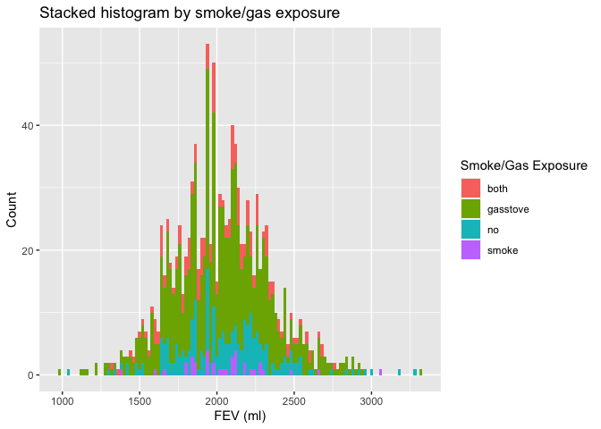

Assignment 02 - Data Viz and Wrangling
================
Qiushi
2022-10-07

Import libraries.

``` r
library(data.table)
library(dplyr)
```

    ## 
    ## Attaching package: 'dplyr'

    ## The following objects are masked from 'package:data.table':
    ## 
    ##     between, first, last

    ## The following objects are masked from 'package:stats':
    ## 
    ##     filter, lag

    ## The following objects are masked from 'package:base':
    ## 
    ##     intersect, setdiff, setequal, union

``` r
library(ggplot2)
```

## Step 0. Download data, read in, merge, and check

Download and read in data.

``` r
if (!file.exists("chs_individual.csv"))
  download.file(
    url = "https://raw.githubusercontent.com/USCbiostats/data-science-data/master/01_chs/chs_individual.csv",
    destfile = "chs_individual.csv",
    method   = "libcurl",
    timeout  = 60
    )

if (!file.exists("chs_regional.csv"))
  download.file(
    url = "https://raw.githubusercontent.com/USCbiostats/data-science-data/master/01_chs/chs_regional.csv",
    destfile = "chs_regional.csv",
    method   = "libcurl",
    timeout  = 60
    )

individual <- data.table::fread("chs_individual.csv")
regional <- data.table::fread("chs_regional.csv")
```

Merge data.

``` r
total_data <- 
  merge(x = individual,
        y = regional,
        by = "townname",
        all.x = TRUE,
        all.y = FALSE)
```

Check data. Identify and remove duplicates.

``` r
total_data <- unique(total_data)
dim(total_data)
```

    ## [1] 1200   49

Rows matched.

## Step 1. Impute missing data.

Impute data using the average within the variables “male” and
“hispanic”.

``` r
total_data <- data.table(total_data)
total_data[ , bmi := fcoalesce(bmi, mean(bmi, na.rm = TRUE)), by = .(male, hispanic)]
total_data[ , fev := fcoalesce(fev, mean(fev, na.rm = TRUE)), by = .(male, hispanic)]
```

## Step 2. Create “obesity_level”.

Create a new categorical variable named “obesity_level” using the BMI
measurement (underweight BMI\<14; normal BMI 14-22; overweight BMI
22-24; obese BMI\>24).

``` r
total_data[ , obesity_level := fifelse(bmi < 14, "underweight", 
                                       fifelse(bmi <= 22, "normal", 
                                               fifelse(bmi <= 24, "overweight", "obese")))]
```

To make sure the variable is rightly coded, create a summary table that
contains the minimum BMI, maximum BMI, and the total number of
observations per category.

``` r
summary_table <- 
  total_data[ , .(
  Minimum = min(bmi, na.rm = TRUE),
  Maximum = max(bmi, na.rm = TRUE),
  Total_Number = length(bmi)
), by = obesity_level]

knitr::kable(summary_table, col.names = c("Obesity Level", "Minimum BMI", "Maximum BMI", "Total Number of Observation"))
```

| Obesity Level | Minimum BMI | Maximum BMI | Total Number of Observation |
|:--------------|------------:|------------:|----------------------------:|
| normal        |    14.00380 |    21.96387 |                         975 |
| overweight    |    22.02353 |    23.99650 |                          87 |
| obese         |    24.00647 |    41.26613 |                         103 |
| underweight   |    11.29640 |    13.98601 |                          35 |

## Step 3 Create “smoke_gas_exposure”.

Create another categorical variable named “smoke_gas_exposure” that
summarizes “Second Hand Smoke” and “Gas Stove.”

``` r
total_data[ , smoke_gas_exposure := fifelse((smoke == 0) & (gasstove == 0), "no",
  fifelse((smoke == 1) & (gasstove == 0), "smoke",
    fifelse((smoke == 0) & (gasstove == 1), "gasstove", "both")))]
```

## Step 4 Summary tables.

Create four summary tables showing the average (or proportion, if
binary) and sd of “Forced expiratory volume in 1 second (ml)” and asthma
indicator by town, sex, obesity level, and “smoke_gas_exposure.”

Table grouped by town.

``` r
table_town <-
  total_data[ , .(
  Total_Number = length(fev),
  FEV_avg = mean(fev, na.rm = TRUE),
  FEV_sd = sd(fev, na.rm = TRUE),
  Asthma_indicator = sum(asthma, na.rm = TRUE) / sum(!is.na(asthma))
), by = townname]
knitr::kable(table_town, col.names = c("Town Name", "Number of Observation", "FEV Avg", "FEV SD", "%Asthma"))
```

| Town Name     | Number of Observation |  FEV Avg |   FEV SD |   %Asthma |
|:--------------|----------------------:|---------:|---------:|----------:|
| Alpine        |                   100 | 2087.101 | 291.1768 | 0.1134021 |
| Atascadero    |                   100 | 2075.897 | 324.0935 | 0.2551020 |
| Lake Elsinore |                   100 | 2038.849 | 303.6956 | 0.1263158 |
| Lake Gregory  |                   100 | 2084.700 | 319.9593 | 0.1515152 |
| Lancaster     |                   100 | 2003.044 | 317.1298 | 0.1649485 |
| Lompoc        |                   100 | 2034.354 | 351.0454 | 0.1134021 |
| Long Beach    |                   100 | 1985.861 | 319.4625 | 0.1354167 |
| Mira Loma     |                   100 | 1985.202 | 324.9634 | 0.1578947 |
| Riverside     |                   100 | 1989.881 | 277.5065 | 0.1100000 |
| San Dimas     |                   100 | 2026.794 | 318.7845 | 0.1717172 |
| Santa Maria   |                   100 | 2025.750 | 312.1725 | 0.1340206 |
| Upland        |                   100 | 2024.266 | 343.1637 | 0.1212121 |

Table grouped by sex

``` r
table_sex <-
  total_data[ , .(
  Total_Number = length(fev),
  FEV_avg = mean(fev, na.rm = TRUE),
  FEV_sd = sd(fev, na.rm = TRUE),
  Asthma_indicator = sum(asthma, na.rm = TRUE) / sum(!is.na(asthma))
), by = male]
table_sex$male[which(table_sex$male == 1)] <- 'Male'
table_sex$male[which(table_sex$male == 0)] <- 'Female'
knitr::kable(table_sex, col.names = c("Sex", "Number of Observation", "FEV Avg", "FEV SD", "%Asthma"))
```

| Sex    | Number of Observation |  FEV Avg |   FEV SD |   %Asthma |
|:-------|----------------------:|---------:|---------:|----------:|
| Female |                   610 | 1958.911 | 311.9181 | 0.1208054 |
| Male   |                   590 | 2103.787 | 307.5123 | 0.1727749 |

Table grouped by obesity level.

``` r
table_obesity <-
  total_data[ , .(
  Total_Number = length(fev),
  FEV_avg = mean(fev, na.rm = TRUE),
  FEV_sd = sd(fev, na.rm = TRUE),
  Asthma_indicator = sum(asthma, na.rm = TRUE) / sum(!is.na(asthma))
), by = obesity_level]
knitr::kable(table_obesity, col.names = c("Obesity Level", "Number of Observation", "FEV Avg", "FEV SD", "%Asthma"))
```

| Obesity Level | Number of Observation |  FEV Avg |   FEV SD |   %Asthma |
|:--------------|----------------------:|---------:|---------:|----------:|
| normal        |                   975 | 1999.794 | 295.1964 | 0.1401475 |
| overweight    |                    87 | 2224.322 | 317.4261 | 0.1647059 |
| obese         |                   103 | 2266.154 | 325.4710 | 0.2100000 |
| underweight   |                    35 | 1698.327 | 303.3983 | 0.0857143 |

Table grouped by smoke_gas_exposure.

``` r
table_smoke_gas_exposure <-
  total_data[ , .(
  Total_Number = length(fev),
  FEV_avg = mean(fev, na.rm = TRUE),
  FEV_sd = sd(fev, na.rm = TRUE),
  Asthma_indicator = sum(asthma, na.rm = TRUE) / sum(!is.na(asthma))
), by = smoke_gas_exposure]
knitr::kable(table_smoke_gas_exposure[!is.na(smoke_gas_exposure)], col.names = c("Somke/Gas Exposure", "Number of Observation", "FEV Avg", "FEV SD", "%Asthma"))
```

| Somke/Gas Exposure | Number of Observation |  FEV Avg |   FEV SD |   %Asthma |
|:-------------------|----------------------:|---------:|---------:|----------:|
| no                 |                   214 | 2055.356 | 330.4169 | 0.1476190 |
| smoke              |                    36 | 2055.714 | 295.6475 | 0.1714286 |
| gasstove           |                   739 | 2025.989 | 317.6305 | 0.1477428 |
| both               |                   151 | 2019.867 | 298.9728 | 0.1301370 |

## Step 5. Figures

### Figure 1. Facet plot showing scatterplots with regression lines of BMI vs FEV by “townname”.

``` r
total_data[!is.na(bmi) & !is.na(fev)] %>%
  ggplot(mapping = aes(x = bmi, y = fev)) + 
  geom_point(mapping = aes(color = townname), size = 0.5) + 
  geom_smooth(method = lm) +
  facet_wrap(~ townname, nrow = 4) +
  labs(x = "BMI", y = "FEV (ml)", title = "Scatterplots with regression lines of BMI vs FEV by “townname”")
```

    ## `geom_smooth()` using formula 'y ~ x'

<!-- -->

FEV is positively associated with BMI is all towns.

### Figure 2. Stacked histograms of FEV by BMI category and FEV by smoke/gas exposure. Use different color schemes than the ggplot default.

Stacked histogram by BMI category.

``` r
total_data[!is.na(obesity_level) & !is.na(fev)] %>%
  ggplot(aes(fev, fill = obesity_level)) +
  geom_histogram(binwidth = 20) +
  scale_fill_discrete(name = "Obesity Level") +
  labs(x = "FEV (ml)", y = "Count", title = "Stacked histogram by BMI category")
```

<!-- -->

FEV is normally distributed. People with normal obesity level takes up
most proportion.

Stacked histogram by smoke/gas exposure

``` r
total_data[!is.na(smoke_gas_exposure) & !is.na(fev)] %>%
  ggplot(aes(fev, fill = smoke_gas_exposure)) +
  geom_histogram(binwidth = 20) +
  scale_fill_discrete(name = "Smoke/Gas Exposure") +
  labs(x = "FEV (ml)", y = "Count", title = "Stacked histogram by smoke/gas exposure")
```

<!-- -->

A large proportion of children have gas stoves in their homes.

### Figure 3. Barchart of BMI by smoke/gas exposure.

``` r
bmi_exposure <- total_data[, list(bmi, smoke_gas_exposure)]

group_by(bmi_exposure[!is.na(smoke_gas_exposure) & !is.na(bmi)], smoke_gas_exposure) %>%
  summarize_each(funs = mean) %>%
  ggplot() + 
  geom_col(mapping = aes(y = bmi, x = smoke_gas_exposure, colour = smoke_gas_exposure, fill = smoke_gas_exposure), show.legend = FALSE) +
  labs(x = "Smoke/Gas Exposure", y = "BMI", title = "Barchart of BMI by smoke/gas exposure")
```

    ## Warning: `summarise_each_()` was deprecated in dplyr 0.7.0.
    ## Please use `across()` instead.
    ## This warning is displayed once every 8 hours.
    ## Call `lifecycle::last_lifecycle_warnings()` to see where this warning was generated.

<!-- -->

It seems that BMI has nothing to do with the secondary smoke or gass
stove.

### Figure 4. Statistical summary graphs of FEV by BMI and FEV by smoke/gas exposure category.

Statistical summary graphs of FEV by BMI category.

``` r
total_data[!is.na(fev) & !is.na(obesity_level)] %>%
  ggplot(mapping = aes(x = obesity_level, y = fev)) + 
  stat_summary(fun.data = mean_sdl, geom = "pointrange") +
  stat_summary(fun.data = mean_sdl, geom = "errorbar") +
  labs(x = "Obesity Level", y = "FEV (ml)", title = "Statistical summary graphs of FEV by BMI category")
```

<!-- -->

Obese or overweight children tend to have a higher FEV than those noraml
or underweight children.

Statistical summary graphs of FEV by smoke/gas exposure category.

``` r
total_data[!is.na(fev) & !is.na(smoke_gas_exposure)] %>%
  ggplot(mapping = aes(x = smoke_gas_exposure, y = fev)) + 
  stat_summary(fun.data = mean_sdl, geom = "pointrange") +
  stat_summary(fun.data = mean_sdl, geom = "errorbar") +
  labs(x = "Smoke/Gas Exposure", y = "FEV (ml)", title = "Statistical summary graphs of FEV by smoke/gas exposure category")
```

<!-- -->

Gass stove and secondary smoke have very little influence on children’s
FEV.

### 5. A leaflet map showing the concentrations of PM2.5 mass in each of the CHS communities.

``` r
library(leaflet)
pm.pal <- colorNumeric(c('darkgreen','goldenrod','brown'), domain = total_data$pm25_mass)

leaflet(total_data) %>% 
  addProviderTiles('CartoDB.Positron') %>% 
  addCircles(
    lat = ~lat, lng=~lon,
    label = ~paste0(pm25_mass), color = ~ pm.pal(pm25_mass),
    opacity = 1, fillOpacity = 1, radius = 500
    ) %>%
  addLegend('bottomleft', pal = pm.pal, values = total_data$pm25_mass,
          title = 'PM2.5 mass', opacity = 1) %>%
  addControl("Leaflet map showing the concentrations of PM2.5 mass in each of the CHS communities", position = "topright")
```

<!-- -->

Long Beach, Ontario, Riverside have the largest PM2.5 Mass, which means
they have very bad air quality.

### 6. Choose a visualization to examine whether PM2.5 mass is associated with FEV.

``` r
total_data[!is.na(pm25_mass) & !is.na(fev)] %>%
  ggplot(mapping = aes(x = pm25_mass, y = fev)) + 
  geom_point() +
  geom_smooth(method = lm) +
  labs(x = "PM2.5 Mass", y = "FEV (ml)", title = "Scatterplot with regression line of FEV vs PM2.5")
```

    ## `geom_smooth()` using formula 'y ~ x'

<!-- -->

It seems that FEV has a negative correlation to PM2.5 Mass, but the
correlation seems not significant.
