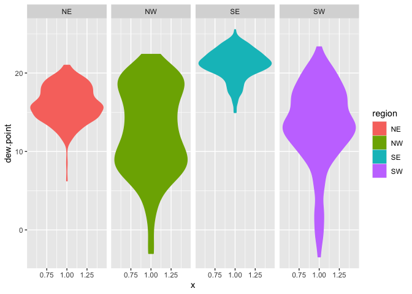
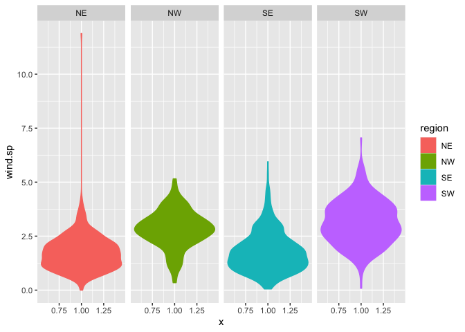
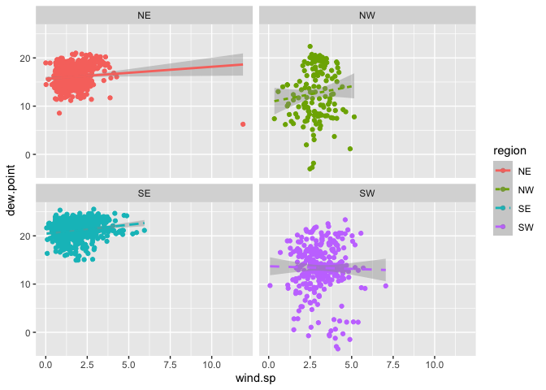
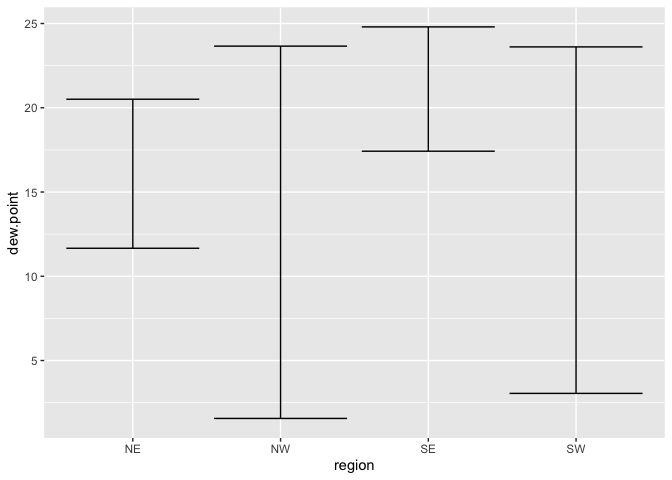
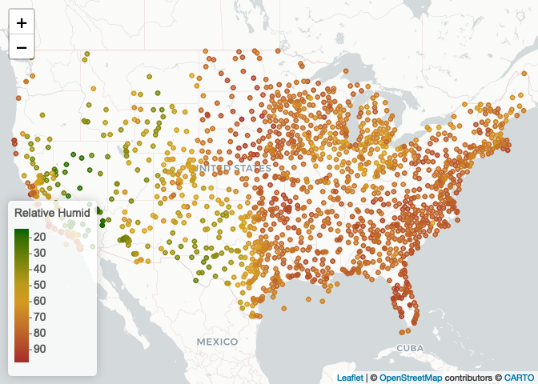

Lab 04 - Data Visualization
================
Qiushi
2022-09-14

``` r
library(lubridate)
```

    ## 
    ## Attaching package: 'lubridate'

    ## The following objects are masked from 'package:base':
    ## 
    ##     date, intersect, setdiff, union

``` r
library(tidyverse)
```

    ## ── Attaching packages
    ## ───────────────────────────────────────
    ## tidyverse 1.3.2 ──

    ## ✔ ggplot2 3.3.6     ✔ purrr   0.3.4
    ## ✔ tibble  3.1.8     ✔ dplyr   1.0.9
    ## ✔ tidyr   1.2.0     ✔ stringr 1.4.1
    ## ✔ readr   2.1.2     ✔ forcats 0.5.2
    ## ── Conflicts ────────────────────────────────────────── tidyverse_conflicts() ──
    ## ✖ lubridate::as.difftime() masks base::as.difftime()
    ## ✖ lubridate::date()        masks base::date()
    ## ✖ dplyr::filter()          masks stats::filter()
    ## ✖ lubridate::intersect()   masks base::intersect()
    ## ✖ dplyr::lag()             masks stats::lag()
    ## ✖ lubridate::setdiff()     masks base::setdiff()
    ## ✖ lubridate::union()       masks base::union()

``` r
library(data.table)
```

    ## 
    ## Attaching package: 'data.table'
    ## 
    ## The following objects are masked from 'package:dplyr':
    ## 
    ##     between, first, last
    ## 
    ## The following object is masked from 'package:purrr':
    ## 
    ##     transpose
    ## 
    ## The following objects are masked from 'package:lubridate':
    ## 
    ##     hour, isoweek, mday, minute, month, quarter, second, wday, week,
    ##     yday, year

## Step 1. Read in the data

First download and then read in with data.table:fread()

``` r
if (!file.exists("met_all.gz"))
  download.file(
    url = "https://raw.githubusercontent.com/USCbiostats/data-science-data/master/02_met/met_all.gz",
    destfile = "met_all.gz",
    method   = "libcurl",
    timeout  = 60
    )
met <- data.table::fread("met_all.gz")
```

## Step 2. Prepare the data

Remove temperatures less than -17C. Make sure there are no missing data
in the key variables coded as 9999, 999, etc.

``` r
met <- met[temp > -17][elev==9999.0, elsv := NA]
```

Generate a date variable using the functions as.Date()

``` r
met <- met[ , ymd := as.Date(paste(year, month, day, sep = "-"))]
```

Using the data.table::week function, keep the observations of the first
week of the month.

``` r
met[, table(week(ymd))]
```

    ## 
    ##     31     32     33     34     35 
    ## 297259 521600 527922 523847 446576

``` r
met <- met[week(ymd) == 31]
```

Compute the mean by station of the variables temp, rh, wind.sp,
vis.dist, dew.point, lat, lon, and elev.

``` r
met[, .(
  temp = max(temp, na.rm = T),
  rh = max(rh, na.rm = T),
  wind.sp = max(wind.sp, na.rm = T),
  vis.dist = max(wind.sp, na.rm = T),
  dew.point = max(dew.point, na.rm = T),
  lat = max(lat, na.rm = T),
  lon = max(lon, na.rm = T),
  elev = max(elev, na.rm = T)
)]
```

    ##    temp  rh wind.sp vis.dist dew.point    lat     lon elev
    ## 1:   47 100    20.6     20.6        29 48.941 -68.313 9999

Great! No more 9999s in our dataset.

``` r
met_avg <- met[, .(
  temp = mean(temp, na.rm = T),
  rh = mean(rh, na.rm = T),
  wind.sp = mean(wind.sp, na.rm = T),
  vis.dist = mean(wind.sp, na.rm = T),
  dew.point = mean(dew.point, na.rm = T),
  lat = mean(lat, na.rm = T),
  lon = mean(lon, na.rm = T),
  elev = mean(elev, na.rm = T)
), by = "USAFID"]
```

Create a region variable for NW, SW, NE, SE based on lon = -98.00 and
lat = 39.71 degrees

``` r
met_avg[, region := fifelse(lon >= -98 & lat > 39.71, "NE",
                fifelse(lon < -98 & lat > 39.71, "NW",
                fifelse(lon < -98 & lat <= 39.71, "SW", "SE")))
]
table(met$region)
```

    ## < table of extent 0 >

Create a categorical variable for elevation as in the lecture slides

``` r
met_avg[, elev_cat := fifelse(elev > 252, "high", "low")]
```

## Step 3. Make Violin plots of dew point temp by region

``` r
met_avg[!is.na(region)] %>%
  ggplot() +
  geom_violin(mapping = aes(x = 1, y= dew.point, color = region, fill = region)) +
  facet_wrap(~ region, nrow = 1)
```

<!-- -->

The highest dew point temperatures are reported in the southeast.

``` r
met_avg[!is.na(region) & !is.na(wind.sp)] %>%
  ggplot() +
  geom_violin(mapping = aes(x = 1, y = wind.sp, color = region, fill = region)) +
  facet_wrap(~ region, nrow = 1)
```

<!-- -->

The highest wind speeds are reported in the northeast.

## Step 04. Use geom_point with geom_smooth to examine the association between dew point temperature and wind speed by region

Colour points by region Make sure to deal with NA category Fit a linear
regression line by region Describe what you observe in the graph

``` r
met_avg[!is.na(region) & !is.na(wind.sp)] %>%
  ggplot(mapping = aes(x = wind.sp, y = dew.point, color = region)) +
  geom_point(mapping = aes(color = region)) +
  geom_smooth(method = lm, mapping = aes(linetype = region)) +
  facet_wrap(~ region, nrow = 2)
```

    ## `geom_smooth()` using formula 'y ~ x'

<!-- -->
The dew point is positively associated with the wind speed in the
southeast.

## Step 5. Use geom_bar to create barplots of the weather stations by elevation category coloured by region

## Step 6. Use stat_summary to examine mean dew point and wind speed by region with standard deviation error bars

``` r
met_avg[!is.na(dew.point)] %>%
  ggplot(mapping = aes(x = region, y = dew.point)) + 
    stat_summary(fun.data = mean_sdl, geom = "errorbar")
```

<!-- -->

## Step 7. Make a map showing the spatial trend in relative h in the US

``` r
# Generating a color palette
library(leaflet)
rh.pal <- colorNumeric(c('darkgreen','goldenrod','brown'), domain=met_avg$rh)
rh.pal
```

    ## function (x) 
    ## {
    ##     if (length(x) == 0 || all(is.na(x))) {
    ##         return(pf(x))
    ##     }
    ##     if (is.null(rng)) 
    ##         rng <- range(x, na.rm = TRUE)
    ##     rescaled <- scales::rescale(x, from = rng)
    ##     if (any(rescaled < 0 | rescaled > 1, na.rm = TRUE)) 
    ##         warning("Some values were outside the color scale and will be treated as NA")
    ##     if (reverse) {
    ##         rescaled <- 1 - rescaled
    ##     }
    ##     pf(rescaled)
    ## }
    ## <bytecode: 0x7f95ca23f3c0>
    ## <environment: 0x7f95ca241cf0>
    ## attr(,"colorType")
    ## [1] "numeric"
    ## attr(,"colorArgs")
    ## attr(,"colorArgs")$na.color
    ## [1] "#808080"

``` r
top10rh <- met_avg[ rank(-rh) <= 10]
```

``` r
rhmap <- leaflet(met_avg) %>% 
  # The looks of the Map
  addProviderTiles('CartoDB.Positron') %>% 
  # Some circles
  addCircles(
    lat = ~lat, lng=~lon,
                                                  # HERE IS OUR PAL!
    label = ~paste0(rh), color = ~ rh.pal(rh),
    opacity = 1, fillOpacity = 1, radius = 500
    ) %>%
  # And a pretty legend
  addLegend('bottomleft', pal=rh.pal, values=met_avg$rh,
          title='Relative Humid', opacity=1)
rhmap
```

<!-- -->
